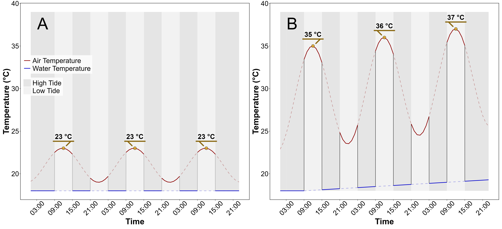
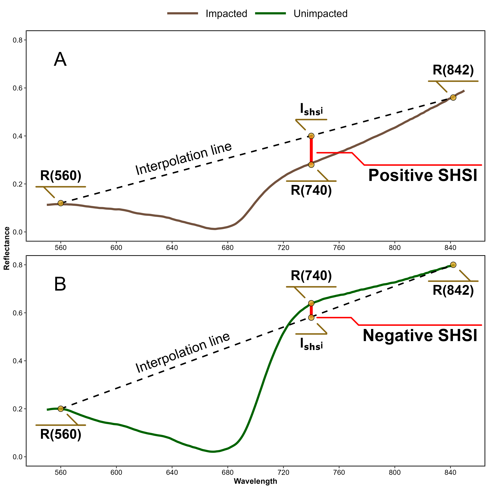
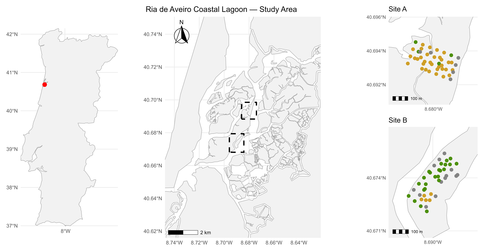
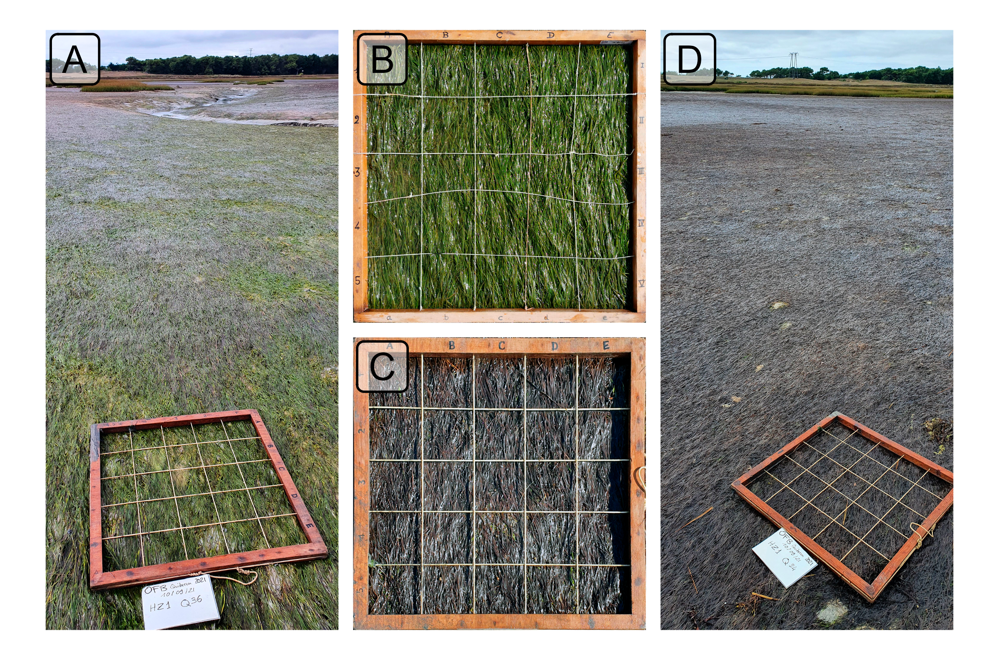
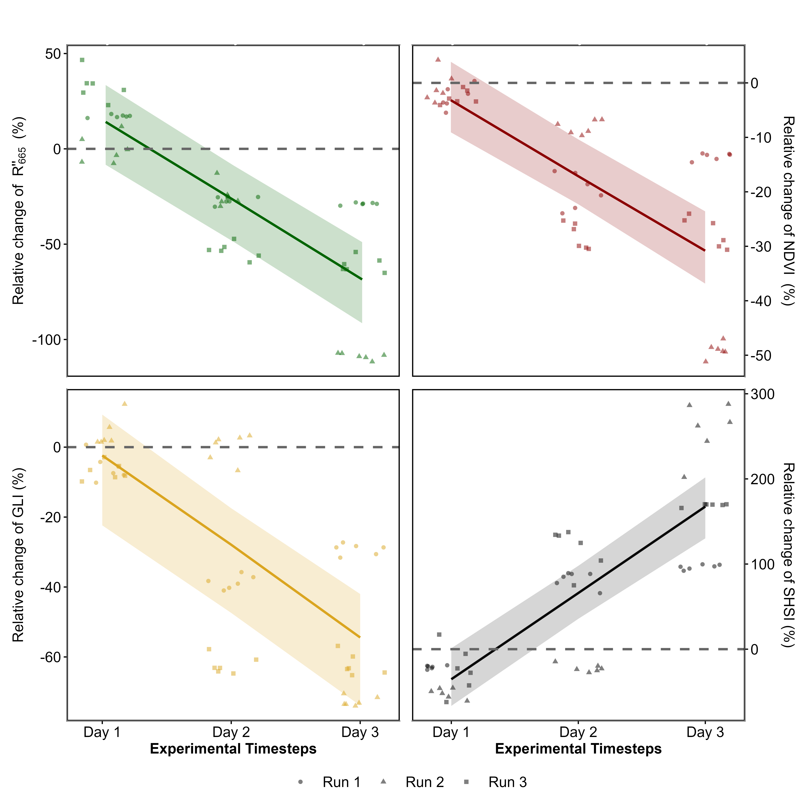
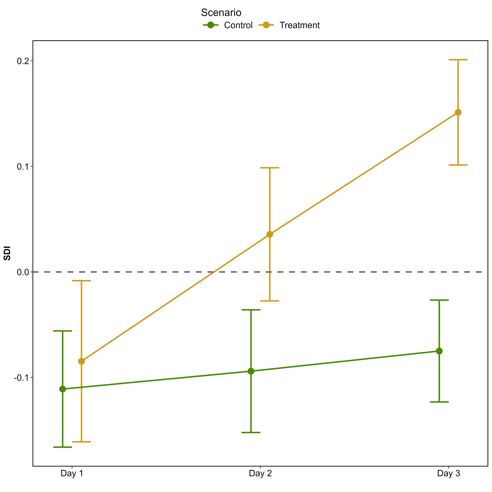
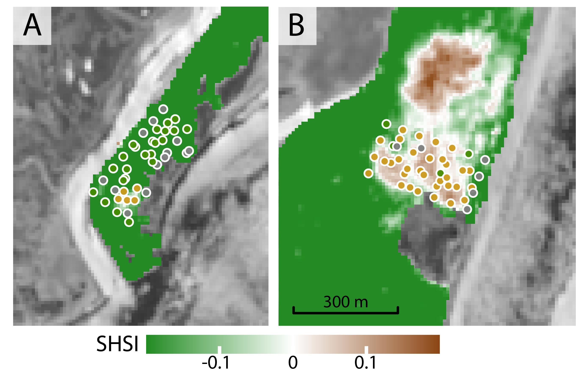
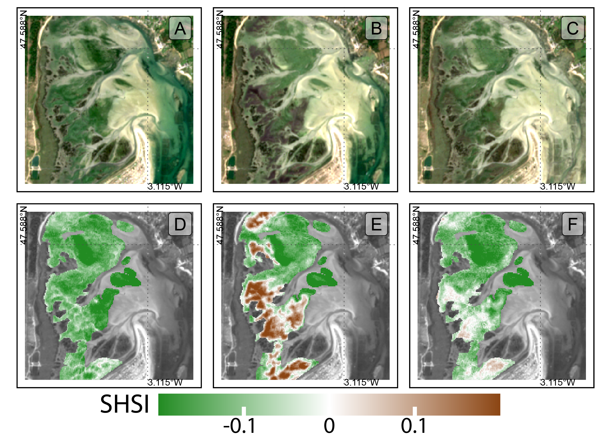
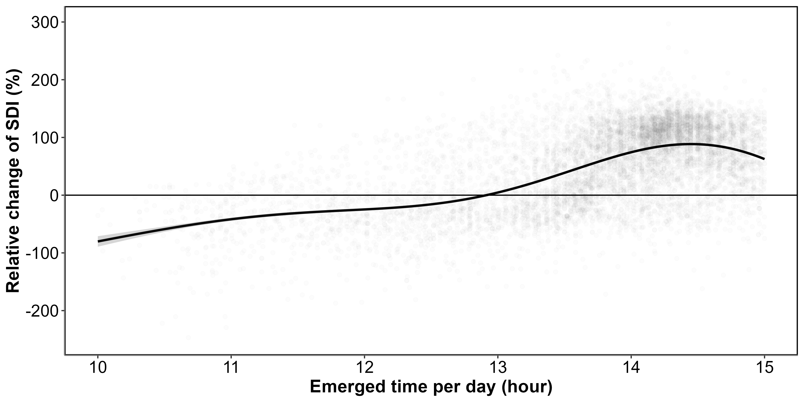

```{r library}
#| cache: true
#| echo: false
#| eval: true
#| warning: false

library(tidyverse)
```

<!-- # Abstract Long version (For LPS Submission) -->

<!-- Seagrasses meadows are important coastal ecosystems, serving as crucial habitats for marine biodiversity, stabilizing sediments to mitigate erosion, and acting as significant carbon sinks in global climate regulation. However, these vital ecosystems face mounting threats from climate change, with the intensification and increased frequency of marine and atmospheric heatwaves posing profound risks to their health and functionality. This study investigates the impact of these extreme thermal events on the intertidal seagrass, employing a combination of laboratory-controlled experiments and satellite-based remote sensing to capture changes in spectral reflectance and to assess its ecological implications. -->

<!-- During laboratory experiments, seagrass of the species *Zostera noltii* were exposed to controlled simulated heatwave conditions during three days to assess the physiological and structural impacts of extreme thermal stress on their spectral reflectance. The experimental design involved placing seagrass samples in intertidal chambers that simulated natural tidal cycles, allowing to precisely regulate temperature conditions during both high and low tides. One chamber served as a control, maintaining typical seasonal temperatures, while the other was used to simulate heatwave conditions by progressively increasing air and water temperatures to mimic an actual heatwave event observed in the field. Hyperspectral reflectance measurements were recorded at regular intervals during low-tide to monitor changes in the seagrass over time. After two days of heatwave exposure the reflectance decreased significantly, particularly in the green (around 560 nm) and near-infrared (NIR) regions of the spectrum. This decline in reflectance was closely linked to visible leaf darkening, suggesting alterations in pigment content, in the internal structure of seagrass leaves and their overall physiological performance. The green reflectance decline indicated a reduction in the plant's photosynthetic capacity, while changes in NIR reflectance were related to the heat-indiced damage to internal arrangement of cells and air spaces. Vegetation indices like the Normalized Difference Vegetation Index (NDVI) and the Green Leaf Index (GLI), which are indicative of the overall health and structural integrity of vegetation, showed marked decreases under heatwave conditions, with NDVI dropping by up to 34% and GLI by 57%. This reduction highlights the adverse effects on the seagrass's ability to maintain its normal physiological processes under heat stress. To quantify these changes more effectively, a novel Seagrass Heat Shock Index (SHSI) was developed. The SHSI, applicable on emerged seagrass, was particularly effective in detecting the transition from green leaves to darkened, stressed leaves, providing a sensitive and reliable tool for assessing thermal stress effects on seagrass. By focusing on specific changes in reflectance across certain spectral bands, the SHSI allowed for a clear differentiation between unimpacted and impacted vegetation, capturing the onset of heat-induced stress with high accuracy. This sensitivity makes the SHSI valuable for early intervention, enabling managers and researchers to identify vulnerable seagrass meadows before substantial damage occurs, thereby facilitating more timely conservation measures. -->

<!-- Complementing the experimental data, Sentinel-2 observations provided clear evidence of the effects of a documented heatwave event in South Brittany, France, on natural seagrass meadows in September 2021. These intertidal zones were exposed to extreme air temperatures up to 32°C for more than 13.5 hours per day, leading to significant leaf darkening, which affected up to 24% of the meadow's area. The satellite-derived SHSI indicated a strong spatial correlation between prolonged heat exposure and areas experiencing spectral darkening, which was consistent with the laboratory experiment. Spatial analysis showed that darkening was especially pronounced in the higher intertidal regions, where seagrasses were exposed to air for longer durations during low tide, underlining the interaction between tidal exposure and thermal stress. Using a Sentinel-2 image acquired one month after the heatwave, SHSI showed partial recovery of darkened patches. Despite this recovery, the seagrasses that had experienced the most severe darkening did not fully return to their original state, indicating that while *Z. noltii* meadows have some capacity for resilience, prolonged or repeated thermal stress can have lasting impacts, particularly in the more exposed intertidal regions. This highlights the need for focused conservation efforts to support their recovery and enhance their resilience in the face of increasing climate-driven thermal extremes. -->

<!-- The combination of laboratory-controlled experiments and satellite-based remote sensing provided a comprehensive understanding of the impacts of heatwaves on seagrass meadows at multiple scales, from individual leaf-level responses to entire meadow-wide effects, offering valuable insights for the management and conservation of these vulnerable habitats. The study underscores the critical role of spectral reflectance as an early warning indicator of heatwave-induced stress, laying the foundation for remote sensing-based monitoring and conservation efforts. By employing innovative indices like the Seagrass Heat Shock Index (SHSI), we captured ecologically significant changes in the physiological performance of *Z. noltii*, advancing the precision of habitat assessments in intertidal zones. As climate scenarios predict more frequent and intense heatwaves, the need for continuous monitoring of intertidal seagrass meadows becomes increasingly urgent. This research demonstrates the efficacy of remote sensing in capturing rapid environmental changes, providing a framework for mitigating the impacts of climate-driven stressors and calling for adaptive conservation strategies. These strategies should integrate advancements in remote sensing technologies with targeted field-based interventions to preserve the resilience of intertidal seagrass meadows, thereby addressing the escalating challenges posed by climate change and ensuring the continued health of these indispensable coastal habitats. -->

# Introduction

Seagrasses play a crucial role in coastal ecosystems by providing habitats and feeding grounds for various marine species, supporting marine biodiversity, and contributing to primary production and carbon sequestration [@unsworth2022planetary; @sousa2019blue]. Seagrasses are essential for several ecological functions, such as sediment stabilisation [@infantes2022seagrass] or eutrophication mitigation by consuming nutrients [@gladstone2018biomass]. This justifies their use as indicators of environmental changes due to their sensitivity to water quality variations [@zoffoli2021decadal]. The interactions between seagrass meadows and their associated herbivores further enhance the delivery of ecosystem services, including coastal protection, fisheries support and provision of habitat and resources for birds [@jankowska2019stabilizing; @zoffoli2023remote; @gardner2018global; @unsworth2021seagrass]. Understanding their ecological role and preserving seagrass is vital for maintaining the biodiversity and productivity of coastal regions [@scott2018role; @ramesh2020seagrass].

Despite their crucial role in marine ecosystems, seagrasses face numerous threats that compromise their health and functionality. Intertidal seagrasses are subjected to a combination of aquatic and aerial abiotic conditions (*e.g.* salinity, wave actions, sun irradiance, air temperature, desiccation) linked with tidal cycles, and face disturbance from terrestrial and aquatic stressors. Human activities such as coastal development are primary threats, reducing the available habitat for seagrasses and increasing water turbidity, limiting light penetration, and photosynthesis [@waycott2009accelerating]. Seagrasses are also threatened by runoff from agricultural fields and urban areas leading to nutrient enrichment. Eutrophication promotes the growth of seaweed in coastal waters, causing macroalgal blooms that compete with seagrasses for light and nutrients [@brun2003effect; @thomsen2023meadow; @rs16234383]. Pollution from industrial and agricultural sources introduces harmful chemicals and heavy metals into coastal waters, posing toxic risks to seagrass health [@green2021historical; @bastos2023high; @zahoor2023water]. Among the manifold anthropogenic stressors, heatwaves (HWs), exacerbated by climate change, pose a severe threat to seagrasses, with catastrophic dieback events observed worldwide [@carlson2018sea; @marba2010mediterranean; @moore2008environmental; @thomson2015extreme; @strydom2020too].

Marine Heatwaves (MHWs) are defined by @hobday2016hierarchical as prolonged discrete anomalously warm water events, while Atmospheric Heatwaves (AHW) are defined by @perkins2013measurement as periods of at least three consecutive days with temperatures exceeding the 90^th^ percentile of a time series covering at least 30 years. Subtidal seagrass meadows are exposed to MHWs, whereas at the interface between land and ocean, intertidal seagrasses are exposed to both MHWs and AHWs. Both HWs profoundly impact seagrass physiology, with effects varying between species and geographic location. Widespread seagrass species such as *Zostera marina* exhibit high susceptibility to elevated sea surface temperatures during winter and spring, leading to advanced flowering, high mortality rates, and reduced biomass [@sawall2021chronically]. Similarly, *Cymodocea nodosa* shows increased photosynthetic activity during HWs but suffers negative effects on photosynthetic performance and leaf biomass during recovery [@deguette2022physiological]. Additionally, different populations of Z*ostera marina* along the European thermal gradient exhibit varied photophysiological responses during the recovery phase of HWs, indicating differential adaptation capabilities among populations [@winters2011effects]. High-latitude populations exhibited prolonged declines in photophysiological performance even after temperatures returned to control levels, whereas the low-latitude Adriatic population showed full recovery [@winters2011effects]. These events intensify other stressors, such as overgrazing and seed burial, compromising recruitment [@guerrero2020heat]. Although extensive research exists on marine heatwaves' effects on subtidal seagrasses [@strydom2020too; @arias2018marine; @deguette2022physiological], less attention has been given to intertidal habitats and even less to the effect of atmospheric extreme events on intertidal seagrass. Nonetheless, recent research showed that the low tide exposure of *Zostera noltii* to a simulated four-day atmospheric HW caused significant decreases in its photosynthetic efficiency, resulting in leaf darkening and decay [@roman2023clam].

The increased occurrence of extreme climate events calls for the implementation of monitoring strategies able to provide detailed and spatially explicit assessments of HWs effects on seagrass meadows. In such context, remote sensing, whose ability to map seagrass distribution over a variety of spatio-temporal scales has been demonstrated [@davies2024sentinel; @davies2024intertidal; @rs16234383; @roman2021using], proved useful to study the changes in seagrass coverage caused by extreme HW event [@strydom2020too]. The pigment composition of plants, including chlorophylls, carotenoids, and anthocyanins, significantly influences their spectral signature in the visible range due to their specific light absorption properties [@davies2023multi; @ustin2020optical; @douay2022new; @olmedo2020far]. During the senescence phase of seagrass' life-cycle, the degradation of chlorophyll and accessory pigments result in noticeable changes in leaf coloration and reflectance, including increased reflectance in the red and green wavelengths and shifts in the red-edge position [@boyer1988senescence; @penuelas2004leaf; @marien2019detecting]. Leaf darkening, often observed after stress events, produces reflectance changes similar to those caused by senescence, enabling the detection of vegetation stress through remote sensing [@boyer1988senescence; @penuelas2004leaf]. Spectral indices such as the Brown Pigment Index (BPI) and the Photochemical Reflectance Index (PRI) have been developed to assess changes in the physiological status of terrestrial plants, particularly under oxidative and drought stress [@garbulsky2011photochemical; @skendzic2023drought]. Like terrestrial vegetation, seagrasses share a comparable pigment composition dominated by chlorophylls, carotenoids, and xanthophylls [@penuelas2004leaf], suggesting that similar optical responses to stress could be expected. However, this relationship has not yet been fully demonstrated for intertidal seagrasses, where environmental conditions such as periodic emersion and water optical effects may modify the expression of these pigment-related spectral features.

This study aims to experimentally test the hypothesis that HWs alter the reflectance of the intertidal seagrass *Zostera noltii*. Controlled experiments in intertidal chambers were conducted to evaluate the direct impact of heat stress on seagrass reflectance. The findings were then applied to satellite remote sensing images, providing critical insights into the spatial extent and temporal dynamics of HW effects on seagrass meadows. By linking experimental results with large-scale observations of seagrass leaves' darkening, the study aimed at underscoring the potential of remote sensing to enhance our understanding of seagrass responses to extreme thermal events across diverse settings and timescales.

# Materials & Methods

## Laboratory Experiment

### Sampling and acclimation of seagrasses

Seagrass samples were taken in summer 2024, at low tide, from a *Zostera noltii* (dwarf eelgrass) meadow located in Bourgneuf Bay, France (46°57'32.0"N, 2°10'37.0"W). A rectangular metal coring device was used to sample seagrass from an area of 30 cm x 15 cm x 5 cm (length x width x depth, respectively), maintaining the sediment structure and avoiding damage to seagrass rhizomes and leaves (@fig-design A). This coring device enabled concistent sediment sampling depth, minimising variability between samples. A total of six samples were collected. Samples including seagrass, sediment, meiofauna, and macrofauna were placed in plastic trays. Maintaining the entire biota allowed for natural interactions between components and reduced stress on the seagrass. Seawater was added to each tray to avoid desiccation during transportation to the laboratory (1h drive). Simultaneously, seawater was sampled 4km away from the seagrass sampling site and transported to the laboratory, where it was filtered using a 0.22 µm nitrocellulose filter to remove suspended particulate matter. The filtered seawater was used in the acclimation tank and the intertidal chambers. The seagrasses were acclimated for one week with a water temperature of 17°C, matching the *in situ* temperature during sampling. Salinity was regularly monitored during the acclimation phases using a refractometer, and any evaporation losses were compensated with distilled water. During the acclimation phase, seagrasses were maintained under a constant Photosynthetically Active Radiation (PAR) of 150 µmol m⁻² s⁻¹, corresponding to the maximum light intensity provided by the experimental intertidal chambers. This setup ensured that samples were pre-adapted to the same irradiance conditions used during the heatwave experiment, thereby preventing any confounding effects related to light reduction upon transfer to the chamber.

```{r pictures design}
#| cache: true
#| echo: false
#| eval: false
#| warning: false

library(tidyverse)
library(tidyterra)
library(terra)

get_letter_position <- function(img){
  
  ext <- ext(img)
  
  x <- as.numeric(ext[1]+(0.05*(ext[2]-ext[1])))
  y <- as.numeric(ext[3]+(0.95*(ext[4]-ext[3])))

  
  return(c(ext[1]+0.1, ext[4]-0.1))
}


A <- rast("Data/imgs/Simon_Sampling.png") 
ext(A) <- c(0,0.975,-1.95,0)

B <- rast("Data/imgs/Chamber.jpg") 
ext(B) <- c(1.025,2,-1.95,0)

D <- rast("Data/imgs/Seagrass_before_zoomed.png")
ext(D) <- c(2.05,3.025,-1.4625,0)

C <- rast("Data/imgs/Tray_high.jpg") 
ext(C) <- c(0,2,-2.975,-2)

E <- rast("Data/imgs/Seagrass_after_zoomed.png")
ext(E) <- c(2.05,3.025,-2.975,-1.5125)

letter_A <- get_letter_position(A)
letter_B <- get_letter_position(B)
letter_C <- get_letter_position(C)
letter_D <- get_letter_position(D)
letter_E <- get_letter_position(E)

letter_size <- 3

plot <- ggplot()+
  geom_spatraster_rgb(data = A, maxcell = 20e+05)+
  geom_spatraster_rgb(data = B, maxcell = 20e+05)+
  geom_spatraster_rgb(data = C, maxcell = 20e+05)+
  geom_spatraster_rgb(data = D, maxcell = 20e+05)+
  geom_spatraster_rgb(data = E, maxcell = 20e+05)+
  coord_equal()+
  geom_label(aes(x = letter_A[1],y=letter_A[2], label = "A"), alpha = 0.5, size = letter_size)+
  geom_label(aes(x = letter_B[1],y=letter_B[2], label = "B"), alpha = 0.5, size = letter_size)+
  geom_label(aes(x = letter_C[1],y=letter_C[2], label = "C"), alpha = 0.5, size = letter_size)+
  geom_label(aes(x = letter_D[1],y=letter_D[2], label = "D"), alpha = 0.5, size = letter_size)+
  geom_label(aes(x = letter_E[1],y=letter_E[2], label = "E"), alpha = 0.5, size = letter_size)+
  theme_void()+
  theme(axis.text = element_blank(), 
        axis.title = element_blank(), 
        axis.ticks = element_blank(), 
        axis.ticks.length = unit(0, "pt"),
        panel.grid.major=element_blank(), 
        panel.grid.minor=element_blank(), 
        plot.margin = margin(0, 0, 0, 0, "pt"))

ggsave("Paper/Figs/High_res/Experimental_design.png",plot, width = 3.025, height = 2.975, dpi = 800)

```

```{r Fig design}
#| cache: false
#| echo: false
#| warning: false
#| fig-cap: "Illustration of the experiment. A: Seagrass field sampling using a coring device; B: Intertidal chamber used during the experiment; C: Seagrass sample inside a chamber during the experiment at high tide; D: Treatment sample at the start of the experiment; E: Treatment sample at the end of the experiment, 3 days after the start of the HW event."
#| label: fig-design
#| out-width: "95%"

knitr::include_graphics("Figs/High_res/Experimental_design.png")
```

### Experimental design

A tidal cycle (i.e. regularly alternating 6h of low-tide and 6h of high-tide) was simulated in the laboratory using an intertidal chamber system from ElectricBlue® [@fig-design B ; @electricblue_intertidal_chamber]. The experimental setup allowed only two tidal states: high tide or low tide, with no intermediate stages. The transition between these states took about 15 minutes to complete after initiation. During the phase of high tide, a volume of 30 L of filtered seawater was pumped and circulated through the chamber (@fig-design B, C). During low tide, the seagrass sample was emerged. The six acclimated rectangular seagrass samples were split into two subsets and placed in two independent chambers used in parallel, with one chamber used for control and the other for the experimental treatment. The intertidal chambers were equipped with LED lights that emitted a low amount of red and infrared radiation. To achieve a PAR intensity of up to 150 μmol·m⁻²·s⁻¹, a filament bulb was added inside the chambers. During the diurnal phase of the experiment, the PAR was kept constant in both intertidal chambers. To follow the circadian cycle, these lights (both LED and filament bulb) were turned on and off each day, at the time of natural sunrise and sunset, respectively.

Air temperature and water temperature were controlled inside the experiment chambers to reproduce the range of variability observed in the field (@fig-Profile). Field temperature was measured using *in situ* sensors (T7.3 EnvLoggers from ElectricBlue®) deployed at the sampling site in August 2024. The loggers were positioned along a transect from the upper to the lower intertidal zone, attached to pre-existing wooden poles at the sediment surface. In complement, the daily temperature maxima recorded *in situ* were compared with measurements from the nearest Météo France weather station (Annexe A1, @sec-AnnexeA). The control chamber was kept at temperatures representing typical summer conditions, with water temperatures at 18°C and air temperatures from 19°C to 23°C, following natural daily temperature fluctuations (@fig-Profile A). In the treatment chamber, the air temperature was adjusted to mimic an AHW that affected the seagrass meadow in Quiberon, South Brittany, France (47°35'40.0"N, 3°07'30.0"W), from September 2 to September 6, 2021. Air temperature in the experimental chamber was set to vary from 23°C (at night) to 35°C (daytime) during the first day of the experiment, and increase by 1°C daily during three consecutive days. Water temperature in the experimental chamber was also adjusted to mimic MHW conditions, starting at the seasonal baseline (18°C) and rising incrementally by 0.5°C daily to simulate the increasing temperatures during the event. This aimed to reproduce the thermal stress experienced by the seagrass meadow during the MHW of Quiberon, France in September 2021 (@fig-Profile B). The experiment, with both treatment and control chambers, was repeated three times with the rectangular seagrass subsets to obtain replicates (hereafter referred to as "Run").

```{r in situ temperature Bourgneuf}
#| cache: true
#| echo: false
#| eval: false
#| warning: false

library(tidyverse)

fn <- function(x){
  a <- read_csv(x,skip = 21) %>% 
    mutate(file = gsub(".*/","",x))
  return(a)
}

df_insitu <- list.files("Data/In_situ_temperature/",".csv",full.names = T) %>% 
  map(fn) %>% 
  bind_rows() %>% 
  mutate(location = case_when(str_detect(file,"Upper") ~ "Upper",
                              str_detect(file,"Lower") ~ "Lower"),
         date = as.POSIXct(time, format = c("%Y-%m-%d %H:%M:%S"), tz = "UTC")) %>% 
      # dplyr::filter(date >= as.POSIXct("2024-08-14 12:00:00") & date <= as.POSIXct("2024-08-16 00:00:00"),
        dplyr::filter(location == "Upper") %>%
  mutate(day = as.Date(date),
         tide = NA)

df_insitu %>% 
  ggplot(aes(x = date, y = temp, color = location))+
  geom_line()

daily_max <- df_insitu %>% 
  group_by(day) %>% 
  reframe(daily_max_insitu = max(temp))


AirTemperature_MF <- list.files("Data/MeteoFrance/RAW/",pattern = "HOR_departement_85_*", full.names = TRUE) %>% 
  map(read.delim,
      sep = ";",
      .progress = TRUE) %>%
  list_rbind() %>% 
  dplyr::select(NOM_USUEL, LAT,LON,AAAAMMJJHH,`T`, TN, TX, T10, T20, T50,T100) %>% 
  dplyr::filter(!is.na(`T`), 
                NOM_USUEL == "NOIRMOUTIER EN") %>% 
  mutate(date = as.POSIXct(as.character(AAAAMMJJHH), format = "%Y%m%d%H",tz = "UTC"),
         day = as.Date(date))


AirTemperature_MF_daily_max <- AirTemperature_MF %>% 
  group_by(day) %>% 
  reframe(daily_max_MF = max(`T`))

df_Temp <- daily_max %>% 
  left_join(AirTemperature_MF_daily_max, by = "day") %>% 
  pivot_longer(-day, names_to = "source", values_to = "temp")

coltabl = c("daily_max_insitu" = "#1f77b4", "daily_max_MF" = "#ff7f0e")

plot_temp <- df_Temp %>% 
  ggplot(aes(x = source, y = temp, color = source))+
  geom_boxplot(show.legend = F)+
  scale_color_manual(values = coltabl)+
  scale_x_discrete(labels=c("daily_max_insitu" = expression(italic("in situ")), "daily_max_MF" = "Meteo France"))+
  ylab("Daily maximum temperature (°C)")+
  theme_Bede()+
  theme(axis.title.x = element_blank(),
        axis.text.x = element_text(size = 30),
        axis.text.y = element_text(size = 30),
        axis.title.y = element_text(size = 35))

ggsave("Paper/Figs/High_res/Temperature_compare.png", plot_temp, height = 10, width = 10, dpi = 300)

meandiff <- df_Temp %>% 
  group_by(source) %>% 
  reframe(mean =mean(temp, na.rm = T), 
          sd = sd(temp, na.rm = T))


```

```{r Fig Temperature_Bourgneuf}
#| cache: false
#| echo: false
#| warning: false
#| eval: false
#| fig-cap: "Comparison of daily maximum temperatures in August measured using an in-situ sensor (blue) and retrieved from Meteo France (orange). The solid line in the middle of the boxplot represents the median, the two ends of the box represent the 25th and 75th percentiles, and the whiskers represent values that are no more than 1.5 times the interquartile range."
#| label: fig-Temperature_Bourgneuf
#| fig-width: 10
#| fig-height: 10
#| out-width: "80%"


knitr::include_graphics("Figs/High_res/Temperature_compare.png")
```

```{r chamber profiles}
#| cache: true
#| echo: false
#| eval: false
#| warning: false

library(MapRs)
library(tidyverse)
library(Utilities.Package)
library(patchwork)

experimental_design <- Make_Chamber_Profile(min_Air_Temp_control = 19,
                                            max_Air_Temp_control = 23,
                                            min_Air_Temp_test = 23,
                                            max_Air_Temp_test = 35,
                                            min_Water_Temp_control= 18, 
                                            max_Water_Temp_control = 18,
                                            min_Water_Temp_test = 18,
                                            max_Water_Temp_test = 18,
                                            date_start = "2024-07-22 21:00:00",
                                            date_end = "2024-07-26 23:00:00",
                                            low_tide_time = "2024-07-23 12:00:00",
                                            High_Tide_Until = "2024-07-24 09:00:00",
                                            daily_increase_Air_Test = 1,
                                            daily_increase_Water_Test = 0.5,
                                            daily_increase_Air_Control = 0,
                                            daily_increase_Water_Control = 0,
                                            sunrise = 6.25,
                                            sunset = 22,
                                            max_light_intensity = 120,
                                            export_profile = F,
                                            Tide = "both",
                                            night_tide = T,
                                            time_step = 60, 
                                            Save_Experiment = F, 
                                            Experiment_Name = "HW5_24072024_to_26072024")

df_control <- experimental_design$Control_df %>% 
  dplyr::filter(Time > as.POSIXct("2024-07-24 00:00:00", format = "%Y-%m-%d %H:%M", tz = "UTC")) %>% 
  dplyr::mutate(scenario = "Control")
df_test <- experimental_design$Test_df %>% 
  dplyr::filter(Time > as.POSIXct("2024-07-24 00:00:00", format = "%Y-%m-%d %H:%M", tz = "UTC")) %>% 
  dplyr::mutate(scenario = "Test")

df <- df_control %>% 
  bind_rows(df_test)

polygon_table <-   df %>% 
  group_by(tide_ID) %>% 
  reframe(Tide_Status = unique(Tide_Status), 
          xmin = min(Time),
          xmax = max(Time),
          T_min = min(Temp_Air,Temp_Water),
          T_max = max(Temp_Air,Temp_Water)) %>% 
  ungroup() %>% 
  mutate( ymin = min(T_min),
          ymax = max(T_max)) %>% 
  rename(Tide = Tide_Status) %>% 
  mutate(Tide = case_when(Tide == "High_Tide" ~ "High Tide",
                          TRUE ~ "Low Tide"))

#### Test
water_polyline_test <- df %>% 
  dplyr::filter(scenario == "Test") %>% 
  dplyr::filter(Tide_Status == "High_Tide") 

air_polyline_test <- df %>% 
  dplyr::filter(scenario == "Test") %>% 
  dplyr::filter(Tide_Status == "Low_Tide")

max_air_temp_test <- df %>% 
  dplyr::filter(scenario == "Test") %>% 
  dplyr::filter(Tide_Status == "Low_Tide") %>% 
  group_by(tide_ID) %>% 
  dplyr::filter(Temp == max(Temp)) %>% 
  dplyr::filter(Temp >=35)

  cols_fill <- c("High Tide" = "gray1", "Low Tide" = "gray50")
  cols_col <- c("Air Temperature" = "red4", "Water Temperature" = "blue3")


plot_treatment <- df %>% 
  dplyr::filter(scenario == "Test") %>% 
ggplot()+
  geom_line(aes(x = Time, y = Temp))+
  geom_rect(data = polygon_table , aes(ymin = 18, ymax = 39, xmin = xmin, xmax =xmax, fill = Tide, group = tide_ID),alpha = 0.1,show.legend = F) +
  geom_line(data = df  %>% 
    dplyr::filter(Time > as.POSIXct("2024-07-24 09:00:00", format = "%Y-%m-%d %H:%M", tz = "UTC")) %>% 
    dplyr::filter(scenario == "Test"),
    aes(x = Time, y = Temp_Water, color = "Water Temperature"), linewidth = 1, linetype = "dashed", alpha = 0.3,show.legend = F)+
  geom_line(data = water_polyline_test, aes(x = Time, y = Temp, group = tide_ID, color = "Water Temperature"), linewidth = 1,show.legend = F)+
    scale_x_datetime(date_breaks = "6 hour", date_labels = "%H:%M") +
  geom_line(aes(x = Time, y = Temp_Air, color = "Air Temperature"), linewidth = 1, linetype = "dashed", alpha = 0.3,show.legend = F)+
  geom_line(data = air_polyline_test, aes(x = Time, y = Temp, group = tide_ID, color = "Air Temperature"),, linewidth = 1,show.legend = F)+
    # geom_text(data = data.frame(x = as.POSIXct("2024-07-24 03:00:00", format = "%Y-%m-%d %H:%M", tz = "UTC"), y = 38.5, label = "Treatment"), aes( x = x, y =y , label = label), hjust = 0, size = 10)+
    scale_fill_manual(name = "legend",
                      values = cols_fill) +
    scale_color_manual(name = "legend",
                       values = cols_col) +
   ggforce::geom_mark_ellipse(data=max_air_temp_test,
                 aes(x=Time,
                     y=Temp,
                     x0 = Time, 
                     y0 = Temp + 1,
                     label = paste0(Temp, " °C"),
                     group = tide_ID),
                     # description=Description),
                 size=0.3,
                 fill = "goldenrod",
                 con.colour = "goldenrod4",
                 show.legend=F,
                 label.fontsize = 25,
                 label.hjust = 0.5,
                 con.size = 2,
                 alpha=0.8,
  expand = unit(2, "mm") , 
  radius = unit(2, "mm") ,
  label.fill = NA,
  label.buffer = unit(5, "mm"))+
  ylab("Temperature (°C)")+
  ylim(c(18,39))+
  # scale_y_continuous(position = "right") +
  theme_Bede()+
    theme(axis.text.x = element_text(size = 25, angle = 45, vjust = 0.6),
          axis.text.y = element_text(size = 25),
          axis.title.x = element_text(size = 30),
          axis.title.y = element_text(size = 30))

### Control 
water_polyline_control <- df %>% 
  dplyr::filter(scenario == "Control") %>% 
  dplyr::filter(Tide_Status == "High_Tide") 

air_polylines_control <- df %>% 
  dplyr::filter(scenario == "Control") %>% 
  dplyr::filter(Tide_Status == "Low_Tide")

max_air_temp_control <- df %>% 
  dplyr::filter(scenario == "Control") %>% 
  dplyr::filter(Tide_Status == "Low_Tide") %>% 
  group_by(tide_ID) %>% 
  dplyr::filter(Temp == max(Temp)) %>% 
  dplyr::filter(Temp >=20)

  # cols_fill <- c("High Tide" = "gray30", "Low Tide" = "gray90")
  # cols_col <- c("Air Temperature" = "red4", "Water Temperature" = "blue3")


plot_control <- df %>% 
  dplyr::filter(scenario == "Control") %>% 
  ggplot()+
    geom_line(aes(x = Time, y = Temp),alpha = 0.2, linewidth = 1)+
    geom_rect(data = polygon_table , aes(ymin = 18, ymax = 39, xmin = xmin, xmax =xmax, fill = Tide, group = tide_ID),alpha = 0.1) +
    geom_line(data = df  %>% 
      dplyr::filter(Time > as.POSIXct("2024-07-24 09:00:00", format = "%Y-%m-%d %H:%M", tz = "UTC")) %>% 
      dplyr::filter(scenario == "Control"),
      aes(x = Time, y = Temp_Water, color = "Water Temperature"), linewidth = 1, linetype = "dashed", alpha = 0.3)+
    geom_line(data = water_polyline_control, aes(x = Time, y = Temp, group = tide_ID, color = "Water Temperature"), linewidth = 1)+
    scale_x_datetime(date_breaks = "6 hour", date_labels = "%H:%M") +
    geom_line(aes(x = Time, y = Temp_Air, color = "Air Temperature"), linewidth = 1, linetype = "dashed", alpha = 0.3)+
    geom_line(data = air_polylines_control, aes(x = Time, y = Temp, group = tide_ID, color = "Air Temperature"), linewidth = 1)+
    # geom_text(data = data.frame(x = as.POSIXct("2024-07-24 03:00:00", format = "%Y-%m-%d %H:%M", tz = "UTC"), y = 38.5, label = "Control"), aes( x = x, y =y , label = label), hjust = 0,size = 10)+
    ggforce::geom_mark_ellipse(data=max_air_temp_control,
                   aes(x=Time,
                       y=round(Temp,0),
                       x0 = Time, 
                       y0 = Temp + 1,
                       label = paste0(round(Temp,0), " °C"),
                       group = tide_ID),
                       # description=Description),
                   size=0.3,
                   fill = "goldenrod",
                   con.colour = "goldenrod4",
                   show.legend=F,
                   label.fontsize = 25,
                   label.hjust = 0.5,
                   con.size = 2,
                   alpha=0.8,
    expand = unit(2, "mm") , 
    radius = unit(2, "mm") ,
    label.fill = NA,
    label.buffer = unit(5, "mm"))+
    scale_fill_manual(name = "legend",
                      values = cols_fill) +
    scale_color_manual(name = "legend",
                       values = cols_col) +
  ylab("Temperature (°C)")+

    ylim(c(18,39))+
    theme_Bede()+
    theme(legend.position = c(0.16,.8),
          legend.background = element_rect(fill=scales::alpha('white', 0.8)),
          legend.text = element_text(size = 25, hjust = 0),
          legend.title = element_blank(),
          legend.key.size = unit(1,"cm"),
          legend.spacing = unit(5,"mm"),
          axis.text.x = element_text(size = 25,angle = 45, vjust = 0.6),
          axis.text.y = element_text(size = 25),
          axis.title.x = element_text(size = 30),
          axis.title.y = element_text(size = 30))


plt <- plot_control + plot_treatment

ggsave("Slides/Images/Control_Profile.png",plot_control, width = 1000*5, height = 405*5, unit= "px")
ggsave("Slides/Images/Test_Profile.png",plot_treatment, width = 1000*5, height = 405*5, unit= "px")


ggsave("Paper/Figs/High_res/Chamber_Profils.png",plt, height = 874*4, width = 1911*4, unit= "px")
```

```{r Fig Profiles}
#| cache: false
#| echo: false
#| warning: false
#| eval: true
#| fig-cap: "Temperature variation in the control (A) and treatment (B) intertidal chambers, during the HW experiment. The red line indicates air temperature, and the blue line water temperature. Due to the tidal cycle of immersion / emersion, the seagrasses experienced the temperatures represented by solid lines."
#| label: fig-Profile
#| fig-width: 10
#| fig-height: 8
#| out-width: "95%"


```

### Optical measurements

#### Hyperspectral reflectance measurements

Throughout the experiment, the hyperspectral reflectance, $R(\lambda)$, of both the control and treatment seagrasses was measured using an ASD HandHeld 2 equipped with a fiber optic extension placed inside the chamber. The measurement set up made it possible to automatically acquire $R(\lambda)$ without opening the chamber. An average of five $R(\lambda)$ spectra, each with an integration time of 544 ms, was taken every minute during daytime [@malvern_panalytical_rs3]. Every 10 minutes, the fiber optic was switched from one intertidal chamber to the other to measure $R(\lambda)$ in both the treatment and control. The reflectance calibration was performed each morning at the very first moment of low tide using a Spectralon white reference with 99% Lambertian reflectivity.

#### Spectrum post-processing

A Savitzky–Golay smoothing filter with a 5 nm moving window was applied to each spectrum using the *hsdar* package in R [@hsdar], to reduce instrumental noise while preserving key pigment absorption features The second derivative at 665 nm (δδ665), showing the highest variability between the control and the treatment, was tested as an indicator of the spectral changes following HWs.

The effect the HW on $R(\lambda)$ was also quantified using two radiometric indices:

-   The Normalized Difference Vegetation Index [NDVI, @rouse1974monitoring], a proxy of chlorophyll-a concentration (@eq-ndvi)

$$
\mathrm{NDVI} = \frac{R(840)-R(668)}{R(840)+R(668)}
$$ {#eq-ndvi}

where $R(840)$ and $R(668)$ are the reflectance at 840 and 668 nm respectively.

-   The Green Leaf Index [GLI, @louhaichi2001spatially], a quantification of the seagrass leaves greenness (@eq-gli)

$$
\mathrm{GLI} = \frac{[R(550)-R(668)]+[R(550)-R(450)]}{(2 \times R(550) )+ R(668) + R(450) }
$$ {#eq-gli}

where $R(550)$ and $R(450)$ are the reflectance in the green (at 550 nm) and in the blue (at 450 nm) spectral bands, respectively.

To quantify heatwave-induced alterations in seagrass reflectance, we developed the Seagrass Heat Shock Index (SHSI). This metric captures deviations in reflectance around 560 and 740 nm—corresponding to the green-yellow and red-edge spectral regions—where the differences between impacted and unimpacted seagrasses are most pronounced (@fig-Exp_Spectra).

Because the SHSI is designed to detect changes in spectral shape rather than absolute reflectance values, the reflectance spectrum of each individual sample must first be standardised using a min–max transformation ([@eq-std] ; @Cao2017)

$$
\begin{aligned}
R_{i}^{*}(\lambda) = \frac{R_{i}(\lambda) - min(R_{i})}{max(R_{i})- min(R_{i})}
\end{aligned}
$$ {#eq-std}

The standardised reflectance values $R^*$ at 560 nm and 740 nm are then compared to a linear baseline defined between two anchor wavelengths: 490 nm (blue region) and 865 nm (near-infrared). The blue anchor (490 nm) was selected because impacted and non-impacted seagrasses exhibit nearly identical standardised reflectance in this region, providing a stable reference point. The near-infrared (NIR) anchor (865 nm) was chosen as the endpoint because both spectra converge at longer wavelengths, making it an optimal reference for multispectral sensors such as Sentinel-2.

$$ 
\begin{aligned}
\mathrm{SHSI} &= \mathrm{LH(\lambda_{green})} + \mathrm{LH(\lambda_{RE})} \\[6pt]
\mathrm{LH(\lambda_i)} &= R^*(\lambda_1) +
\frac{\lambda_i - \lambda_1}{\lambda_2 - \lambda_1}
\big[ R^*(\lambda_2) - R^*(\lambda_1) \big] - R^*(\lambda_i) \\[8pt]
\end{aligned}
$$ {#eq-SDI}

where $R^*$ is the min-max standardized reflectance (@eq-std) and LH is the line height between the measured and interpolated reflectance. Four wavelengths are used to compute the SHSI: $\lambda_1$ = 490 nm, $\lambda_2$ = 865 nm, $\lambda_{green}$ = 560 nm, and $\lambda_{RE}$ = 740 nm. By definition, the SHSI is mathematically constrained between −2 and +2, although these extreme values cannot be reached under natural conditions. A positive SHSI indicates darkened seagrass, whereas a negative SHSI characterizes green vegetation. These specific wavelengths were selected to match the spectral configuration of current and upcoming multispectral satellite missions (e.g., Sentinel-2, Landsat Next), ensuring broad applicability for remote sensing analyses. Because NIR radiations are strongly absorbed by water, the SHSI can be reliably computed only for emerged seagrasses during low-tide conditions.

```{r SHSI Building Figure}
#| cache: true
#| echo: false
#| eval: false
#| warning: false

library(tidyverse)
library(Utilities.Package)


df <- read.csv("Data/df_experiment.csv") %>% 
  as_tibble()


df_cleaned <- df %>% 
  dplyr::filter(Scenario == "Treatment") %>% 
  mutate(days = case_when(timeDiff < 10 ~ 1,
                          timeDiff > 10 & timeDiff < 40 ~ 2,
                          T ~ 3)) %>% 
  group_by(days, Wavelength) %>% 
  reframe(mean_ref = mean(std_cor ),
         sd_ref = sd(std_cor)) 


df_segment <- data.frame(xmin = c(560,560),
                         xmax = c(842,842),
                         ymin = c(0.2,0.12),
                         ymax = c(0.8,0.56),
                         scenario = c("Unimpacted","Impacted"))

df_segment_labels <- df_segment %>%
  mutate(
    xmid = c(650,650),
    ymid = c(0.4,0.27),
    angle = c(20,15),
    Label = c("Interpolated line", "Interpolated line")
  )

Label_ref <- data.frame(x = c(560,560,740,740,842,842),
                        y = c(0.2,0.12,0.64,0.28,0.8,0.56),
                        label = c("R(560)","R(560)","R(740)","R(740)","R(842)","R(842)"),
                        scenario = c("Unimpacted","Impacted","Unimpacted","Impacted","Unimpacted","Impacted"),
                        y0 = c(0.2,0.12,0.75,0.15,0.8,0.56))

df_segment_SHSI <- data.frame(xmin = c(740,740),
                              xmax = c(740,740),
                              ymin = c(0.58,0.28),
                              ymax = c(0.64,0.40),
                              scenario = c("Unimpacted","Impacted"))

df_label_SHSI <- data.frame(x = c(740,740),
                           y = c(0.58,0.33),
                           scenario = c("Unimpacted","Impacted"),
                           Label = c("Negative SHSI", "Positive SHSI"),
                           x0 = c(840,810),
                           y0 = c(0.5,0.23))


df_label_I_SHSI <- data.frame(x = c(740,740),
                           y = c(0.58,0.4),
                           scenario = c("Unimpacted","Impacted"),
                           Label = c("ISHSI","ISHSI"),
                           x0 = c(800,810),
                           y0 = c(0.4,0.45))


col_scale <- c("Unimpacted" = "darkgreen", "Impacted" = "#73523E")

# Create a data frame for the panel labels
panel_labels <- data.frame(
  scenario = c("Impacted", "Unimpacted"),
  label = c("A", "B"),
  x = 555,  # Choose an x-value slightly greater than your x-limit's lower bound
  y = 0.75   # Choose a y-value near the top of your y-limit
)


plot_SHSI <- df_cleaned %>% 
  filter(days != 2) %>% 
  mutate(scenario = case_when(days == 1 ~ "Unimpacted",
                              days == 3 ~ "Impacted")) %>% 
  
ggplot() +
  geom_line(aes(x = Wavelength, y = mean_ref, color = scenario, group = scenario), 
            linewidth = 1.5) +
  # geom_segment(data = df_segment,
  #              aes(x = xmin, y = ymin, xend = xmax, yend = ymax, group = scenario), 
  #              linewidth = 1,
  #              linetype = "dashed") +
  # geom_segment(data = df_segment_SHSI, 
  #              aes(x = xmin, y = ymin, xend = xmax, yend = ymax, group = scenario), 
  #              linewidth = 2,
  #              color = "red") +
  # # Add the text labels along the segments
  # geom_text(data = df_segment_labels,
  #           aes(x = xmid, y = ymid, label = Label, angle = angle, group = scenario),
  #           color = "black",
  #           vjust = -0.5, # adjust vertical positioning as desired
  #           size = 7, # adjust text size as desired
  #           show.legend = FALSE) +
  facet_wrap(~scenario, scales = "free", ncol = 1) +
  # ggforce::geom_mark_ellipse(
  #   data = Label_ref,
  #   aes(x = x, y = y, y0 = y0,label = label, group = interaction(scenario,x)),
  #   size = 0.3,
  #   fill = "goldenrod",
  #   con.colour = "goldenrod4",
  #   show.legend = F,
  #   label.fontsize = 20,
  #   label.hjust = 0.5,
  #   con.size = 1,
  #   alpha = 0.8,
  #   expand = unit(0.5, "mm"),
  #   radius = unit(1.5, "mm"),
  #   label.fill = NA,
  #   label.buffer = unit(5, "mm")
  # ) +
  # ggforce::geom_mark_ellipse(
  #   data = df_label_I_SHSI,
  #   aes(x = x, y = y, y0 = y0,label = Label, group = interaction(scenario,x)),
  #   size = 0.3,
  #   fill = "goldenrod",
  #   con.colour = "goldenrod4",
  #   show.legend = F,
  #   label.fontsize = 20,
  #   label.hjust = 0.5,
  #   con.size = 1,
  #   alpha = 0.8,
  #   expand = unit(0.5, "mm"),
  #   radius = unit(1.5, "mm"),
  #   label.fill = NA,
  #   label.buffer = unit(5, "mm")
  # ) +
  # ggforce::geom_mark_ellipse(
  #   data = df_label_SHSI,
  #   aes(x = x, y = y, y0 = y0, x0 = x0,label = Label, group = scenario),
  #   size = 0,
  #   fill = "darkred",
  #   con.colour = "red",
  #   show.legend = F,
  #   label.fontsize = 25,
  #   label.hjust = 0.5,
  #   con.size = 1,
  #   alpha = 0.8,
  #   expand = unit(0, "mm"),
  #   radius = unit(0, "mm"),
  #   label.fill = NA,
  #   label.buffer = unit(5, "mm")
  # )+
  # # Add the panel labels
  # geom_text(data = panel_labels,
  #           aes(x = x, y = y, label = label),
  #           hjust = 0,    # Left align the text
  #           vjust = 1,    # Top align the text
  #           size = 10) +
  scale_color_manual(values = col_scale) +
  ylab("Reflectance")+
  ylim(c(0,1)) +
  theme_Bede()+
  scale_x_continuous(breaks = c(400,440,480,520,560,600,640,680,720,760,800,840, 880),
                     limits = c(400,900), expand = F)+
  theme(
    # plot.background = element_rect(fill = "white",color = NA),
        strip.text = element_blank(),
        axis.text.x = element_text(size = 15),
        axis.text.y = element_text(size = 15),
        axis.title.x = element_text(size = 17),
        axis.title.y = element_text(size = 17),
        strip.background = element_blank(),
        legend.title = element_blank(),
        legend.position = "top",
        legend.text = element_text(size = 15),
        legend.key.width = unit(2,"cm"))

ggsave("Paper/Figs/High_res/Plot_explain_SHSI.svg", plot_SHSI,height = 10, width = 10,)
# ggsave("Paper/Figs/Low_res/Plot_explain_SHSI.png", plot_SHSI,height = 10, width = 10, dpi = 200)

ggsave("Slides/Images/Plot_explain_SHSI.png", plot_SHSI,height = 10, width = 9, dpi = 400)
```

```{r Fig Site Quiberon Plot}
#| cache: false
#| echo: false
#| warning: false
#| fig-cap: "Calculation of the Seagrass Heat Shock Index (SHSI) for impacted (A) and unimpacted (B) seagrass leaves. The orange line shows the reflectance interpolation between 490 nm and 865 nm, while the red dashed vertical lines at 560 nm and 740 nm indicate the two line heights that are summed to obtain the SHSI value (@eq-SDI)."
#| label: fig-SHSI
#| out-width: "95%"


```

## Validation of the SHSI

A field campaign was conducted in the seagrass meadow of the Ria de Aveiro Coastal Lagoon (Portugal) from July 14 to 18, 2025. Two distinct study areas were selected, and within each, a grid sampling with additional random sampling stations was established, covering a total surface of 5.6 ha (@fig-Map_Aveiro). Grid sampling with added random sampling is optimal for detecting abundance changes and mapping benthic organisms [@bijleveld2012designing]. At every station, a Quadrat Point (QP) was collected as georeferenced quadrat images across the meadow. Each image was subsequently analysed in the laboratory by independent observers, who classified the meadow condition as either impacted by heat stress (*i.e.*, leaves showing visible discoloration or darkening) or unimpacted (*i.e.*, leaves appearing green). This set of visual classifications was used as the ground-truth dataset.

```{r Process map aveiro}
#| cache: false
#| echo: false
#| warning: false
#| eval: false

# ---- Packages ----
library(tidyverse)
library(sf)
library(readr)
library(ggspatial)       # scale bar, north arrow
library(rnaturalearth)   # country basemap
library(rnaturalearthdata)
library(patchwork)       # combine main map + inserts
library(scales)

# ---- Paths & data ----
csv_path <- "Data/Aveiro/Quadrat_metadata_Laurent.csv"

grid <- readxl::read_xlsx("Data/Aveiro/Aveiro_grid_info.xlsx") %>% 
  dplyr::select(picture,longitude,latitude)

df_raw <- read_csv(csv_path, show_col_types = FALSE) %>% 
  dplyr::select(filename, Target_types) %>%
  mutate(filename = gsub(".JPG","",filename)) %>% 
  left_join(grid, by = c("filename" = "picture")) %>% 
  rename(lat = "latitude",
         lon = "longitude") %>% 
  dplyr::filter(!is.na(lat))


Aveiro_Intertidal <- read_sf("Data/shp/mask_land_intertidal_Aveiro.shp")

# Basic checks
stopifnot(all(c("lat","lon","Target_types") %in% names(df_raw)))

# Normalize labels (in case of case/spacing variations)
df <- df_raw %>%
  mutate(Target_types = str_trim(str_to_title(Target_types))) %>%
  mutate(Target_types = recode(Target_types,
                               "Impacted" = "Impacted",
                               "Unimpacted" = "Unimpacted",
                               .default = Target_types))

# ---- Make sf points ----
pts <- st_as_sf(df, coords = c("lon","lat"), crs = 4326, remove = FALSE)

# ---- Split into two study sites (auto) ----
# If your CSV already has a site column, replace this block by that column.
set.seed(42)
km <- kmeans(st_coordinates(pts), centers = 2, nstart = 50)
pts <- pts %>% mutate(Site = factor(km$cluster, labels = c("Site A","Site B")))

# ---- Color mapping ----
col_map <- c("Impacted" = "goldenrod3",
             "Unimpacted" = "#458B00")

# ---- Helper to expand a bbox by a margin (in degrees) ----
expand_bbox <- function(bbox, dx = 0.002, dy = 0.002) {
  # dx, dy in degrees (~200 m per 0.002 deg at these latitudes; adjust if needed)
  c(xmin = bbox["xmin"] - dx,
    xmax = bbox["xmax"] + dx,
    ymin = bbox["ymin"] - dy,
    ymax = bbox["ymax"] + dy)
}

# ---- BBoxes ----
# Overall study area bbox (expanded)
bb_all <- st_bbox(pts)
bb_all_exp <- expand_bbox(bb_all, dx = 0.05, dy = 0.05)

names(bb_all_exp) <- c("xmin","xmax","ymin","ymax")
# Per-site bboxes (tighter, for insets)
site_bboxes <- pts %>%
  st_drop_geometry() %>%
  select(Site, lon, lat) %>%
  nest(data = c(lon, lat)) %>%
  mutate(bbox = map(data, ~{
    bb <- c(xmin = min(.x$lon), xmax = max(.x$lon),
            ymin = min(.x$lat), ymax = max(.x$lat))
    expand_bbox(bb, dx = 0.004, dy = 0.004)
  }))

bb_siteA <- site_bboxes$bbox[[which(site_bboxes$Site == "Site A")]]
bb_siteB <- site_bboxes$bbox[[which(site_bboxes$Site == "Site B")]]

names(bb_siteA) <- c("xmin","xmax","ymin","ymax")
names(bb_siteB) <- c("xmin","xmax","ymin","ymax")

# ---- Basemap (Portugal) ----
prt <- ne_countries(country = "Portugal", scale = 10, returnclass = "sf")%>%
  st_cast("MULTIPOLYGON") %>%      # split into individual polygons
  st_cast("POLYGON") %>%
  mutate(area = st_area(.)) %>%
  slice_max(area, n = 1) %>%       # keep the biggest one
  st_sf() %>%                      # back to sf
  select(-area)

# ---- Inset rectangles (as sf polygons) ----
rect_from_bb <- function(bb) {
  m <- matrix(c(bb[[1]], bb[[3]],
                bb[[1]], bb[[4]],
                bb[[2]], bb[[4]],
                bb[[2]], bb[[3]],
                bb[[1]], bb[[3]]), ncol = 2, byrow = TRUE)
  
  poly <- st_polygon(list(m)) |> st_sfc(crs = 4326)
  st_sf(geometry = poly)   # directly return sf object
}

rectA <- rect_from_bb(bb_siteA) %>% mutate(Site = "Site A")
rectB <- rect_from_bb(bb_siteB) %>% mutate(Site = "Site B")
rects <- rbind(rectA, rectB)

# ---- Compute average coordinate ----
center_pt <- pts %>%
  st_drop_geometry() %>%
  summarise(lon = mean(lon, na.rm = TRUE),
            lat = mean(lat, na.rm = TRUE))


# Red dot at the average location of your sampling points
center_pt <- pts %>%
  st_drop_geometry() %>%
  summarise(lon = mean(lon, na.rm = TRUE),
            lat = mean(lat, na.rm = TRUE))

portugal_panel <-
  ggplot() +
  geom_sf(data = prt, fill = "grey95", color = "grey65", linewidth = 0.3) +
  geom_point(data = center_pt, aes(x = lon, y = lat), color = "red", size = 3) +
  coord_sf(expand = FALSE) +
      scale_x_continuous(n.breaks = 3) + 
  # labs(title = "Portugal", x = NULL, y = NULL) +
  theme_minimal(base_size = 11) +
  theme(panel.grid.minor = element_blank(),
        axis.title = element_blank())

# ---- Main map with red centroid ----
(main_map <-
  ggplot() +
  geom_sf(data = prt, fill = NA, color = NA, linewidth = 0.3) +
  geom_sf(data = Aveiro_Intertidal, fill = "grey95", color = "grey65", linewidth = 0.3)+
  # centroid point
  # geom_point(data = center_pt,
  #            aes(x = lon, y = lat),
  #            color = "red", size = 4) +
  geom_sf(data = rects, fill = NA, color = "black", linewidth = 1, linetype = "dashed") +
  coord_sf(xlim = c(bb_all_exp["xmin"], bb_all_exp["xmax"]),
           ylim = c(bb_all_exp["ymin"], bb_all_exp["ymax"])) +
  annotation_scale(location = "bl", text_cex = 0.7, line_width = 0.6,
                   pad_x = unit(0.2,"cm"), pad_y = unit(0.2,"cm")) +
  annotation_north_arrow(location = "tl", style = north_arrow_fancy_orienteering) +
  labs(title = "Ria de Aveiro Coastal Lagoon — Study Area",
       # subtitle = "Centroid of sampling stations",
       x = NULL, y = NULL) +
  theme_minimal(base_size = 11) +
  theme(
    legend.position = "bottom",
    panel.grid.minor = element_blank()
  )
)
# Safety: coerce bbox to numeric + add a tiny margin
bbA <- as.numeric(bb_siteA[c("xmin","xmax","ymin","ymax")])

names(bbA) <- c("xmin","xmax","ymin","ymax")
pad <- 0.0025
bbA[c("xmin","ymin")] <- bbA[c("xmin","ymin")] + pad
bbA[c("xmax","ymax")] <- bbA[c("xmax","ymax")] - pad

# Crop mainland polygon to inset extent (faster plotting & correct zoom)
prt_A <- st_crop(prt, c(xmin = bbA[[1]], xmax = bbA[[2]],
                                 ymin = bbA[[3]], ymax = bbA[[4]]))

(inset_A <-
  ggplot() +
  geom_sf(data = prt_A, fill = NA, color = NA, linewidth = 0.25) +
  geom_sf(data = Aveiro_Intertidal, fill = "grey95", color = "grey65", linewidth = 0.3)+

  geom_point(data = pts %>% filter(Site == "Site A"),
             aes(x = lon, y = lat, color = Target_types),
             size = 2.4, alpha = 0.95) +
  coord_sf(xlim = c(bbA["xmin"], bbA["xmax"]),
           ylim = c(bbA["ymin"], bbA["ymax"]),
           expand = FALSE)+ 
    scale_x_continuous(n.breaks = 3) + 
    scale_y_continuous(n.breaks = 3) +
  scale_color_manual(values = col_map, guide = "none") +
  annotation_scale(location = "bl", text_cex = 0.6, line_width = 0.5) +
  labs(title = "Site B", x = NULL, y = NULL) +
  theme_minimal(base_size = 10) +
  theme(panel.grid.minor = element_blank())
)
# ---- Inset: Site B ----

# Safety: coerce bbox to numeric + add a tiny margin
bbB <- as.numeric(bb_siteB[c("xmin","xmax","ymin","ymax")])

names(bbB) <- c("xmin","xmax","ymin","ymax")
padB <- 0.0025
bbB[c("xmin","ymin")] <- bbB[c("xmin","ymin")] + padB
bbB[c("xmax","ymax")] <- bbB[c("xmax","ymax")] - padB

# Crop mainland polygon to inset extent (faster plotting & correct zoom)
prt_B <- st_crop(prt, c(xmin = bbB[[1]], xmax = bbB[[2]],
                                 ymin = bbB[[3]], ymax = bbB[[4]]))

(inset_B <-
  ggplot() +
  geom_sf(data = prt_B, fill = NA, color = NA, linewidth = 0.25) +
  geom_sf(data = Aveiro_Intertidal, fill = "grey95", color = "grey65", linewidth = 0.3)+
  geom_point(data = pts %>% filter(Site == "Site B"),
             aes(x = lon, y = lat, color = Target_types),
             size = 2.4, alpha = 0.95) +
  coord_sf(xlim = c(bbB["xmin"], bbB["xmax"]),
           ylim = c(bbB["ymin"], bbB["ymax"]),
           expand = FALSE) + 
    scale_x_continuous(n.breaks = 3) + 
    scale_y_continuous(n.breaks = 3) +
  scale_color_manual(values = col_map, guide = "none") +
  annotation_scale(location = "bl", text_cex = 0.6, line_width = 0.5) +
  labs(title = "Site A", x = NULL, y = NULL) +
  theme_minimal(base_size = 10) +
  theme(panel.grid.minor = element_blank())
)


final_plot_all <-
  (portugal_panel | main_map | (inset_B / inset_A)) +
  plot_layout(widths = c(0.9, 1.8, 1.2), guides = "collect") +
  plot_annotation(
    theme = theme(legend.position = "bottom")
  )

final_plot_all

# Optional: save to file
ggsave("Paper/Figs/High_res/Aveiro_StudyArea_WithInsets.png", final_plot_all, width = 12, height = 6, dpi = 600)

ggsave("Paper/Figs/High_res/Aveiro_StudyArea_WithInsets.svg", final_plot_all, width = 12, height = 6)

```

```{r map_Aveiro}
#| cache: false
#| echo: false
#| warning: false
#| fig-cap: "Location of field observations in a seagrass meadow impacted by a HW that occurred on the 14th of July 2025 in Ria de Aveiro coastal lagoon, Portugal. Green dots indicate the location of quadrat pictures over unimpacted seagrasses (i.e. showing a green colour on the field), and orange dots indicate the location of quadrats taken over impacted seagrasses (i.e. showing a brown color on the field)."
#| label: fig-Map_Aveiro
#| out-width: "95%"


```

### Satellite observations of Ria de Aveiro Coastal Lagoon, Portugal

To complement the in situ observations, a Level-2 Sentinel-2 MSI image acquired just one day after field sampling, on the 15^th^ of July 2025 was downloaded from the Copernicus Open Access Hub [@copernicus_sentinel2], provided by the European Space Agency (ESA). Level-2 products correspond to atmospherically corrected surface reflectance [Sen2Cor processor; @sen2cor] and are delivered as orthorectified data at a spatial resolution of 10-20m. SHSI was computed using @eq-SDI.

Because the ground-truth dataset consists of georeferenced points classified into two categories (*i.e.*, impacted or unimpacted), the continuous SHSI values were subsequently categorised as follows:

SHSI \> 0 : Impacted

SHSI \< 0 : Unimpacted

### Validation Metrics

This binary classification derived from the satellite data was compared against the ground-truth labels obtained from the photo-quadrats. A confusion matrix was computed, from which standard performance metrics (overall accuracy, sensitivity, specificity, user and producer accuracies, F1-score, and Cohen’s κ) were derived to assess the reliability of Sentinel-2–based SHSI in detecting heat-stressed seagrass patches.

## Focus on a Study Site: Seagrass Meadow of Quiberon, France

```{r filedtrip Quadrats}
#| cache: true
#| echo: false
#| eval: false
#| warning: false

library(tidyverse)
library(exiftoolr)
library(shiny)

image_list <- list.files("Data/Biolittoral/Bio-Littoral_Drone/OFB2021_Quadrat_Zost_QBR", recursive = T, full.names = T) %>% 
  as_tibble() %>% 
  dplyr::rename(path = "value") %>% 
  dplyr::mutate(filename = gsub(".*/","",path),
                lat = NA,
                lon=NA) %>% 
  dplyr::filter(str_detect(path,"Quadrats"))


  for (i in 1:nrow(image_list)) {
    a <- exiftoolr::exif_read(image_list$path[i])
    
    lat_a <- a$GPSLatitude
    lon_B <- a$GPSLongitude
    
    image_list$lat[i] <- lat_a
    image_list$lon[i] <- lon_B
  } 
 
 if (!"Target_types" %in% colnames(image_list)) {
  image_list$Target_types <- NA
}

ui <- fluidPage(
  titlePanel("Image Annotation App"),
  sidebarLayout(
    sidebarPanel(
      uiOutput("category_ui"),
      textInput("new_category", "Add New Category"),
      actionButton("add_category_btn", "Add Category"),
      actionButton("next_btn", "Next Image")
    ),
    mainPanel(
      imageOutput("image_display", width = "900px")
    )
  )
)

server <- function(input, output, session) {
  # Reactive value to keep track of the current image index
  current_index <- reactiveVal(1)
  
  # ReactiveValues to store categories
  rv <- reactiveValues(categories = character())
  
  # Display the current image
  output$image_display <- renderImage({
    # Get the current image path
    img_path <- image_list$path[current_index()]
    
    # Check if the image file exists
    if (file.exists(img_path)) {
      list(src = img_path, contentType = 'image/jpeg', style = "width:100%; height:auto;", alt = "Image")
    } else {
      list(src = "https://via.placeholder.com/400x300?text=Image+Not+Found", contentType = 'image/png', alt = "Image Not Found")
    }
  }, deleteFile = FALSE)
  
  # Generate the UI for categories
  output$category_ui <- renderUI({
    if (length(rv$categories) > 0) {
      checkboxGroupInput("selected_categories", "Select Categories:", choices = rv$categories)
    } else {
      tags$p("No categories available. Please add a new category.")
    }
  })
  
  # Add new category
  observeEvent(input$add_category_btn, {
    new_cat <- input$new_category
    if (!is.null(new_cat) && new_cat != "") {
      rv$categories <- unique(c(rv$categories, new_cat))
      updateTextInput(session, "new_category", value = "")
    }
  })
  
  # Next button logic
  observeEvent(input$next_btn, {
    # Get selected categories
    selected_cats <- input$selected_categories
    if (is.null(selected_cats)) {
      selected_cats <- NA
    } else {
      selected_cats <- paste(selected_cats, collapse = ", ")
    }
    
    # Save the selected categories to 'Target_types' column
    image_list$Target_types[current_index()] <<- selected_cats
    
    # Move to next image
    if (current_index() < nrow(image_list)) {
      current_index(current_index() + 1)
      
      # Reset the selected categories input
      updateCheckboxGroupInput(session, "selected_categories", selected = character(0))
    } else {
      showModal(modalDialog(
        title = "End of Images",
        "You have reached the end of the images.",
        easyClose = TRUE
      ))
    }
  })
}

shinyApp(ui = ui, server = server)
 
write.csv(image_list, "Data/Biolittoral/Bio-Littoral_Drone/Quadrat_metadata.csv", row.names = F)


```

```{r img_list_text}
#| cache: true
#| echo: false
#| eval: false
#| warning: false

library(tidyverse)

image_list <- read.csv("../Data/Biolittoral/Bio-Littoral_Drone/Quadrat_metadata.csv") %>% 
    as_tibble() %>% 
  dplyr::filter(Target_types %in% c("Bleached_Seagrass", "Healthy_Seagrasses"),
                lat > 47.575)

```

```{r Sites Quiberon}
#| cache: true
#| echo: false
#| eval: false
#| warning: false

library(tidyverse)
library(sf)
library(terra)
library(MapRs)
library(nngeo)
library(smoothr)
library(rnaturalearth) 
library(rnaturalearthdata) 

image_list <- read.csv("Data/Biolittoral/Bio-Littoral_Drone/Quadrat_metadata.csv")


quadrat_sf <- image_list %>% 
  st_as_sf(coords = c("lon", "lat"), crs = 4326) %>% 
  mutate(Target_types = case_when(str_detect(Target_types,"Mix") ~ "Other",
                                  str_detect(Target_types,"Healthy") ~ "Healthy_seagrass",
                                  str_detect(Target_types,"Bleached") ~ "Bleached_seagrass",
                                  T ~ "Other")) %>% 
  dplyr::filter(Target_types %in% c("Bleached_seagrass","Healthy_seagrass"))# Assuming your data is in WGS84 (EPSG: 4326)


# Drone_flight_area <- "Data/shp/Flight_area_drone.shp" %>% 
#   read_sf()


######  Intertidal mask computing ######

 lon_min <- -3.15
 lon_max <- -3.07
 lat_min <- 47.54
 lat_max <- 47.6

 poly <- data.frame(
   x = c(lon_min,lon_max,lon_max,lon_min),
   y = c(lat_max,lat_max,lat_min,lat_min),
   id = c(1,1,1,1)
 )


 # Ensure the polygon is closed by adding the first point at the end if necessary
 if (!all(poly[1, c("x", "y")] == poly[nrow(poly), c("x", "y")])) {
   poly <- rbind(poly, poly[1, ])
 }

 # Create a matrix of coordinates
 coords <- as.matrix(poly[, c("x", "y")])

 # Create a list of coordinate matrices (required by st_polygon)
 polygon_list <- list(coords)

 # Create an 'sfc' (simple features geometry list column) object with the appropriate CRS
 polygon_sfc <- st_sfc(st_polygon(polygon_list), crs = 4326) %>%
   st_transform(32630)
 # CRS 4326 corresponds to WGS84

 #Combine the 'id' with the geometry to create an 'sf' object
 poly_sf <- st_sf(id = unique(poly$id), geometry = polygon_sfc)


 Low_Tide <- "Data/Sentinel2/S2B_MSIL2A_20230903T110629_N0509_R137_T30TVT_20230903T125637.SAFE" %>%
  list.files(pattern = ".jp2", recursive = T, full.names = T) %>%
  as_tibble() %>%
  rename(path = "value") %>%
  dplyr::filter(str_detect(path, "10m"))
 
# High_Tide <- "Data/Sentinel2/S2B_MSIL2A_20240503T112119_N0510_R037_T30TVT_20240503T130006.SAFE" %>% 
#   list.files(pattern = ".jp2", recursive = T, full.names = T) %>% 
#   as_tibble() %>% 
#   rename(path = "value") %>% 
#   dplyr::filter(str_detect(path, "10m"))
# 
# RGB_High <- rast(High_Tide$path[6]) %>% 
#   crop(poly_sf)
RGB_Low <- rast(Low_Tide$path[6]) %>%
  crop(poly_sf)
# 
# RGB(RGB_High) <- 1:3
# RGB(RGB_Low) <- 1:3
# 
# plot(RGB_Low)
# 
# 
# NDVI_comp <- function(df,mask){
#   
#   B4 <- (rast(df$path[4])-1000) %>% 
#     crop(mask)
#   B8 <- (rast(df$path[5])-1000) %>% 
#     crop(mask)
#   
#   ndvi = (B8-B4)/(B8+B4)
#   return(ndvi)
# }
# 
#  NDVI_High<- NDVI_comp(High_Tide,poly_sf)
#  NDVI_Low<- NDVI_comp(Low_Tide,poly_sf)
#  
#  
# int_mask <- NDVI_High < -0.05 & NDVI_Low > 0.05
# 
# values(int_mask)[values(int_mask) == F] <- NA
# 
# mask_sf <- as.polygons(int_mask) %>% 
#   st_as_sf() %>% 
#   st_cast("POLYGON") %>% 
#   mutate(area = st_area(geometry)) %>% 
#   dplyr::filter(as.numeric(area) > 6500) %>% 
#   nngeo::st_remove_holes() %>% 
#   smoothr::smooth(method = "ksmooth", smoothness = 3)
  
plot(mask_sf)

# write_sf(mask_sf,"Data/shp/mask_intertidal_quiberon.shp")

mask_sf <- read_sf("Data/shp/mask_intertidal_quiberon.shp")

########## Geomgrob ##################"

sovereignty10 <- ne_countries(scale = 10, returnclass = "sf")

world_map <- sovereignty10 %>% 
  st_as_sf() %>% 
  dplyr::filter(sovereignt%in%c("Spain","France","Portugal",
                                "Italy","Andorra",
                                "United Kingdom",
                                "Switzerland","Belgium",
                                "Germany","Luxembourg") ) 

bbox_europe <- st_bbox(c(xmin = -20, ymin = 34,
                         xmax = 20, ymax = 55) ,
                       crs = st_crs(world_map) ) 

world_map<-st_make_valid(world_map) 

european_union_map_cropped <- st_crop(world_map, bbox_europe)  %>% 
  st_transform("+proj=laea +lat_0=52 +lon_0=10 +x_0=4321000 +y_0=3210000 +ellps=GRS80 +units=m +no_defs ")  


UnitedKingdom<-sovereignty10 %>% 
  st_as_sf() %>% 
  dplyr::filter(sovereignt%in%c("United Kingdom") ) %>% 
  st_cast("POLYGON") 

bbox_UK <- st_bbox(c(xmin = -20, ymin = 45,
                         xmax = 20, ymax = 55) ,
                       crs = st_crs(UnitedKingdom) ) 

UnitedKingdom<-st_make_valid(UnitedKingdom) 

UK_map_cropped <- st_crop(UnitedKingdom, bbox_UK)  %>% 
  st_transform("+proj=laea +lat_0=52 +lon_0=10 +x_0=4321000 +y_0=3210000 +ellps=GRS80 +units=m +no_defs ") 

Europe_sf<-european_union_map_cropped %>% 
  dplyr::bind_rows(UK_map_cropped) 

Miniworld_map <- sovereignty10 %>% 
  st_as_sf()

sf_use_s2(FALSE)

bbox_EU <- st_bbox(c(xmin = -30, ymin = 20,
                         xmax = 50, ymax = 70) ,
                       crs = st_crs(Miniworld_map) ) 

MiniEU_map<-st_crop(Miniworld_map, bbox_EU)  %>% 
  st_transform("+proj=laea +lat_0=52 +lon_0=10 +x_0=4321000 +y_0=3210000 +ellps=GRS80 +units=m +no_defs ")  


scaleFUN <- function(x) paste0(sprintf("%.2f", x),"°N")
  
Quiberon_Location <- data.frame(
  lon = mean(c(ext(poly_sf)[1],ext(poly_sf)[2])),
  lat = mean(c(ext(poly_sf)[3],ext(poly_sf)[4])),
  ID = "Quiberon",
  Site = " baie de Plouharnel"
) %>% 
  st_as_sf(coords=c("lon","lat") )  %>% 
  st_set_crs("EPSG:32630") %>% 
  st_transform("+proj=laea +lat_0=52 +lon_0=10 +x_0=4321000 +y_0=3210000 +ellps=GRS80 +units=m +no_defs ")  %>%
  dplyr::mutate(lon = sf::st_coordinates(.) [,1],
                lat = sf::st_coordinates(.) [,2]) %>% 
  sf::st_set_geometry(NULL)


p1  <-
  ggplot(MiniEU_map) +
  geom_sf(linewidth=0.5,alpha=0.93,
          fill="#CFCFCF",colour="grey30")+
    ggforce::geom_mark_ellipse(data=Quiberon_Location,
                 aes(x=lon,
                     y=lat,
                     label = ID
                     # description=Site
                     ) ,
                 linewidth=0.2,
                 fill="goldenrod",
                 show.legend=F,
                 label.hjust = 0.3,
                 con.size = 1,
                 con.colour = "goldenrod4",
                 label.fontsize = c(12),
                 alpha=0.8,
                 expand = unit(1.5, "mm") , 
                 radius = unit(1.5, "mm") , 
                 label.buffer = unit(4, "mm") ,
                 label.fill = "grey90")+
  coord_sf(xlim=c(2600000,4100000) ,
  ylim=c(1600000,3100000))+
  theme_Bede_Map()+
  labs(x="Longitude",
       y="Latitude")+
  scale_y_continuous(labels=scaleFUN)+
  # theme(plot.margin = unit(c(0.0,0.0,0.0,0.0), "cm"),
  #       axis.title = element_blank(),
  #       axis.ticks = element_blank(),
  #       panel.grid.major = element_blank(),
  #       # axis.text.x = element_text(size = 20),
  #       # axis.text.y = element_text(size = 20) 
  #       axis.text.x = element_blank(),
  #       axis.text.y = element_blank() 
  #       )+
  theme_void()+
  theme(plot.background = element_rect(fill = "slategray3"))

p1

col_sf <- c("Bleached_seagrass" = "goldenrod3", 
            "Healthy_seagrass" = "#458B00"
            # "Other" = "grey"
            )
# c("#458B00")

# Extract x and y ranges

xlim <- c(ext(poly_sf)[1],ext(poly_sf)[2])
ylim <- c(ext(poly_sf)[3],ext(poly_sf)[4])

# Compute the coordinates for the rectangle (25% to 75% of the ranges)
xleft   <- xlim[1] + 0.71 * diff(xlim)
xright  <- xlim[1] + 0.99 * diff(xlim)
ybottom <- ylim[1] + 0.78 * diff(ylim)
ytop    <- ylim[1] + 0.975 * diff(ylim)

# Create a rectangle as an sf polygon
rectangle_coords <- matrix(c(
  xleft,  ybottom,
  xleft,  ytop,
  xright, ytop,
  xright, ybottom,
  xleft,  ybottom  # Close the polygon by repeating the first point
), ncol = 2, byrow = TRUE)

rectangle_sf <- st_polygon(list(rectangle_coords)) %>%
  st_sfc(crs = st_crs("EPSG:32630")) %>%
    st_transform("+proj=laea +lat_0=52 +lon_0=10 +x_0=4321000 +y_0=3210000 +ellps=GRS80 +units=m +no_defs ") %>%
  st_sf()

meadow_mask <- "Data/shp/mask_seagrasses.shp" %>% 
  read_sf()%>% 
  smoothr::smooth(method = "ksmooth", smoothness = 3)%>%
  filter(st_intersects(., mask_sf, sparse = FALSE)[,1])

poly_land_Inter <- "Data/shp/mask_study_quiberon_narrow.shp" %>% 
  read_sf()

inter_mask <- mask_sf %>% 
  dplyr::filter(Class == "Intertidal")

p2 <- ggplot() +
  tidyterra::geom_spatraster_rgb(data = RGB_Low) +
  geom_sf(data = meadow_mask, aes(fill = Class, , color = Class), linewidth = 0.8) +
    scale_color_manual(
    values = c("Seagrass" = "darkgreen", "Saltmarsh" = "darkolivegreen"),
    labels = c("Saltmarsh","Seagrass meadow"),
    name = NULL
  ) +
  scale_fill_manual(
    values = c("Seagrass" = "darkgreen", "Saltmarsh" = "darkolivegreen"),
    labels = c("Saltmarsh","Seagrass meadow"),
    name = NULL  # No title for the fill legend
  ) +
  ggnewscale::new_scale_color()+
  ggnewscale::new_scale_fill()+
  geom_sf(data = mask_sf, aes(fill = Class, color = Class), linewidth = 0.8) +
  geom_sf(data = mask_sf, fill = NA, color = "darkred", linewidth = 1, show.legend = F) +

  scale_color_manual(
    values = c("Land" = alpha("white",0), "Intertidal" = "darkred"),
    labels = c("Intertidal area","Land"),
    name = NULL
  ) +
  scale_fill_manual(
    values = c("Intertidal" = alpha("white",0), "Land" = alpha("white",0.6)),
    labels = c("Intertidal area","Land"),
    name = NULL  # No title for the fill legend
  ) +
  ggnewscale::new_scale_color()+
  ggnewscale::new_scale_fill()+
  # geom_sf(data = quadrat_sf, color = "white", size = 2.5)+
  geom_sf(data = quadrat_sf, aes(fill = Target_types), color = "white", shape = 21, size = 3)+
  geom_sf(data = rectangle_sf, fill = "white", alpha = 0.5, color = NA) +
  scale_fill_manual(
    values = c("Bleached_seagrass" = "goldenrod3", 
                "Healthy_seagrass" = "#458B00"),
    labels = c("Impacted", "Unimpacted"),
    name = NULL  # No title for the fill legend
  ) +
  coord_sf(expand = F,
          xlim = as.numeric(ext(poly_sf)[1:2]),
          ylim = as.numeric(ext(poly_sf)[3:4]) )+
  theme_Bede_Map() +
  guides(
    fill = guide_legend(order = 2),  # Order the fill legend
    color = guide_legend(order = 1)  # Order the color legend
  ) +
  labs(fill = NULL, colour = NULL)+
  theme(
    legend.background = element_rect(fill = alpha("white", 0)),
    plot.background = element_rect(fill = "white", color = NA),
    legend.box = "vertical",  # Stack legends vertically
    legend.box.just = "left",  # Align the legends to the left
    legend.spacing.y = unit(0.0, 'mm'),  # Adjust the spacing between items
    legend.key = element_rect(fill = "white", color = "black"),  # Ensure clear legend keys
    legend.box.margin = margin(5, 5, 5, 5)
    )  # Adjust position if needed  )

p2


combined_plot <- ggdraw() +
  draw_plot(p2) +                    # Main plot
  draw_plot(p1, x = 0.577, y = 0.04,   # p1 inset (bottom right)
            width = 0.3, height = 0.3)
# combined_plot

ggsave("Paper/Figs/High_res/Quiberon_map.png", combined_plot, width = 10, height = 10, dpi = 800)
ggsave("Paper/Figs/Low_res/Quiberon_map.png", combined_plot, width = 10, height = 10, dpi = 200)


```

Field measurements were taken on the 10^th^ of September 2021 after an atmospheric and marine HW to assess the impact of heat stress on seagrass. The study site was a seagrass meadow near Quiberon (France : 46°57'32.0"N, 2°10'37.0"W, @fig-quiberonMap). Impacted brown seagrass leaves were observed over large patches of the meadow alongside areas covered by unimpacted green seagrass (@fig-QuiberonImg). A total of 96 QPs were collected. These images allowed for visual assessment of vegetation type, density, and coloration. The QPs were then divided into two categories: green seagrasses (henceforth: unimpacted QPs) and brown seagrasses (henceforth: impacted QPs), based on a visual estimation of the leaf coloration (@fig-quiberonMap).

```{r Fig Site Quiberon Plot}
#| cache: false
#| echo: false
#| warning: false
#| label: fig-quiberonMap
#| fig-cap: "Location of Quadrat Points (QPs) in a seagrass meadow impacted by an HW that occurred on the 10th of September 2021 in Quiberon, South Brittany, France. The red line indicates the intertidal zone (Zone between high tide and low tide, exposed during low tide), the dark green area indicates the extent of the seagrass meadow and the olive area indicates saltmarshes. Green dots indicate the location of QPs over unimpacted seagrasses (i.e. showing a green colour on the field), and orange dots indicate the location of QPs taken over impacted seagrasses (i.e. showing a  brown color on the field)."
#| fig-width: 10
#| fig-height: 10
#| out-width: "95%"

knitr::include_graphics("Figs/High_res/Quiberon_map.png")
```

```{r img_Quiberon}
#| cache: true
#| echo: false
#| eval: false
#| warning: false

library(tidyverse)
library(tidyterra)
library(terra)

get_letter_position <- function(img){
  
  ext <- ext(img)
  
  x <- as.numeric(ext[1]+(0.05*(ext[2]-ext[1])))
  y <- as.numeric(ext[3]+(0.95*(ext[4]-ext[3])))

  
  return(c(ext[1]+0.1, ext[4]-0.1))
}


A <- rast("Data/imgs/biolittoral/healthy_landscap.png") 
ext(A) <- c(0,1,-2.05,0)

B <- rast("Data/imgs/biolittoral/Quadrat_Healthy_greener.png") 
ext(B) <- c(1.05,2.05,-1,0)

C <- rast("Data/imgs/biolittoral/Quadrat_darkened.png")
ext(C) <- c(1.05,2.05,-2.05,-1.05)

D <- rast("Data/imgs/biolittoral/darkened_landscap.png") 
ext(D) <- c(2.1,3.1,-2.05,0)


letter_A <- get_letter_position(A)
letter_B <- get_letter_position(B)
letter_C <- get_letter_position(C)
letter_D <- get_letter_position(D)

letter_size <- 3

plot <- ggplot()+
  geom_spatraster_rgb(data = A, maxcell = 20e+05)+
  geom_spatraster_rgb(data = B, maxcell = 20e+05)+
  geom_spatraster_rgb(data = C, maxcell = 20e+05)+
  geom_spatraster_rgb(data = D, maxcell = 20e+05)+
  coord_equal()+
  geom_label(aes(x = letter_A[1],y=letter_A[2], label = "A"), alpha = 0.5, size = letter_size)+
  geom_label(aes(x = letter_B[1],y=letter_B[2], label = "B"), alpha = 0.5, size = letter_size)+
  geom_label(aes(x = letter_C[1],y=letter_C[2], label = "C"), alpha = 0.5, size = letter_size)+
  geom_label(aes(x = letter_D[1],y=letter_D[2], label = "D"), alpha = 0.5, size = letter_size)+
  theme_void()+
  theme(axis.text = element_blank(), 
        axis.title = element_blank(), 
        axis.ticks = element_blank(), 
        axis.ticks.length = unit(0, "pt"),
        panel.grid.major=element_blank(), 
        panel.grid.minor=element_blank(), 
        plot.margin = margin(0, 0, 0, 0, "pt"))

ggsave("Paper/Figs/High_res/img_Quiberon.png",plot, width = 3.1, height = 2.05, dpi = 800)
ggsave("Paper/Figs/Low_res/img_Quiberon.png",plot, width = 3.1, height = 2.05, dpi = 400)


```

```{r Fig img_Quiberon}
#| cache: false
#| echo: false
#| warning: false
#| fig-cap: "Illustration of the two colorations of seagrass leaves observed *in situ* on the 10th of September 2021 after a heatwave in Quiberon, South Brittany (France). A: Picture of a zone with both green and brown seagrass; B: Seagrass quadrat with green leaves; C: Seagrass quadrat with brown leaves; D: Picture of a zone where all leaves turned brown."
#| label: fig-QuiberonImg
#| fig-width: 10
#| fig-height: 10
#| out-width: "95%"


```

### Temperature data and HW detection

#### Air temperature

Hourly air temperature data from 1952 to 2024 (more than 395,000 observations) from a nearby weather station (Lorient-Lann Bihoue, 47°45'46"N 3°26'11"W) was retrieved from Meteo France (https://portail-api.meteofrance.fr).

#### Water temperature

```{r Polygon_area_SST}
#| cache: true
#| echo: false
#| eval: true
#| warning: false

library(sf)
# Define the bounding box around Quiberon (adjust the range as needed)
lon_min <- -3.5
lon_max <- -2.7
lat_min <- 47.3
lat_max <- 47.7

poly <- data.frame(
  x = c(lon_min,lon_max,lon_max,lon_min),
  y = c(lat_max,lat_max,lat_min,lat_min),
  id = c(1,1,1,1)
)


# Ensure the polygon is closed by adding the first point at the end if necessary
if (!all(poly[1, c("x", "y")] == poly[nrow(poly), c("x", "y")])) {
  poly <- rbind(poly, poly[1, ])
}

# Create a matrix of coordinates
coords <- as.matrix(poly[, c("x", "y")])

# Create a list of coordinate matrices (required by st_polygon)
polygon_list <- list(coords)

# Create an 'sfc' (simple features geometry list column) object with the appropriate CRS
polygon_sfc <- st_sfc(st_polygon(polygon_list), crs = 4326)  # CRS 4326 corresponds to WGS84

# Combine the 'id' with the geometry to create an 'sf' object
poly_sf <- st_sf(id = unique(poly$id), geometry = polygon_sfc)

poly_sf_projected <- st_transform(poly_sf, crs = 32630)  # UTM Zone 30N

# 2. Calculate the area in square meters
area_poly_sst_m2 <- st_area(poly_sf_projected)

# 3. Convert the area to square kilometers
area_poly_sst_km2 <- units::set_units(area_poly_sst_m2, km^2)

# Convert the units object to numeric for rounding
area_poly_sst_numeric <- as.numeric(area_poly_sst_km2)

# 4. Round the area to the nearest hundred
area_poly_sst_rounded <- round(area_poly_sst_numeric / 100) * 100
```

Sea Surface Temperature (SST) data from 1982–2022 over the Quiberon coastal area were downloaded from the Copernicus Marine Service [@CMEMS_1] portal. The product provides daily SST at a spatial resolution of 0.05° × 0.05°. An area of `r area_poly_sst_rounded` km² was extracted and daily averages over this area were computed. This area was large enough to minimize missing values caused by cloud cover while remaining small enough to limit the influence of offshore SST stability.

#### Heatwave detection and characterization

MHW and AHW detection was performed using the HeatwaveR package in R [@heatwaveR]. This package utilises the methodology proposed by @hobday2016hierarchical to detect HW events. The annual climatology (i.e. the average temperature of each day of the year since the start of the time serie) of both air and water temperature was computed. HWs were defined as events when the temperature exceeded the 90^th^ percentile of the climatology during three consecutive days. Furthermore, the severity of each event was assessed using the methodology proposed by @hobday2018categorizing.

### Satellite observations of Quiberon

Three 2021 Sentinel-2 images of the study site were selected during low tide to assess the effect of the combined AHW and MHW ("HW event", henceforth) on the seagrass meadow: the first image was taken 5 days before the HW (1^st^ of September 2021), the second image during the HW (6^th^ of September 2021) and the third image one month later (8^th^ of October 2021 ; Due to tidal and cloud cover constraints, no images closer to the HW event were usable.). Level-2 data were downloaded from the Copernicus open access hub [@copernicus_sentinel2].

The SHSI (@eq-SDI) was computed and mapped for each image. For the pixel containing a field QP (@fig-quiberonMap), the satellite-derived reflectance was extracted, and compared before and after the HW event.

```{r textto remove SC}
#| cache: true
#| echo: false
#| eval: false
#| warning: false

# A remote sensing based seagrass covers estimation equation, the SC developed by @zoffoli2020sentinel, were used to retrieve the proportion of seagrass of Sentinel-2 pixel (@eq-spc):

# $$
# SC = 172.06 \times NDVI - 22.18
# $$ {#eq-spc}
```

### Emersion time of the seagrass meadow

The spatial distribution of seagrass emersion time during low tide was estimated using bathymetric and water level data. Very high-resolution bathymetry data (Litto3D® product) at 1m of spatial resolution for the Quiberon intertidal meadow were sourced from the “Service Hydrographique et Océanographique de la Marine” [@shom_bathymetry_litto3d_bzh_2018_2021], while one-minute interval water level data were downloaded from the Intergovernmental Oceanographic Commission data portal [@ioc_sea_level_lecy], using measurements from the nearest tide gauge at Le Crouesty. A 2.85 m vertical correction was applied to the Litto3D data to align its zero reference with that of the water level data [RAM, @shom_ram_2022]. The Litto3D elevation data were resampled to the Sentinel-2 grid resolution using mean aggregation to ensure spatial consistency between datasets. 

Once aligned, the corrected elevation was compared to water height for each pixel and each time step during the HW event. The emersion time was then calculated as the daily total time each pixel remained exposed along the duration of the AHW.

## Statistics

General Linear Models (GLMs) were used to assess relative differences over time in response variables (Spectral Indices) with different treatments (Impacted vs Unimpacted). To analyse the effect of HW on the reflectance indices observed during the lab experiment, the relative change was modeled as a function of Days (1-3: Discrete) with Runs (1-3: Factor) and Timestep within Run (1-6: Factor) as cross-random factors. Satellite-derived SHSI were modeled as a function of Date (1-3: Discrete) and Treatment (Impacted vs Unimpacted: Categorical). A General Additive Model (GAM) was used to assess the relationship between relative SHSI change with emersion time. SHSI was modeled as a function of emersion time with a basis spline. All model parameters were estimated within a Bayesian framework using the “brms” and “RStan” packages in R to leverage the stan language [@JSSv100i05; @stan2020rstan; @JSSv076i01; @Rbase]. The response variables were modeled assuming a Gaussian distribution, with weakly informative priors (Student-T(3,0,2.5)). Model parameters were estimated using Markov Chain Monte Carlo (MCMC) sampling, with four chains of 5000 iterations and a warm-up of 500.

# Results

## Laboratory Experiment

```{r functions_exp}
#| cache: true
#| echo: false
#| eval: false
#| warning: false


Correction_Factor_Computation <- function(Radiance, Ref){

  Ref_Rad <- Radiance %>% 
    dplyr::filter(Time == Ref) %>% 
    pull(Value)
  
  for(i in 1:length(unique(Radiance$Time))){
    
    Rad_to_Compare <- Radiance %>% 
    dplyr::filter(Time == unique(Radiance$Time)[i])
    

    Diff <- Rad_to_Compare %>% 
      mutate(Value = (Value/Ref_Rad)) %>% 
      rename(Correction_factor = "Value")
    
    if(i == 1){
      Correction_factor = Diff
    }else{
      Correction_factor = rbind(Correction_factor,Diff)
    }
  }
  
  return(Correction_factor %>% 
           dplyr::select(-Date))
}

```

```{r data opening exp}
#| cache: true
#| echo: false
#| eval: false
#| warning: false

HW3 <- MapRs::Open_library("Data/Experiment_Intertidal_Chambers/HW3") %>% 
  mutate(ID = gsub("HW2","HW3",ID),
         Spectra = gsub("HW2","HW3",Spectra),
         experiment = "HW3",
         Subdir = gsub("/","",Subdir),
         Time = substr(Time,1,5))%>% 
  rename(scenario = "Subdir")

HW5 <- MapRs::Open_library("Data/Experiment_Intertidal_Chambers/HW5") %>% 
  mutate(experiment = "HW5",
         Subdir = gsub("/","",Subdir),
         Time = substr(Time,1,5))%>% 
  rename(scenario = "Subdir")

HW6 <- MapRs::Open_library("Data/Experiment_Intertidal_Chambers/HW6") %>% 
  mutate(experiment = "HW6",
         Subdir = gsub("/","",Subdir),
         Time = substr(Time,1,5))%>% 
  rename(scenario = "Subdir")

# HW6 <- MapRs::clean_spectra(HW6, batch_size = 100)
# HW6 <- cleaned


```

```{r Radiance of References exp}
#| cache: true
#| echo: false
#| eval: false
#| warning: false

Rad <- MapRs::Open_library("Data/Radiance_Referances") %>% 
  mutate(Date = ymd_hms(paste0("2024-08-21 ",substr(Spectra,1,2) %>%  gsub("[^0-9]", "", .),":00:00"))) %>%
  group_by(Date, Wavelength) %>% 
  reframe(Value = mean(Value))

full_time_seq <- seq(min(Rad$Date), max(Rad$Date), by = "min")


for(i in 1:length(unique(Rad$Wavelength))){
  
  a <- Rad %>% 
    dplyr::filter(Wavelength == unique(Rad$Wavelength)[i])
  
  interpolated_values <- approx(
  x = a$Date, 
  y = a$Value, 
  xout = full_time_seq
  )
  
  interpolated_series <- data.frame(
    Date = interpolated_values$x,
    Wavelength = rep(unique(Rad$Wavelength)[i],length(interpolated_values$x)),
    Value = interpolated_values$y
  )
  
  if(i == 1){
    df_interpolated = interpolated_series
  }else{
    df_interpolated = rbind(df_interpolated,interpolated_series)
  }
}

ggplot(df_interpolated)+
  geom_line(aes(x = Wavelength, y = Value, color = Date, group = Date))

##################

Radiance <- df_interpolated %>% 
    as_tibble() %>% 
  mutate(Time = substr(as.character(Date),12,16))

#########################
```

```{r Spectra Correction exp}
#| cache: true
#| echo: false
#| eval: false
#| warning: false


Cor_9h <- Correction_Factor_Computation(Radiance , "09:10")
Cor_9h_max <- Cor_9h %>% 
  dplyr::filter(Time == "12:00")
Cor_10h <- Correction_Factor_Computation(Radiance , "10:10")
Cor_10h_max <- Cor_10h %>% 
  dplyr::filter(Time == "12:00")


HW3 <- HW3 %>% 
  left_join(Cor_10h, by = c("Time","Wavelength"))  %>%
  left_join(dplyr::select(Cor_10h_max, Wavelength, Correction_factor), by = "Wavelength", suffix = c("", "_max")) %>%
  dplyr::mutate(Correction_factor = ifelse(!Time %in% Cor_10h$Time, Correction_factor_max, Correction_factor)) %>% 
  dplyr::select(-Correction_factor_max) %>% 
  dplyr::mutate(Value_mean_corrected = Value_mean * Correction_factor,
                Value_mean_corrected = case_when((timeDiff > 40) & (scenario == "Control") ~ Value_mean_corrected + 0.01,
                                                 T ~ Value_mean_corrected)
                )

HW5 <- HW5 %>% 
  left_join(Cor_9h, by = c("Time","Wavelength"))  %>%
  left_join(dplyr::select(Cor_9h_max, Wavelength, Correction_factor), by = "Wavelength", suffix = c("", "_max")) %>%
  dplyr::mutate(Correction_factor = ifelse(!Time %in% Cor_9h$Time, Correction_factor_max, Correction_factor)) %>% 
  dplyr::select(-Correction_factor_max)%>% 
  dplyr::mutate(Value_mean_corrected = Value_mean * Correction_factor)

HW6 <- HW6 %>% 
  left_join(Cor_9h, by = c("Time","Wavelength"))  %>%
  left_join(dplyr::select(Cor_9h_max, Wavelength, Correction_factor), by = "Wavelength", suffix = c("", "_max")) %>%
  dplyr::mutate(Correction_factor = ifelse(!Time %in% Cor_9h$Time, Correction_factor_max, Correction_factor)) %>% 
  dplyr::select(-Correction_factor_max)%>% 
  dplyr::mutate(Value_mean_corrected = Value_mean * Correction_factor)

df <- rbind(HW3,HW5,HW6) %>%
  group_by(ID) %>% 
  mutate(std_cor = (Value_mean_corrected-min(Value_mean_corrected))/(max(Value_mean_corrected)-min(Value_mean_corrected))) %>%
  ungroup() %>% 
  mutate(Value_mean_cor = Value_mean_corrected) %>% 
  dplyr::select(-c(Value_mean,std,Value_mean_corrected,IntegrationTime)) %>% 
  dplyr::rename(Raw_value = "Value",
                Scenario = "scenario",
                Experiment = "experiment") %>% 
  dplyr::mutate(Scenario = case_when(Scenario == "Test" ~ "Treatment",
                                     T ~ "Control"))

 new_data_HW6 <- df %>% 
  dplyr::filter(Wavelength > 400,
                Experiment == "HW6",
                timeDiff >=24) %>% 
   mutate(timeDiff = timeDiff + 24,
          Time_POS = Time_POS + 24*60*60
          ) %>% 
   group_by(ID) %>% 
   mutate(cor = runif(1,min = 0.88, max = 0.95),
          cor2 = runif(1,min = 0.98, max = 1)) %>% 
   # ungroup() %>% 
   # group_by(Wavelength, ID) %>% 
   mutate(
     Value_mean_cor = case_when(Scenario == "Test" ~ Value_mean_cor * cor,
                                     T ~ Value_mean_cor * cor2),
          Raw_value = case_when(Scenario == "Test" ~ Raw_value *cor,
                                     T ~ Raw_value * cor2),
          # Value_mean_cor = Value_mean_cor * cor,
          # Raw_value =  Raw_value *cor,
          Spectra = paste0(Spectra,"_1"),
          ID = paste0(ID,"_1")) %>% 
   ungroup() %>% 
   group_by(ID) %>% 
   mutate(std_cor = (Value_mean_cor-min(Value_mean_cor))/(max(Value_mean_cor)-min(Value_mean_cor)))%>% 
   dplyr::select(-c(cor, cor2))
 
df <- rbind(df,new_data_HW6)

write.csv(df, "Data/df_experiment.csv", row.names = F)

```

### Heatwave effect on seagrass reflectance

During the laboratory HW experiment, the seagrass reflectance was drastically impacted by the increase in both air and water temperature (@fig-Exp_Spectra). The Control $R(\lambda)$ displayed a spectral shape typical of seagrass, with a green peak around 560 nm, a valley associated with chlorophyll-a absorption around 665 nm, and a NIR plateau beyond 705 nm. This remained stable over time, with only minimal changes in magnitude and spectral features. In contrast, the Treatment $R(\lambda)$ showed severe changes throughout the experiment. During day 1, the Treatment $R(\lambda)$ was generally similar to the Control $R(\lambda)$, despite a slightly less marked peak around 560 nm and slightly lower Red-Edge around 750 nm. A drastic decrease was then observed during days 2 and 3 across all wavelengths, particularly in the green–yellow spectral region (500–650 nm) and in the red-edge and short-wave portion of the NIR (710–910 nm). During day 3, the collapse in $R(\lambda)$ appeared to stabilise in the Red Edge and the shortwave NIR, whereas it slightly continued in the green spectral region. At the end of the HW experiment, the $R(\lambda)$ valley around 665 nm was also less pronounced, suggesting a decrease in chlorophyll-a concentration.

```{r Plot Spectra}
#| cache: true
#| echo: false
#| eval: false
#| warning: false

library(MapRs)
library(lubridate)
library(patchwork)
library(hsdar)

df_spectra_exp <- read.csv("Data/df_experiment.csv")

Color_spectra = c("Day 1" = "darkgreen", "Day 2" = "#CDCD00","Day 3" = "#73523E")


(plot_Spectra_exp <- df_spectra_exp %>% 
  mutate(days = case_when(timeDiff < 10 ~ "Day 1",
                          timeDiff < 31 ~ "Day 2",
                           timeDiff < 60 ~ "Day 3"),
         Scenario = case_when(Scenario == "Test" ~ "Treatment",
                              T ~ Scenario)) %>% 
  dplyr::filter(Experiment == "HW3") %>% 
  ggplot()+
  geom_line(aes(x = Wavelength, y = std_cor, color = days, group = ID), linewidth = 0.1)+
  facet_wrap(~ Scenario)+
  scale_color_manual(values = Color_spectra,
                        # breaks = c(0,24,48),
                        labels = c("Day 1","Day 2","Day 3"),
                        name = "Experimental Timesteps",
                        guide = guide_legend(override.aes = list(linewidth = 1))
                     )  +
    scale_x_continuous(
                       breaks = seq(400, 1000, by =100))+
  theme_Bede() + 
  ylab("Standardized Reflectance")+
  xlab("Wavelength (nm)")+
    theme(
      strip.text.x = element_text(size =17),
      legend.title = element_text(size =17, hjust = 0.5),
      legend.title.position = "top",
      legend.text = element_text(size =13),

      # legend.text = element_text(hjust = 0, size =13),
      axis.text.x = element_text(size = 13),
      axis.text.y = element_text(size = 13),
      axis.title.x = element_text(size = 17),
      axis.title.y = element_text(size = 17),
      
      # legend.position = c(0.86, 0.13),
      legend.position = "top",
      # plot.background = element_rect(fill = "white"),
      legend.key.width = unit(1,"cm"),
      legend.key.height = unit(5,"mm"),

    plot.margin = margin(t = 5, r = 5, b = 5, l = 5), # Adjusts plot margins
    legend.spacing.y = unit(0.1, "cm"),  # Reduces space between legend items vertically
    legend.margin = margin(t = 0, b = -10)  
      # panel.border = element_blank(),
    )
)

ggsave("Paper/Figs/High_res/plot_Spectra_exp.png", plot_Spectra_exp, height = 5, width = 10, dpi = 400)
ggsave("Paper/Figs/Low_res/plot_Spectra_exp.png", plot_Spectra_exp, height = 5, width = 10, dpi = 200)
# 
# ggsave("Slides/Images/plot_Spectra_exp.png", plot_Spectra_exp, height = 5, width = 10, dpi = 400)
```

```{r Fig Exp_Spectra}
#| cache: false
#| echo: false
#| warning: false
#| fig-cap: "Standardised hyperspectral reflectance of *Z. noltii* leaves during the HW experiment, showing the Control (Left) and Treatment (Right) measurements. The color indicates the progression along the experiment from the beginning (Day 1: Green), middle (Day 2: Yellow) and end (Day 3: Brown). A min-max standardisation was applied to each individual spectrum."
#| label: fig-Exp_Spectra
#| fig-width: 10
#| fig-height: 5
#| out-width: "95%"


```

### Heatwave effect on radiometric indices

```{r 2nd Derivative}
#| cache: true
#| echo: false
#| eval: false
#| warning: false

# library(MapRs)
# library(lubridate)
# library(patchwork)
# library(hsdar)
# library(ggh4x)
library(tidyverse)
library(Utilities.Package)

library(prospectr)  # for savitzkyGolay()

# --- 1) Load & prefilter data -------------------------------------------------
df <- read.csv("Data/df_experiment.csv") %>% 
  dplyr::filter(!timeDiff %in% c(6, 30, 54),
                Wavelength >= 420, Wavelength <= 900)

# --- 2) Define a common 1-nm wavelength grid ---------------------------------
wl_grid <- seq(from = floor(min(df$Wavelength)),
               to   = ceiling(max(df$Wavelength)),
               by = 1)

# --- 3) Interpolate each spectrum to the 1-nm grid ---------------------------
# Result: a matrix with rows = spectra (IDs), cols = wavelengths (wl_grid)
ids <- unique(df$ID)

interp_list <- purrr::map(ids, function(id_i) {
  di <- df %>% dplyr::filter(ID == id_i) %>%
    dplyr::arrange(Wavelength)
  stats::approx(x = di$Wavelength,
                y = di$Value_mean_cor,
                xout = wl_grid,
                rule = 2)  # linear; extend to edges if needed
})

# Build matrix: rows = IDs, cols = wl_grid
X <- do.call(rbind, lapply(interp_list, function(a) a$y))
rownames(X) <- ids
colnames(X) <- wl_grid

# --- 4) Savitzky–Golay smoothing + 2nd derivative ----------------------------
# Parameters roughly match your previous pipeline (sgolay n = 15)
# w must be odd; p is polynomial order (3–4 is typical); delta.wav = 1 nm
w <- 21  # window length (odd)
p <- 3   # polynomial order
delta <- 1  # nm spacing on wl_grid

# If prospectr is unavailable, you could switch to signal::sgolayfilt with deriv = 2
X_deriv2 <- prospectr::savitzkyGolay(X, m = 2, p = p, w = w, delta.wav = delta)

# # --- 5) Return as a tidy tibble (like your hsdar workflow produced) ----------
# # You previously had a transposed tibble (wavelengths as rows). Do the same:
n_full  <- length(wl_grid)
n_deriv <- ncol(X_deriv2)

if (n_deriv != n_full) {
  # assume symmetric loss at both ends
  edge <- floor((n_full - n_deriv) / 2)
  wl_deriv <- wl_grid[(edge + 1):(n_full - edge)]
} else {
  wl_deriv <- wl_grid
}
# 
# deriv2_tbl <- as_tibble(t(X_deriv2)) %>%
#   dplyr::mutate(Wavelength = wl_deriv) %>%
#   dplyr::relocate(Wavelength)
# 
# # 'deriv2_tbl' has columns: Wavelength, then one column per ID (2nd derivative)
# # If you need a long format:
# deriv2_long <- deriv2_tbl %>%
#   tidyr::pivot_longer(-Wavelength, names_to = "ID", values_to = "d2_reflectance")
# 
# # --- Optional: also output the smoothed (m = 0) curves if you need them ------
# X_smooth <- prospectr::savitzkyGolay(X, m = 0, p = p, w = w, delta.wav = delta)
# 
# 
# n_full  <- length(wl_grid)
# n_deriv <- ncol(X_smooth)
# 
# if (n_deriv != n_full) {
#   # assume symmetric loss at both ends
#   edge <- floor((n_full - n_deriv) / 2)
#   wl_deriv <- wl_grid[(edge + 1):(n_full - edge)]
# } else {
#   wl_deriv <- wl_grid
# }

smooth_tbl <- as_tibble(t(X_deriv2)) %>%
  dplyr::mutate(Wavelength = wl_deriv) %>%
  dplyr::relocate(Wavelength)


deriv <- smooth_tbl %>% 
  mutate(Wavelength = Wavelength-26)

deriv_long <- deriv %>% 
  # dplyr::rename(Wavelength = wavelength) %>% 
  pivot_longer(-Wavelength, names_to = "ID", values_to = "Deriv") %>% 
  dplyr::filter(Wavelength >= 440 & Wavelength <= 700) %>% 
  left_join(df,by = c("Wavelength","ID"))


# # 
# deriv_long %>%
#   ggplot(aes(x = Wavelength, y = Deriv, color = Time_POS, group = Spectra))+
#   geom_line(show.legend = F)+
#   facet_wrap(~ Scenario)

coltab_chla <- c("abs_chla" = "red")


(plot_deriv <- deriv_long %>%
  dplyr::filter(
    # Scenario == "Control",
                Experiment == "HW3",
                timeDiff > 24
                ) %>%
group_by(Wavelength,Scenario) %>% 
  reframe(avg = mean(Deriv, na.rm = T),
          sd = sd(Deriv,na.rm = T)) %>% 
  pivot_wider(values_from = avg, names_from = Scenario) %>% 
  group_by(Wavelength) %>% 
  reframe(Control = mean(Control, na.rm = T),
          Treatment = mean(Treatment, na.rm = T),
          sd = mean(sd, na.rm = T)) %>% 
  mutate(Diff = Control-Treatment) %>% 
  ggplot()+
  geom_line(aes(x = Wavelength, y = Diff * 10000), linewidth = 0.6)+
  geom_ribbon(aes(x = Wavelength, y = Diff* 10000, ymin = Diff* 10000 - sd* 10000, ymax = Diff* 10000 + sd* 10000), alpha = 0.2)+
  geom_vline( aes(xintercept = 666, color = "abs_chla"),linewidth =0.5)+
      labs(y = expression("Difference of " ~ R[665] * "'' (x" *10^4 *")"))+
    geom_hline(yintercept = 0, linewidth = 1, linetype = "dashed", color = "grey40")+
# expression("Second Derivative Average (x "*10^5 *")")
  theme_Bede() + 
  xlab("Wavelength (nm)")+ 
  scale_x_continuous(position = "top",
                     limits = c(450,700))+
    scale_color_manual(values = coltab_chla,
                       name = NULL,
                       label = "Chlorophyll-a absorption")+
    # scale_fill_manual(values = coltab)+
    theme(
      # strip.text.y= element_text(size =17),
       strip.text.y= element_blank(),
      # legend.title = element_text(size =17, hjust = 0.5),
      legend.title = element_blank(),
      legend.title.position = "top",
      legend.text = element_text(size =13),

      # legend.text = element_text(hjust = 0, size =13),
      axis.text.x = element_text(size = 13),
      axis.text.y = element_text(size = 13),
      axis.title.x = element_text(size = 13),
      axis.title.y = element_text(size = 13, hjust = 0.7),
      
      legend.position = c(0.13, 0.92),
      # legend.position = "top",
      plot.background = element_rect(fill = "white"),
      legend.key.width = unit(1,"cm"),
      legend.key.height = unit(2,"mm")

    # plot.margin = margin(t = 5, r = 5, b = 5, l = 5), # Adjusts plot margins
    # legend.spacing.y = unit(0.1, "cm"),  # Reduces space between legend items vertically
    # legend.margin = margin(t = 0, b = -10)  
      # panel.border = element_blank(),
    )
)


# (plot_deriv <- deriv_long %>%
#   dplyr::filter(
#     # Scenario == "Control",
#                 Experiment == "HW3",
#                 timeDiff > 24
#                 ) %>%
# group_by(Wavelength,Scenario) %>% 
#   reframe(avg = mean(Deriv, na.rm = T),
#           sd = sd(Deriv,na.rm = T)) %>% 
#   ggplot()+
#   geom_line(aes(x = Wavelength, y = avg*10000), linewidth = 0.6)+
#   geom_ribbon(aes(x = Wavelength, y = avg*10000, ymin = avg*10000 - sd*10000, ymax = avg*10000 + sd*10000), alpha = 0.2)+
#   geom_vline( aes(xintercept = 666, color = "abs_chla"),linewidth =0.5)+
#   facet_grid(
#     rows = vars(Scenario)
#   ) +
#   # geom_vline(xintercept = 643, color = "green")+
#   # geom_vline(xintercept = 575, color = "goldenrod")+
#   # geom_vline(xintercept = 525, color = "darkred")+
#   # xlim()+
#     # ylab("Second Derivative Average (x 1e+05)") +
#       labs(y = expression("Second Derivative Average (x "*10^5 *")"))+
# 
#   theme_Bede() + 
#   xlab("Wavelength (nm)")+ 
#   scale_x_continuous(position = "top",
#                      limits = c(450,700))+
#     scale_color_manual(values = coltab_chla,
#                        name = NULL,
#                        label = "Chlorophyll-a absorption")+
#     # scale_fill_manual(values = coltab)+
#     theme(
#       # strip.text.y= element_text(size =17),
#        strip.text.y= element_blank(),
#       # legend.title = element_text(size =17, hjust = 0.5),
#       legend.title = element_blank(),
#       legend.title.position = "top",
#       legend.text = element_text(size =13),
# 
#       # legend.text = element_text(hjust = 0, size =13),
#       axis.text.x = element_text(size = 13),
#       axis.text.y = element_text(size = 13),
#       axis.title.x = element_text(size = 13),
#       axis.title.y = element_text(size = 13),
#       
#       legend.position = c(0.13, 0.92),
#       # legend.position = "top",
#       plot.background = element_rect(fill = "white"),
#       legend.key.width = unit(1,"cm"),
#       legend.key.height = unit(2,"mm")
# 
#     # plot.margin = margin(t = 5, r = 5, b = 5, l = 5), # Adjusts plot margins
#     # legend.spacing.y = unit(0.1, "cm"),  # Reduces space between legend items vertically
#     # legend.margin = margin(t = 0, b = -10)  
#       # panel.border = element_blank(),
#     ))

ggsave("Paper/Figs/High_res/plot_deriv.png",plot_deriv, height = 2.96, width = 10, dpi = 400)
# ggsave("Paper/Figs/Low_res/plot_deriv.png",plot_deriv, height = 5, width = 10, dpi = 200)


##### Absorption 

set.seed(123)
 Relative_chla_abs <- deriv_long %>% 
      dplyr::filter(Wavelength == 665) %>% 
      group_by(Time_POS,Spectra,Scenario,Experiment) %>%
   mutate(Deriv = case_when(Experiment == "HW6" & timeDiff > 40 & Scenario == "Treatment" ~ Deriv*runif(1,min =0.5, max = 1.2),
                            Deriv == "HW6" & timeDiff > 40 & Scenario == "Control" ~ Deriv* runif(1,min = 0.8, max = 1.2),
                            T ~ Deriv)) %>% 
  dplyr::select(c(Spectra,timeDiff, Experiment,Scenario,Deriv )) %>% 
  pivot_wider(names_from = "Scenario",values_from = "Deriv") %>%
  group_by(timeDiff,Experiment) %>%
  reframe(Treatment = mean(Treatment,na.rm = T),
          Control = mean(Control,na.rm = T)) %>% 
  mutate(Relative = (Treatment-Control)/Control) %>% 
  ungroup() %>% 
  mutate(Relative = case_when(Experiment == "HW3" ~ Relative +0.25,
                              Experiment == "HW5" ~ Relative -0.25,
                              T ~ Relative),
         Experiment = case_when(Experiment == "HW3" ~ "Run 1",
                                Experiment == "HW5" ~ "Run 2",
                                Experiment == "HW6" ~ "Run 3"))


######## MIXED effects


Relative_chla_abs_glmm <- Relative_chla_abs %>% 
  mutate(days = case_when(timeDiff < 23 ~ 1,
                              timeDiff < 47 ~ 2,
                              T ~ 3),
        Experiment = as.factor(Experiment),
        timesteps = case_when(days == 1 ~ timeDiff,
                              days == 2 ~ timeDiff - 24,
                              days == 3 ~ timeDiff - 48), 
        timesteps = as.factor(timesteps))


# Fit the Bayesian mixed-effects model with brms
model_glmm_chla_abs <- brms::brm(
  formula = Relative ~ days + (1|Experiment/timesteps),
  data = Relative_chla_abs_glmm, 
  family = brms::student(), 
  cores = 8, 
  iter = 5000,
  warmup = 500, 
  control = list(adapt_delta = 0.9999),
  save_pars = brms::save_pars(latent = TRUE),
  file = "Output/glmm/glmm_chla_abs_5000iter_Experiment_and_timestep_as_RandomEffect_revision"
  )

plot(model_glmm_chla_abs)
summary(model_glmm_chla_abs)
                     
NewData_chla_abs<-expand_grid(days = unique(Relative_chla_abs_glmm$days),
                     Experiment = unique(Relative_chla_abs_glmm$Experiment),
                     timesteps = unique(Relative_chla_abs_glmm$timesteps))

InitialData_chla_abs<-NewData_chla_abs %>%
  tidybayes::add_linpred_draws(model_glmm_chla_abs, ndraws=2000,seed=123)%>% 
  group_by(days)%>% 
  summarise(tidybayes::median_qi(.linpred,.width=c(0.89))) %>% 
  mutate(variable = "abs_chla")


(plot_chla_abs <- Relative_chla_abs_glmm %>% 
    mutate(timeDiff = (timeDiff)) %>% 
    ggplot()+
    # geom_point(aes(x = timestep, y = Relative,shape = Experiment), alpha = 0.5, size = 2)+
    geom_jitter(aes(x = days, y = Relative*100,shape = Experiment), show.legend = F, color = "darkgreen", height = 0, width = 0.2,alpha = 0.5)+
    geom_line(data = InitialData_chla_abs, aes(x = days, y = y*100),color = "darkgreen", linewidth = 1)+
    geom_ribbon(data = InitialData_chla_abs, aes(x = days, y = y*100, ymin = ymin*100, ymax = ymax*100), fill = "darkgreen", color = NA, alpha = 0.2)+
        geom_hline(yintercept = 0, linetype = "dashed", linewidth = 1, color = "grey40")+

    labs(y = expression("Relative change of " ~ R[665] * "'' (%)"))+

    # ylab("Relative SDI (Test to Control)") +
  theme_Bede() + 
  xlab("Experimental Timesteps")+
    # facet_wrap(~ Experiment, scales = "free")+
    # ylim(c(0,20))+
    scale_x_continuous(breaks = c(1,2,3),
                       labels = c("Day 1","Day 2","Day 3"),
                       position = "top")+
    scale_y_continuous(position = "left")+ 
    theme(
      strip.text.x = element_text(size =17),
      # legend.title = element_text(size =17, hjust = 0.5),
      legend.title = element_blank(),
      legend.title.position = "top",
      legend.text = element_text(size =13),

      # legend.text = element_text(hjust = 0, size =13),
      axis.text.x = element_text(size = 13,color = "white"),
      axis.ticks.x = element_blank(),
      axis.text.y = element_text(size = 13),
      axis.title.x = element_text(size = 13, color = "white"),
      axis.title.y = element_text(size = 13),
      
      # legend.position = c(0.86, 0.13),
      legend.position = "top",
      plot.background = element_rect(fill = "white"),
      legend.key.width = unit(1,"cm"),
      legend.key.height = unit(2,"mm")

    # plot.margin = margin(t = 5, r = 5, b = 5, l = 5), # Adjusts plot margins
    # legend.spacing.y = unit(0.1, "cm"),  # Reduces space between legend items vertically
    # legend.margin = margin(t = 0, b = -10)  
      # panel.border = element_blank(),
    )
)

```

```{r SHSI_exp_models}
#| cache: true
#| echo: false
#| eval: false
#| warning: false

# library(MapRs)
# library(lubridate)
# library(patchwork)
# library(hsdar)
library(tidyverse)
# library(broom)
library(brms)
# library(lme4)
library(Utilities.Package)
library(stats)

green_wavelength <- 560 
NIR_wavelength <- 865
RE_wavelength <- 740
blue_wavelength <- 490
set.seed(123)

SHSI <- df %>% 
  ungroup() %>% 
  dplyr::select(-c(Raw_value,Date,Time,ID,std_cor,Correction_factor)) %>% 
  dplyr::filter(Wavelength %in% c(NIR_wavelength, green_wavelength,RE_wavelength,blue_wavelength)) %>%
  pivot_wider(names_from = Wavelength, values_from = Value_mean_cor) %>%
  group_by(Time_POS,Spectra,Scenario,Experiment) %>% 
  reframe(Dgreen = (`490`+(0.187*(`865`-`490`)))-`560`,
          Dre = (`490`+(0.667*(`865`-`490`)))-`740`,
          SHSI = Dgreen + Dre,
          timeDiff = timeDiff) %>% 
  dplyr::filter(!timeDiff %in% c(6,30,54)) %>% 
  mutate(Days = as.Date(Time_POS)) %>% 
   group_by(Time_POS,Spectra,Scenario,Experiment) %>%
   mutate(SHSI = case_when(Experiment == "HW6" & timeDiff > 40 & Scenario == "Treatment" ~ 0.02*runif(1,min = 0.9, max = 1.1),
                            Experiment == "HW6" & timeDiff > 40 & Scenario == "Control" ~ 0.0025* runif(1,min = 0.9, max = 1.1),
                            T ~ SHSI),
          SHSI = case_when(Experiment == "HW6" & Scenario == "Control"~ SHSI - 0.01,
                           Experiment == "HW5" & Scenario == "Treatment" & timeDiff > 40 ~ SHSI - 0.015,
                            Experiment == "HW3" & Scenario == "Treatment"~ SHSI - 0.012,
                            Experiment == "HW5" & Scenario == "Treatment"~ SHSI - 0.005,
                            Experiment == "HW6" & Scenario == "Treatment"~ SHSI - 0.011,
                            T ~ SHSI)
          )

SHSI %>% 
  dplyr::filter(Experiment == "HW5") %>% 
  ggplot(aes(x = timeDiff, y = SHSI))+
  geom_point()+
  facet_wrap(~Scenario)


Diff_SHSI <- SHSI %>% 
  dplyr::select(-Time_POS) %>% 
  pivot_wider(names_from = Scenario, values_from = SHSI) %>% 
  group_by(Days,Experiment) %>% 
  reframe(diff = mean(Control, na.rm = T)-mean(Treatment,na.rm = T)) %>% 
  ungroup() %>% 
  group_by(Experiment) %>% 
  slice(1) %>% 
  ungroup() %>% 
  dplyr::select(-Days)

SHSI %>%   
  left_join(Diff_SHSI, by = "Experiment") %>%
  mutate(timeDiff = as.factor(timeDiff),
         value_corrected = case_when(Scenario == "Treatment" ~ SHSI + diff,
                           T ~ SHSI)) %>% 
  dplyr::select(-diff) %>% 

  ggplot(aes(x = timeDiff, y = SHSI, color = Scenario)) +
  geom_boxplot(aes(group = interaction(Scenario,Days)), outliers = F)+
  facet_wrap(~ Experiment, scales = "free",)+
  geom_hline(yintercept = 0)+
  theme_Bede()+
  scale_colour_Bede("mixed")+
  theme(
    axis.text.x = element_text(angle = 45, vjust = 0.5)
  )+
  theme_Bede()


Relative_SHSI <- SHSI %>% 
  mutate(value = SHSI) %>% 
  dplyr::select(-c(Time_POS)) %>% 
  pivot_wider(names_from = "Scenario", values_from = "value") %>%
  group_by(timeDiff,Experiment) %>%
  reframe(Treatment = mean(Treatment,na.rm = T),
          Control = mean(Control,na.rm = T)) %>% 
  mutate(Relative = (Treatment-Control)/abs(Control)) %>% 
  ungroup() %>% 
  mutate(Relative = case_when(Experiment == "HW3" ~ Relative + 0.25,
                              Experiment == "HW5" ~ Relative  ,
                              Experiment == "HW6" ~ Relative ),
         Experiment = case_when(Experiment == "HW3" ~ "Run 1",
                                Experiment == "HW5" ~ "Run 2",
                                Experiment == "HW6" ~ "Run 3"),
         Relative = Relative -0.5)


  # dplyr::select(-Control) %>% 
  # mutate(Test = abs(relative-Test)) %>% 
  # rename(Relative = "Test") %>% 
  # dplyr::select(-c(relative)) %>% 
  # drop_na(Relative)
#   
# Color_spectra = c("darkgreen", "#CDCD00","#73523E")
# 
# 
# 
# 
# 
# glm_SHSI <- glm(Relative ~ timeDiff*Experiment , data = Relative_SHSI)
# # glm_res_true <- mgcv::gam(prop ~ area * true_fct , data = total, familly = mgcv::betar(link="logit")) 
# 
# summary(glm_SHSI)
# 
# # glm_res_true$coefficients
# # coef(summary(glm_res_true))[,4]
# 
# Utilities.Package::Model_Check(glm_SHSI)
# 
# 
# 
# NewData_SHSI<-expand_grid(timeDiff=unique(Relative_SHSI$timeDiff),
#                           Experiment=unique(Relative_SHSI$Experiment))
# 
# pred <- predict(glm_SHSI, NewData_SHSI, se.fit = T, type = "link")
# 
# 
# NewData_SHSI <- NewData_SHSI %>% 
#   mutate(fit = pred$fit,
#          se = pred$se.fit)


# coltab <- c("Run 1" = "#805e73", "Run 2" = "#60993E" , "Run 3" = "#2d4654")


# ggsave("Paper/Figs/High_res/glm_SHSI.png",plot_SHSI, height = 10, width = 10, dpi = 400)
# ggsave("Paper/Figs/Low_res/glm_SHSI.png",plot_SHSI, height = 10, width = 10, dpi = 200)

######## MIXED effects


Relative_SHSI_glmm <- Relative_SHSI %>% 
  mutate(days = case_when(timeDiff < 23 ~ 1,
                              timeDiff < 47 ~ 2,
                              T ~ 3),
        Experiment = as.factor(Experiment),
        timesteps = case_when(days == 1 ~ timeDiff,
                              days == 2 ~ timeDiff - 24,
                              days == 3 ~ timeDiff - 48), 
        timesteps = as.factor(timesteps))


# Fit the Bayesian mixed-effects model with brms
model_glmm_SHSI <- brm(
  formula = Relative ~ days + (1|Experiment/timesteps),
  data = Relative_SHSI_glmm, 
  family = student(), 
  cores = 8, 
  iter = 5000,
  warmup = 500, 
  control = list(adapt_delta = 0.9999),
  save_pars = save_pars(latent = TRUE),
  file = "Output/glmm/glmm_SHSI_5000iter_Experiment_and_timestep_as_RandomEffect_revision"
  )

plot(model_glmm_SHSI)
summary(model_glmm_SHSI)
                     
NewData_SHSI<-expand_grid(days = unique(Relative_SHSI_glmm$days),
                     Experiment = unique(Relative_SHSI_glmm$Experiment),
                     timesteps = unique(Relative_SHSI_glmm$timesteps))

InitialData_SHSI<-NewData_SHSI %>%
  tidybayes::add_linpred_draws(model_glmm_SHSI, ndraws=2000,seed=123)%>% 
  group_by(days)%>% 
  summarise(tidybayes::median_qi(.linpred,.width=c(0.89))) %>% 
  mutate(variable = "SHSI")


(plot_SHSI <- Relative_SHSI_glmm %>% 
    mutate(timeDiff = (timeDiff)) %>% 
    ggplot()+
    # geom_point(aes(x = timestep, y = Relative,shape = Experiment), alpha = 0.5, size = 2)+
    geom_jitter(aes(x = days, y = Relative*100,shape = Experiment), height = 0, width = 0.2, alpha = 0.5)+
    geom_line(data = InitialData_SHSI, aes(x = days, y = y*100), linewidth = 1)+
    geom_ribbon(data = InitialData_SHSI, aes(x = days, y = y*100, ymin = ymin*100, ymax = ymax*100) , color = NA, alpha = 0.2)+
      labs(y = expression("Relative change of SHSI (%)"))+
        geom_hline(yintercept = 0, linetype = "dashed", linewidth = 1, color = "grey40")+


    # ylab("Relative SHSI (Test to Control)") +
  theme_Bede() + 
  xlab("Experimental Timesteps")+
    # facet_wrap(~ Experiment, scales = "free")+
    # ylim(c(0,20))+
    scale_x_continuous(breaks = c(1,2,3),
                       labels = c("Day 1","Day 2","Day 3"))+
    scale_y_continuous(
      # trans = "log",
      position = "right",
      # labels = scales::label_number(suffix = "%"),
      # breaks = c(1, 2, 4, 8, 16, 32, 64, 128, 256, 512) # adjust for your data range
    ) + 
    # scale_color_manual(values = coltab)+
    # scale_fill_manual(values = coltab)+
    theme(
      strip.text.x = element_text(size =17),
      # legend.title = element_text(size =17, hjust = 0.5),
      legend.title = element_blank(),
      legend.title.position = "top",
      legend.text = element_text(size =13),

      # legend.text = element_text(hjust = 0, size =13),
      axis.text.x = element_text(size = 13),
      axis.text.y = element_text(size = 13),
      axis.title.x = element_text(size = 13),
      axis.title.y = element_text(size = 13),
      
      # legend.position = c(0.86, 0.13),
      legend.position = "top",
      plot.background = element_rect(fill = "white"),
      legend.key.width = unit(1,"cm"),
      legend.key.height = unit(2,"mm")

    # plot.margin = margin(t = 5, r = 5, b = 5, l = 5), # Adjusts plot margins
    # legend.spacing.y = unit(0.1, "cm"),  # Reduces space between legend items vertically
    # legend.margin = margin(t = 0, b = -10)  
      # panel.border = element_blank(),
    )
)

# ggsave("Paper/Figs/High_res/glm_SHSI.png",plot_SHSI, height = 10, width = 10, dpi = 400)
# ggsave("Paper/Figs/Low_res/glm_SHSI.png",plot_SHSI, height = 10, width = 10, dpi = 200)

ggsave("Plot_SHSI_exp.svg",plot_SHSI, heigh = 5, width = 10)
```

```{r NDVI_exp}
#| cache: true
#| echo: false
#| eval: false
#| warning: false

library(MapRs)
# library(lubridate)
# library(patchwork)
# library(hsdar)
library(tidyverse)

RED_wavelength <- 665 
NIR_wavelength <- 800
set.seed(123)

NDVI <- df %>% 
  ungroup() %>% 
  dplyr::select(-c(Raw_value,Date,Time,ID,std_cor,Correction_factor)) %>% 
  dplyr::filter(Wavelength %in% c(NIR_wavelength, RED_wavelength)) %>%
  pivot_wider(names_from = Wavelength, values_from = Value_mean_cor) %>%
  group_by(Time_POS,Spectra,Scenario,Experiment) %>% 
  reframe(value = (`800` - `665`) / (`800` + `665`),
          timeDiff = timeDiff) %>% 
  dplyr::filter(!timeDiff %in% c(6,30,54)) %>% 
  mutate(Days = as.Date(Time_POS)) %>% 
   group_by(Time_POS,Spectra,Scenario,Experiment) %>%
   mutate(value = case_when(Experiment == "HW6" & timeDiff > 40 & Scenario == "Treatment" ~ value*runif(1,min = 0.9, max = 1.1),
                            Experiment == "HW6" & timeDiff > 40 & Scenario == "Control" ~ value* runif(1,min = 0.9, max = 1.1),
                            T ~ value))

NDVI %>% 
  dplyr::filter(Experiment == "HW6") %>% 
  ggplot(aes(x = timeDiff, y = value))+
  geom_point()+
  facet_wrap(~Scenario)


Diff_NDVI <- NDVI %>% 
  dplyr::select(-Time_POS) %>% 
  pivot_wider(names_from = Scenario, values_from = value) %>% 
  group_by(Days,Experiment) %>% 
  reframe(diff = mean(Control, na.rm = T)-mean(Treatment,na.rm = T)) %>% 
  ungroup() %>% 
  group_by(Experiment) %>% 
  slice(1) %>% 
  ungroup() %>% 
  dplyr::select(-Days)

NDVI %>%   
  left_join(Diff_NDVI, by = "Experiment") %>%
  mutate(timeDiff = as.factor(timeDiff),
         value_corrected = case_when(Scenario == "Treatment" ~ value + diff,
                           T ~ value)) %>% 
  dplyr::select(-diff) %>% 

  ggplot(aes(x = timeDiff, y = value, color = Scenario)) +
  geom_boxplot(aes(group = interaction(Scenario,Days)), outliers = F)+
  facet_wrap(~ Experiment, scales = "free",)+
  theme_Bede()+
  scale_colour_Bede("mixed")+
  theme(
    axis.text.x = element_text(angle = 45, vjust = 0.5)
  )+
  theme_Bede()


Relative_NDVI <- NDVI %>% 
  dplyr::select(-c(Time_POS)) %>% 
  pivot_wider(names_from = "Scenario", values_from = "value") %>%
  group_by(timeDiff,Experiment) %>%
  reframe(Treatment = mean(Treatment ,na.rm = T),
          Control = mean(Control,na.rm = T)) %>% 
  mutate(Relative = (Treatment-Control)/Control) %>% 
  ungroup() %>% 
  mutate(Relative = case_when(Experiment == "HW3" ~ Relative - 0.08,
                              Experiment == "HW5" ~ Relative - 0.18,
                              Experiment == "HW6" ~ Relative - 0.01),
         Experiment = case_when(Experiment == "HW3" ~ "Run 1",
                                Experiment == "HW5" ~ "Run 2",
                                Experiment == "HW6" ~ "Run 3"))
  # dplyr::select(-Control) %>% 
  # mutate(Test = abs(relative-Test)) %>% 
  # rename(Relative = "Test") %>% 
  # dplyr::select(-c(relative)) %>% 
  # drop_na(Relative)
  


Relative_NDVI_glmm <- Relative_NDVI %>% 
  mutate(days = case_when(timeDiff < 23 ~ 1,
                              timeDiff < 47 ~ 2,
                              T ~ 3),
        Experiment = as.factor(Experiment),
        timesteps = case_when(days == 1 ~ timeDiff,
                              days == 2 ~ timeDiff - 24,
                              days == 3 ~ timeDiff - 48), 
        timesteps = as.factor(timesteps))


# Fit the Bayesian mixed-effects model with brms
library(brms)

model_glmm_NDVI <- brm(
  formula = Relative ~ days + (1|Experiment/timesteps),
  data = Relative_NDVI_glmm, 
  family = student(), 
  cores = 8, 
  iter = 5000,
  warmup = 500, 
  control = list(adapt_delta = 0.9999),
  save_pars = save_pars(latent = TRUE),
  file = "Output/glmm/glmm_NDVI_5000iter_Experiment_and_timestep_as_RandomEffect_revision"
  )

plot(model_glmm_NDVI)
summary(model_glmm_NDVI)
                     
NewData_NDVI<-expand_grid(days = unique(Relative_NDVI_glmm$days),
                     Experiment = unique(Relative_NDVI_glmm$Experiment),
                     timesteps = unique(Relative_NDVI_glmm$timesteps))

InitialData_NDVI<-NewData_NDVI %>%
  tidybayes::add_linpred_draws(model_glmm_NDVI, ndraws=2000,seed=123)%>% 
  group_by(days)%>% 
  summarise(tidybayes::median_qi(.linpred,.width=c(0.89))) %>% 
  mutate(variable = "NDVI")

(plot_NDVI <- Relative_NDVI_glmm %>% 
    mutate(timeDiff = (timeDiff)) %>% 
    ggplot()+
    # geom_point(aes(x = timestep, y = Relative,shape = Experiment), alpha = 0.5, size = 2)+
    geom_jitter(aes(x = days, y = Relative*100,shape = Experiment) ,show.legend = F, color = "darkred", height = 0, width = 0.2, alpha = 0.5)+
    geom_line(data = InitialData_NDVI, aes(x = days, y = y*100), color = "darkred",linewidth = 1)+
    geom_ribbon(data = InitialData_NDVI, aes(x = days, y = y*100, ymin = ymin*100, ymax = ymax*100) ,fill = "darkred", color = NA, alpha = 0.2)+
        geom_hline(yintercept = 0, linetype = "dashed", linewidth = 1, color = "grey40")+
      labs(y = expression("Relative change of NDVI  (%)"))+

    # ylab("Relative SDI (Test to Control)") +
  theme_Bede() + 
  xlab("Experimental Timesteps")+
    # facet_wrap(~ Experiment, scales = "free")+
    # ylim(c(0,20))+
    scale_x_continuous(breaks = c(1,2,3),
                       labels = c("Day 1","Day 2","Day 3"),
                       position = "top")+
    scale_y_continuous(position = "right")+
    # scale_color_manual(values = coltab)+
    # scale_fill_manual(values = coltab)+
    theme(
      strip.text.x = element_text(size =17),
      # legend.title = element_text(size =17, hjust = 0.5),
      legend.title = element_blank(),
      legend.title.position = "top",
      legend.text = element_text(size =13),

      # legend.text = element_text(hjust = 0, size =13),
      axis.text.x = element_text(size = 13,color = "white"),
      axis.ticks.x = element_blank(),

      axis.text.y = element_text(size = 13),
      axis.title.x = element_text(size = 13, color = "white"),
      axis.title.y = element_text(size = 13),
      
      # legend.position = c(0.86, 0.13),
      legend.position = "top",
      plot.background = element_rect(fill = "white"),
      legend.key.width = unit(1,"cm"),
      legend.key.height = unit(2,"mm")

    # plot.margin = margin(t = 5, r = 5, b = 5, l = 5), # Adjusts plot margins
    # legend.spacing.y = unit(0.1, "cm"),  # Reduces space between legend items vertically
    # legend.margin = margin(t = 0, b = -10)  
      # panel.border = element_blank(),
    )
)


# ggsave("Paper/Figs/High_res/glm_NDVI.png",plot_NDVI, height = 10, width = 10, dpi = 400)
# ggsave("Paper/Figs/Low_res/glm_NDVI.png",plot_NDVI, height = 10, width = 10, dpi = 200)

```

```{r GLI_exp}
#| cache: true
#| echo: false
#| eval: false
#| warning: false

# library(MapRs)
# library(lubridate)
# library(patchwork)
# library(hsdar)
library(tidyverse)
library(brms)
# library(patchwork)


# df <- read.csv("Data/df_experiment.csv")

GREEN_wavelength <- 550  # Exampmple wavelength for NIR
RED_wavelength <- 665
BLUE_wavelength <- 450

set.seed(123)


df %>% 
  ungroup() %>% 
  dplyr::select(-c(Raw_value,Date,Time,ID,std_cor,Correction_factor)) %>% 
  dplyr::filter(Wavelength %in% c(NIR_wavelength, RED_wavelength)) %>%
  pivot_wider(names_from = Wavelength, values_from = Value_mean_cor) %>%
  group_by(Time_POS,Spectra,Scenario,Experiment) %>% 
  reframe(value = (`800` - `665`) / (`800` + `665`),
          timeDiff = timeDiff) %>% 
  dplyr::filter(!timeDiff %in% c(6,30,54)) %>% 
  mutate(Days = as.Date(Time_POS)) %>% 
   group_by(Time_POS,Spectra,Scenario,Experiment) %>%
   mutate(value = case_when(Experiment == "HW6" & timeDiff > 40 & Scenario == "Treatment" ~ value*runif(1,min = 0.9, max = 1.1),
                            Experiment == "HW6" & timeDiff > 40 & Scenario == "Control" ~ value* runif(1,min = 0.9, max = 1.1),
                            T ~ value))
GLI <- df %>% 
  ungroup() %>% 
  dplyr::select(-c(Raw_value,Date,Time,ID,std_cor,Correction_factor)) %>% 
  dplyr::filter(Wavelength %in% c(GREEN_wavelength,BLUE_wavelength, RED_wavelength)) %>%
  pivot_wider(names_from = Wavelength, values_from = Value_mean_cor) %>%
  group_by(Time_POS,Spectra,Scenario,Experiment) %>% 
  reframe(value = (((`550`- `665`)+(`550`-`450`))/((2*`550`)+`665`+`450`)),
          timeDiff = timeDiff) %>% 
  dplyr::filter(!timeDiff %in% c(6,30,54)) %>% 
  mutate(Days = as.Date(Time_POS)) %>% 
   group_by(Time_POS,Spectra,Scenario,Experiment) %>%
   mutate(value = case_when(Experiment == "HW6" & timeDiff > 40 & Scenario == "Treatment" ~ value* runif(1,min = 0.9, max = 1.1),
                            Experiment == "HW6" & timeDiff > 40 & Scenario == "Control" ~ value* runif(1,min = 0.9, max = 1.1),
                            T ~ value))

GLI %>% 
  dplyr::filter(Experiment == "HW6") %>% 
  ggplot(aes(x = Time_POS, y = value))+
  geom_point()+
  facet_wrap(~Scenario)


Diff_GLI <- GLI %>% 
  dplyr::select(-Time_POS) %>% 
  pivot_wider(names_from = Scenario, values_from = value) %>% 
  group_by(Days,Experiment) %>% 
  reframe(diff = mean(Control, na.rm = T)-mean(Treatment,na.rm = T)) %>% 
  ungroup() %>% 
  group_by(Experiment) %>% 
  slice(1) %>% 
  ungroup() %>% 
  dplyr::select(-Days)

GLI %>%   
  left_join(Diff_GLI, by = "Experiment") %>%
  mutate(timeDiff = as.factor(timeDiff),
         value_corrected = case_when(Scenario == "Treatment" ~ value + diff,
                           T ~ value)) %>% 
  dplyr::select(-diff) %>% 

  ggplot(aes(x = timeDiff, y = value, color = Scenario)) +
  geom_boxplot(aes(group = interaction(Scenario,Days)), outliers = F)+
  facet_wrap(~ Experiment, scales = "free",)+
  theme_Bede()+
  scale_colour_Bede("mixed")+
  theme(
    axis.text.x = element_text(angle = 45, vjust = 0.5)
  )+
  theme_Bede()


Relative_GLI <- GLI %>% 
  dplyr::select(-c(Time_POS)) %>% 
  pivot_wider(names_from = "Scenario", values_from = "value") %>%
  group_by(timeDiff,Experiment) %>%
  reframe(Treatment = mean(Treatment,na.rm = T),
          Control = mean(Control,na.rm = T)) %>% 
  mutate(Relative = (Treatment-Control)/Control) %>% 
  ungroup() %>% 
  mutate(
    Relative = case_when( Experiment == "HW5" ~ Relative - 0.05,
                              T ~ Relative),
         Experiment = case_when(Experiment == "HW3" ~ "Run 1",
                                Experiment == "HW5" ~ "Run 2",
                                Experiment == "HW6" ~ "Run 3"))
  

Relative_GLI_glmm <- Relative_GLI %>% 
  mutate(days = case_when(timeDiff < 23 ~ 1,
                              timeDiff < 47 ~ 2,
                              T ~ 3),
        Experiment = as.factor(Experiment),
        timesteps = case_when(days == 1 ~ timeDiff,
                              days == 2 ~ timeDiff - 24,
                              days == 3 ~ timeDiff - 48), 
        timesteps = as.factor(timesteps))


# Fit the Bayesian mixed-effects model with brms
library(brms)

model_glmm_GLI <- brm(
  formula = Relative ~ days + (1|Experiment/timesteps),
  data = Relative_GLI_glmm, 
  family = student(), 
  cores = 8, 
  iter = 5000,
  warmup = 500, 
  control = list(adapt_delta = 0.9999),
  save_pars = save_pars(latent = TRUE),
  file = "Output/glmm/glmm_GLI_5000iter_Experiment_and_timestep_as_RandomEffect_revision"
  )

plot(model_glmm_GLI)
summary(model_glmm_GLI)
                     
NewData_GLI<-expand_grid(days = unique(Relative_GLI_glmm$days),
                     Experiment = unique(Relative_GLI_glmm$Experiment),
                     timesteps = unique(Relative_GLI_glmm$timesteps))

InitialData_GLI<-NewData_GLI %>%
  tidybayes::add_linpred_draws(model_glmm_GLI, ndraws=2000,seed=123)%>% 
  group_by(days)%>% 
  summarise(tidybayes::median_qi(.linpred,.width=c(0.89))) %>% 
  mutate(variable = "GLI")

(plot_GLI <- Relative_GLI_glmm %>% 
    mutate(timeDiff = (timeDiff)) %>% 
    ggplot()+
    # geom_point(aes(x = timestep, y = Relative,shape = Experiment), alpha = 0.5, size = 2)+
    geom_jitter(aes(x = days, y = Relative *100,shape = Experiment), show.legend = F, color = "goldenrod", height = 0, width = 0.2, alpha = 0.5)+
    geom_line(data = InitialData_GLI, aes(x = days, y = y*100),color="goldenrod", linewidth = 1)+
    geom_ribbon(data = InitialData_GLI, aes(x = days, y = y*100, ymin = ymin*100, ymax = ymax*100),fill="goldenrod" , color = NA, alpha = 0.2)+
    geom_hline(yintercept = 0, linetype = "dashed", linewidth = 1, color = "grey40")+
      labs(y = expression("Relative change of GLI (%)"))+

    # ylab("Relative SDI (Test to Control)") +
  theme_Bede() + 
  xlab("Experimental Timesteps")+
    # facet_wrap(~ Experiment, scales = "free")+
    # ylim(c(0,20))+
    scale_x_continuous(breaks = c(1,2,3),
                       labels = c("Day 1","Day 2","Day 3"))+
    # scale_color_manual(values = coltab)+
    # scale_fill_manual(values = coltab)+
    theme(
      strip.text.x = element_text(size =17),
      # legend.title = element_text(size =17, hjust = 0.5),
      legend.title = element_blank(),
      legend.title.position = "top",
      legend.text = element_text(size =13),

      # legend.text = element_text(hjust = 0, size =13),
      axis.text.x = element_text(size = 13),
      axis.text.y = element_text(size = 13),
      axis.title.x = element_text(size = 13),
      axis.title.y = element_text(size = 13),
      
      # legend.position = c(0.86, 0.13),
      legend.position = "top",
      plot.background = element_rect(fill = "white"),
      legend.key.width = unit(1,"cm"),
      legend.key.height = unit(2,"mm")

    # plot.margin = margin(t = 5, r = 5, b = 5, l = 5), # Adjusts plot margins
    # legend.spacing.y = unit(0.1, "cm"),  # Reduces space between legend items vertically
    # legend.margin = margin(t = 0, b = -10)  
      # panel.border = element_blank(),
    )
)

# ggsave("Paper/Figs/High_res/glm_GLI.png",plot_GLI, height = 10, width = 10, dpi = 400)
# ggsave("Paper/Figs/Low_res/glm_GLI.png",plot_GLI, height = 10, width = 10, dpi = 200)

```

```{r Patchwork_Indices}
#| cache: true
#| echo: false
#| eval: false
#| warning: false

library(patchwork)
library(terra)
library(tidyterra)

# Combine plots into a square layout with shared legend
final_plot <- ((plot_chla_abs | plot_NDVI) / (plot_GLI | plot_SHSI)) +
  plot_layout(guides = "collect") +
  plot_annotation(
    theme = theme(legend.position = "bottom")
  )


# Display the combined plot
ggsave("Paper/Figs/High_res/merged_indices_1.png",final_plot, height = 10, width = 10, dpi = 400)
# ggsave("Paper/Figs/Low_res/merged_indices.png",final_plot, height = 10, width = 10, dpi = 200)

plot <- rast("Paper/Figs/High_res/merged_indices_1.png") %>% 
  terra::flip()
  
# deriv <- rast("Paper/Figs/High_res/plot_deriv.png")
# ext(deriv) <- c(60,3730,3780,4867.5)

ext(plot) <- c(0,4000,0,4000)

letter_size = 6

plot_labeled <- ggplot()+
  geom_spatraster_rgb(data = plot, maxcell = 4000*4000)+
  # geom_spatraster_rgb(data = deriv, maxcell = 4000*1000)+

  # geom_spatraster_rgb(data = plot, maxcell = 200000)+
  # geom_spatraster_rgb(data = deriv, maxcell = 200000)+
  
  # geom_text(aes(x = 100, y = 4800, label = "A"), size = letter_size)+
  geom_text(aes(x = 100, y = 3550, label = "A"),  size = letter_size)+
  geom_text(aes(x = 3900, y = 3550, label = "B"), size = letter_size)+
  geom_text(aes(x = 100, y = 580, label = "C"), size = letter_size)+
  geom_text(aes(x = 3900, y = 580, label = "D"), size = letter_size)+
  # geom_text(aes(x = 1900, y = 3570, label = "Control"), angle = -90 , size = 5)+
  # geom_text(aes(x = 1900, y = 2700, label = "Treatment"), angle = -90 , size = 5)+


  coord_equal()+
  theme_void()+
  theme(plot.background = element_rect(fill = "white", color = NA),
          plot.margin = unit(c(0, 0, 0, 0), "cm"))

# plot(plot_labeled)
ggsave("Paper/Figs/High_res/merged_indices.png",plot_labeled, height = 10, width = 10, dpi = 400)
ggsave("Paper/Figs/Low_res/merged_indices.png",plot_labeled, height = 10, width = 10, dpi = 200)

df_output_model <- InitialData_chla_abs %>% 
  rbind(InitialData_GLI,InitialData_NDVI, InitialData_SHSI)

write.csv(df_output_model, "Output/Output_model_Comparison_Hyperspectral_indices.csv", row.names = F)
```

```{r data_model_GLM}
#| cache: false
#| echo: false
#| eval: true
#| warning: false

library(tidyverse)
df_model_hyperspectral <- read.csv("../Output/Output_model_Comparison_Hyperspectral_indices.csv")
```

```{r stat index}
#| cache: true
#| echo: false
#| eval: true
#| warning: false

library(tidyverse)
library(flextable)
library(brms)

model_glmm_GLI <- brm(
  formula = Relative ~ days + (1|Experiment/timesteps),
  data = Relative_GLI_glmm, 
  family = student(), 
  cores = 8, 
  iter = 5000,
  warmup = 500, 
  control = list(adapt_delta = 0.9999),
  save_pars = save_pars(latent = TRUE),
  file = "../Output/glmm/glmm_GLI_5000iter_Experiment_and_timestep_as_RandomEffect_revision"
  ) 

model_glmm_NDVI <- brm(
  formula = Relative ~ days + (1|Experiment/timesteps),
  data = Relative_NDVI_glmm, 
  family = student(), 
  cores = 8, 
  iter = 5000,
  warmup = 500, 
  control = list(adapt_delta = 0.9999),
  save_pars = save_pars(latent = TRUE),
  file = "../Output/glmm/glmm_NDVI_5000iter_Experiment_and_timestep_as_RandomEffect_revision"
  )

model_glmm_chla_abs <- brms::brm(
  formula = Relative ~ days + (1|Experiment/timesteps),
  data = Relative_chla_abs_glmm, 
  family = brms::student(), 
  cores = 8, 
  iter = 5000,
  warmup = 500, 
  control = list(adapt_delta = 0.9999),
  save_pars = brms::save_pars(latent = TRUE),
  file = "../Output/glmm/glmm_chla_abs_5000iter_Experiment_and_timestep_as_RandomEffect_revision"
  )

model_glmm_SDI <- brm(
  formula = Relative ~ days + (1|Experiment/timesteps),
  data = Relative_SDI_glmm, 
  family = student(), 
  cores = 8, 
  iter = 5000,
  warmup = 500, 
  control = list(adapt_delta = 0.9999),
  save_pars = save_pars(latent = TRUE),
  file = "../Output/glmm/glmm_SHSI_5000iter_Experiment_and_timestep_as_RandomEffect_revision"
  )

summary_glmm_GLI <- summary(model_glmm_GLI)

# Convert to a clean data frame
table_glmm_GLI <- as.data.frame(summary_glmm_GLI$fixed) %>%
  rownames_to_column(var = "Variable") %>% 
  mutate(Index = "GLI") %>%
  dplyr::select(
    Index = Index,
    Term = Variable,
    `Estimate` = Estimate,
    `Std.Error` = Est.Error,
    `Lower 95% CI` = `l-95% CI`,
    `Upper 95% CI` = `u-95% CI`,
    `Rhat` = Rhat,
    `Bulk_ESS` = Bulk_ESS,
    `Tail_ESS` = Tail_ESS
) %>% 
  mutate(across(where(is.numeric), round, 2))  


summary_glmm_NDVI <- summary(model_glmm_NDVI)


table_glmm_NDVI <- as.data.frame(summary_glmm_NDVI$fixed) %>%
  rownames_to_column(var = "Variable") %>% 
  mutate(Index = "NDVI") %>%
  dplyr::select(
    Index = Index,
    Term = Variable,
    `Estimate` = Estimate,
    `Std.Error` = Est.Error,
    `Lower 95% CI` = `l-95% CI`,
    `Upper 95% CI` = `u-95% CI`,
    `Rhat` = Rhat,
    `Bulk_ESS` = Bulk_ESS,
    `Tail_ESS` = Tail_ESS
) %>% 
  mutate(across(where(is.numeric), round, 2))  


summary_glmm_chla_abs <- summary(model_glmm_chla_abs)


table_glmm_chla_abs <- as.data.frame(summary_glmm_chla_abs$fixed) %>%
  rownames_to_column(var = "Variable") %>% 
  mutate(Index = "Second Derivative") %>%
  dplyr::select(
    Index = Index,
    Term = Variable,
    `Estimate` = Estimate,
    `Std.Error` = Est.Error,
    `Lower 95% CI` = `l-95% CI`,
    `Upper 95% CI` = `u-95% CI`,
    `Rhat` = Rhat,
    `Bulk_ESS` = Bulk_ESS,
    `Tail_ESS` = Tail_ESS
) %>% 
  mutate(across(where(is.numeric), round, 2))  


summary_glmm_SHSI <- summary(model_glmm_SDI)


table_glmm_SHSI <- as.data.frame(summary_glmm_SHSI$fixed) %>%
  rownames_to_column(var = "Variable") %>% 
  mutate(Index = "SHSI") %>%
  dplyr::select(
    Index = Index,
    Term = Variable,
    `Estimate` = Estimate,
    `Std.Error` = Est.Error,
    `Lower 95% CI` = `l-95% CI`,
    `Upper 95% CI` = `u-95% CI`,
    `Rhat` = Rhat,
    `Bulk_ESS` = Bulk_ESS,
    `Tail_ESS` = Tail_ESS
) %>% 
  mutate(across(where(is.numeric), round, 2)) 


index_order <- c("Second Derivative", "NDVI", "GLI", "SHSI")

df_stat_indices <- table_glmm_SHSI %>% 
  bind_rows(table_glmm_chla_abs,table_glmm_NDVI,table_glmm_GLI)%>%
  mutate(Index = factor(Index, levels = index_order),
         Term = case_when(Term == "days" ~ "Slope",
                          T ~ Term)) %>%
  arrange(Index)

flextable_table <- df_stat_indices %>%
  flextable() %>%
  merge_v(j = "Index") %>%  # Merge repeated values in Index column
  theme_vanilla() %>%  # Apply a clean theme
  set_table_properties(width = 0.95, layout = "autofit") %>%
  flextable::align(j = 2:8, align = "center", part = "all") %>%  # Center align numeric columns
  bold(j = 1, part = "all") %>%  # Make the first column bold
  autofit()


```

All radiometric indices, $R''_{665 \, \text{nm}}$, NDVI, GLI and SHSI changed after the experimental heatwave (@fig-Exp_Spectral_indices ; @sec-AnnexeB).

At the start of the experiment (day 1), the difference between Treatment and Control was not significant in $R''_{665 \, \text{nm}}$, NDVI and GLI (@fig-Exp_Spectral_indices A, B & C). During days 2 and 3 the radiometric indices all decreased significantly, with an overall decline of `r abs(round(df_model_hyperspectral |> dplyr::filter(days == 3 & variable == "abs_chla") |> dplyr::pull(y) *100))`%, `r abs(round(df_model_hyperspectral |> dplyr::filter(days == 3 & variable == "NDVI") |> dplyr::pull(y) *100))`% and `r abs(round(df_model_hyperspectral |> dplyr::filter(days == 3 & variable == "GLI") |> dplyr::pull(y) *100))` for $R''_{665 \, \text{nm}}$, NDVI and GLI.

Unlike the other metrics, the SHSI of the Treatment was on average `r abs(round(df_model_hyperspectral |> dplyr::filter(days == 1 & variable == "SHSI") |> dplyr::pull(y) *100))` % lower than that of the Control in day 1 (@fig-Exp_Spectral_indices D). By day 2, the SHSI exhibited a rapid increase of approximately `r round(df_model_hyperspectral |> dplyr::filter(days == 2 & variable == "SHSI") |> dplyr::pull(y) *100)` %, eventually reaching an overall rise of `r round(df_model_hyperspectral |> dplyr::filter(days == 3 & variable == "SHSI") |> dplyr::pull(y) *100)` % by day 3.

With a maximum deviation of `r round(df_model_hyperspectral |> dplyr::filter(days == 3 & variable == "SHSI") |> dplyr::pull(y) *100)` %, SHSI emerged as the most sensitive index for detecting seagrass darkening. Consequently, only this index was considered for the next steps of the study.

```{r Fig Exp_Spectral_indices}
#| cache: false
#| echo: false
#| warning: false
#| fig-cap: " Comparison of spectral metrics for detecting reflectance changes of seagrass leaves after a HW. A: Relative difference between the Treatment and the Control over time for A) the second derivative at 665 nm (R''(665nm)), B) the NDVI, C) the GLI, and D) the SHSI. Points indicate raw data, the line represents a GLM estimate, while the shaded area is the model's 89 % confidence interval. The dashed lines represent no difference between the Control and the Treatment."
#| label: fig-Exp_Spectral_indices
#| fig-width: 10
#| fig-height: 10
#| out-width: "95%"


```

Looking at raw SHSI values revealed clear distinctions between the Control and Treatment groups (@fig-SDI_over_Time A). On day 1, the SHSI of the Control and Treatment groups were comparable, with median values of -0.25 and -0.23, respectively. By the end of the experiment, seagrasses in the Treatment group exhibited a median SHSI of 0.09, consistent with their visibly darkened appearance. In contrast, the Control group retained a green appearance throughout the experiment, with a median SHSI of -0.12. A negative SHSI was considered indicative of non-impacted seagrasses, while a positive SHSI was used as a marker for impacted seagrasses.

```{r SDI_over_Time}
#| cache: true
#| echo: false
#| eval: false
#| warning: false

# library(MapRs)
# library(lubridate)
# library(patchwork)
# library(hsdar)
# library(ggh4x)
library(tidyverse)
library(Utilities.Package)

df <- read.csv("Data/df_experiment.csv") %>% 
    dplyr::filter(!timeDiff %in% c(6,30,54),
                  Wavelength >= 420 & Wavelength <= 900)


green_wavelength <- 560 
NIR_wavelength <- 865
RE_wavelength <- 740
blue_wavelength <- 490
set.seed(123)


SHSI <- df %>% 
  ungroup() %>% 
  dplyr::select(-c(Raw_value,Date,Time,ID,std_cor,Correction_factor)) %>% 
  dplyr::filter(Wavelength %in% c(NIR_wavelength, green_wavelength,RE_wavelength,blue_wavelength)) %>%
  pivot_wider(names_from = Wavelength, values_from = Value_mean_cor) %>%
  group_by(Time_POS,Spectra,Scenario,Experiment) %>% 
  reframe(Dgreen = (`490`+(0.187*(`865`-`490`)))-`560`,
          Dre = (`490`+(0.667*(`865`-`490`)))-`740`,
          SHSI = Dgreen + Dre,
          timeDiff = timeDiff) %>% 
  dplyr::filter(!timeDiff %in% c(6,30,54)) %>% 
  mutate(Days = as.Date(Time_POS)) %>% 
   group_by(Time_POS,Spectra,Scenario,Experiment) %>%
   mutate(SHSI = case_when(Experiment == "HW6" & timeDiff > 40 & Scenario == "Treatment" ~ 0.02*runif(1,min = 0.9, max = 1.1),
                            Experiment == "HW6" & timeDiff > 40 & Scenario == "Control" ~ 0.0025* runif(1,min = 0.9, max = 1.1),
                            T ~ SHSI),
          SHSI = case_when(Experiment == "HW6" & Scenario == "Control"~ SHSI - 0.01,
                           Experiment == "HW5" & Scenario == "Treatment" & timeDiff > 40 ~ SHSI - 0.015,
                            Experiment == "HW3" & Scenario == "Treatment"~ SHSI - 0.012,
                            Experiment == "HW5" & Scenario == "Treatment"~ SHSI - 0.005,
                            Experiment == "HW6" & Scenario == "Treatment"~ SHSI - 0.011,
                            T ~ SHSI), 
          days = case_when(timeDiff < 23 ~ 1,
                              timeDiff < 47 ~ 2,
                              T ~ 3)
          )

SHSI_sum <- SHSI %>% 
  ungroup() %>% 
  group_by(days,Scenario) %>% 
  reframe(mean = mean(SHSI, na.rm = T),
          ci_lower = quantile(SHSI, probs = 0.055, na.rm = TRUE),
          ci_upper = quantile(SHSI, probs = 0.945, na.rm = TRUE))
  


coltab = c("Control" = "#458B00", "Treatment" = "goldenrod3")
(plot_SHSI_exp <- SHSI_sum %>% 
  ggplot(aes(x = days, y = mean*10, color = Scenario))+
  geom_errorbar(aes(ymin = ci_lower*10, ymax =  ci_upper*10), show.legend = F,position = position_dodge(0.2), width = 0.2, linewidth = 1)+
  geom_point(position = position_dodge(0.2), show.legend = F, size = 4)+
  geom_line(position = position_dodge(0.2), show.legend = F, size = 1)+
  scale_x_continuous(breaks = c(1,2,3),
                     labels = c("Day 1", "Day 2", "Day 3"))+
  theme_Bede()+
  geom_hline(yintercept = 0, linetype = "dashed", color = "grey40", linewidth=1)+
  scale_color_manual(values = coltab, 
                     labels = c("Control","Treatment"))+
  theme_Bede() +
  theme(legend.position = "top")+ 
      labs(y = paste0("SHSI"), x = "Experimental days")+
      theme(
        strip.text.x = element_text(size =17),
        # legend.title = element_text(size =17, hjust = 0.5),
        legend.title.position = "top",
        legend.title = element_text(size = 15),
        legend.text = element_text(size =13),
  
        # legend.text = element_text(hjust = 0, size =13),
        axis.text.x = element_text(size = 13),
        axis.text.y = element_text(size = 13),
        axis.title.x = element_text(size = 13, color = "white"),
        axis.title.y = element_text(size = 13),
        plot.background = element_rect(fill = "white"),
        legend.key.width = unit(1,"cm"),
        legend.key.height = unit(2,"mm")
      )
)

ggsave("Paper/Figs/High_res/SHSI_exp_overtime.png",plot_SHSI_exp, height = 6, width = 10, dpi = 400)

ggsave("Paper/Figs/High_res/SHSI_exp_overtime.svg",plot_SHSI_exp, height = 10, width = 10)

ggsave("Paper/Figs/Low_res/SHSI_exp_overtime.png",plot_SHSI_exp, height = 6, width = 10, dpi = 200)

```

```{r Fig SDI_over_Time}
#| cache: false
#| echo: false
#| warning: false
#| fig-cap: "A - Median of the SHSI across experimental runs, on each day of the experiment. The error structure represents the 89 % confidence interval. The green line shows values of the Control group while the orange line indicates values of the Treatment group. B - Changes in the SHSI estimated from Sentinel-2, before (1st of September 2021), during (6th of September 2021) and after (8th of October 2021) a HW in the seagrass meadow of Quiberon (South Brittany, France). The relative SHSI difference was calculated calculated using the 1st of September as a reference. SHSI was calculated for two categories of Quadrat Points (QPs; @fig-S2_comparison): unimpacted seagrass (green) and impacted seagrass (orange). Points represent the estimated value of the SHSI using a GLM, while the error bar represents the 89% confidence interval."
#| label: fig-SDI_over_Time
#| out-width: "95%"


```

## Validation in Ria de Aveiro Coastal Lagoon, Portugal

The two sites of the Ria de Aveiro Lagoon exhibited contrasting responses to heat stress (@fig-Map_Aveiro_SHSI). Site A showed extensive areas of darkened seagrass, with large portions of the meadow displaying positive SHSI values (@fig-Map_Aveiro_SHSI A). At this site, most QPs corresponded to visibly browned seagrass leaves (@fig-Map_Aveiro_SHSI C). In contrast, Site B appeared largely unaffected, with seagrass maintaining a green coloration and negative SHSI values across most of the area (@fig-Map_Aveiro_SHSI B & D).

```{r SHSI Aveiro}
#| cache: false
#| echo: false
#| warning: false
#| eval: false

library(terra)
library(tidyterra)
library(sf)
library(dplyr)
library(ggplot2)
library(patchwork)
library(MapRs)
library(leaflet)

mask <- read_sf("Data/shp/mask_land_intertidal_Aveiro_cropped.shp") %>% 
  dplyr::filter(Type == "Intertidal")
  

img <- MapRs::Read_S2("Data/Sentinel2/S2C_MSIL2A_20250715T113341_N0511_R080_T29TNF_20250715T165315.SAFE") %>%
  crop(mask, mask = T) / 10000

# SHSI <- MapRs::S2_SHSI(img,STD = F)
SHSI_STD <- MapRs::S2_SHSI(img) %>%
  project("EPSG:4326")
# values(SHSI)[values(NDVI_mask) <0] <- NA
values(SHSI_STD)[values(SHSI_STD) < -0.1] <- -0.099
values(SHSI_STD)[values(SHSI_STD) > 0.1] <- 0.099

# writeRaster(SHSI_STD, "Data/Aveiro/SHSI_Aveiro.tif")
pal_SHSI <- colorNumeric(
  palette  = colorRampPalette(c("#228B22",   # −0.1 → green
                                "white",    #  0   → white
                                "#8B4513")) #  0.1 → brown
              (255),           # 255‑step gradient
  domain   = c(-0.1, 0.1),
  na.color = "transparent"
)


csv_path <- "Data/Aveiro/Quadrat_metadata_Laurent.csv"

grid <- readxl::read_xlsx("Data/Aveiro/Aveiro_grid_info.xlsx") %>% 
  dplyr::select(picture,longitude,latitude)

df_raw <- read_csv(csv_path, show_col_types = FALSE) %>% 
  dplyr::select(filename, Target_types) %>%
  mutate(filename = gsub(".JPG","",filename)) %>% 
  left_join(grid, by = c("filename" = "picture")) %>% 
  rename(lat = "latitude",
         lon = "longitude") %>% 
  dplyr::filter(!is.na(lat))


Aveiro_Intertidal <- read_sf("Data/shp/mask_land_intertidal_Aveiro.shp")

# Basic checks
stopifnot(all(c("lat","lon","Target_types") %in% names(df_raw)))

# Normalize labels (in case of case/spacing variations)
df <- df_raw %>%
  mutate(Target_types = str_trim(str_to_title(Target_types))) %>%
  mutate(Target_types = recode(Target_types,
                               "Impacted" = "Impacted",
                               "Unimpacted" = "Unimpacted",
                               .default = Target_types))

# ---- Make sf points ----
pts <- st_as_sf(df, coords = c("lon","lat"), crs = 4326, remove = FALSE)

# ---- Split into two study sites (auto) ----
# If your CSV already has a site column, replace this block by that column.
set.seed(42)
km <- kmeans(st_coordinates(pts), centers = 2, nstart = 50)
pts <- pts %>% mutate(Site = factor(km$cluster, labels = c("Site A","Site B")))

# ---- Color mapping ----
col_map <- c("Impacted" = "goldenrod3",
             "Unimpacted" = "#458B00")

# ---- Helper to expand a bbox by a margin (in degrees) ----
expand_bbox <- function(bbox, dx = 0.002, dy = 0.002) {
  # dx, dy in degrees (~200 m per 0.002 deg at these latitudes; adjust if needed)
  c(xmin = bbox["xmin"] - dx,
    xmax = bbox["xmax"] + dx,
    ymin = bbox["ymin"] - dy,
    ymax = bbox["ymax"] + dy)
}

# ---- BBoxes ----
# Overall study area bbox (expanded)
bb_all <- st_bbox(pts)
bb_all_exp <- expand_bbox(bb_all, dx = 0.1, dy = 0.1)

names(bb_all_exp) <- c("xmin","xmax","ymin","ymax")
# Per-site bboxes (tighter, for insets)
site_bboxes <- pts %>%
  st_drop_geometry() %>%
  select(Site, lon, lat) %>%
  nest(data = c(lon, lat)) %>%
  mutate(bbox = map(data, ~{
    bb <- c(xmin = min(.x$lon), xmax = max(.x$lon),
            ymin = min(.x$lat), ymax = max(.x$lat))
    expand_bbox(bb, dx = 0.003, dy = 0.003)
  }))

bb_siteA <- site_bboxes$bbox[[which(site_bboxes$Site == "Site A")]]
bb_siteB <- site_bboxes$bbox[[which(site_bboxes$Site == "Site B")]]

names(bb_siteA) <- c("xmin","xmax","ymin","ymax")
names(bb_siteB) <- c("xmin","xmax","ymin","ymax")
# --- SHSI palette from your colorNumeric() (−0.1..0.1) ---

# --- SHSI palette from your colorNumeric() (−0.1..0.1) ---
pal_cols <- pal_SHSI(seq(-0.1, 0.1, length.out = 255))

# --- Helper: crop a raster to a lon/lat bbox, auto-reprojecting if needed ---
crop_r_to_bb <- function(r, bb) {
  bb_sf  <- sf::st_as_sfc(sf::st_bbox(c(
    xmin = bb[[1]], xmax = bb[[2]],
    ymin = bb[[3]], ymax = bb[[4]]
  ), crs = 4326))
  bb_r  <- sf::st_transform(bb_sf, sf::st_crs(terra::crs(r)))
  v     <- terra::vect(bb_r)
  terra::mask(terra::crop(r, v, mask = T), v)
}

# --- Ensure we have site bboxes (in lon/lat) ---
get_bb_from_pts <- function(pts_site, pad = 0.002) {
  b <- sf::st_bbox(pts_site)
  c(xmin = b[[1]] - pad, xmax = b[[2]] + pad,
    ymin = b[[3]] - pad, ymax = b[[4]] + pad)
}

if (!exists("bb_siteA") || !exists("bb_siteB")) {
  bb_siteA <- get_bb_from_pts(pts %>% filter(Site == "Site A"))
  bb_siteB <- get_bb_from_pts(pts %>% filter(Site == "Site B"))
}

# --- Prepare rasters per site ---
# SHSI (already loaded as SHSI_STD)
SHSI_A <- crop_r_to_bb(SHSI_STD, bb_siteA)
SHSI_B <- crop_r_to_bb(SHSI_STD, bb_siteB)

# RGB composite
RGB_all <- terra::rast("Data/Aveiro/S2_RGB_Composite_Aveiro.tif")
RGB(RGB_all) <- 1:3
RGB_A <- crop_r_to_bb(RGB_all, bb_siteA)
RGB_B <- crop_r_to_bb(RGB_all, bb_siteB)

# --- Quick helper to force 2 ticks on axes ---
ticks2 <- list(scale_x_continuous(n.breaks = 2),
               scale_y_continuous(n.breaks = 2))

# Optional: your custom theme if you have it
thm <- theme_minimal(base_size = 10)+
  theme(axis.text = element_blank())

# ----------------- PLOTS -----------------

pts_plot <- pts %>% 
  vect() %>% 
  project("EPSG:32629") %>% 
  st_as_sf()

RGB_greyscale_A <- mean(RGB_A)
names(RGB_greyscale_A) <- "greyscale"

p_SHSI_A <-
  ggplot() +
  geom_spatraster(data = RGB_greyscale_A, mapping = aes(fill = greyscale), alpha = 0.8,show.legend = F) +
  scale_fill_gradient(low = "black", high = "white", name = "Greyscale") +
  ggnewscale::new_scale_fill()+
  geom_spatraster(data = SHSI_A) +
  scale_fill_gradientn(colors = pal_cols,
                       limits = c(-0.1, 0.1),
                       oob = scales::squish,
                       na.value = "transparent",
                       name = "SHSI") +

  geom_sf(data = pts %>% filter(Site == "Site A"),
             aes(color = Target_types),
             size = 4, alpha = 0.95) +
  scale_color_manual(values = col_map, guide = "none") +
  # coord_sf(xlim = c(bb_siteA["xmin"][[1]], bb_siteA["xmax"][[1]]),
  #          ylim = c(bb_siteA["ymin"][[1]], bb_siteA["ymax"][[1]]),
  #          expand = FALSE) +
  # labs(title = "SHSI — Site A", x = NULL, y = NULL) +
  ticks2 + thm +
  theme(panel.grid.minor = element_blank())


RGB_greyscale_B <- mean(RGB_B)
names(RGB_greyscale_B) <- "greyscale"

p_SHSI_B <-
  ggplot() +
  geom_spatraster(data = RGB_greyscale_B, mapping = aes(fill = greyscale), alpha = 0.8,show.legend = F) +
  scale_fill_gradient(low = "black", high = "white", name = "Greyscale") +
  ggnewscale::new_scale_fill()+
  geom_spatraster(data = SHSI_B, show.legend = F) +
  scale_fill_gradientn(colors = pal_cols,
                       limits = c(-0.1, 0.1),
                       oob = scales::squish,
                       na.value = "transparent",
                       name = "SHSI") +

  geom_sf(data = pts %>% filter(Site == "Site B"),
             aes(color = Target_types),
             size = 4, alpha = 0.95) +
  scale_color_manual(values = col_map, guide = "none") +
  # coord_sf(xlim = c(bb_siteB["xmin"][[1]], bb_siteB["xmax"][[1]]),
  #          ylim = c(bb_siteB["ymin"][[1]], bb_siteB["ymax"][[1]]),
  #          expand = FALSE) +
  # labs(title = "SHSI — Site B", x = NULL, y = NULL) +
  ticks2 + thm +
  theme(panel.grid.minor = element_blank())
# 
# p_RGB_A <-
#   ggplot() +
#   geom_spatraster_rgb(data = RGB_A, interpolate = FALSE, max_col_value = 255)+
# 
#   geom_sf(data = pts %>% filter(Site == "Site A"),
#              aes(color = Target_types),
#              size = 4, alpha = 0.95) +
#   scale_color_manual(values = col_map, guide = "none") +
#   coord_sf(
#     # xlim = c(bb_siteA["xmin"], bb_siteA["xmax"]),
#       # ylim = c(bb_siteA["ymin"], bb_siteA["ymax"]),
#            expand = FALSE) +
#   # labs(title = "RGB — Site A", x = NULL, y = NULL) +
#   ticks2 + thm +
#   theme(legend.position = "none", panel.grid.minor = element_blank())
# 
# p_RGB_B <-
#   ggplot() +
#   geom_spatraster_rgb(data = RGB_B, interpolate = FALSE, max_col_value = 255)+
# 
#   geom_sf(data = pts %>% filter(Site == "Site B"),
#              aes(color = Target_types),
#              size = 4, alpha = 0.95)  +
#   scale_color_manual(values = col_map, guide = "none") +
#   coord_sf(
#     # xlim = c(bb_siteB["xmin"], bb_siteB["xmax"]),
#     # ylim = c(bb_siteB["ymin"], bb_siteB["ymax"]),
#            expand = FALSE) +
#   # labs(title = "RGB — Site B", x = NULL, y = NULL) +
#   ticks2 + thm +
#   theme(legend.position = "none", panel.grid.minor = element_blank())
# 
# # ----------------- PATCHWORK -----------------
# plot_4 <-
  # (p_SHSI_A + p_SHSI_B) /
  # (p_RGB_A  + p_RGB_B) +
  # plot_layout(guides = "collect") +
  # plot_annotation(
  #   theme = theme(legend.position = "bottom",
  #                 legend.direction = "horizontal",
  #                 legend.key.width = unit(2.0, "cm"))
#   )
# 
# plot_4

  plot_pierre <- (p_SHSI_A + p_SHSI_B) + 
  plot_layout(guides = "collect") +
  plot_annotation(
    theme = theme(legend.position = "bottom",
                  legend.direction = "horizontal",
                  legend.key.width = unit(2.0, "cm")))


ggsave("paper/Figs/High_res/plot_SHSI_Aveiro_Pierre.svg",plot_pierre,width = 10, height = 10)
```

```{r SHSI_Aveiro_fig}
#| cache: false
#| echo: false
#| warning: false
#| fig-cap: "Seagrass Heat Shock Index estimated from the Sentinel-2 image acquired on 15 July 2025 at Site A (A) and Site B (B) of Ria de Aveiro Coastal Lagoon. Orange points represent QPs showing darkened seagrasses while green points represent QPs showing green seagrasses. "
#| label: fig-Map_Aveiro_SHSI
#| out-width: "95%"


```

```{r tbldata}
#| cache: false
#| echo: false
#| warning: false
#| eval: true

library(terra)
library(tidyverse)
library(caret)
library(flextable)
library(officer)
library(cowplot)

r <- rast("../Data/Aveiro/SHSI_Aveiro.tif")

csv_path <- "../Data/Aveiro/Quadrat_metadata_Laurent.csv"

grid <- readxl::read_xlsx("../Data/Aveiro/Aveiro_grid_info.xlsx") %>% 
  dplyr::select(picture,longitude,latitude)

df_raw <- read_csv(csv_path, show_col_types = FALSE) %>% 
  dplyr::select(filename, Target_types) %>%
  mutate(filename = gsub(".JPG","",filename)) %>% 
  left_join(grid, by = c("filename" = "picture")) %>% 
  rename(lat = "latitude",
         lon = "longitude") %>% 
  dplyr::filter(!is.na(lat))


pts <- vect(df_raw, geom = c("lon", "lat"), crs = "EPSG:4326")


vals <- terra::extract(r, pts, method = "bilinear", ID = FALSE)  # returns a data.frame with column SHSI

# 5) Bind back to your original data frame and save
out <- bind_cols(df_raw, vals) %>% 
  rename(SHSI = "B02") %>% 
  mutate(prediction = case_when(SHSI > -0.0986  ~ "Impacted",
                                SHSI < -0.0986  ~ "Unimpacted")) %>% 
  dplyr::filter(Target_types %in% c("Unimpacted","Impacted")) %>% 
  mutate(Target_types = as_factor(Target_types),
         prediction = as_factor(prediction))

validation_result <- confusionMatrix(out$prediction, out$Target_types)

ga <- round(validation_result$overall,2)
# write.csv(out, "Data/Aveiro/Validation_dataset.csv", row.names = F)

cm <- validation_result$table            # rows = Prediction, cols = Reference
classes <- colnames(cm)
n <- sum(cm)
tp <- diag(cm)
rowsum <- rowSums(cm)
colsum <- colSums(cm)

# ---- Per-class metrics (one-vs-all) ----
FN <- colsum - tp
FP <- rowsum - tp
TN <- n - (tp + FN + FP)

sensitivity  <- tp / (tp + FN)                        # == Producer's accuracy
specificity  <- TN / (TN + FP)
precision    <- tp / (tp + FP)                        # == User's accuracy (per row)
f1           <- 2 * tp / (2 * tp + FP + FN)
balanced_acc <- (sensitivity + specificity) / 2

cm_mat <- as.data.frame.matrix(cm) 
# cm_mat <- as.data.frame(matrix(c(30, 5, 3, 40), nrow = 2, byrow = TRUE))
rownames(cm_mat) <- c("Unimpacted", "Impacted")
colnames(cm_mat) <- c("Unimpacted", "Impacted")

# Add side and row label columns
cm_df <- data.frame(
  Side = "Prediction",
  Row  = rownames(cm_mat),
  cm_mat,
  check.names = FALSE
)

# Flextable
tbl <- flextable(cm_df) %>%
  # Add "Truth" as merged header above the last two columns
  add_header_row(values = c("", "Observed"), colwidths = c(2, 2)) %>%
  set_header_labels(Side = "", Row = "", .labels = colnames(cm_mat)) %>%
  bold(part = "header") %>%
  bold(j = "Row",  part = "body") %>%
  bold(j = "Side", part = "body") %>%
  merge_v(j = "Side", part = "body") %>%
  rotate(j = "Side", rotation = "btlr", part = "body") %>%
  valign(j = "Side", valign = "center", part = "body") %>%
  align(align = "center", part = "all") %>%
  align(i = 1, align = "center", part = "header") %>%  # center "Truth"
  width(j = "Side", width = 0.3) %>%
  width(j = "Row",  width = 1.4) %>%
  autofit() %>%
  border_remove()  %>%  # keep the table clean
  hline_bottom(
    part   = "header",
    j      = 2:4,
    border = fp_border(color = "black", width = 1)
  ) %>%  # keep the table clean
  hline_bottom(
    part   = "body",
    j      = 2:4,
    border = fp_border(color = "black", width = 1)
  ) 
  # Add a vertical line between 1st and 2nd columns
  # vline(j = 1, border = fp_border(color = "black", width = 1))

classes <- intersect(rownames(cm_mat), colnames(cm_mat))
total <- sum(cm_mat)

metrics_df <- map_dfr(classes, function(k) {
  TP <- cm_mat[k, k]
  FN <- sum(cm_mat[, k]) - TP          # actual k but predicted other
  FP <- sum(cm_mat[k, ]) - TP          # predicted k but actually other
  TN <- total - TP - FN - FP

  safe_div <- function(num, den) ifelse(den > 0, num/den, NA_real_)

  precision <- safe_div(TP, TP + FP)
  recall    <- safe_div(TP, TP + FN)
  f1        <- safe_div(2 * precision * recall, precision + recall)

  tibble(
    Class              = k,
    Sensitivity        = safe_div(TP, TP + FN),  # = Recall
    Specificity        = safe_div(TN, TN + FP),
    Users_Accuracy     = safe_div(TP, TP + FP),  # = Precision
    Producers_Accuracy = safe_div(TP, TP + FN),   # = Sensitivity/Recall
    `F1 Score`         = f1
  )
}) %>%
  pivot_longer(-Class, names_to = "metric", values_to = "values") %>%
  mutate(values = round(values,2)) %>%
  pivot_wider(names_from = "metric", values_from = "values")

# Flextable (centered, bold header, 3 decimals)
ft_metrics <- flextable(metrics_df) %>%
  set_header_labels(
    Class              = "Class",
    Sensitivity        = "Sensitivity",
    Specificity        = "Specificity",
    Users_Accuracy     = "User's accuracy",
    Producers_Accuracy = "Producer's accuracy"
  ) %>%
  bold(part = "header") %>%
  align(align = "center", part = "all") %>%
  colformat_num(j = -1, digits = 3) %>%  # all numeric columns
  autofit()
# write.csv(out, "Data/Aveiro/Validation_dataset.csv", row.names = F)

```

Overall the SHSI can detect impacted meadow with an accuracy of `r ga[[1]]`, a kappa coeffiscient of `r ga[[2]]` and an F1 score of `r mean(metrics_df[,6][[1]])`. The SHSI correctly identified all observed impacted pixels, but 19% of truly unimpacted pixels have shown positive SHSI (@tbl-validation).

```{r Validation_SHSI}
#| cache: false
#| echo: false
#| warning: false
#| label: tbl-validation
#| tbl-cap: "Confusion matrix and accuracy metrics (Sensitivity, Specificity, User's and Producer's accuracy and F1 score) of the SHSI capacity to detect heat impacted-seagrasses."
#| eval: true

library(terra)
library(tidyverse)
library(caret)
library(flextable)
library(officer)
library(cowplot)

tbl
```

```{r GLMM output table}
#| eval: true
#| echo: false
#| error: false
#| message: false
#| warning: false

ft_metrics
```

## HW of September 2021 in Quiberon, South Brittany

### Spectral changes

```{r SST_processing}
#| cache: true
#| echo: false
#| eval: false
#| warning: false

library(tidyverse)
library(terra)
library(ncdf4)
library(heatwaveR)
library(Utilities.Package)
library(reshape2)


######### NC PLOTTING ################


file_path <- "Data/SST/cmems_obs-sst_atl_phy_my_l3s_P1D-m_1729089512246.nc"
nc <- nc_open(file_path)

# Get the temperature variable (adjust the variable name if different)
temp_var_name <- "adjusted_sea_surface_temperature"
temperature_data <- ncvar_get(nc, temp_var_name)

# Get the longitude and latitude variables (adjust variable names if different)
lon <- ncvar_get(nc, "longitude")
lat <- ncvar_get(nc, "latitude")

# Compute the mean SST over time at each grid point
mean_sst_map <- apply(temperature_data, c(1, 2), sd, na.rm = TRUE)

# Convert the 2D array to a data frame for plotting
mean_sst_df <- melt(mean_sst_map, varnames = c("lon_idx", "lat_idx"), value.name = "mean_sst")
mean_sst_df$lon <- lon[mean_sst_df$lon_idx]
mean_sst_df$lat <- lat[mean_sst_df$lat_idx]

# Convert Kelvin to Celsius if necessary
mean_sst_df$mean_sst_celsius <- mean_sst_df$mean_sst - 273.15


# Plot the mean SST map
ggplot() +
  geom_tile(data = mean_sst_df,  mapping = aes(x = lon, y = lat, fill = mean_sst_celsius)) +
  # geom_polygon(data = poly, mapping = aes(x = x, y = y, group = id), alpha = 0.8)+
  scale_fill_viridis_c(option = "inferno") +
  coord_fixed() +
  labs(title = "Mean Sea Surface Temperature", fill = "Temperature (°C)") +
  theme_minimal()


##### NC opening and processing ######

file_path <- "Data/SST/cmems_obs-sst_atl_phy_my_l3s_P1D-m_1729089512246.nc"

# Open the NetCDF file
nc <- nc_open(file_path)

# Get the temperature variable (adjust the variable name if different)
temp_var_name <- "adjusted_sea_surface_temperature"
temperature_data <- ncvar_get(nc, temp_var_name)

# Get the time variable
time_data <- ncvar_get(nc, "time")  # Adjust "time" if the name is different

# Get the longitude and latitude variables
lon <- ncvar_get(nc, "longitude")  # Adjust "longitude" if the name is different
lat <- ncvar_get(nc, "latitude")   # Adjust "latitude" if the name is different

lon_min <- -3.5
lon_max <- -2.7
lat_min <- 47.3
lat_max <- 47.7
# Adjust longitudes if they are in the range [0, 360]
if (max(lon) > 180) {
  lon <- ifelse(lon > 180, lon - 360, lon)
}

# Find the indices of lon and lat within the bounding box
lon_indices <- which(lon >= lon_min & lon <= lon_max)
lat_indices <- which(lat >= lat_min & lat <= lat_max)

# Subset the temperature data
temperature_data_subset <- temperature_data[lon_indices, lat_indices, ]

# Calculate the mean temperature over the spatial dimensions for each time point
mean_temperature <- apply(temperature_data_subset, 3, mean, na.rm = TRUE)

# Convert time data to POSIXct format (adjust the origin if necessary)
sst <- data.frame(time = time_data, sst = mean_temperature) %>%
  mutate(time = as.POSIXct(time, origin = "1970-01-01"))

# Plot the SST over time
sst %>%
  filter(!is.na(sst)) %>%
  ggplot(aes(x = time, y = sst - 273.15)) +
  geom_point(alpha = 0.3) +
  geom_smooth(method = "glm") +
  labs(x = "Time", y = "SST (°C)", title = "Mean SST around Quiberon Over Time")


#### HEATWAVE DETECTION ########

df_heatwaveR <- sst %>% 
  rename(t = time,
         temp = sst) %>%
  mutate(t = as.Date(t),
         temp = temp - 273.15) %>% 
  dplyr::select(t,temp) 

  
  df_heatwaveR[which(df_heatwaveR$t == as.Date("2021-09-07")),]$temp = df_heatwaveR[which(df_heatwaveR$t == as.Date("2021-09-07")),]$temp +0.8 

  clim <- ts2clm(df_heatwaveR, climatologyPeriod = c(min(df_heatwaveR$t), max(df_heatwaveR$t)))
  
  event <- detect_event(clim,categories = T,minDuration = 3)
  res <- detect_event(clim, minDuration = 3)
  mhw <- res$clim

  mhw_filled <- mhw %>%
  arrange(t) %>%
  mutate(
    # Replace NaN with NA for compatibility
    temp = ifelse(is.nan(temp), NA, temp),
    missing = case_when(is.na(temp) ~ T,
                        T ~ F),
    # Convert Date to numeric if it's not already
    Date_num = as.numeric(t),
    # Perform linear interpolation
    temp = approx(
      x = Date_num[!is.na(temp)],
      y = temp[!is.na(temp)],
      xout = Date_num,
      method = "linear",
      rule = 2
    )$y
  ) %>%
  select(-Date_num) 
  
  mhw_segments <- mhw_filled %>%
  mutate(
    t_lead = lead(t),
    temp_lead = lead(temp),
    missing_lead = lead(missing)
  ) %>%
  filter(!is.na(t_lead)) %>%
  mutate(
    # Determine linetype based on missingness of adjacent points
    linetype = ifelse(missing & missing_lead, "solid", "dashed")
  )
  

```

```{r Air_processing}
#| cache: true
#| echo: false
#| eval: false
#| warning: false

library(sf)

df <- list.files("Data/MeteoFrance/RAW/",pattern = "HOR_departement_56_*", full.names = TRUE) %>% 
  map(read.delim,
      sep = ";",
      .progress = TRUE) %>%
  list_rbind() %>% 
  dplyr::select(NOM_USUEL, LAT,LON,AAAAMMJJHH,`T`, TN, TX, T10, T20, T50,T100) %>%
  dplyr::filter(!is.na(`T`)) 

station <- df %>% 
  group_by(NOM_USUEL) %>% 
  reframe(Lat = unique(LAT),
          Lon = unique(LON),
          n_obs = n())

sovereignty10 <- rnaturalearth::ne_countries(scale = 10, returnclass = "sf")

France_shp <- sovereignty10 %>% 
  st_as_sf() %>% 
  dplyr::filter(sovereignt%in%c("France")) 


bbox_france <- st_bbox(c(xmin = min(station$Lon),
                         ymin = min(station$Lat),
                         xmax = max(station$Lon),
                         ymax = max(station$Lat)),
                       crs = st_crs(France_shp)) 

France_map_cropped <- France_shp %>% 
  st_crop(bbox_france) %>%
  st_make_valid()
  

station_shp <- station %>% 
  st_as_sf(coords=c("Lon","Lat") )  %>% 
  st_set_crs("EPSG:4326") 

# ggplot() +
#   geom_sf(data = France_map_cropped,linewidth=0.5,alpha=0.93,
#           fill="#CFCFCF",colour="grey30")+
#   ggforce::geom_mark_ellipse(data=station,
#                  aes(x=Lon,
#                      y=Lat,
#                      label = paste("n: ", n_obs),
#                      description=NOM_USUEL) ,
#                  linewidth=0.2,
#                  fill="goldenrod",
#                  show.legend=F,
#                  label.hjust = 0.2,
#                  con.size = 1,
#                  con.colour = "goldenrod4",
#                  label.fontsize = c(10,12),
#                  alpha=0.8,
#   expand = unit(1, "mm") , 
#   radius = unit(1, "mm") , 
#   label.buffer = unit(1, "mm") ,
#   label.fill = "grey90")
#   
df_56 <- df %>% 
  dplyr::filter(str_detect(NOM_USUEL,"BIHOUE"),
                !is.na(`T`)) %>% 
  dplyr::select(NOM_USUEL, LAT,LON,,AAAAMMJJHH,`T`, TN, TX, T10, T20, T50,T100) %>% 
  mutate(date = as.POSIXct(as.character(AAAAMMJJHH), format = "%Y%m%d%H",tz = "UTC"))


ggplot(df_56)+
  geom_line(aes(x = date, y = `T`))


df_heatwaveR <- df_56 %>% 
  rename(t = date,
         temp = `T`) %>% 
  dplyr::select(t,temp) %>% 
  mutate(t = as.Date(t)) %>% 
  group_by(t) %>% 
  reframe(temp = max(temp,na.rm = T))


clim <- ts2clm(df_heatwaveR, climatologyPeriod = c(min(df_heatwaveR$t), max(df_heatwaveR$t)))
  
event <- detect_event(clim,categories = T,minDuration = 2)
  
res <- detect_event(clim, minDuration = 2)
mhw_Air<- res$clim


# img_before <- readPNG("Data/screenshot_S2/Before_event_quiberon.png") %>%
  # rasterGrob(interpolate=TRUE)

```

```{r Plotting Heatwave detections}
#| cache: true
#| echo: false
#| eval: false
#| warning: false

library(ggplot2)
library(dplyr)
library(ggpubr)  # For the 'ggarrange' function if needed
library(ggnewscale)
# Ensure you have the necessary packages installed

# Prepare the SST data

label <- data.frame(x = c(as.Date("2021-09-01"), as.Date("2021-09-06")),
                    y = c(15.5,15.5),
                    label = c("2021-09-01","2021-09-06"))

sst_data <- mhw_segments %>%
  filter(t > as.Date("2021-07-28") & t < as.Date("2021-10-18")) %>%
  mutate(variable = "SST")

# Prepare the Air data
air_data <- mhw_Air %>%
  filter(t > as.Date("2021-07-28") & t < as.Date("2021-10-28")) %>%
  mutate(variable = "Air")

# Combine the datasets
combined_data <- bind_rows(sst_data, air_data)


tabcol <- c(line_water = "blue",
            line_water_thresh ="darkblue",
            line_air="red",
            line_air_thresh = "darkred")

tabcol_air <- c(
            line_air="red",
            line_air_thresh = "darkred")

tabcol_water <- c(line_water = "blue",
            line_water_thresh ="darkblue")
# Create the combined plot with facets
Combined_plot <- ggplot() +
  
  # Plot the SST data
  geom_segment(
    data = sst_data,
    aes(x = t, y = temp, xend = t_lead, yend = temp_lead,
    color = "line_water"),
  ) +
  geom_flame(
    data = sst_data,
    aes(x = t, y = temp, y2 = thresh),
    fill = "darkblue",
    alpha = 0.5
  ) +
  geom_line(
    data = sst_data,
    aes(x = t, y = thresh,
        color = "line_water_thresh"),
    linetype = "twodash",
    size = 1
    
  ) +
  
  # Plot the Air data
  geom_line(
    data = air_data,
    aes(x = t, y = temp,
    color = "line_air")
  ) +
  geom_flame(
    data = air_data,
    aes(x = t, y = temp, y2 = thresh),
    fill = "darkred",
    alpha = 0.5
  ) +
  geom_line(
    data = air_data,
    aes(x = t, y = thresh,
    color = "line_air_thresh"),
    linetype = "twodash",
    size = 1
  ) +
  geom_vline(xintercept = as.Date("2021-09-01"), linetype = "dashed", linewidth = 1)+
  geom_vline(xintercept = as.Date("2021-09-07"), linetype = "dashed",linewidth = 1)+
  scale_color_manual(values = tabcol,
                     name = NULL,
                     label = c("Air Temperature","p90 of Air Temperature", "SST","p90 of SST"))+
  
  # Facet the plot to stack them vertically
  facet_grid(variable ~ ., scales = "free_y") +
  
  # Add common elements
  theme_Bede() +
  ylab("Temperature (°C)") +
  xlab("Date of 2021") +
  theme(
    strip.text.y = element_blank(),  # Remove facet titles (strip text)
    strip.text.x = element_blank(),
    strip.background = element_blank(),
    legend.position = c(0.7, 0.93),
    # legend.position = "bottom",

    plot.background = element_rect(fill = "white", color = NA),
    legend.box = "vertical",  # Stack legends vertically
    legend.box.just = "left",  # Align the legends to the left
    legend.spacing.y = unit(0.1, 'mm'),  # Adjust vertical spacing
    legend.spacing.x = unit(0.1, 'mm') ,  # Adjust horizontal spacing   
    # legend.key = element_rect(fill = "white", color = "black"),  # Ensure clear legend keys
    legend.box.margin = margin(1,1,1,1),
    legend.text = element_text(hjust = 0, size =15),
    axis.text.x = element_text(size = 19),
    axis.text.y = element_text(size = 19),
    # axis.title.x = element_text(size = 25),
    axis.title.y = element_text(size = 25),
    axis.title.x = element_blank(),
    panel.spacing = unit(0, "lines")
  ) +
  guides(
    linetype = "none" 
  )+
  scale_x_date(position = "top",date_labels = "%b %Y")

  
  

# Display the combined plot
print(Combined_plot)

ggsave("Paper/Figs/Sat_SST_Air/Temp_plot_211024.png",Combined_plot, width = 6.83, height = 10, dpi = 416 )

write.csv(combined_data, "Data/Temperature_Data_Quiberon_Sept2021.csv", row.names = F)
# ggsave("Paper/Figs/Sat_SST_Air/Temp_plot_squared.jpg",Combined_plot,height = 1000*2, width = 800*2, unit = "px")
```

```{r Spectra_S2}
#| cache: true
#| echo: false
#| eval: false
#| warning: false

library(MapRs)
library(terra)
library(sf)
library(tidyverse)

mask <- "Data/shp/mask_intertidal_quiberon.shp" %>% 
  read_sf()

before <- "Data/Sentinel2/S2B_MSIL2A_20210814T110619_N0500_R137_T30TVT_20230213T031209.SAFE" %>%
  Read_S2() %>%
  crop(mask)
names(before) <- paste0("B",c(1:12))

after <- "Data/Sentinel2/S2B_MSIL2A_20210906T112109_N0500_R037_T30TVT_20230113T070720.SAFE" %>%
  Read_S2() %>%
  crop(mask)
names(after) <- paste0("B",c(1:12))

way_after <- "Data/Sentinel2/S2A_MSIL2A_20211008T110951_N0500_R137_T30TVT_20230108T123709.SAFE" %>%
  Read_S2() %>%
  crop(mask)
names(way_after) <- paste0("B",c(1:12))


GCP <- read.csv("Data/Biolittoral/Bio-Littoral_Drone/Quadrat_metadata.csv") %>% 
    as_tibble() %>% 
  st_as_sf(coords = c("lon", "lat"), crs = 4326) %>% 
  mutate(Target_types = case_when(str_detect(Target_types,"Mix") ~ "Other",
                                  str_detect(Target_types,"Healthy") ~ "Healthy_seagrass",
                                  str_detect(Target_types,"Bleached") ~ "Bleached_seagrass",
                                  T ~ "Other")) %>% 
  dplyr::filter(Target_types %in% c("Bleached_seagrass","Healthy_seagrass"))

# write_sf(GCP,"Data/shp/GCP_biolittoral.shp")
# GCP <- read_sf("Data/shp/GCP_biolittoral.shp") %>% 
#   rename(filename = "filenam",
#          Target_types = "Trgt_ty") 

rasters <- list(before, after,way_after)

# Initialize an empty list to store extracted values
extracted_values_list <- list()

# Loop over each raster and extract values
for (i in seq_along(rasters)) {
  # Extract pixel values for all bands of this raster
  extracted_values <- terra::extract(rasters[[i]], vect(GCP))
  
  # Add a prefix to the column names to differentiate bands from different rasters
  colnames(extracted_values)[-1] <- paste0("raster", i, "_band", seq_len(ncol(extracted_values) - 1))
  
  # Add the extracted values to the list
  extracted_values_list[[i]] <- extracted_values
}

# Combine the extracted values from all rasters
extracted_values_combined <- do.call(cbind, extracted_values_list)

# Remove duplicate 'ID' columns (if any)
extracted_values_combined <- extracted_values_combined[, !duplicated(colnames(extracted_values_combined))]

result <- GCP %>%
  st_drop_geometry() %>%
  as_tibble() %>%
  bind_cols(as_tibble(extracted_values_combined)) %>% 
  pivot_longer(-c(path,filename,Target_types,ID), names_to = "Band",values_to = "values") %>% 
  mutate(values = values - 1000,
         Raster = case_when(str_detect(Band,"raster1") ~ "Before",
                            str_detect(Band,"raster2") ~ "During",
                            T ~ "After"),
         Band = gsub(".*_","",Band))

imgs_to_keep <- result %>% 
  group_by(filename) %>% 
  reframe(sum = sum(values)) %>% 
  group_by(sum) %>% 
  slice(1) %>%
  pull(filename)


result_cleaned <- result %>% 
  # dplyr::filter(filename %in% imgs_to_keep) %>% 
  mutate(Wavelength = case_when(Band == "band1" ~ 442,
                                Band == "band2" ~ 492,
                                Band == "band3" ~ 559,
                                Band == "band4" ~ 664,
                                Band == "band5" ~ 704,
                                Band == "band6" ~ 740,
                                Band == "band7" ~ 782,
                                Band == "band8" ~ 832,
                                Band == "band9" ~ 864,
                                Band == "band10" ~ 945,
                                Band == "band11" ~ 1613,
                                Band == "band12" ~ 2202)) %>% 
  dplyr::filter(Wavelength <1000)

NDVI <- result_cleaned %>% 
  dplyr::select(filename ,Raster,Wavelength, values, Target_types) %>% 
  dplyr::filter(Wavelength == 664 | Wavelength == 832) %>% 
  pivot_wider(names_from = Wavelength, values_from = values) %>% 
  mutate(NDVI = ((`832`/10000) - (`664`/10000))/((`832`/10000) + (`664`/10000)),
         SPC = 172.06*NDVI-22.18,
         SPC = case_when(SPC < 0 ~ 0, 
                         T ~ SPC)) %>% 
  # dplyr::filter(SPC <= 100) %>% 
  dplyr::select(filename,Raster,NDVI,SPC,Target_types)

GLI <- result_cleaned %>% 
  dplyr::select(filename ,Raster,Wavelength, values,Target_types) %>% 
  dplyr::filter(Wavelength == 559 | Wavelength == 664 | Wavelength == 492) %>% 
  pivot_wider(names_from = Wavelength, values_from = values) %>% 
  mutate(GLI = ((`559`/10000-`664`/10000)+(`559`/10000-`492`/10000)) / ((2*`559`/10000) + `664`/10000+`492`/10000)) %>% 
  dplyr::select(filename,Raster,GLI,Target_types)

SDI <- result_cleaned %>% 
  group_by(ID,Raster) %>% 
  mutate(values_STD = (values-min(values))/(max(values)-min(values))) %>% 
  dplyr::select(filename ,Raster,Wavelength, values_STD,Target_types) %>%
  pivot_wider(names_from = Wavelength, values_from = values_STD) %>% 
  ungroup() %>% 
  mutate(
    Dgreen = (`492`+(0.187*(`864`-`492`)))-`559`,
    Dre = (`492`+(0.667*(`864`-`492`)))-`740`,
    SHSI = Dgreen + Dre) %>%
  dplyr::select(filename,Raster,SHSI,Target_types)

df_all_spectra_s2 <- result_cleaned %>% 
  left_join(NDVI, by = c("filename","Raster", "Target_types"))%>% 
  left_join(GLI, by = c("filename","Raster", "Target_types"))%>% 
  left_join(SDI, by = c("filename","Raster", "Target_types"))

write.csv(df_all_spectra_s2,"Data/Sentinel2/df_all_spectra_GCP.csv", row.names = F)

result_cleaned <- read.csv("Data/Sentinel2/df_all_spectra_GCP.csv")

result_cleaned_NDVI <- result_cleaned %>% 
  dplyr::filter(Raster != "After") %>% 
  mutate(Raster = case_when(Raster == "During" ~ "After",
                            T ~ Raster) )%>% 
  # left_join(NDVI, by = c("filename","Raster")) %>% 
  dplyr::filter(NDVI > 0.1) %>% 
  group_by(filename,Raster) %>% 
  mutate(values_STD = (values - min(values))/(max(values)-min(values))) %>% 
  ungroup() %>% 
  group_by(Raster,Target_types,Wavelength) %>% 
  reframe(mean = mean(values_STD),
          sd = sd(values_STD)) %>% 
  mutate(date = case_when(Raster == "After" ~ ("2021-09-06"),
                          T ~ ("2021-09-01")),
         Desc = case_when(Target_types == "Bleached_seagrass" ~ "Darkened seagrass in the field", 
                          T ~ "Green seagrass in the field"),
         label = case_when(Raster == "After" ~ ("Spectra during heatwaves : 2021-09-06"),
                          T ~ ("Spectra before heatwaves : 2021-09-01"))
         )


coltab = c("Green seagrass in the field" = "chartreuse4", "Darkened seagrass in the field" = "goldenrod")


(plot_spectra <- result_cleaned_NDVI %>%
  ggplot() +
    geom_line(aes(x = Wavelength, y = mean, color = Desc), linewidth = 1) +
    geom_ribbon(aes(x = Wavelength, y = mean, ymin = mean - sd, ymax = mean + sd, color = NULL, fill = Desc), alpha = 0.1) +
    facet_wrap(~ date) +
  geom_text(x = 950, y = 0, aes(label =  gsub("\\\\n", "\n", label)), size = 5, hjust = 1, vjust = 1)+
    scale_color_manual(values = coltab,
                       name = "QPs:", 
                       labels = c("Impacted", "Unimpacted")) +
    scale_fill_manual(values = coltab, 
                      name = "QPs:", 
                       labels = c("Impacted", "Unimpacted")) +
    ylab("Reflectance") +
    scale_y_continuous(sec.axis = dup_axis(name = "Reflectance")) + 
  xlab("Wavelength (nm)")+# Adds secondary y-axis
    theme_Bede() +
    theme(
      strip.background = element_blank(),
      strip.text.x = element_blank(),
      legend.title = element_text(size =17),
      legend.text = element_text(hjust = 0, size =13),
      axis.text.x = element_text(size = 13),
      axis.text.y = element_text(size = 13),
      axis.title.x = element_text(size = 17),
      axis.title.y = element_text(size = 17),
      
      # legend.position = c(0.86, 0.13),
      legend.position = "bottom",
      plot.background = element_rect(fill = "white"),
      # panel.border = element_blank(),
      axis.line.y.right = element_line(color = "black") # Makes the right y-axis visible
    )
)

ggsave("Paper/Figs/Sat_SST_Air/S2_Spectra_21102024.png", plot_spectra, width=10 ,height=4.68, dpi = 853.2)

```

```{r Making_GCPs_map}
#| cache: true
#| echo: false
#| eval: false
#| warning: false

library(sf)
library(terra)
library(tidyverse)
library(tidyterra)

extent_map <- "Data/shp/mask_study_quiberon.shp" %>% 
  read_sf()

ext_zoom <- "Data/shp/zoom_GCPs.shp" %>% 
  read_sf()

gcps <- "Data/shp/GCP_biolittoral.shp" %>% 
  read_sf()


before <- "Data/Sentinel2/before_RGB_comp.tif" %>% 
  rast(lyrs = 1:3) %>% 
  crop(extent_map, mask = T) 
RGB(before) <- 1:3

after <- "Data/Sentinel2/after_RGB_comp.tif" %>% 
  rast(lyrs = 1:3) %>% 
  crop(extent_map, mask = T) 
RGB(before) <- 1:3


coltab <- c("Bleached_seagrass" = "goldenrod" ,"Healthy_seagrass" = "chartreuse4")

segment_zoom= data.frame(x1 = c(ext(ext_zoom)[1], ext(ext_zoom)[2]),
                     x2 = c(491078,492223),
                     y1 = c(ext(ext_zoom)[4],ext(ext_zoom)[4]),
                     y2 = c(5270688,5270687),
                     id = c(1,2))


##### PLOTTING   


(p1_before <- ggplot()+
  geom_spatraster_rgb(data = before)+
  geom_sf(data = ext_zoom, fill= NA, color = 'white', linetype = "dashed", linewidth = 4)+
  # geom_sf(data = gcps,color = "white", show.legend = F, linetype = "dashed", size = 4.5)+
    geom_sf(data = gcps,aes(fill = Trgt_ty), color = "white", shape = 21, show.legend = F, size = 4,)+
  coord_sf(expand = F,
           xlim = c(ext(ext_zoom)[1],ext(ext_zoom)[2]),
           ylim = c(ext(ext_zoom)[3],ext(ext_zoom)[4]))+
  scale_fill_manual(values = coltab)+
  theme_void())

(p2_before <- ggplot()+
  geom_spatraster_rgb(data = before)+
  geom_sf(data = ext_zoom, fill= NA, color = 'white', linetype = "dashed", linewidth = 2)+
      geom_segment(data = segment_zoom, aes(x = x1, xend = x2, y = y1, yend = y2, group = id), color = "white", linewidth = 2, linetype = "dashed")+
  coord_sf(expand = F,
           xlim = c(ext(extent_map)[1],ext(extent_map)[2]),
           ylim = c(ext(extent_map)[3],ext(extent_map)[4]))+
  theme_void())


(final_plot_before <- ggdraw() +
  draw_plot(p2_before) +
  draw_plot(
    p1_before,
    x = 0.995,     # X position of the inset (adjust as needed)
    y = 1.075,     # Y position of the inset (adjust as needed)
    width = 0.5,  # Width of the inset (adjust as needed)
    height = 0.5,
    hjust = 1,
    vjust = 1# Height of the inset (adjust as needed)
  ))

ggsave(filename = "Paper/Figs/Map_Before_After/Before.png", final_plot_before, width = 7.11, height = 10, dpi = 400 )


(p1_after <- ggplot()+
  geom_spatraster_rgb(data = after)+
  geom_sf(data = ext_zoom, fill= NA, color = 'white', linetype = "dashed", linewidth = 4)+
  # geom_sf(data = gcps,color = "white", show.legend = F, linetype = "dashed", size = 4.5)+
    geom_sf(data = gcps,aes(fill = Trgt_ty), color = "white", shape = 21, show.legend = F, size = 4,)+
  coord_sf(expand = F,
           xlim = c(ext(ext_zoom)[1],ext(ext_zoom)[2]),
           ylim = c(ext(ext_zoom)[3],ext(ext_zoom)[4]))+
  scale_fill_manual(values = coltab)+
  theme_void())

(p2_after <- ggplot()+
  geom_spatraster_rgb(data = after)+
  geom_sf(data = ext_zoom, fill= NA, color = 'white', linetype = "dashed", linewidth = 2)+
      geom_segment(data = segment_zoom, aes(x = x1, xend = x2, y = y1, yend = y2, group = id), color = "white", linewidth = 2, linetype = "dashed")+
  coord_sf(expand = F,
           xlim = c(ext(extent_map)[1],ext(extent_map)[2]),
           ylim = c(ext(extent_map)[3],ext(extent_map)[4]))+
  theme_void())


(final_plot_after <- ggdraw() +
  draw_plot(p2_after) +
  draw_plot(
    p1_after,
    x = 0.995,     # X position of the inset (adjust as needed)
    y = 1.075,     # Y position of the inset (adjust as needed)
    width = 0.5,  # Width of the inset (adjust as needed)
    height = 0.5,
    hjust = 1,
    vjust = 1# Height of the inset (adjust as needed)
  ))

ggsave(filename = "Paper/Figs/Map_Before_After/after.png", final_plot_after, width = 7.11, height = 10, dpi = 400 )
```

```{r Patchwork fig S2}
#| cache: true
#| echo: false
#| eval: false
#| warning: false

library(patchwork)
library(terra)
library(tidyverse)
library(tidyterra)

Temp <- rast("Paper/Figs/Sat_SST_Air/Temp_plot_211024.png")
ext(Temp) <- c(2844,5688,-4000,160)

before <- rast("Paper/Figs/Map_Before_After/before.png")
ext(before) <- c(0,2844,-4000,0)

after <- rast("Paper/Figs/Map_Before_After/after.png")
ext(after) <- c(5688,8532,-4000,0)


sp <- rast("Paper/Figs/Sat_SST_Air/S2_Spectra_21102024.png")
ext(sp) <- c(0,8532,-7922,-4000)

letter_size = 8

all_plot <- ggplot()+
  # geom_spatraster_rgb(data = Temp,maxcell = 100000)+
  # geom_spatraster_rgb(data = sp,maxcell = 100000) +
  # geom_spatraster_rgb(data = before,maxcell = 100000)+
  # geom_spatraster_rgb(data = after,maxcell = 100000) +
  geom_spatraster_rgb(data = Temp,maxcell = 500325 * 20)+
  geom_spatraster_rgb(data = before)+
  geom_spatraster_rgb(data = after) +
  geom_spatraster_rgb(data = sp,maxcell = 500325 * 20) +

  geom_text(aes(x = 2844-80, y = -4000+200, label = "2021-09-01"), hjust= 1, vjust = 1,size = 6, color = "white")+
  geom_text(aes(x = 8532-80, y = -4000+200, label = "2021-09-06"), hjust= 1, vjust = 1,size = 6, color = "white")+
  geom_text(aes(x = 4000, y = -4000+350, label = "2021-09-01"),hjust= 0.5, vjust = 1, angle = 90,size = 3, color = "black")+
  geom_text(aes(x = 4366, y = -4000+350, label = "2021-09-06"),hjust= 0.5, vjust = 1, angle = 90,size = 3, color = "black")+

  
  geom_label(aes(x = 80, y = -80, label = "A"), hjust= 0, vjust = 1, alpha = 0.5, size = letter_size)+
  geom_label(aes(x = 3244, y = -80, label = "B"), hjust= 0, vjust = 1, alpha = 0.5, size = letter_size)+
  geom_label(aes(x = 5688+80, y = -80, label = "C"), hjust= 0, vjust = 1, alpha = 0.5, size = letter_size)+
  geom_label(aes(x = 750, y = -4100, label = "D"), hjust= 0, vjust = 1, alpha = 0.5, size = letter_size)+
    geom_label(aes(x = 4400, y = -4100, label = "E"), hjust= 0, vjust = 1, alpha = 0.5, size = letter_size)+
  coord_equal()+
  theme_void()+
  theme(plot.background = element_rect(fill = "white", color = NA),
          plot.margin = unit(c(0, 0, 0, 0), "cm")  # Remove margins around the plot
)

all_plot

ggsave("Paper/Figs/High_res/Heatwaves_S2_plot.png",all_plot, height = 9.55, width = 10, dpi = 400)
ggsave("Paper/Figs/Low_res/Heatwaves_S2_plot.png",all_plot, height = 9.55, width = 10, dpi = 200)


```

```{r data_Temperatures}
#| cache: true
#| echo: false
#| eval: true
#| warning: false

library(tidyverse)

df_Temp <- read.csv("../Data/Temperature_Data_Quiberon_Sept2021.csv") %>% 
  as_tibble()
```

Sentinel-2 images acquired on the 1st and 6th of September 2021 were analysed to assess the short-term impact of a HW on seagrass leaves in South Brittany, France (@fig-S2_comparison A and C). Both an AHW and a MHW occurred during the 2021 summer, from the 4th to the 7th and from the 3rd to the 8th of September, respectively (@fig-S2_comparison B). Within just a few days, the temperature experienced a sharp increase, from `r df_Temp |> dplyr::filter(variable == "Air" & t == "2021-09-01") |> dplyr::pull(temp)` to `r df_Temp |> dplyr::filter(variable == "Air" & t == "2021-09-07") |> dplyr::pull(temp)`°C in air, and from `r round(df_Temp |> dplyr::filter(variable == "SST" & t == "2021-09-01") |> dplyr::pull(temp),1)` to `r round(df_Temp |> dplyr::filter(variable == "SST" & t == "2021-09-07") |> dplyr::pull(temp),1)` °C in water. During this period, the 90th percentile of the air temperatures was `r round(df_Temp |> dplyr::filter(variable == "Air" & t == "2021-09-01") |> dplyr::pull(thresh),1)` °C and `r round(df_Temp |> dplyr::filter(variable == "SST" & t == "2021-09-01") |> dplyr::pull(thresh),1)` °C for the water temperature. The air temperature anomaly of `r df_Temp |> dplyr::filter(variable == "Air" & t == "2021-09-07") |> dplyr::pull(temp) - round(df_Temp |> dplyr::filter(variable == "Air" & t == "2021-09-01") |> dplyr::pull(seas),1)` °C classified the AHW as a strong event, whereas the `r round(df_Temp |> dplyr::filter(variable == "SST" & t == "2021-09-07") |> dplyr::pull(temp) - df_Temp |> dplyr::filter(variable == "SST" & t == "2021-09-01") |> dplyr::pull(seas),1)` °C anomaly in water temperature classified the MHW as a moderate event.

Two days after the start of the AHW, the Sentinel-2 image from the 6th of September revealed patches of brown seagrass in the true-color composition (@fig-S2_comparison C). Such brown patches were absent from the image on the 1st of September, taken before the HW began (@fig-S2_comparison A). Before the HW, all QPs appeared green on the Sentinel-2 image, with similar reflectance spectra, typical of green seagrass leaves (@fig-S2_comparison A and D). Their reflectance spectra showed a peak at 560 nm (in the green part of the spectra), low values at 665 nm and a high NIR plateau (\> 705 nm). However, on the 6th of September, QPs classified as impacted during the field campaign, showed significant differences in their reflectance spectral shape compared to unimpacted QPs (@fig-S2_comparison C and E). The reflectance spectra of brown seagrass were characterised by the loss of the reflectance peak at 560 nm and a decrease in the NIR plateau, which was replaced by a steadily increasing slope up to 940 nm. The darkening of large seagrass patches could also be observed in the true-color composition (@fig-S2_comparison C)

```{r Fig S2_comparison}
#| cache: false
#| echo: false
#| warning: false
#| fig-cap: "Intertidal seagrass meadow in South Brittany (France) observed before and during a heatwave (HW). A: true-color composition of the Sentinel-2 image of the 1st of September 2021 before the HW; C: true-color composition of the Sentinel-2 image of the 6th of September 2021 on the second day of a strong AHW. The circles correspond to QPs collected on the 10th of September 2021, with unimpacted seagrass in green and impacted seagrass in orange; B: Detection of HW events based on both Air Temperature and Sea Surface Temperature (SST). The solid line represents the daily average temperature, while the dashed line indicates the 90th percentile of the climatology. Coloured areas identify HWs (marine in blue and atmospherical in red). The two vertical dashed lines represent the acquisition dates of the two Sentinel-2 images (01-09-2021 and 06-09-2021);  D: Sentinel-2 reflectance of seagrass leaves before the HW for both categories of QPs; E: Sentinel-2 reflectance of seagrass leaves during the HW for both categories of QPs. Average spectral signatures were obtained in areas where QPs corresponded to green and brown seagrasses leaves (green and orange circles, respectively) as identified during the field survey. The shaded areas around the reflectance spectra represent the standard deviation."
#| label: fig-S2_comparison
#| fig-width: 10
#| fig-height: 9.55
#| out-width: "95%"


```

### SHSI metric applied to Sentinel-2

```{r data Indices_S2}
#| cache: true
#| echo: false
#| eval: true
#| warning: false
library(tidyverse)
df_indices_S2 <- read.csv("../Output/Output_model_Comparison_S2_indices.csv") 


```

Using Sentinel-2 data and the QPs, SHSI of green seagrass areas that appeared unimpacted by the HW (Unimpacted QPs ; @fig-S2_comparison C) remained negative between between the 1st and the 6th of September 2021 (@fig-SDI_over_Time B). In contrast, seagrass impacted by the HW that turned brown (Impacted QPs ; @fig-S2_comparison C) exhibited significant SHSI changes, with values becoming positive on the 6th of September (@fig-SDI_over_Time B). One month after the event, on the 8th of October 2021, the SHSI of unimpacted seagrass had remained negative. Regarding impacted seagrass, one month after the event, the SHSI decreased to values comparable to those of unimpacted seagrass.

```{r NDVI_GLI_SPC}
#| cache: true
#| echo: false
#| eval: false
#| warning: false

library(tidyverse)
library(Utilities.Package)
library(tidyterra)
library(terra)
library(brms)

img_to_remove <- read.csv("Data/Sentinel2/df_all_spectra_GCP.csv") %>% 
  dplyr::select(c(filename, Target_types,Raster,NDVI,GLI,SPC,SHSI)) %>%
  mutate(sum = NDVI + GLI + SPC + SHSI) %>% 
  dplyr::distinct(sum, .keep_all = T) %>% 
  dplyr::select(-sum) %>% 
  dplyr::filter(SPC < 20) %>% 
  pull(filename)

df_all_indice <- read.csv("Data/Sentinel2/df_all_spectra_GCP.csv") %>% 
  dplyr::select(c(filename, Target_types,Raster,NDVI,GLI,SPC,SHSI)) %>%
  mutate(sum = NDVI + GLI + SPC + SHSI) %>% 
  dplyr::distinct(sum, .keep_all = T) %>% 
  dplyr::select(-sum) %>% 
    dplyr::filter(NDVI > 0, 
                  !filename %in% img_to_remove) %>% 
  # mutate(GLI = GLI *2) %>% 
  pivot_longer(c(NDVI,SPC,GLI,SHSI), names_to = "Indices", values_to = "values") %>%
  # dplyr::filter(Indices != "SPC") %>% 
  mutate(date = case_when(Raster == "During" ~ ("2021-09-06"),
                          Raster == "After" ~ ("2021-10-08"),
                          T ~ ("2021-09-01")),
         Target_types = case_when(Target_types == "Bleached_seagrass" ~ "Impacted seagrasses",
                                  T ~ "Unimpacted seagrasses"),
        Target_types = factor(Target_types, levels = c("Unimpacted seagrasses", "Impacted seagrasses")),
        Indices = factor(Indices, levels = c("NDVI","SPC" ,"GLI","SHSI"))
  )%>%
  group_by(filename, Indices,Target_types) %>%
  mutate(
    Before_value = values[Raster == "Before"],
    Relative = (values - Before_value) / abs(Before_value)
  ) %>%
  ungroup() %>%
  select(-Before_value) %>% 
  mutate(Raster = as.factor(Raster),
         Indices = as.factor(Indices)) %>% 
  as_tibble()

df_all_indice %>% 
  dplyr::filter(filename == "FR5300027_HZ1_132841736.jpg")


df_all_indice %>% 
  dplyr::select(filename,Target_types,Raster,Relative,Indices) %>% 
  pivot_wider(names_from = Indices, values_from = Relative) %>%
  # dplyr::filter(NDVI > 0.6) %>% 
  ggplot(aes(x = NDVI, y = SPC))+
  geom_point()

coltab <- c("Impacted seagrasses" = "goldenrod",
            "Unimpacted seagrasses" = "green4")
 
##################   NDVI  #####################

df_glm_NDVI_S2 <- df_all_indice %>% 
  dplyr::filter(Indices == "NDVI")


glm_NDVI_S2 <- brm(
  formula = Relative ~ Raster*Target_types,
  data = df_glm_NDVI_S2, 
  family = gaussian(), 
  cores = 8, 
  iter = 5000,
  warmup = 500,
  control = list(adapt_delta = 0.9999),
  save_pars = save_pars(latent = TRUE),
  file = "Output/glmm/glmm_S2_NDVI_5000iter"
  )

NewData_S2_NDVI<-expand_grid(Raster = unique(df_glm_NDVI_S2$Raster),
                     Target_types = unique(df_glm_NDVI_S2$Target_types),
                     Indices = unique(df_glm_NDVI_S2$Indices))

InitialData_S2_NDVI<-NewData_S2_NDVI %>%
  tidybayes::add_linpred_draws(glm_NDVI_S2, ndraws=2000,seed=123)%>% 
  group_by(Raster,Target_types,Indices)%>% 
  summarise(tidybayes::median_qi(.linpred,.width=c(0.89))) %>% 
  mutate(Raster = factor( Raster, levels  = c("Before","During","After")))


plot_NDVI <- InitialData_S2_NDVI %>% 
  ggplot(aes(x = Raster, y = y*100, color = Target_types)) +
  geom_point(position = position_dodge(width = 0.3)) +
  geom_line(aes(group = Target_types),position = position_dodge(width = 0.3)) +
  geom_errorbar(aes(ymin = ymin*100, ymax = ymax*100), width = 0.2, position = position_dodge(width = 0.3)) +
  geom_hline(yintercept = 0, linetype = "dashed", color = "grey40", linewidth=1)+
  scale_color_manual(values = coltab, 
                     labels = c("Unimpacted","Impacted"),
                     name = "QPs: ")+
  theme_Bede() +
  theme(legend.position = "top")+ 
      scale_x_discrete(labels = c("1st-Sept","6th-Sept","8th-Oct"),
                                       position = "top")+
      labs(y = paste0("Relative Differences of NDVI (%)"), x = "Dates")+
      theme(
        strip.text.x = element_text(size =17),
        # legend.title = element_text(size =17, hjust = 0.5),
        legend.title.position = "top",
        legend.title = element_text(size = 15),
        legend.text = element_text(size =13),
  
        # legend.text = element_text(hjust = 0, size =13),
        axis.text.x = element_text(size = 13),
        axis.text.y = element_text(size = 13),
        axis.title.x = element_text(size = 13, color = "white"),
        axis.title.y = element_text(size = 13),
        plot.background = element_rect(fill = "white"),
        legend.key.width = unit(1,"cm"),
        legend.key.height = unit(2,"mm")
      )

 ##################   SPC  #####################

df_glm_SPC_S2 <- df_all_indice %>% 
  dplyr::filter(Indices == "SPC")


glm_SPC_S2 <- brm(
  formula = Relative ~ Raster*Target_types,
  data = df_glm_SPC_S2, 
  family = gaussian(), 
  cores = 8, 
  iter = 5000,
  warmup = 500,
  control = list(adapt_delta = 0.9999),
  save_pars = save_pars(latent = TRUE),
  file = "Output/glmm/glmm_S2_SPC_5000iter"
  )

NewData_S2_SPC<-expand_grid(Raster = unique(df_glm_SPC_S2$Raster),
                     Target_types = unique(df_glm_SPC_S2$Target_types),
                     Indices = unique(df_glm_SPC_S2$Indices))

InitialData_S2_SPC<-NewData_S2_SPC %>%
  tidybayes::add_linpred_draws(glm_SPC_S2, ndraws=2000,seed=123)%>% 
  group_by(Raster,Target_types,Indices)%>% 
  summarise(tidybayes::median_qi(.linpred,.width=c(0.89))) %>% 
  mutate(Raster = factor( Raster, levels  = c("Before","During","After")),
         y = case_when(Raster == "During" & Target_types == "Unimpacted seagrasses" ~ y + 0.0199,
                       T ~ y),
         ymin = case_when(Raster == "During" & Target_types == "Unimpacted seagrasses" ~ ymin + 0.0199,
                       T ~ ymin),
         ymax = case_when(Raster == "During" & Target_types == "Unimpacted seagrasses" ~ ymax + 0.0199,
                       T ~ ymax))


plot_SPC <- InitialData_S2_SPC %>% 
  ggplot(aes(x = Raster, y = y*100, color = Target_types)) +
  geom_point(position = position_dodge(width = 0.3), show.legend = F) +
  geom_line(aes(group = Target_types),position = position_dodge(width = 0.3), show.legend = F) +
  geom_errorbar(aes(ymin = ymin*100, ymax = ymax*100), width = 0.2, position = position_dodge(width = 0.3), show.legend = F) +
  geom_hline(yintercept = 0, linetype = "dashed", color = "grey40", linewidth=1)+
  scale_color_manual(values = coltab, 
                     labels = c("Unimpacted","Impacted"))+
  theme_Bede() +
  theme(legend.position = "top")+ 
      scale_x_discrete(labels = c("1st-Sept","6th-Sept","8th-Oct"),
                                       position = "top")+
      scale_y_continuous(position = "right")+
      labs(y = paste0("Relative Differences of SC (%)"), x = "Dates")+
      theme(
        strip.text.x = element_text(size =17),
        # legend.title = element_text(size =17, hjust = 0.5),
        legend.title.position = "top",
        legend.text = element_text(size =13),
  
        # legend.text = element_text(hjust = 0, size =13),
        axis.text.x = element_text(size = 13),
        axis.text.y = element_text(size = 13),
        axis.title.x = element_text(size = 13, color = "white"),
        axis.title.y = element_text(size = 13),
        plot.background = element_rect(fill = "white"),
        legend.key.width = unit(1,"cm"),
        legend.key.height = unit(2,"mm")
      )


 ##################   GLI  #####################

df_glm_GLI_S2 <- df_all_indice %>% 
  dplyr::filter(Indices == "GLI")


glm_GLI_S2 <- brm(
  formula = Relative ~ Raster*Target_types,
  data = df_glm_GLI_S2, 
  family = gaussian(), 
  cores = 8, 
  iter = 5000,
  warmup = 500,
  control = list(adapt_delta = 0.9999),
  save_pars = save_pars(latent = TRUE),
  file = "Output/glmm/glmm_S2_GLI_5000iter"
  )

NewData_S2_GLI<-expand_grid(Raster = unique(df_glm_GLI_S2$Raster),
                     Target_types = unique(df_glm_GLI_S2$Target_types),
                     Indices = unique(df_glm_GLI_S2$Indices))

InitialData_S2_GLI<-NewData_S2_GLI %>%
  tidybayes::add_linpred_draws(glm_GLI_S2, ndraws=2000,seed=123)%>% 
  group_by(Raster,Target_types,Indices)%>% 
  summarise(tidybayes::median_qi(.linpred,.width=c(0.89))) %>% 
  mutate(Raster = factor( Raster, levels  = c("Before","During","After")))


plot_GLI <- InitialData_S2_GLI %>% 
  ggplot(aes(x = Raster, y = y*100, color = Target_types)) +
  geom_point(position = position_dodge(width = 0.3), show.legend = F) +
  geom_line(aes(group = Target_types),position = position_dodge(width = 0.3), show.legend = F) +
  geom_errorbar(aes(ymin = ymin*100, ymax = ymax*100), width = 0.2, position = position_dodge(width = 0.3), show.legend = F) +
  geom_hline(yintercept = 0, linetype = "dashed", color = "grey40", linewidth=1)+
  scale_color_manual(values = coltab, 
                     labels = c("Unimpacted","Impacted"))+
  theme_Bede() +
  theme(legend.position = "top")+ 
      scale_x_discrete(labels = c("1st-Sept","6th-Sept","8th-Oct"))+
      labs(y = paste0("Relative Differences of GLI (%)"), x = "Dates")+
      theme(
        strip.text.x = element_text(size =17),
        # legend.title = element_text(size =17, hjust = 0.5),
        legend.title.position = "top",
        legend.text = element_text(size =13),
  
        # legend.text = element_text(hjust = 0, size =13),
        axis.text.x = element_text(size = 13),
        axis.text.y = element_text(size = 13),
        axis.title.x = element_text(size = 13),
        axis.title.y = element_text(size = 13),
        plot.background = element_rect(fill = "white"),
        legend.key.width = unit(1,"cm"),
        legend.key.height = unit(2,"mm")
      )


 ##################   SDI  #####################

df_glm_SDI_S2 <- df_all_indice %>% 
  dplyr::filter(Indices == "SHSI")


glm_SDI_S2 <- brm(
  formula = values ~ Raster*Target_types,
  data = df_glm_SDI_S2, 
  family = gaussian(), 
  cores = 8, 
  iter = 5000,
  warmup = 500,
  control = list(adapt_delta = 0.9999),
  save_pars = save_pars(latent = TRUE),
  file = "Output/glmm/glmm_S2_SDI_5000iter_relative_rawValues"
  )

NewData_S2_SDI<-expand_grid(Raster = unique(df_glm_SDI_S2$Raster),
                     Target_types = unique(df_glm_SDI_S2$Target_types),
                     Indices = unique(df_glm_SDI_S2$Indices))

InitialData_S2_SDI<-NewData_S2_SDI %>%
  tidybayes::add_linpred_draws(glm_SDI_S2, ndraws=2000,seed=123)%>% 
  group_by(Raster,Target_types,Indices)%>% 
  summarise(tidybayes::median_qi(.linpred,.width=c(0.89))) %>% 
  mutate(Raster = factor( Raster, levels  = c("Before","During","After"))) %>% 
  dplyr::filter(Indices == "SHSI")%>% 
  mutate(Raster = factor( Raster, levels  = c("Before","During","After")),
         Target_types = factor( Target_types, levels  = c("Unimpacted seagrasses","Impacted seagrasses")))

plot_SDI <- InitialData_S2_SDI %>% 
  mutate(y = case_when(Raster == "During" & Target_types == "Unimpacted seagrasses" ~ y,
                       T ~ y),
         ymin = case_when(Raster == "During" & Target_types == "Unimpacted seagrasses" ~ ymin,
                          T ~ ymin),
         ymax = case_when(Raster == "During" & Target_types == "Unimpacted seagrasses" ~ ymax,
                          T ~ ymax)) %>% 
  ggplot(aes(x = Raster, y = y, color = Target_types)) +
  geom_point(position = position_dodge(width = 0.3), show.legend = F) +
  geom_line(aes(group = Target_types),position = position_dodge(width = 0.3), show.legend = F) +
  geom_errorbar(aes(ymin = ymin, ymax = ymax), width = 0.2, position = position_dodge(width = 0.3), show.legend = F) +
  geom_hline(yintercept = 0, linetype = "dashed", color = "grey40", linewidth=1)+
  scale_color_manual(values = coltab, 
                     labels = c("Unimpacted","Impacted"))+
  theme_Bede() +
  theme(legend.position = "top")+ 
      scale_x_discrete(labels = c("1st-Sept","6th-Sept","8th-Oct"))+
      # scale_y_continuous(position = "right")+
      labs(y = paste0("Relative Differences of SHSI (%)"), x = "Dates")+
      theme(
        strip.text.x = element_text(size =17),
        # legend.title = element_text(size =17, hjust = 0.5),
        legend.title.position = "top",
        legend.text = element_text(size =13),
  
        # legend.text = element_text(hjust = 0, size =13),
        axis.text.x = element_text(size = 13),
        axis.text.y = element_text(size = 13),
        axis.title.x = element_text(size = 13),
        axis.title.y = element_text(size = 13),
        plot.background = element_rect(fill = "white"),
        legend.key.width = unit(1,"cm"),
        legend.key.height = unit(2,"mm")
      )


ggsave("Paper/Figs/High_res/SHSI_S2.png",plot_SDI, width =10 , height = 5, dpi = 400)
ggsave("Paper/Figs/Low_res/SHSI_S2.png",plot_SDI, width =10 , height = 5, dpi = 200)

ggsave("Paper/Figs/High_res/SHSI_S2.svg",plot_SDI, width =10 , height = 10)


df_final_S2 <- InitialData_S2_SDI %>% 
  rbind(InitialData_S2_NDVI,InitialData_S2_SPC,InitialData_S2_GLI)

write.csv(df_final_S2, "Output_model_Comparison_S2_indices.csv", row.names = F)

# ########### TOTAL PLOT ##########
# (final_plot <- ((plot_NDVI | plot_SPC) / (plot_GLI | plot_SDI))  + 
#   plot_layout(guides = "collect")+
#   plot_annotation(
#     theme = theme(legend.position = "bottom")
#   ))
# 
# 
# ggsave("Paper/Figs/High_res/Compares_Indices_S2.png",final_plot, width =10 , height = 10, dpi = 400)
# 
# 
# 
# 
# graph <- "Paper/Figs/High_res/Compares_Indices_S2.png" %>% 
#   rast() %>% 
#   flip()
# ext_graph <- ext(graph)
# 
# plot_labeled <- ggplot()+
#   geom_spatraster_rgb(data = graph, maxcell = 3000*3000)+
#     # geom_spatraster_rgb(data = graph)+
#     geom_text(aes(x = 450, y = 3600, label = "A"),  size = 8)+ 
#     geom_text(aes(x = 2200, y = 3600, label = "B"),size = 8)+ 
#     geom_text(aes(x = 450, y = 1950, label = "C"),  size = 8)+
#     geom_text(aes(x = 2200, y = 1950, label = "D"), size = 8)+
#     coord_equal(expand = F)+
#     theme_void()

# plot_labeled

# ggsave("Paper/Figs/High_res/Compares_Indices_S2.png",plot_labeled, width =10 , height = 10, dpi = 400)
# ggsave("Paper/Figs/Low_res/Compares_Indices_S2.png",plot_labeled, width =10 , height = 10, dpi = 200)


```

```{r Bathy and Darkening Index}
#| cache: true
#| echo: false
#| eval: false
#| warning: false

library(sf)
library(terra)
library(tidyverse)
library(MapRs)
library(tidyterra)
library(MapRs)

msk <- read_sf("Data/shp/mask_study_quiberon_narrow.shp")
msk_inter <- "Data/shp/mask_intertidal_quiberon.shp" %>% 
  read_sf()

icecream <- "Data/ICECREAM/S2B_MSIL2A_20210906T112109_N0500_R037_T30TVT_20230113T070720_Pred_BFRD.tif" %>% 
  rast(lyr = 1)
crs(icecream)<-crs("EPSG:32630")

seagrass_mask <- (icecream == 3 | icecream == 4) %>% 
  as.polygons() %>% 
  st_as_sf() %>% 
  st_cast("POLYGON") %>% 
  mutate(area = st_area(geometry)) %>% 
  dplyr::filter(as.numeric(area) > 300) %>%
  nngeo::st_remove_holes() %>% 
  mutate(area_num = as.numeric(area)) %>% 
  dplyr::filter(out_class == 1,
                area_num == 1215400)


# write_sf(seagrass_mask, "Data/shp/mask_seagrasses.shp")
plot(seagrass_mask)

seagrass_mask <- read_sf("Data/shp/mask_seagrasses.shp") %>% 
  dplyr::filter(Class == "Seagrass")

############## S2 opening ####################

before <- "Data/Sentinel2/S2B_MSIL2A_20210814T110619_N0500_R137_T30TVT_20230213T031209.SAFE" %>%
  Read_S2() %>%
  crop(msk_inter)
names(before) <- paste0("B",c(1:12))

after <- "Data/Sentinel2/S2B_MSIL2A_20210906T112109_N0500_R037_T30TVT_20230113T070720.SAFE" %>%
  Read_S2() %>%
  crop(msk_inter)
names(after) <- paste0("B",c(1:12))

after2 <- "Data/Sentinel2/S2A_MSIL2A_20211008T110951_N0500_R137_T30TVT_20230108T123709.SAFE" %>%
  Read_S2() %>%
  crop(msk_inter)
names(after2) <- paste0("B",c(1:12))

before_corr <- before - 1000

NDVI_before = ((before_corr$B8)-(before_corr$B4))/((before_corr$B8)+(before_corr$B4))
GLI_before =  ((before_corr$B3-before_corr$B4)+(before_corr$B3-before_corr$B2)) / ((2*before_corr$B3) + before_corr$B4+before_corr$B2)

SDI_before = ((before_corr$B2+ ((560-490)/(865-490))*(before_corr$B9-before_corr$B2)) - before_corr$B3)+ ((before_corr$B2+ ((740-490)/(865-490))*(before_corr$B9-before_corr$B2)) - before_corr$B6)


after_corr <- after - 1000
NDVI_after = ((after_corr$B8)-(after_corr$B4))/((after_corr$B8)+(after_corr$B4))
GLI_after =  ((after_corr$B3-after_corr$B4)+(after_corr$B3-after_corr$B2)) / ((2*after_corr$B3) + after_corr$B4+after_corr$B2)

SDI_after = ((after_corr$B2+ ((560-490)/(865-490))*(after_corr$B9-after_corr$B2)) - after_corr$B3)+ ((after_corr$B2+ ((740-490)/(865-490))*(after_corr$B9-after_corr$B2)) - after_corr$B6)


after2_corr <- after2 - 1000
NDVI_after2 = ((after2_corr$B8)-(after2_corr$B4))/((after2_corr$B8)+(after2_corr$B4))
GLI_after2 =  ((after2_corr$B3-after2_corr$B4)+(after2_corr$B3-after2_corr$B2)) / ((2*after2_corr$B3) + after2_corr$B4+after2_corr$B2)

SDI_after2 = ((after2_corr$B2+ ((560-490)/(865-490))*(after2_corr$B9-after2_corr$B2)) - after2_corr$B3)+ ((after2_corr$B2+ ((740-490)/(865-490))*(after2_corr$B9-after2_corr$B2)) - after2_corr$B6)

names(NDVI_after) <- "NDVI_during"
names(NDVI_before) <- "NDVI_before"
names(GLI_after) <- "GLI_during"
names(GLI_before) <- "GLI_before"
names(SDI_after) <- "SDI_during"
names(SDI_before) <- "SDI_before"

names(NDVI_after2) <- "NDVI_after"
names(GLI_after2)<- "GLI_after"
names(SDI_after2)<- "SDI_after"

seagrass_mask <- read_sf("Data/shp/mask_seagrasses.shp")

stk <- c(NDVI_before,NDVI_after,NDVI_after2,GLI_before,GLI_after,GLI_after2,SDI_before,SDI_after,SDI_after2) %>% 
  crop(seagrass_mask,mask = T) 

writeRaster(stk,"Data/Sentinel2/Before_During_After_indices_meadowCropped.tif", overwrite = T)

############### Litto3D ################# 
# filelist_litto <- list.files("Data/Litto3D", pattern = "IGN69.asc", recursive = T, full.names = T) %>% 
#   as_tibble() %>% 
#   rename(path = "value") %>% 
#   dplyr::filter(str_detect(path, "MNT1m"))
# 
# for (i in 1:nrow(filelist_litto)) {
#  a <- rast(filelist_litto$path[i]) 
#  print(paste0(i,"/",nrow(filelist_litto)))
#  if(i == 1 ){
#    b = a
#  }else{
#    b = terra::merge(b,a)
#  }
# }
# 
# writeRaster(b, "Data/Litto3D/Litto_1m_merged.tif", overwrite = T)
# 
# 
# crs(b) <- crs("EPSG:2154")
# 
# b_corr_HZ <- b + 2.850 ### Correct avergage sea level heigh to be in "lowest athmospheric tides"
# 
# 
# b_32630 <- b_corr_HZ %>% 
#   terra::project(crs("EPSG:32630"))
# 
# b_32630_cropped <- b_32630%>% 
#   # crop(msk) %>% 
#   crop(msk_inter, mask = T) 
#   
# litto_10m <- terra::resample(b_32630_cropped, stk$NDVI_before, method = "average") %>% 
#   # crop(msk) %>% 
#   crop(seagrass_mask, mask = T) 
# names(litto_10m) = "bathy"
# 
# writeRaster(litto_10m, "Data/Litto3D/Litto_10m_merged_32630.tif", overwrite = T)

litto_10m <- rast("Data/Litto3D/Litto_10m_merged_32630.tif") %>% 
  crop(seagrass_mask, mask = T)
# Create contour lines (specify the contour interval or levels)
# contours = terra::as.contour(b_32630_cropped, levels = seq(0,8,by = 0.1))
# 
# # Convert the SpatVector to sf object
# contours_sf <- st_as_sf(contours)
# 
# # Check the structure of the sf object
# plot(contours_sf)
# 
# 
# write_sf(contours_sf,"Output/Bathy_lines1.shp")
# 
# bathy_line <- read_sf("Output/Bathy_lines.shp")

############### Stacking ########### 

u <- union(ext(stk), ext(litto_10m))
stk_u   <- extend(stk, u)
litto_u <- extend(resample(litto_10m, stk, method="bilinear"), u)

stk_litto   <- c(stk_u, litto_u) %>% 
  as.data.frame(xy = T) %>% 
  mutate(diff_GLI = (GLI_before-GLI_after), 
         diff_NDVI = NDVI_before-NDVI_after)

writeRaster(stk_u, "Data/Sentinel2/Before_after_indices_meadowCropped.tif", overwrite = T)

ggplot() +
  geom_point(data = stk_litto,aes(x = bathy, y = diff_GLI)) + 
  ylim (-1,1)


rast_darkening_SDI <- stk_litto  %>% 
  dplyr::select(c(x,y,SDI_after)) %>% 
  rast(type = "xyz", crs = "EPSG:32630") 

writeRaster(rast_darkening_SDI, "Output/SDI_after.tif", overwrite = T)
  
dark_seagrass <- rast_darkening_SDI >=0

values(dark_seagrass)[values(dark_seagrass)==F] = NA

sf_darkseagrass <- as.polygons(dark_seagrass) %>% 
  st_as_sf() %>% 
  st_cast("POLYGON") %>% 
  mutate(area = st_area(geometry)) %>% 
  dplyr::filter(as.numeric(area) > 300) %>%
  nngeo::st_remove_holes() %>% 
  smoothr::smooth(method = "ksmooth", smoothness = 2)


write_sf(sf_darkseagrass,"Output/darkening_patches_SDI.shp")
plot(sf_darkseagrass)

```

```{r function Tide_info}
#| cache: true
#| echo: false
#| eval: false
#| warning: false

library(rvest)
library(sf)
library(terra)
Tide_info<-function(coords=NA,tide_date=NA){
  
  
  data_coord<-list.files("./", pattern="station_coordinate.csv",full.names = T,recursive = T)
  if (length(data_coord)==1) {
    station_coordinate<-read.csv(data_coord)
    
  }
  if (exists("station_coordinate")==FALSE) {
    
    url_stat<-"http://www.ioc-sealevelmonitoring.org/list.php?operator=&showall=all&output=general"
    download.file(url_stat, destfile = "scrapedpage_stat.html",quiet=T)
    webpage_stat <- read_html("scrapedpage_stat.html")
    stat_table<-rvest::html_text(rvest::html_nodes(webpage_stat,'td'))
    stat_table<-stat_table[-length(stat_table)]
    
    stat_table<-stat_table[-c(1:19)]
    name_stat_table<-stat_table[c(1:10)]
    name_stat_table<-unlist(strsplit(name_stat_table,"\r\r\n\t\t\t\t"))
    name_stat_table[8]<-"Last_Observation_Time_in_GMT"
    for (i in 1:length(name_stat_table)) {
      name_stat_table[i]<-gsub(" ","_",  name_stat_table[i])
      
    }
    
    
    stat_table<-stat_table[-c(1:10)]
    stat_table<-as.data.frame(matrix(stat_table,ncol=11,byrow = T))
    names(stat_table)<-name_stat_table
    
    stat_table<-stat_table[which((nchar(stat_table$Code)==4)|(nchar(stat_table$Code)==5)),]
    # stat_table<-stat_table[which(stat_table$Connection=="ftp"),]
    stat_table$Last_Observation_Time_in_GMT<-substr(stat_table$Last_Observation_Time_in_GMT,7,nchar(stat_table$Last_Observation_Time_in_GMT))
    stat_table<-stat_table[which((stat_table$Last_Observation_Time_in_GMT!="-down-")),]
    stat_table<-stat_table[which((stat_table$Last_Observation_Time_in_GMT!="-maintenance-")),]
    
    for (i in 1:nrow(stat_table)) {
      
      print(paste0(i,"/",nrow(stat_table)," station: ",stat_table$Code[i]))
      
      url_coord<-paste0("http://www.ioc-sealevelmonitoring.org/station.php?code=",stat_table$Code[i])
      download.file(url_coord, destfile = "scrapedpage_coord.html",quiet=T)
      webpage <- read_html("scrapedpage_coord.html")
      stat_coord<-as.character(rvest::html_text(rvest::html_nodes(webpage,'tr')))
      
      lat<-stat_coord[which(substr(stat_coord,1,8)=="Latitude")]
      long<-stat_coord[which(substr(stat_coord,1,9)=="Longitude")]
      lat<-gsub("Latitude . ","",lat)
      long<-gsub("Longitude . ","",long)
      stat_table$long[i]<-long
      stat_table$lat[i]<-lat
      
      station_coordinate<-stat_table
      
      
    }
    # return(station_coordinate)
    write.csv(station_coordinate,"./station_coordinate.csv")
  }
  
  
  
  sr<-crs('+proj=longlat +ellps=WGS84 +datum=WGS84 +no_defs')
  # coord_centroid<-data.frame(x=(c(xmax(roi)+xmin(roi), ymax(roi)+ymin(roi))/2)[1],
  #                            y=(c(xmax(roi)+xmin(roi), ymax(roi)+ymin(roi))/2)[2])
  
  # coordinates(coord_centroid)<- ~x+y
  # crs(coord_centroid)<-crs(roi)
  # 
  # roi <- spTransform(coord_centroid, sr)
  # coord_centroid<-c(xmax(roi)+xmin(roi), ymax(roi)+ymin(roi))/2
  # 
  dist_roi_Tide<-data.frame(
    code_tide=station_coordinate$Code,
    Name_station=station_coordinate$Location,
    dist=NA
  )
  
  coord_centroid = coords
  
  for (i in 1:nrow(station_coordinate)) {
    
    dist_roi_Tide$dist[i]<-sqrt(((coord_centroid[2]-station_coordinate$long[i])^2)+(coord_centroid[1]-station_coordinate$lat[i])^2)
  }
  
  site_name_selected<-dist_roi_Tide[which(dist_roi_Tide$dist==min(dist_roi_Tide$dist)),]
  site_id<-site_name_selected$code_tide[1]
  
  
  tide_date_wrong<-as.POSIXct(tide_date, format = "%Y-%m-%d")
  tide_date_true<-tide_date_wrong+ (60*60*24)
  
  
  # site_id<-"batr"
  
  url <- paste0("http://www.ioc-sealevelmonitoring.org/bgraph.php?code=",site_id,"&output=tab&period=1&endtime=",tide_date_true)
  download.file(url, destfile = "scrapedpage.html",quiet=T)
  webpage <- read_html("scrapedpage.html")
  tidal_RAW<-rvest::html_text(rvest::html_nodes(webpage,'td'))
  Tide_table<-as.data.frame(matrix(tidal_RAW,ncol=2, byrow = T))
  names(Tide_table)<-Tide_table[1,]
  Tide_table<-Tide_table[-1,]
  Tide_table$`Time (UTC)`<-as.POSIXct(Tide_table$`Time (UTC)`, tryFormats = c("%Y-%m-%d %H:%M:%OS",
                                                                              "%Y/%m/%d %H:%M:%OS",
                                                                              "%Y-%m-%d %H:%M",
                                                                              "%Y/%m/%d %H:%M",
                                                                              "%Y-%m-%d",
                                                                              "%Y/%m/%d",
                                                                              "%Y%m%d %H:%M:%OS3",
                                                                              "%Y%m%d %H:%M",
                                                                              "%Y%m%d"))
  
  Tide_table_aggregate <- aggregate(as.numeric(Tide_table[,2]), 
                                    list(fiveMin=cut(Tide_table$`Time (UTC)`, "10 mins")),
                                    mean)
  # # Tide_table_aggregate$x<-round(Tide_table_aggregate$x,3)
  # Tide_table_aggregate$fiveMin<-as.POSIXct(Tide_table_aggregate$fiveMin, tryFormats = c("%Y-%m-%d %H:%M:%S",
  #                                                                                       "%Y/%m/%d %H:%M:%S",
  #                                                                                       "%Y-%m-%d %H:%M",
  #                                                                                       "%Y/%m/%d %H:%M",
  #                                                                                       "%Y-%m-%d",
  #                                                                                       "%Y/%m/%d",
  #                                                                                       "%Y%m%d %H:%M:%S",
  #                                                                                       "%Y%m%d %H:%M",
  #                                                                                       "%Y%m%d"))

  Tide_table_aggregate$smooth<-signal::sgolayfilt(Tide_table_aggregate$x,n=15)
  
  # Tide_table_aggregate$first_diff<- ave(Tide_table_aggregate$smooth , Tide_table_aggregate$fiveMin , FUN=function(i) c(NA,diff(i)))
  
  
  
  
  for (i in 1:(nrow(Tide_table_aggregate)-1)) {
    
    a<-as.numeric(Tide_table_aggregate[i,3])-as.numeric(Tide_table_aggregate[i+1,3])
    # a<-round(a,digits = 2)
    
    if (i==1) {
      
      if (a>0) {
        Tide_type<-"jusant"
        
      }else{
        Tide_type<-"flot"
      }
    }else{
      
      if (a>0 & Tide_type=="flot" ) {
        Tide_table_aggregate[i,4]<-"HT"
      }
      if (a<0 & Tide_type=="jusant" ){
        Tide_table_aggregate[i,4]<-"LT"
      }
      if (a>0) {
        Tide_type<-"jusant"
        
      }else{
        Tide_type<-"flot"
      }
      
    }
    
  }
  names(Tide_table_aggregate)<-c('date','water_height',"smooth",'tide_step')
  
  
  Tide_table_aggregate$date1 <- as.character(Tide_table_aggregate$date) %>% 
    as.POSIXct(format = "%Y-%m-%d %H:%M:%S")
  
  Tide_table_aggregate$date1[1]<- as.character(Tide_table_aggregate$date[1]) %>% 
    as.POSIXct(format = "%Y-%m-%d %H:%M:%S")
  Tide_table_aggregate$date1[nrow(Tide_table_aggregate)]<- as.character(Tide_table_aggregate$date[nrow(Tide_table_aggregate)]) %>% 
    as.POSIXct(format = "%Y-%m-%d %H:%M:%S")
  
  Tide_table_aggregate <- Tide_table_aggregate %>% 
    dplyr::select(-date) %>% 
    rename(date = "date1")
  BMPM<-Tide_table_aggregate[which(is.na(Tide_table_aggregate[,4])==FALSE),]
  
  plot_tide<-ggplot(data=Tide_table_aggregate,aes(x=date,y=water_height))+
    geom_line()
    # geom_vline(xintercept = as.POSIXct(BMPM$date,tryFormats = c("%Y-%m-%d %H:%M:%OS",
    #                                                             "%Y/%m/%d %H:%M:%OS",
    #                                                             "%Y-%m-%d %H:%M",
    #                                                             "%Y/%m/%d %H:%M",
    #                                                             "%Y-%m-%d",
    #                                                             "%Y/%m/%d",
    #                                                             "%Y%m%d %H:%M:%OS3",
    #                                                             "%Y%m%d %H:%M",
    #                                                             "%Y%m%d")), linetype="dotted", 
    #            color = "blue", size=1.5)
    # 
 
  out<-list()
  out$site<-site_name_selected
  out$tide<-BMPM
  out$df_tide<-Tide_table_aggregate[,c(1,2,4)]
  out$tide_plot<-plot_tide
  
  return(out)
  
}


```

```{r GAM Bathy to Emersion}
#| cache: true
#| echo: false
#| eval: false
#| warning: false

library(tidyverse)
library(Utilities.Package)
library(heatwaveR)
library(sf)
library(smoothr)   # for nice polygon smoothing
library(patchwork)


dates <- c("2021-09-04", "2021-09-05","2021-09-06","2021-09-07")
coords <- c(47.586782, -3.121514)

seagrass_mask <- read_sf("Data/shp/mask_seagrasses.shp")

for(i in 1:length(dates)){
  tide_data <- Tide_info(coords = coords, tide_date = dates[i])
  
  if(i == 1){
    df_tide = tide_data$tide %>% 
      as_tibble()
  }else{
    df_tide = rbind(df_tide,tide_data$tide)
  }

}


tabfill <- c("UnderWater" = "darkblue","Exposed" = "darkred")

plot_tide <- ggplot2::ggplot(df_tide)+
  geom_line(aes(x = date, y = smooth))+
  geom_hline(yintercept = 3.9, color = "goldenrod2", linewidth = 1)+
  geom_flame(
    aes(x = date, y = smooth, y2 = 3.9,
    fill = "UnderWater"),
    alpha = 0.2
  )+
   geom_flame(
    aes(x = date, y2 = smooth, y = 3.9,
        fill = "Exposed"),
    alpha = 0.1
  )+
  scale_fill_manual(values = tabfill,
                    labels = c("Exposed Seagrass", "Under Water Seagrasses"),
                    name = NULL)+
  ylab("Water Height (m)")+
  theme_Bede()+
  theme(legend.position = c(0.22, 0.1),
        # legend.text = element_text(hjust = 0),
        
    strip.text.y = element_blank(),  # Remove facet titles (strip text)
    strip.text.x = element_blank(),
    strip.background = element_blank(),
    # legend.position = "bottom",

    plot.background = element_rect(fill = "white"),
    legend.box = "vertical",  # Stack legends vertically
    legend.box.just = "left",  # Align the legends to the left
    legend.spacing.y = unit(0.1, 'mm'),  # Adjust vertical spacing
    legend.spacing.x = unit(0.1, 'mm') ,  # Adjust horizontal spacing   
    # legend.key = element_rect(fill = "white", color = "black"),  # Ensure clear legend keys
    legend.box.margin = margin(1,1,1,1),
    legend.text = element_text(hjust = 0, size =19),
    axis.text.x = element_text(size = 19),
    axis.text.y = element_text(size = 19),
    # axis.title.x = element_text(size = 25),
    axis.title.y = element_text(size = 25),
    axis.title.x = element_blank(),
    panel.spacing = unit(0, "lines"))


ggsave("Paper/Figs/High_res/graph_tide.png", plot_tide, height = 8, width = 10, dpi = 400)  


### emersion time processing
library(terra)

litto_10m_df <- rast("Data/Litto3D/Litto_10m_merged_32630.tif") %>% 
  as.data.frame(xy=T) %>% 
  mutate(emersion_time = NA,
         submerged_time = NA)

tidal_df <- df_tide %>% 
  dplyr::select(date,smooth) %>%
  complete(date = seq(min(date), max(date), by = "1 min")) %>%
  mutate(smooth = zoo::na.approx(smooth, na.rm = FALSE))

for (i in 1:nrow(litto_10m_df)) {
  
  df_emerged <- tidal_df %>% 
    dplyr::filter(smooth < litto_10m_df$bathy[i])
  df_submerged <- tidal_df %>% 
    dplyr::filter(smooth > litto_10m_df$bathy[i])
  
  litto_10m_df$emersion_time[i] <- (nrow(df_emerged))+1
  litto_10m_df$submerged_time[i] <- (nrow(df_submerged))+1
}

litto_cropped <- litto_10m_df %>% 
  rast(type = "xyz", crs = crs("EPSG:32630"))%>% 
  crop(seagrass_mask, mask = T)

stk <- rast("Data/Sentinel2/Before_after_indices_meadowCropped.tif") %>% 
  crop(seagrass_mask, mask = T) %>% 
  crop(litto_cropped)

stk_all <- c(stk,litto_cropped) %>% 
  # mutate(diff_GLI = GLI_before-GLI_after) %>% 
  crop(seagrass_mask, mask = T)

writeRaster(stk_all,"Data/Stack_all_variables.tif", overwrite = T)

mask <- "Data/shp/mask_seagrasses.shp" %>% 
  read_sf() %>% 
  dplyr::filter(Class == "Seagrass") %>% 
  st_buffer(-20)

stk_all <- rast("Data/Stack_all_variables.tif") %>% 
  mutate(Relative_SDI = (SDI_after-SDI_before)/abs(SDI_before)) %>% 
  crop(mask, mask = T)

stk_all_df <- stk_all %>% 
  as.data.frame(xy = T) %>% 
  as_tibble() %>% 
  # as_tibble() %>% 
  mutate(emersion_per_day = (emersion_time/60)/4, 
         SDI_after = (SDI_after / 10000),
         SDI_before = (SDI_before / 10000),
         SDI_during = SDI_during / 10000
         )%>% 
  as.data.frame()


stk_all_df_gam_sdi <- stk_all_df %>% 
  dplyr::filter(
    NDVI_before > 0.5,
    # SDI_before < 0,
    # !(NDVI_before > NDVI_after & SDI_before > SDI_after),
    # !(GLI_before < GLI_after & SDI_before > SDI_after),
    # 
    # Relative_SDI < 10,
    # # Relative_SDI > -5,
    # emersion_per_day < 16
    )
# 
# stk_all_df_gam %>% 
#   # dplyr::filter(NDVI_before > 0.5) %>% 
#   ggplot(aes(x = emersion_per_day, y = diff))+
#   # geom_density2d()
#   geom_point()
# 
stk_all_df_gam_sdi %>%
  ggplot(aes(x = emersion_per_day, y = SDI_before/10000))+
  # geom_density2d()
  geom_point()

  
  
#### During 

During_sup_zero <- stk_all_df_gam_sdi$SDI_during>0


gam_model_during <- mgcv::gam(SDI_during ~ s(emersion_per_day,
                                          k=4
                                          ), 
                       
                 family = gaussian(),
                 data = stk_all_df_gam_sdi)

Utilities.Package::Model_Check(gam_model_during)


NewData_during<-expand_grid(emersion_per_day=unique(stk_all_df_gam_sdi$emersion_per_day))

pred_during <- predict(gam_model_during, NewData_during, se.fit = T, type = "link")


NewData_during <- NewData %>% 
  mutate(fit = pred_during$fit,
         se = pred_during$se.fit)


library(ggExtra)

SDI_positive_at <- NewData_during %>% 
  dplyr::filter(fit <0,
                emersion_per_day > 11,
                emersion_per_day < 15) %>% 
  dplyr::filter(fit == max(fit)) %>% 
  pull(emersion_per_day)

(plot_GAM_during <- ggplot()+
  geom_line(data = NewData_during, aes(x = emersion_per_day, y = fit), linewidth = 1)+
  geom_ribbon(data = NewData_during, aes(x = emersion_per_day, y = fit, ymin = fit- se, ymax = fit + se ), alpha = 0.2)+
  ylab("SHSI")+
  xlab("Emerged time per day (hour)")+
  geom_point(data = stk_all_df_gam_sdi , aes(x = emersion_per_day , y = SDI_during),
             alpha = 0.05
             )+
  geom_vline(xintercept = SDI_positive_at, color = "darkred",linetype = "dashed", linewidth = 1)+
    geom_text(aes(x = 11, y = max(stk_all_df_gam_sdi$SDI_during)), label = "B - During the HW", size = 7, hjust = 0)+
    geom_hline(yintercept = 0)+
    # ylim(c(-100,150))+
  theme_Bede()+
  xlim(c(11,15))+
  theme(axis.text.x = element_text(size = 15),
        axis.text.y = element_text(size = 15),
        axis.title.x = element_text(size = 16),
        axis.title.y = element_text(size = 16))
        # plot.background = element_rect(fill = "white"))
  )


stat_after <- stk_all_df_gam_sdi %>% 
  dplyr::filter(emersion_per_day > SDI_positive_at,
                emersion_per_day < 15)

sup_0 <- stat_after$SDI_during > 0


gam_model_before <- mgcv::gam(SDI_before ~ s(emersion_per_day,
                                          k=4
                                          ), 
                       
                 family = gaussian(),
                 data = stk_all_df_gam_sdi)

before_inf_zero <- stk_all_df_gam_sdi$SDI_before<0

Utilities.Package::Model_Check(gam_model_before)


NewData_before<-expand_grid(emersion_per_day=unique(stk_all_df_gam_sdi$emersion_per_day))

pred_before <- predict(gam_model_before, NewData_before, se.fit = T, type = "link")


NewData_before <- NewData %>% 
  mutate(fit = pred_before$fit,
         se = pred_before$se.fit)


library(ggExtra)

(plot_GAM_before <- ggplot()+
  geom_line(data = NewData_before, aes(x = emersion_per_day, y = fit), linewidth = 1)+
  geom_ribbon(data = NewData_before, aes(x = emersion_per_day, y = fit, ymin = fit- se, ymax = fit + se ), alpha = 0.2)+
  ylab("SHSI")+
  xlab("Emerged time per day (hour)")+
  geom_point(data = stk_all_df_gam_sdi , aes(x = emersion_per_day , y = SDI_before),
             alpha = 0.05
             )+
  geom_text(aes(x = 11, y = max(stk_all_df_gam_sdi$SDI_before)), label = "A - Before the HW", size = 7, hjust = 0)+
  geom_hline(yintercept = 0)+
    # ylim(c(-100,150))+
  theme_Bede()+
  xlim(c(11,15))+
  theme(axis.text.x = element_text(size = 15),
        axis.text.y = element_text(size = 15),
        axis.title.x = element_text(size = 16),
        axis.title.y = element_text(size = 16))
        # plot.background = element_rect(fill = "white"))
  )


#### Map

r_true <- stk_all$emersion_time/60/4 > SDI_positive_at 
names(r_true) <- "impacted"

r_true_only <- classify(r_true, rcl = matrix(c(0, NA), ncol = 2, byrow = TRUE))

pol_impacted <- as.polygons(r_true_only, dissolve = TRUE)
pol_impacted <- makeValid(pol_impacted)
sf_impacted <- st_as_sf(pol_impacted)

# Function to create a square polygon
create_square_polygon <- function(x, y, L) {
  # Convert x and y to an sf point in EPSG 4326
  point_sf <- st_as_sf(data.frame(x = x, y = y), coords = c("x", "y"), crs = 4326)
  
  # Reproject the point to EPSG 32630
  point_32630 <- st_transform(point_sf, crs = 32630)
  
  # Extract the coordinates in EPSG 32630
  coords <- st_coordinates(point_32630)
  x_32630 <- coords[1]
  y_32630 <- coords[2]
  
  # Calculate the half-length of the square
  half_L <- L / 2
  
  # Define the corners of the square
  square_coords <- matrix(
    c(
      x_32630 - half_L, y_32630 - half_L, # Bottom-left
      x_32630 + half_L, y_32630 - half_L, # Bottom-right
      x_32630 + half_L, y_32630 + half_L, # Top-right
      x_32630 - half_L, y_32630 + half_L, # Top-left
      x_32630 - half_L, y_32630 - half_L  # Close the polygon
    ),
    ncol = 2,
    byrow = TRUE
  )
  
  # Create a polygon in EPSG 32630
  square_polygon <- st_polygon(list(square_coords)) |> 
    st_sfc(crs = 32630)
  
  return(square_polygon)
}

# Example usage
x <- -3.1205497440038  # Longitude in EPSG 4326
y <- 47.5831217648443  # Latitude in EPSG 4326
L <- 1800   # Length in meters

msk <- create_square_polygon(x, y, L)

RGB_During <- "Data/Sentinel2/During_RGB_comp.tif" %>% 
  terra::rast() %>% 
  terra::crop(msk)

RGB(RGB_During) <- 1:3
lims <- ext(RGB_During)

crs_rgb <- crs(RGB_During, proj = TRUE)

sf_impacted_aligned <- st_transform(sf_impacted, crs_rgb)

footprint <- RGB_During[[1]]           
fp_mask   <- !is.na(footprint)
fp_poly   <- as.polygons(fp_mask, dissolve = TRUE) |> 
  makeValid() |>
  st_as_sf()

sf_impacted_clip <- st_intersection(sf_impacted_aligned, fp_poly)


sf_impacted_smooth <- smoothr::smooth(sf_impacted_clip, method = "chaikin", refinements = 5) %>% 
  st_make_valid() %>% 
  st_cast("MULTIPOLYGON") %>% 
  st_cast("POLYGON") %>% 
  mutate(area = st_area(geometry))  %>% 
  filter(as.numeric(units::set_units(area, "m^2")) >19178) %>% 
  slice(-7)


max_col_value <- 220

map <- ggplot() +
  geom_spatraster_rgb(data = RGB_During, interpolate = FALSE, max_col_value = max_col_value) +
  geom_sf(data = sf_impacted_smooth, fill = NA, color = "gold", linewidth = 0.6) +
  theme_Bede_Map() +
  theme(
    plot.background = element_rect(fill = "white"),
    axis.title = element_blank(),
    axis.text.y = element_text(angle = 90, vjust = -6.5, hjust = 0, size = 9),
    axis.text.x = element_text(vjust = 7, hjust = 0, size = 9),
    axis.ticks = element_blank(),
    line = element_blank(), rect = element_blank(),
    axis.ticks.length = unit(0, "pt"),
    panel.spacing = unit(0, "pt"),
    plot.margin = unit(c(0, 0, 0, 0), "lines")
  )


# Make the right panel (Map) a square
Map_sq <- map + theme(aspect.ratio = 1)

# Make the left column a square by giving each half an aspect ratio of 1/2
Before_half <- plot_GAM_before + theme(aspect.ratio = 0.5)
During_half <- plot_GAM_during + theme(aspect.ratio = 0.5)


final_plot <-
  ((Before_half/During_half) | Map_sq ) +
  plot_layout(widths = c(1,1))
final_plot


# ggsave("Paper/Figs/High_res/GAM_emersion.png", plot_GAM, height = 5 , width = 10, dpi = 400 )
# ggsave("Paper/Figs/Low_res/GAM_emersion.png", plot_GAM, height = 5 , width = 10, dpi = 200 )

# ggsave("Slides/Images/GAM_emersion.png", plot_GAM, height = 5 , width = 10, dpi = 400 )
ggsave("Paper/Figs/High_res/GAM_emersion.svg", final_plot, height = 10 , width = 10)


```

```{r gam outputs}
#| cache: true
#| echo: false
#| eval: true
#| warning: false

library(tidyverse)
library(terra)
library(flextable)

stk_all_df <-  rast("../Data/Stack_all_variables.tif") %>% 
  as.data.frame(xy = T) %>% 
  as_tibble() %>% 
  # as_tibble() %>% 
  mutate(emersion_per_day = (emersion_time/60)/4, 
         SDI_after = (SDI_after / 10000),
         SDI_before = (SDI_before / 10000),
         SDI_during = SDI_during / 10000
         )%>% 
  as.data.frame()


stk_all_df_gam_sdi <- stk_all_df %>% 
  dplyr::filter(
    NDVI_before > 0.5,
    # SDI_before < 0,
    # !(NDVI_before > NDVI_after & SDI_before > SDI_after),
    # !(GLI_before < GLI_after & SDI_before > SDI_after),
    # 
    # Relative_SDI < 10,
    # # Relative_SDI > -5,
    # emersion_per_day < 16
    )
# 
# stk_all_df_gam %>% 
#   # dplyr::filter(NDVI_before > 0.5) %>% 
#   ggplot(aes(x = emersion_per_day, y = diff))+
#   # geom_density2d()
#   geom_point()
# 


  
  
#### During 


gam_model <- mgcv::gam(SDI_during ~ s(emersion_per_day,
                                          k=4
                                          ), 
                       
                 family = gaussian(),
                 data = stk_all_df_gam_sdi)

ft_gam <- as_flextable(gam_model) 


paragraph <- as_paragraph(ifelse(ft_gam$body$dataset$p.value == 0.0000, "<0.0001",NA))

paragraph[[2]]$txt<-"p-value"
ft_gam <- ft_gam %>%
  compose(
    j = "p.value", # Column to modify
    value = paragraph
  )

```

```{r manual flextable making}
#| cache: true
#| echo: false
#| eval: false
#| warning: false


# Load required packages
library(mgcv)
library(flextable)

# Assume `gam_mod` is a fitted GAM model (using mgcv::gam with family=gaussian).
# e.g., gam_mod <- gam(y ~ s(x1) + s(x2) + ..., data=mydata, family=gaussian)

gam_mod <- gam_model
# Extract summary information from the model
gam_sum <- summary(gam_mod)

# Overall model fit statistics
adj_r2   <- gam_sum$r.sq              # Adjusted R-squared
dev_expl <- gam_sum$dev.expl          # Deviance explained (proportion of null deviance)
aic_val  <- AIC(gam_mod)              # Akaike Information Criterion
bic_val  <- BIC(gam_mod)              # Bayesian Information Criterion
method   <- gam_sum$method            # Smoothing parameter selection method (e.g., "REML", "GCV.Cp")
crit_val <- gam_sum$sp.criterion      # Value of the smoothing selection criterion
scale_est <- gam_sum$scale            # Residual scale (dispersion) estimate
n_obs    <- gam_sum$n                 # Number of observations

# Prepare label for the smoothing criterion (GCV/UBRE/REML)
crit_label <- if(grepl("GCV", method)) {
  "GCV score"
} else if(grepl("UBRE", method)) {
  "UBRE score"
} else if(grepl("REML", method) || grepl("ML", method)) {
  paste(method, "score")
} else {
  paste(method, "score")
}

# Extract parametric coefficients table (if any)
param_tab <- as.data.frame(gam_sum$p.table)
param_tab$Term <- rownames(gam_sum$p.table)
names(param_tab) <- c("Estimate", "Std.Error", "t-value", "p-value", "Term")
param_tab <- param_tab[, c("Term","Estimate","Std.Error","t-value","p-value")]

# Extract smooth terms table
smooth_tab <- as.data.frame(gam_sum$s.table)
smooth_tab$Term <- rownames(gam_sum$s.table)
names(smooth_tab) <- c("edf", "Ref.df", "F-value", "p-value", "Term")
smooth_tab <- smooth_tab[, c("Term","edf","Ref.df","F-value","p-value")]

# (Optional) Round numeric values for cleaner display
param_tab[,-1]  <- lapply(param_tab[,-1],  function(x) if(is.numeric(x)) round(x,4) else x)
smooth_tab[,-1] <- lapply(smooth_tab[,-1], function(x) if(is.numeric(x)) round(x,4) else x)

# Create flextable for parametric coefficients
ft_param <- flextable(param_tab)
ft_param <- add_header_row(ft_param, values = "Parametric coefficients",
                           colwidths = ncol(param_tab))
ft_param <- autofit(ft_param)

# Create flextable for smooth terms
ft_smooth <- flextable(smooth_tab)
ft_smooth <- add_header_row(ft_smooth, values = "Smooth terms",
                            colwidths = ncol(smooth_tab))
ft_smooth <- autofit(ft_smooth)

# Combine the two tables (parametric and smooth) into one flextable
# We do this by adding a 'Component' column and stacking the data frames
param_tab$Component  <- "Parametric coefficients"
smooth_tab$Component <- "Smooth terms"
# Add empty columns to make structures identical before stacking
param_tab$edf <- param_tab$Ref.df <- param_tab$`F-value` <- NA
smooth_tab$Estimate <- smooth_tab$Std.Error <- smooth_tab$`t-value` <- NA
# Order columns identically
param_tab  <- param_tab[, c("Component","Term","Estimate","Std.Error","t-value","edf","Ref.df","F-value","p-value")]
smooth_tab <- smooth_tab[,c("Component","Term","Estimate","Std.Error","t-value","edf","Ref.df","F-value","p-value")]
# Stack the rows
combined_df <- rbind(param_tab, smooth_tab)

# Build a single flextable from the combined data
ft_combined <- flextable(combined_df)
# Merge the "Component" cells vertically so it's shown as a section label
ft_combined <- merge_v(ft_combined, j = "Component")
# Align the Component header and add proper labels for other columns
ft_combined <- set_header_labels(ft_combined, 
  values = list(Component = "", Term="Term", Std.Error="Std. Error"))
ft_combined <- autofit(ft_combined)

# Add model fit statistics in the footer of the table
fit_line1 <- sprintf("Adjusted R-squared: %.3f; Deviance explained: %.1f%%",
                     adj_r2, 100 * dev_expl)
fit_line2 <- sprintf("AIC: %.2f; BIC: %.2f; %s: %.3f; Scale: %.3f; N: %d", 
                     aic_val, bic_val, crit_label, crit_val, scale_est, n_obs)
ft_combined <- add_footer_lines(ft_combined, values = c(fit_line1, fit_line2))

# The `ft_combined` object is the formatted table.
ft_combined

```

```{r making bathyMap}
#| cache: true
#| echo: false
#| eval: false
#| warning: false

library(ggplot2)
library(sf)
library(cowplot)

msk <- read_sf("Data/shp/mask_study_quiberon_narrow.shp")

zoom1 <- "Data/shp/zoom_bathy_insert.shp" %>% 
  read_sf()
coltab <- c("bathy_color" = "goldenrod2")

RGB_comp <- "Data/Sentinel2/after_RGB_comp.tif" %>% 
  terra::rast() %>% 
  terra::crop(msk)


lims <- ext(RGB_comp)

segment_bathy= data.frame(x1 = c(490415, 490816),
                     x2 = c(490760,491554),
                     y1 = c(5271168,5271168),
                     y2 = c(5270760,5270762),
                     id = c(1,2))
# Create the main plot
main_plot_bathy <- ggplot() +
  geom_spatraster_rgb(data = RGB_comp,interpolate = F,max_col_value = 220 ) +
  geom_sf(data = bathy_line, aes(color = "bathy_color"), linewidth = 0.7) +
  geom_sf(data = zoom1, color = "red", fill = NA,linewidth = 1, linetype = "dashed")+
  geom_segment(data = segment_bathy, aes(x = x1, xend = x2, y = y1, yend = y2, group = id), color = "red", linewidth = 0.8, linetype = "dashed")+
  geom_label(aes(x = 490200, y = 5271680, label = "A"), alpha = 0.5, size = 10)+
  coord_sf(xlim = lims[1:2], ylim = lims[3:4], expand = FALSE) +
  scale_color_manual(values = coltab,
                     label = "3.9 meter",
                     name = "Bathymetry Isobar") +
  theme_Bede_Map() +
  theme(
    legend.position = c(0.95, 0.98),
    legend.background = element_rect(fill = alpha("white", 0.5)),
    plot.background = element_rect(fill = "white"),
    axis.text.y = element_text(vjust = 0.5,hjust = 0.5, angle = 90),
    axis.title.y = element_blank(),
    axis.title.x = element_blank()
  )


zoom1_bbox <- st_bbox(zoom1)

# Create the inset plot
inset_plot_bathy <- ggplot() +
  geom_spatraster_rgb(data = RGB_comp,interpolate = F,max_col_value = 150 ) +
  geom_sf(data = bathy_line, aes(color = "bathy_color"), linewidth = 0.7) +
    geom_sf(data = zoom1, color = "red", fill = NA, linewidth = 2, linetype = "dashed")+
  coord_sf(
    xlim = c(zoom1_bbox$xmin, zoom1_bbox$xmax),
    ylim = c(zoom1_bbox$ymin, zoom1_bbox$ymax),
    expand = FALSE
  ) +
  scale_color_manual(values = coltab,
                     label = "1m bathymetry",
                     name = NULL) +
  theme_void() +  # Remove axes and background for the inset
  theme(legend.position = "none")  # Remove legend from the inset

# Combine the main plot and the inset plot
final_plot <- ggdraw() +
  draw_plot(main_plot_bathy) +
  draw_plot(
    inset_plot_bathy,
    x = 0.95,     # X position of the inset (adjust as needed)
    y = 0.76,     # Y position of the inset (adjust as needed)
    width = 0.45,  # Width of the inset (adjust as needed)
    height = 0.45, # Height of the inset (adjust as needed)
    hjust = 1,
    vjust = 1
  )
# print(final_plot)

ggsave("Paper/Figs/High_res/Map_bathy.png",final_plot, width = 5, height = 9, dpi = 400)


```

```{r making DarkeningIndexMap}
#| cache: true
#| echo: false
#| eval: false
#| warning: false

library(ggplot2)
library(sf)
library(cowplot)


zoom2 <- "Data/shp/zoom_bathy_insert.shp" %>% 
  read_sf()

# coltab_darkening <- c("darkseagrass" = c("#436EEE"))
coltab_darkening <- c("darkseagrass" = c("#009ACD"))


segment_darkening= data.frame(x1 = c(490524, 490925),
                     x2 = c(490797,491540),
                     y1 = c(5269905,5269905),
                     y2 = c(5270467,5270448),
                     id = c(1,2))

sf_darkseagrass <- read_sf("Output/darkening_patches_SDI.shp")

main_plot_darkening <- ggplot() +
  geom_spatraster_rgb(data = RGB_comp,interpolate = F,max_col_value = 220 ) +
  geom_sf(data = sf_darkseagrass, aes(color = "darkseagrass", fill = "darkseagrass"), linewidth = 0.7) +
  geom_sf(data = bathy_line, color = "goldenrod2", linewidth = 0.7) +

  geom_sf(data = zoom2, color = "red", fill = NA,linewidth = 1, linetype = "dashed")+
  geom_segment(data = segment_bathy, aes(x = x1, xend = x2, y = y1, yend = y2, group = id), color = "red", linewidth = 0.8, linetype = "dashed")+
  geom_label(aes(x = 490200, y = 5271680, label = "B"), alpha = 0.5, size = 10)+

  coord_sf(xlim = lims[1:2], ylim = lims[3:4], 
           expand = FALSE,
          label_axes = list(
          bottom = "E", right = "N"
           )) +
  
  scale_color_manual(values = coltab_darkening,
                     label = "Dark Patches",
                     name = NULL) +
  scale_fill_manual(values = coltab_darkening,
                     label = "Dark Patches",
                     name = NULL) +
  theme_Bede_Map() +
  theme(
    legend.position = c(0.95, 0.98),
    legend.background = element_rect(fill = alpha("white", 0.5)),
    plot.background = element_rect(fill = "white"),

    # axis.text.y = element_text(vjust = 0.5,hjust = 0.5, angle = 90),
    axis.text.y.right = element_text(vjust = 0.5,hjust = 0.5, angle = 90),
    axis.title.y = element_blank(),
    axis.title.x = element_blank()
  )
main_plot_darkening


zoom2_bbox <- st_bbox(zoom2)

# Create the inset plot
inset_plot_darkening <- ggplot() +
  geom_spatraster_rgb(data = RGB_comp,interpolate = F,max_col_value = 150 ) +
  geom_sf(data = sf_darkseagrass, aes(color = "darkseagrass", fill = "darkseagrass"), fill = NA, linewidth = 0.7) +
  geom_sf(data = bathy_line, color = "goldenrod2", linewidth = 0.7) +
  geom_sf(data = zoom2, color = "red", fill = NA, linewidth = 2, linetype = "dashed")+
  coord_sf(
    xlim = c(zoom2_bbox$xmin, zoom2_bbox$xmax),
    ylim = c(zoom2_bbox$ymin, zoom2_bbox$ymax),
    expand = FALSE
  ) +
  scale_color_manual(values = coltab_darkening,
                     label = "Dark Patches",
                     name = NULL) +
  scale_fill_manual(values = coltab_darkening,
                     label = "Dark Patches",
                     name = NULL) +
  theme_void() +  # Remove axes and background for the inset
  theme(legend.position = "none")  # Remove legend from the inset

# Combine the main plot and the inset plot
final_plot <- ggdraw() +
  draw_plot(main_plot_darkening) +
  draw_plot(
    inset_plot_darkening,
    x = 0.9,     # X position of the inset (adjust as needed)
    y = 0.76,     # Y position of the inset (adjust as needed)
    width = 0.45,  # Width of the inset (adjust as needed)
    height = 0.45,
    hjust = 1,
    vjust = 1# Height of the inset (adjust as needed)
  )


# print(final_plot)

ggsave("Paper/Figs/High_res/Map_darkening.png",final_plot, width = 5, height = 9, dpi = 400)

```

```{r map after}
#| cache: true
#| echo: false
#| eval: false
#| warning: false

library(ggplot2)
library(sf)
library(cowplot)

RGB_comp <- "Data/Sentinel2/after2_RGB_comp.tif" %>% 
  terra::rast() %>% 
  terra::crop(msk)


lims <- ext(RGB_comp)

segment_bathy= data.frame(x1 = c(490415, 490816),
                     x2 = c(490760,491554),
                     y1 = c(5271168,5271168),
                     y2 = c(5270760,5270762),
                     id = c(1,2))
# Create the main plot
main_plot_bathy <- ggplot() +
  geom_spatraster_rgb(data = RGB_comp,interpolate = F,max_col_value = 220 ) +
  geom_sf(data = bathy_line, aes(color = "bathy_color"),show.legend = F,linewidth = 0.7) +
  geom_sf(data = zoom1, color = "red", fill = NA,linewidth = 1, linetype = "dashed")+
  geom_segment(data = segment_bathy, aes(x = x1, xend = x2, y = y1, yend = y2, group = id), color = "red", linewidth = 0.8, linetype = "dashed")+
  geom_label(aes(x = 490200, y = 5271680, label = "C"), alpha = 0.5, size = 10)+
    coord_sf(xlim = lims[1:2], ylim = lims[3:4], 
           expand = FALSE,
          label_axes = list(
          bottom = "E", right = "N"
           )) +
  scale_color_manual(values = coltab) +
  theme_Bede_Map() +
  theme(
    # legend.position = c(0.95, 0.98),
    # legend.background = element_rect(fill = alpha("white", 0.5)),
    plot.background = element_rect(fill = "white", color=NA),
    axis.text.y = element_text(vjust = 0.5,hjust = 0.5, angle = 90),
    axis.title.y = element_blank(),
    axis.title.x = element_blank()
  )


zoom1_bbox <- st_bbox(zoom1)

# Create the inset plot
inset_plot_bathy <- ggplot() +
  geom_spatraster_rgb(data = RGB_comp,interpolate = F,max_col_value = 150 ) +
  geom_sf(data = bathy_line, aes(color = "bathy_color"), linewidth = 0.7) +
    geom_sf(data = zoom1, color = "red", fill = NA, linewidth = 2, linetype = "dashed")+
  
  coord_sf(
    xlim = c(zoom1_bbox$xmin, zoom1_bbox$xmax),
    ylim = c(zoom1_bbox$ymin, zoom1_bbox$ymax),
    expand = FALSE
  ) +
  scale_color_manual(values = coltab,
                     label = "1m bathymetry",
                     name = NULL) +
  theme_void() +  # Remove axes and background for the inset
  theme(legend.position = "none")  # Remove legend from the inset

# Combine the main plot and the inset plot
final_plot <- ggdraw() +
  draw_plot(main_plot_bathy) +
  draw_plot(
    inset_plot_bathy,
    x = 0.90,     # X position of the inset (adjust as needed)
    y = 0.76,     # Y position of the inset (adjust as needed)
    width = 0.45,  # Width of the inset (adjust as needed)
    height = 0.45, # Height of the inset (adjust as needed)
    hjust = 1,
    vjust = 1
  )

# print(final_plot)

ggsave("Paper/Figs/High_res/Map_bathy_after.png",final_plot, width = 5, height = 9, dpi = 400)


```

```{r merging Bathy and Darkening}
#| cache: true
#| echo: false
#| eval: false
#| warning: false

library(terra)
library(tidyverse)
library(tidyterra)

plt1 <- rast("Paper/Figs/High_res/Map_bathy.png")
values(plt1)[values(plt1$Map_bathy_4)==0] <- NA

plt2 <- rast("Paper/Figs/High_res/Map_darkening.png")
values(plt2)[values(plt2$Map_darkening_4)==0] <- NA

plt3 <- rast("Paper/Figs/High_res/Map_bathy_after.png")
values(plt3)[values(plt3$Map_bathy_after_4)==0] <- NA

ext(plt2)[1]<-ext(plt2)[1]+ext(plt1)[2]-100 
ext(plt2)[2]<-ext(plt2)[2]+ext(plt1)[2]-100
ext(plt3)[2]<-ext(plt1)[2]+ext(plt2)[2]-185

ext(plt3)[1] <- ext(plt2)[2]-185
# ext(plt3)[1] <-3800


plt_combine <- ggplot()+
  # geom_spatraster_rgb(data = plt3, maxcell = ext(plt1)[2]*ext(plt1)[4])+
  # geom_spatraster_rgb(data = plt2, maxcell = ext(plt1)[2]*ext(plt1)[4])+
  # geom_spatraster_rgb(data = plt1, maxcell = ext(plt1)[2]*ext(plt1)[4])+
  geom_spatraster_rgb(data = plt2)+
  geom_spatraster_rgb(data = plt1)+
  geom_spatraster_rgb(data = plt3)+

  coord_sf(expand = F)+
  theme_void()+
  theme( plot.background = element_rect(fill = "white", color = NA))
plt_combine     

ggsave("Paper/Figs/High_res/Map_darkening_Bathy.png",plt_combine, width = 10, height = 6.2, dpi = 400)
ggsave("Paper/Figs/Low_res/Map_darkening_Bathy.png",plt_combine, width = 10, height =6.2, dpi = 200)
```

```{r Stat_mapping}
#| cache: true
#| echo: false
#| eval: true
#| warning: false

library(sf)
library(terra)
library(tidyverse)

sf_darkseagrass <- read_sf("../Output/darkening_patches_SDI.shp") %>% 
  mutate(area = st_area(geometry),
         area_num = as.numeric(area))

seagrass_extent <-  read_sf("../Data/shp/mask_seagrasses.shp") %>% 
  mutate(area = st_area(geometry),
         area_num = as.numeric(area))


rast_all <- rast("../Data/Stack_all_variables.tif") %>% 
  as.data.frame(xy = T) %>% 
  as_tibble()

darkenened <- rast_all %>% 
  dplyr::filter(SDI_after > 0)

Percent_above_bathy <- darkenened %>% 
  mutate(Above = case_when(bathy > 3.8 ~ T,
                           T ~ F)) %>% 
  group_by(Above) %>% 
  reframe(nobs = n()) %>% 
  pivot_wider(names_from = "Above", values_from = "nobs") %>% 
  mutate(PercentAbove = (`TRUE`/(`TRUE`+`FALSE`))*100) %>% 
  pull(PercentAbove) %>% 
  round(1)

```

```{r Maps_Pathwork_Laurent}
#| cache: true
#| echo: false
#| eval: false
#| warning: false

library(tidyverse)
library(sf)

# Function to create a square polygon
create_square_polygon <- function(x, y, L) {
  # Convert x and y to an sf point in EPSG 4326
  point_sf <- st_as_sf(data.frame(x = x, y = y), coords = c("x", "y"), crs = 4326)
  
  # Reproject the point to EPSG 32630
  point_32630 <- st_transform(point_sf, crs = 32630)
  
  # Extract the coordinates in EPSG 32630
  coords <- st_coordinates(point_32630)
  x_32630 <- coords[1]
  y_32630 <- coords[2]
  
  # Calculate the half-length of the square
  half_L <- L / 2
  
  # Define the corners of the square
  square_coords <- matrix(
    c(
      x_32630 - half_L, y_32630 - half_L, # Bottom-left
      x_32630 + half_L, y_32630 - half_L, # Bottom-right
      x_32630 + half_L, y_32630 + half_L, # Top-right
      x_32630 - half_L, y_32630 + half_L, # Top-left
      x_32630 - half_L, y_32630 - half_L  # Close the polygon
    ),
    ncol = 2,
    byrow = TRUE
  )
  
  # Create a polygon in EPSG 32630
  square_polygon <- st_polygon(list(square_coords)) |> 
    st_sfc(crs = 32630)
  
  return(square_polygon)
}

# Example usage
x <- -3.1205497440038  # Longitude in EPSG 4326
y <- 47.5831217648443  # Latitude in EPSG 4326
L <- 1800   # Length in meters

msk <- create_square_polygon(x, y, L)

coltab <- c("bathy_color" = "goldenrod2")

bathy_line <- read_sf("Output/Bathy_lines.shp") %>% 
  st_intersection(msk)

### RGBs

RGB_Before <- "Data/Sentinel2/Before_RGB_comp.tif" %>% 
  terra::rast() %>% 
  terra::crop(msk)
RGB(RGB_Before) <- 1:3

RGB_During <- "Data/Sentinel2/During_RGB_comp.tif" %>% 
  terra::rast() %>% 
  terra::crop(msk)
RGB(RGB_During) <- 1:3


RGB_After <- "Data/Sentinel2/After_RGB_comp.tif" %>% 
  terra::rast() %>% 
  terra::crop(msk)
RGB(RGB_After) <- 1:3

# plot(RGB_After)

lims <- ext(RGB_Before)


RGB_list <- list(RGB_Before,RGB_During,RGB_After)
RGB_plot_names <- c("Plot_RGB_Before","Plot_RGB_During","Plot_RGB_After")
#### Plot RGB Before 

img <- RGB_list[[i]]
# 47,588796824186°  -3,129550067639°
letter_positions_x <- 491698
letter_positions_y <- 5270737

letters_RGB <- c("A","B","C")
letters_Index <- c("D","E","F")
for(i in 1:length(RGB_plot_names)){
  img <- RGB_list[[i]]
  
  max_col_value <- c(220,220,220)[i]
  
  letter_df_rgb <- data.frame(x = letter_positions_x,
                       y = letter_positions_y,
                       label = letters_RGB[i])
  
  Plot <- ggplot() +
    geom_spatraster_rgb(data = img,interpolate = F,max_col_value = max_col_value ) +
    geom_label(data = letter_df_rgb, mapping = aes(x = x, y=y, label = label), alpha = 0.5, size = 6)+
    scale_x_continuous(breaks = -3.115) +
    scale_y_continuous(breaks = 47.588) +
    theme_Bede_Map() +
    theme(plot.background = element_rect(fill = "white"),
      axis.title.y = element_blank(),
      axis.title.x = element_blank(),
      axis.text.y = element_text(angle = 90, vjust = -6.5, hjust = 0, size = 9),
      axis.text.x = element_text(vjust = 7, hjust = 0, size = 9),
      axis.ticks = element_blank(),
      # panel.spacing = element_blank(),
      line = element_blank(), rect = element_blank(), 
    axis.ticks.length = unit(0, "pt"), axis.ticks.length.x = NULL, 
    axis.ticks.length.x.top = NULL, axis.ticks.length.x.bottom = NULL, 
    axis.ticks.length.y = NULL, axis.ticks.length.y.left = NULL, 
    axis.ticks.length.y.right = NULL, axis.minor.ticks.length = unit(0, 
      "pt"),strip.clip = "inherit", panel.spacing = unit(0, 
      "pt"), plot.margin = unit(c(0, 0, 0, 0), "lines")
    )
  assign(RGB_plot_names[i],Plot)
}


seagrass_mask <- read_sf("Data/shp/mask_seagrasses.shp") %>% 
  dplyr::filter(ToRemove != 1,
                Class == "Seagrass")

Index_rast <- rast("Data/Sentinel2/Before_During_After_indices_meadowCropped.tif")[[7:9]] %>% 
  terra::crop(msk) %>%
  terra::crop(seagrass_mask, mask = T)

Index_rast <- Index_rast/100

values(Index_rast)[values(Index_rast) > 4] <- 4
values(Index_rast)[values(Index_rast) < -4] <- -4

Index_plot_names <- c("Plot_index_Before","Plot_Index_During","Plot_index_After")

nlyr(Index_rast)

RGB_Before <- "Data/Sentinel2/Before_RGB_comp.tif" %>% 
  terra::rast() %>% 
  terra::crop(msk)

RGB_greyscale <- mean(RGB_Before)
names(RGB_greyscale) <- "greyscale"

pal_SHSI <- colorNumeric(
  palette  = colorRampPalette(c("#228B22",   # −0.1 → green
                                "white",    #  0   → white
                                "#8B4513")) #  0.1 → brown
              (255),           # 255‑step gradient
  domain   = c(-4, 4),
  na.color = "transparent"
)

for(i in 1:nlyr(Index_rast)){
  
  img <- Index_rast[[i]]
  names(img) <- "layer"
  
  letter_df_rgb <- data.frame(x = letter_positions_x,
                       y = letter_positions_y,
                       label = letters_Index[i])
  
  if(i == 3){
    Plot <- ggplot() +
      geom_spatraster(data = RGB_greyscale, mapping = aes(fill = greyscale), alpha = 0.8,show.legend = F) +
      scale_fill_gradient(low = "black", high = "white", name = "Greyscale") +
      ggnewscale::new_scale_fill()+
      geom_spatraster(data = img, mapping = aes(fill = layer))+
       scale_fill_gradientn(colors = pal_cols,
                       limits = c(-4, 4),
                       oob = scales::squish,
                       na.value = "transparent",
                       name = "SHSI")+
            # geom_sf(data = bathy_line, color = "goldenrod2", linewidth = 1)+
      # scico::scale_fill_scico(palette = "batlow", 
      #                na.value = NA,
      #                name = "SHSI",
      #                breaks = c(-2,0,2),
      #                limits = c(-4,4),
      #                labels = c("-2","0","2"))+
      geom_label(data = letter_df_rgb, mapping = aes(x = x, y=y, label = label), alpha = 0.5, size = 6)


  }else{
    Plot <- ggplot() +
      geom_spatraster(data = RGB_greyscale, mapping = aes(fill = greyscale), alpha = 0.8,show.legend = F) +
      scale_fill_gradient(low = "black", high = "white", name = "Greyscale") +
      ggnewscale::new_scale_fill()+
      geom_spatraster(data = img, mapping = aes(fill = layer),show.legend = F)+
       scale_fill_gradientn(colors = pal_cols,
                       limits = c(-4, 4),
                       oob = scales::squish,
                       na.value = "transparent",
                       name = "SHSI")+
            # geom_sf(data = bathy_line, color = "goldenrod2", linewidth = 1)+
      # scico::scale_fill_scico(palette = "batlow", 
      #                na.value = NA,
      #                name = "SHSI",
      #                breaks = c(-2,0,2),
      #                limits = c(-4,4),
      #                labels = c("-2","0","2"))+
      geom_label(data = letter_df_rgb, mapping = aes(x = x, y=y, label = label), alpha = 0.5, size = 6)

    
  }
  
 Plot <- Plot +
    scale_x_continuous(breaks = -3.115) +
    scale_y_continuous(breaks = 47.588) +
    theme_Bede_Map() +
    theme(plot.background = element_rect(fill = "white"),
      axis.title.y = element_blank(),
      axis.title.x = element_blank(),
      axis.text.y = element_text(angle = 90, vjust = -6.5, hjust = 0, size = 9),
      axis.text.x = element_text(vjust = 7, hjust = 0, size = 9),
      axis.ticks = element_blank(),
      # panel.spacing = element_blank(),
      line = element_blank(), rect = element_blank(), 
    axis.ticks.length = unit(0, "pt"), axis.ticks.length.x = NULL, 
    axis.ticks.length.x.top = NULL, axis.ticks.length.x.bottom = NULL, 
    axis.ticks.length.y = NULL, axis.ticks.length.y.left = NULL, 
    axis.ticks.length.y.right = NULL, axis.minor.ticks.length = unit(0, 
      "pt"),strip.clip = "inherit", panel.spacing = unit(0, 
      "pt"), plot.margin = unit(c(0, 0, 0, 0), "lines")
    )

  assign(Index_plot_names[i],Plot)
}


plot_SHSI <- (Plot_RGB_Before + Plot_RGB_During + Plot_RGB_After)/
(Plot_index_Before+Plot_Index_During+Plot_index_After)+
  plot_layout(guides = "collect") +
  plot_annotation(
    theme = theme(legend.position = "bottom",
    legend.key.width = unit(2, "cm"))
  )
plot_SHSI
ggsave("Paper/Figs/High_res/SHSI_S2_map.png",plot_SHSI, width = 10, height = 7.22, dpi = 400)
ggsave("Paper/Figs/High_res/SHSI_S2_map.svg",plot_SHSI, width = 10, height = 7.22)

ggsave("Paper/Figs/Low_res/SHSI_S2_map.png",plot_SHSI, width = 10, height = 7.22, dpi = 200)


```

Using the SHSI (@eq-SDI), we detected large darkened seagrass patches in the meadow on 6th of September (@fig-Map_darkening_Bathy). A total of `r round(sum(sf_darkseagrass$area_num) * 1e-4, 2)` ha of seagrass turned brown between 1st and 6th of September. The largest brown patch covered nearly `r round(max(sf_darkseagrass$area_num) * 1e-4)` ha. Overall, `r round((sum(sf_darkseagrass$area_num)/sum(seagrass_extent$area_num))*100)` % of the total seagrass meadow area showed signs of darkening between 1st and 6th of September. Comparing the spatial distribution of darkened patches with the site’s topography revealed that `r Percent_above_bathy` % of darkened areas were located above a bathymetric level of 3.9 meters (@fig-Map_darkening_Bathy, A and B). One month later, on 8th of October, the previously darkened areas appeared to have regained their green coloration (@fig-Map_darkening_Bathy C).

```{r Fig Map_darkening_Bathy}
#| cache: false
#| echo: false
#| warning: false
#| fig-cap: "Sentinel-2 true-color composition of the seagrass meadow of Quiberon, South Brittany, France (Upper panels). A), Before (1st of September 2021), B) During (6th of September 2021) and c) After (8th of October 2021) the HW event. SHSI computed from the same Sentinel-2 images (Bottom panels).D) Before, E) During and F) After the HW."
#| label: fig-Map_darkening_Bathy
#| fig-width: 10
#| fig-height: 6.2
#| out-width: "95%"


```

Additionally, there was a clear relationship between seagrass emersion time and seagrass darkening (@fig-GAM_Emersion; @sec-AnnexeC). Before the heatwave event, no clear relationship was observed between emersion time and SHSI values (@fig-GAM_Emersion A), with more than 98% of pixels exhibiting negative SHSI values. In contrast, during the heatwave, SHSI values increased sharply beyond an emersion duration of approximately 13 h 19 min per day (@fig-GAM_Emersion B). More than 88% of the pixels that were exposed for more than 13 h 19 min per day displayed positive SHSI values during the event.

```{r Fig GAM_Emersion}
#| cache: false
#| echo: false
#| warning: false
#| fig-cap: "Relationship between the Seagrass Heat Shock Index (SHSI) and daily emersion time before (A) and during (B) the heatwave event. Each faded dot in panels (A) and (B) represents a single pixel. (C) Sentinel-2 true-color composition acquired on 6 September 2021, during the heatwave. Red polygons indicate areas exposed to air for more than 13 h 19 min per day."
#| label: fig-GAM_Emersion
#| out-width: "95%"


```

# Discussion

```{r old discussion}
#| cache: false
#| echo: false
#| warning: false
#| eval: false
## Physiological impacts of heatwaves on seagrasses

# This study initiates an exploration of how intertidal seagrasses respond to the dual influence of MHWs and AHWs, underscoring the need for further investigation in this under-explored area.
# 
# In the present study, significant changes in the reflectance of seagrasses exposed to HWs were observed experimentally. These changes mainly include a drop in reflectance around 560 nm and another drop around 740 nm in the near-infrared part of the spectrum (@fig-Exp_Spectral_indices). The second derivative at 665 nm (R''665), NDVI, and GLI (@fig-Exp_Spectral_indices A, B & C) all demonstrated a clear decline over the experimental period. These changes suggest a progressive reduction in photosynthetic activity as well as potential structural or physiological changes to the leaves, such as degraded pigmentation or altered light absorption in the treatment group relative to the control as a consequence of the simulated HW event. In contrast, SHSI showed a marked increase, reaching up to 600% for some samples by day 3 (@fig-Exp_Spectral_indices D). This positive trend in SHSI demonstrates its sensitivity at quantifing seagrass darkening. While the general trends are consistent across experimental runs, there is some variability, particularly evident in the confidence intervals, which are wider for SHSI than for the other indices. This suggests that while darkening is a consistent response, it may vary in intensity between individual samples or experimental runs. Furthermore, the contrasting magnitudes of change—especially the pronounced increases in SHSI versus the declines in other indices—highlight the sensitivity of SHSI to changes associated with seagrass darkening, which could be indicative of stress or adaptation responses specific to the treatment conditions.
# 
# Change in vegetation color can be multifactorial and has been documented in plants under various stress conditions, including thermal stress [@jones1992leaf; @dascaliuc2007heat]. Leaf blackening in angiosperms, as observed in *Protea neriifolia*, is primarily driven by oxidative processes involving the enzyme polyphenol oxidase and the oxidation of phenolic compounds. When photosynthesis is inhibited by factors such as low light, chemical interference, or thermal stress, the plant’s production of essential carbohydrates and antioxidants diminishes, increasing oxidative stress and leading to darkening. Experimental essays have proved that low-oxygen environments and the addition of antioxydants like diphenylamine, have been effective in reducing these oxidative reactions. In the absence of photosynthesis, membrane integrity is also compromised, allowing polyphenol oxidase to interact with phenolic compounds, thereby accelerating darkening. Furthermore, high temperatures can destabilize membranes, especially in chloroplasts, disrupting photosystem II and impairing recovery of photosynthetic function. As chlorophyll-a degrades, the ratio of pigments shifts, with pigments like carotenoids becoming more prominent, leading to a darkening of the leaves.
# 
# *Zostera noltii*, as a species inhabiting the intertidal zone and regularly exposed to air, has developed adaptations to minimize hydric stress; drying out. For example, it exhibits smaller, narrower leaves compared to species residing lower in the intertidal zone, such as *Zostera marina*, which helps reduce water loss during air exposure periods [@cabaco2009individual]. However, during intense warming events and under high light conditions, desiccation can occur in certain parts of the meadow, particularly where seagrass leaves are emerged during prolonged periods (@fig-GAM_Emersion). Under such hydric stress, cellular turgor pressure decreases (the internal cell water pressure that maintains cell shape), and concentrations of ions like Na+ and Cl– can reach toxic levels. These effects can impair cellular functions, enzymatic activity, and membrane stability.
# 
# In healthy plant leaves, the high infrared reflectance in the near-infrared spectral range (700 - 1300 nm) is primarily due to the internal cellular structure that scatters light, as well as the absence of light absorption by pigments in that spectral range. Once sunlight enters the leaf, it is diffused through various layers, particularly the spongy mesophyll, which contains air spaces and cell walls with different refractive indices. The scattering effect in the NIR is intensified because there is minimal absorption allowing light to reflect back through the leaf surface. Therefore, once the membranes (chloroplasts, thylakoids, cell walls) are destroyed due to oxidative stress, the reflectance in the Red Edge and the NIR regions decreases significantly .
# 
# The influence of heat stress on seagrass enables the detection of leaves darkening using remote sensing. The SHSI (@eq-SDI) developed in this study leverages key reflectance bands (560, 740 and 840 nm) to detect reductions in the green and the Red-Edge regions. SHSI can be used to assess the extent and severity of darkening events across intertidal seagrass meadows from space. Current multi-spectral satellite missions, including Sentinel-2, Pleiades-Neo, WorldView-3, SkySat, and GeoSat-2 along with upcoming missions (Sentinel-2 Next Generation and Landsat Next), capture reflectance in the three wavelengths used as input for SHSI. As climate change advances, remote sensing becomes a crucial tool for monitoring cumulative ecological impacts on seagrass meadows due to HWs. Although the physiological and structural changes occur at the cellular level over short temporal scales, their synchronous manifestation across the entire meadow causes changes at large spatial scales. Remote sensing, with its synoptic views and real-time acquisition capabilities, enables the monitoring of these rapid biological responses to anthropogenic stressors. However, cloud coverage can limit continuous observations, necessitating the integration of alternative tools, such as multi-spectral drone platforms. Combined approaches allow for precise, localized monitoring of damaged seagrass meadows immediately after extreme events, which is critical for the early detection of ecosystem degradation, quick actions for habitat conservation and targeted management strategies. Moreover, uninterrupted, multi-year data acquisition would strengthen predictive ecological models for future heatwave impacts, enhancing the capacity for adaptive management and supporting long-term resilience planning for seagrass ecosystems.

# ## Climate change and heatwaves
# 
# # The rapid global escalation of HW frequency, intensity and duration is a defining characteristic of the current climate crisis, heavily influenced by anthropogenic activities and greenhouse gas emissions [@devi2024intensity; @russo2023intensity]. Recent research suggests that the magnitude of these events has surged in the recent decades, with climate projections predicting a continuation of this trend. For example, heatwaves that were once considered rare are now up to ten times more likely to occur, with some regions experiencing events three times as intense as those in the early 20th century. Cumulative indices that quantify heatwave intensity are based on total temperature exceedances and offer a more comprehensive understanding of event severity than average temperature alone. This is because the cumulative impact of prolonged high temperatures imposes more extensive stress on ecosystems than isolated peak temperatures [@russo2023intensity].
# # 
# # From a hazard analysis perspective, the concurrent evaluation of intensity, frequency, and duration of atmospheric heatwaves allows for a partial understanding of their likely impacts. Models like the Heatwave Intensity Duration Frequency (HIDF) provide insights into various heatwave scenarios, indicating that both short intense and prolonged moderate events present unique risks depending on the region. For instance, in the Mediterranean, the frequency of high-intensity heatwaves has dramatically increased, leading to severe impacts on urban infrastructure, public health, energy consumption but also to terrestrial and intertidal ecosystems, such as seagrass meadows [@mazdiyasni2019hidf; @smale2019marine]. Sharper increase in extreme heat events is expected in regions experiencing large daily thermic amplitude, which underscores the role of atmospheric variability in local heatwave dynamics. In mid-latitudes, where daily variability is expected to decrease, heat extremes may stabilize at elevated levels, reducing cold extremes while allowing for increasingly frequent hot days [@simolo2022quantifying].
# # 
# # In the ocean, similar trends were observed with marine heatwaves (MHWs), which have increased by more than 50% in the total number of days per year since the early 20th century, and projections suggest that a near-permanent state of MHW, based on nowadays baselines, could develop by the end of the century if greenhouse gas emissions remain high [@oliver2019projected]. Events like the “Blob” in the northeast Pacific (2013–2016) have underscored the ecological ramifications of such heat anomalies, including shifts in species distributions, mass mortalities, and habitat degradation across vast oceanic regions. The physical mechanisms driving MHWs, such as altered ocean circulation and air-sea heat flux, further illustrate the interconnection of atmospheric and marine systems in the context of climate-driven thermal extremes [@smale2019marine].
# # 
# # The escalating frequency and intensity of heatwaves represent not only an atmospheric anomaly but a profound disruption to ecological stability across diverse ecosystems [@devi2024intensity; @stillman2019heat]. The temperature spikes associated with these events occur over very short timescales, with limited recovery periods—giving organisms little to no opportunity to acclimate to rapidly changing conditions and often exceeding their tolerance limits. The sustained high temperatures associated with both atmospheric and marine heatwaves lead to physiological stress, habitat degradation, and increased mortality in many species, particularly those with limited thermal tolerance [@simolo2022quantifying; @oliver2019projected]. Terrestrial and marine ecosystems experience shifts in species distributions, altered community dynamics, and reduced biodiversity as species are either forced to migrate or face local extinction under increasingly inhospitable conditions [@pansch2018heat]. Similarly, in marine environments, prolonged heat stress from marine heatwaves has cascading effects on foundational species, including corals, kelps, and seagrasses, all of which are crucial for providing habitat, food, and shelter to diverse marine life [@smale2019marine; @oliver2019projected]. Seagrasses, in particular, play a vital role in carbon sequestration and coastal protection but are especially vulnerable to extreme heat events. Elevated temperatures can disrupt seagrass photosynthesis and metabolic processes, leading to reduced growth and heightened susceptibility to disease [@guerrero2020heat; @winters2011effects; @sawall2021chronically; @deguette2022physiological]. With repeated heatwave exposure and limited recovery periods, seagrass meadows may suffer severe declines, threatening their ability to deliver key ecosystem services such as carbon storage, sediment stabilization, and habitat provision [@mazdiyasni2019hidf]. The compounded impacts of atmospheric and marine heatwaves thus pose an existential threat to intertidal seagrass ecosystems, highlighting the urgent need for targeted climate adaptation measures to mitigate these escalating thermal stresses and preserve the resilience of these essential marine habitats [@stillman2019heat; @russo2023intensity].
# 
# 
# ## Seagrass resilience to heatwaves
# 
# Seagrass resilience to heatwaves is a complex and multifaceted issue shaped by species-specific traits, geographical location, and concurrent environmental stressors [@canadell2021ecosystem; @hatum2024predicting; @berger2024eelgrass]. As climate change drives the frequency and intensity of marine heatwaves, understanding these dynamics become crucial, especially for temperate seagrass meadows composed of slow-growing, long-lived species like *Posidonia* spp., *Amphibolis* spp. or *Zostera* spp.. These species, unlike their tropical counterparts, tend to be highly vulnerable to abrupt environmental changes, struggling to recover from disturbances due to their slower growth and longer lifespan. In contrast, colonizing species typical of tropical regions, such as *Halodule* spp., *Halophila* spp., and *Syringodium* spp., demonstrate greater resilience to warming events and marine heatwaves due to their rapid growth and more flexible life strategies [@o2018seagrass].
# 
# In our study, we observed a darkening effect in the seagrasses, using an experimental setup simulating tides with a uniformed period of daily exposure. In natural settings, however, bathymetry plays a significant role, and depending on depth variations, seagrasses may be exposed for even longer periods during low tides (@fig-GAM_Emersion). This suggests that in situ exposure times could exacerbate the stress effects observed, as seagrasses may endure prolonged air exposure. The impact of HWs on seagrass ecosystems is further intensified by tidal variations, especially in temperate regions with large tidal ranges that can exceed 10 meters, such as Mont Saint Michel Bay , France. This pronounced tidal amplitude affects intertidal seagrasses like *Zostera noltii*, which experience varying durations of air exposure based on their position within the intertidal zone. During neap tides, seagrasses situated higher in the intertidal zone may remain exposed for extended periods, increasing their vulnerability to AHWs. Conversely, seagrasses in the lower intertidal zone experience prolonged immersion throughout the tidal cycle, making them susceptible to extreme MHWs. As a result, both marine and atmospheric HWs can increase stress on intertidal seagrass meadows, with effects that may be intensified by tidal timing and amplitude. In our study, during the experiment, seagrasses were exposed to a symmetric tidal cycle, spending equal amounts of time submerged and exposed to air. In the field, this configuration occurs only in meadows located at hydrographic zero height (mean sea level). @fig-GAM_Emersion shows that seagrass darkening was most pronounced in seagrasses located in the upper intertidal zone, where they were exposed to air for approximately 14 hours per day, while no significant darkening was observed around mean sea level. This difference can be attributed to the distinct temperature conditions experienced by experimental and *in situ* seagrasses. A way to improve our understanding would be to experimentally test different temperature scenarios for both air and water, varying in intensity and combination, to assess their effects on seagrass darkening.
# 
# <!-- Species like *Zostera noltii* display distinct seasonal patterns that become increasingly pronounced at higher latitudes [@davies2024sentinel; @davies2024intertidal]. These patterns reflect the species' adaptation to seasonal variations in temperature and light, but they also make *Z. noltii* particularly sensitive to extreme events depending on their timing. For instance, the impact on meadow resilience can be quite severe if a heatwave coincides with early developmental stages, and less severe if it occurs after the biomass peak when leaf senescence has already begun. -->
# 
# <!-- Environmental conditions can moderate seagrass resilience to thermal stress. Seagrass meadows located in areas benefiting from tidal cooling or positioned in the middle of their geographical ranges (i.e., far away from the warmer edges) often experience reduced heat stress, resulting in higher shoot densities and enhanced resilience [@canadell2021ecosystem; @berger2024eelgrass]. In these cooler areas, *Zostera noltii* exhibits high survival and photosynthetic performance up to 37°C, though temperatures above 39°C led to near-total mortality within days, underscoring the species' sensitivity to temperature thresholds that may become increasingly common under climate change scenarios [@franssen2014genome]. Moreover, the frequency, duration, and intervals between heatwaves significantly affect seagrass biomass and recovery; prolonged and frequent heatwaves reduce resilience and complicate recovery processes [@hatum2024predicting]. -->
# 
# <!-- The influence of other stressors, such as eutrophication and sulfide accumulation, complicates this resilience. Increased sediment sulfide levels, which often accompany nutrient enrichment, can be toxic to seagrasses, particularly under elevated temperatures that amplify sulfide toxicity. *Zostera noltii*, for example, has a mutualistic relationship with lucinid clams that help detoxify sulfides. However, this interaction is compromised at high temperatures, reducing the efficacy of sulfide removal and further inhibiting nutrient uptake, growth, and overall resilience [@de2022increased]. -->
# 
# In a simulated heatwave experiment on *Zostera noltii*, resilience was evident under short-term moderate stress, with no significant changes in photosynthetic performance or survival [@massa2009temperature; @franssen2014genome]. However, prolonged or more intense heat events posed a greater challenge, highlighting the species’ limited capacity to withstand chronic thermal stress. In the present study, Sentinel-2 images acquired before, during, and after a HW event enabled the assessment of leaf darkening using the SHSI index. During the HW, Sentinel-2 imagery indicated that impacted seagrass patches (i.e., areas exhibiting seagrass darkening) also experienced a sharp decline in NDVI. The Sentinel-2 image acquired one month after the HW showed that the NDVI of impacted seagrass patches had not recovered to its initial level (@fig-NDVI_GLI_SPC). NDVI is commonly used as a proxy for seagrass cover [@zoffoli2020sentinel; @davies2024sentinel], with higher NDVI values associated with greater seagrass coverage and lower NDVI values indicating reduced cover. Our findings demonstrate that heatwaves alter the spectral signature of seagrasses, causing a decrease in NDVI—and consequently, in the satellite-derived estimate of seagrass cover—while the actual coverage observed in the field remains stable (see @fig-QuiberonImg). This discrepancy underscores a limitation of remote sensing in accurately capturing true seagrass cover during stress events. It was only after the heatwave that leaf detachment began, leading to an actual decline in seagrass density. The delayed response in seagrass cover highlights how extreme events can compromise seagrass resilience, leaving previously robust patches in a weakened state compared to less disturbed areas (@fig-NDVI_GLI_SPC).
# 
# 
# ## Big picture
# 
# Given the combined effects of temperature extremes, eutrophication, and other anthropogenic pressures, targeted management strategies are essential for enhancing seagrass resilience [@loarie2009velocity]. Approaches such as reducing local stressors, cultivating heat-tolerant genotypes, and investing in restoration initiatives are vital to supporting these ecosystems in a warming climate. Although challenges remain, the adaptability and potential resilience of certain seagrass species offer hope for their persistence amid accelerating ecological shifts. In particular, regions that can buffer seagrasses from extreme stressors or provide cooler refuges may play a critical role in maintaining these valuable ecosystems in the face of global climate change [@de2022increased; @canadell2021ecosystem].
# 
# Seagrass meadows function as foundational components of coastal ecosystems, sustaining diverse marine communities by providing essential habitats, nursery grounds, and trophic resources for fish, invertebrates, and migratory birds [@zoffoli2023remote]. Their dense canopies stabilize sediment and protect shorelines from erosion, an increasingly crucial role as sea levels rise due to climate change [@gacia1999approach; @folmer2012seagrass]. Recurrent HW events, which induce physiological stress like leaf darkening, can severely diminish seagrass density, thereby reducing their effectiveness in sediment stabilization and wave attenuation, ultimately increasing the risk of coastal erosion [@calleja2007relationship]. From a biodiversity perspective, degradation of these meadows disrupts intricate food webs, impacting commercially significant fish and shellfish populations that rely on seagrass for sustenance and refuge. This loss can reduce local fisheries' productivity and threaten the livelihoods of coastal communities [@unsworth2014biodiversity]. Furthermore, as seagrass meadows decline, their capacity to act as a blue carbon sink—critical for climate mitigation—also diminishes, inadvertently contributing to increased atmospheric carbon levels [@armitage2016carbon; @samper2020characterization]

```

## Effect of heatwaves on *Zostera noltii* reflectance

This study explored the dual effect of MHWs and AHWs on the spectral reflectance of intertidal seagrass. Significant changes in seagrass reflectance exposed to HWs were observed both in field measurements and the laboratory experiment. The effects included drop in reflectance around 560 and 740 nm (@fig-Exp_Spectral_indices) as well as drop in the second derivative at 665 nm (R’’665), and in the NDVI, and GLI (@fig-Exp_Spectral_indices A, B & C) . By contrast, the SHSI showed a marked increase, reaching a mxaimum of 300% for some samples by day 3 (@fig-Exp_Spectral_indices D), demonstrating its sensitivity to detect seagrass leaf darkening (@tbl-validation). These changes suggest a progressive reduction in photosynthetic activity as well as potential structural or physiological changes to the leaves, such as degraded pigmentation, altered light absorption, or reduced water content. Moreover, we observed a considerable decrease in reflectance in the NIR region (700 - 900 nm) in stressed plants, which is likely related to the destruction of the membranes (chloroplasts, thylakoids, cell walls) due to thermal oxidative stress, and the consequent decrease of light scattering through the leaf surface [@knipling1970reflectance]. The leaf darkening observed in plants subjected to thermal stress was mainly explained by the oxidation of phenolic compounds by the enzyme polyphenol oxidase and with damage to photosynthetic apparatus [@allakhverdiev2008heat]. High temperatures destabilise chloroplast membranes, disrupting photosystem II and impairing recovery of photosynthetic function. As chlorophyll-a degrades, the ratio of pigments shifts, with pigments like carotenoids becoming more prominent [@jones1992leaf; @dascaliuc2007heat]. These processes can eventually result in growth impairment and plant mortality.

The SHSI (@eq-SDI) developed in this study makes it possible to detect reductions in the green and the Red-Edge regions caused by thermal stress using only four reflectance bands (490, 560, 740 and 840 nm). These spectral bands (or close equivalent) are available in current (*i.e.* Sentinel-2, Pleiades-Neo, WorldView-3, SkySat, and GeoSat-2) and future multi-spectral missions (i.e. Sentinel-2 Next Generation and Landsat Next), opening new perspectives for the detection and monitoring of heatwave effects on intertidal seagrass. As shown in the next section, the SHSI can be used to assess the extent and severity of darkening events across intertidal seagrass meadows from high resolution satellite images.

## Satellite observations of HW effects on intertidal seagrass

Using our new SHSI, Sentinel-2 images acquired before, during, and after a HW event made it possible to detect seagrass leaf darkening at high spatial resolution, as well as to describe the spatial distribution of the heatwave impact over the whole meadow. The analysis of satellite images in Quiberon Bay during the 2021 HW revealed that most of the meadow darkening took place in the upper intertidal area, where plants were emerged for more than 13h hours per day, while no significant darkening was observed in the lower intertidal zone. This contrasted with the experiment, in which seagrasses were exposed to a symmetric tidal cycle, spending equal amounts of time submerged and exposed to air. However, in the field, this configuration occurs only in meadows located at hydrographic zero height (mean sea level). Thus, under the same atmospheric temperatures, bathymetry, and therefore, exposure times will modulate the stress effects observed, as seagrasses located lower in the intertidal may be more resistant to HWs than those in upper fringes. Field observations further revealed that leaf detachment began after the heatwave, causing an apparent decline in seagrass density at the upper intertidal. *Zostera noltii*, as a species inhabiting the intertidal zone and regularly exposed to air, has developed adaptations to minimize hydric stress, such as its narrow leaves, which help reduce water loss during air exposure periods [@cabaco2009individual]. Nonetheless, if plants at the upper intertidal are exposed to intense heating and irradiance for prolonged periods, these mechanisms may not be able to prevent degradation of photosynthetic pigments, decreases in photosynthetic capacity and tissue degradation.

During the HW, Sentinel-2 imagery indicated that impacted seagrass patches (*i.e.*, areas exhibiting seagrass darkening) experienced a sharp decline in NDVI. Moreover, the Sentinel-2 image acquired one month after the HW showed that the NDVI of impacted seagrass patches had not recovered to its initial level (@fig-SDI_over_Time B). NDVI is commonly used as a proxy for seagrass cover [@zoffoli2020sentinel; @davies2024sentinel], with high NDVI associated with greater seagrass coverage and low NDVI indicating reduced cover. Our findings demonstrate that heatwaves altered the spectral signature of seagrasses, causing a decrease in NDVI—and consequently, in the satellite-derived estimate of seagrass cover—while the actual coverage observed in the field remained stable (see @fig-QuiberonImg). This discrepancy underscores a potential limitation of remote sensing in accurately capturing true seagrass cover during stress events. We demonstrate that such bias could be corrected by the combined analysis of both NDVI and SHSI indices, as proxies of seagrass cover and heatwave impact.

One month after the heatwave, the SHSI in impacted QPs recovered to similar values to those of the unimpacted ones. Moreover, Sentinel-2 images revealed a partial recovery in areas of the mid to low intertidal, as shown by their return to green color. These results suggested a resilience capacity of *Z. noltii* after thermal disturbance. *Z. noltii* is a dynamic, fast-growing coloniser species [@roca2016response], with fast leaf turnover times and growth rates [@borum2004european] and fast rhizome elongation rates [@duarte1991allometric]. The return to green color in some parts of the meadow after recovery might be due to new leaf growth, which was likely sustained by the energy reserves of the surviving below ground biomass [@hemminga1998root].

Although Sentinel-2 imagery provides valuable coverage and spectral information for large-scale monitoring, its 10 m spatial resolution limits the ability to detect small or fragmented patches of heat-impacted seagrass, particularly in heterogeneous intertidal environments. In addition, the study of intertidal meadows using remote sensing techniques is constrained by environmental conditions at the time of image acquisition, as the tide must be sufficiently low to expose the seagrass canopy, and the scene must be free of clouds and atmospheric haze. These two requirements substantially reduce the number of usable images and can limit temporal continuity during key events such as heatwaves. As a result, fine-scale degradation occurring at the patch or shoot level may remain undetected, leading to an underestimation of localised impacts.

Nevertheless, the consistency of Sentinel-2 data and its high revisit frequency make it a powerful tool for long-term, regional monitoring of seagrass responses to climate extremes. Combining Sentinel-2 with very-high-resolution sensors—such as multispectral drones or commercial satellites like WorldView or Pleiades-Neo—could improve the detection of early or spatially limited stress signals and provide a multi-scale monitoring framework for conservation and management applications.

## Ecological implications of heatwaves impact on *Zostera noltii*

In the present study, we observed that heatwave-driven thermal stress changed the spectral reflectance of *Z. noltii* leaves, indicating photosynthetic pigments degradation, with potential negative consequences on health, growth and survival of the above-ground biomass. In this sense, previous experiments on the effects of warming on *Z. noltii* have shown contrasting results, depending on the duration and intensity of heating. In some cases, there were no significant changes in photosynthetic performance or survival under short-term moderate stress [@franssen2014genome], or under gradual temperature increases [@roman2022effects]. By contrast, studies focused on extreme temperature events have evidenced decreases in photosynthetic performance and leaf tissue integrity [@massa2009temperature; @roman2023clam]. Therefore, our findings, jointly with previous research, suggest that *Z. noltii* meadows at the upper intertidal could be a vulnerable species under future global warming scenarios, where heatwaves will be more frequent and intense [@stillman2019heat; @IPCC2023].

The observed leaf tissue degradation, both in the laboratory experiment and the field, can eventually result in decreases in meadow density and cover under recurrent heatwaves. Such darkening and loss of photosynthetic capacity at the leaf scale may ultimately translate into spatial fragmentation of meadows, as observed after major MHW [@taylor2025breaking]. Incorporating fragmentation metrics alongside optical indicators like SHSI could thus improve assessments of seagrass vulnerability and recovery trajectories. This decline could have a cascading effect on species that rely on the provision of refuge and/or food by the seagrass canopy [@zoffoli2023remote]. Commercially important fish and shellfish populations that rely on seagrass for sustenance and refuge could also be impacted, with negative consequences on local fisheries’ productivity and the livelihoods of coastal communities [@unsworth2014biodiversity]. Furthermore, as seagrass meadows decline, their capacity to act as a blue carbon sink—critical for climate mitigation—could diminish, contributing to increased atmospheric carbon levels [@armitage2016carbon; @samper2020characterization]. Moreover, the sediment stabilisation and wave attenuation could be hampered, ultimately increasing the risk of coastal erosion [@calleja2007relationship; @folmer2012seagrass; @gacia1999approach].

Heatwaves rarely occur in isolation, and their ecological impact on seagrass meadows is likely to be amplified by interactions with other chronic stressors such as eutrophication, grazing pressure, and tidal exposure dynamics. Nutrient enrichment and eutrophication, for example, have been shown to synergistically worsen the effects of elevated temperatures, reducing photosynthetic efficiency and accelerating stress-induced decline [@dias2025marine]. Similarly, warming may foster epiphyte proliferation; under extreme temperatures, grazers may fail to control epiphyte growth, intensifying shading and delaying recovery [@lawrence2023experimental]. In intertidal zones, tidal exposure modulates both desiccation and heat stress, meaning meadows in higher intertidal positions may suffer more aerial heat damage, while those in lower zones may face intense MHW. These interactive processes emphasise that heat stress acts as a compounding driver, potentially pushing already pressured meadows beyond their physiological thresholds. The combined influence of local and global stressors is also evident in recovery dynamics: when other stressors co-occur, seagrass resilience and regrowth rates are often constrained [@smulders2025temperature].

# Conclusion

This study provides an integrated laboratory-to-satellite assessment of the effects of marine and atmospheric heatwaves on the reflectance of the intertidal seagrass *Zostera noltii*. By combining controlled experiments with multispectral satellite observations, we demonstrated that heat stress leads to consistent spectral changes associated with leaf darkening, pigment degradation, and reduced photosynthetic efficiency. The Seagrass Heat Shock Index (SHSI) developed here proved to be a sensitive and robust metric for detecting early heatwave-induced stress both in controlled and natural conditions. Its compatibility with Sentinel-2 spectral bands highlights its applicability for large-scale, repeatable, and operational monitoring of intertidal seagrass ecosystems.

Beyond its methodological contribution, this work enhances our understanding of how intertidal seagrasses respond to short-term thermal extremes and how these events can be captured using remote sensing. The validation performed in an independent site confirmed the transferability of the SHSI and its potential for integration into existing seagrass monitoring frameworks.

Nevertheless, several limitations must be acknowledged. Laboratory conditions, while allowing precise temperature control, cannot fully reproduce the complex interactions of field environments, such as hydrodynamics, light variability, and biological interactions. Similarly, the spatial resolution of Sentinel-2 (10 m) constrains the detection of small or mixed patches and may underestimate fine-scale impacts. Future work should therefore combine the SHSI with higher-resolution sensors and *in situ* spectral measurements to improve local-scale detection and validation.

Overall, this research provides a novel methodological pathway for quantifying and spatially evaluating the effects of heatwaves on intertidal vegetation, bridging laboratory experimentation and satellite monitoring. The SHSI represents a valuable tool for early detection of seagrass thermal stress, offering direct applications for ecosystem management, conservation planning, and climate resilience assessments. Continued development of this approach, particularly across species, regions, and seasons, will be key to advancing our predictive capacity and supporting adaptive management of coastal ecosystems under increasing climate extremes.

# Annexes

## Annexes A - Temperatures of the experiment {#sec-AnnexeA}


On average, *in situ* temperatures were 3 ± 3.2°C higher than those recorded by Meteo France. Additionally, temperatures recorded by Meteo France were more stable than those from the *in situ* sensors, likely due to the sheltered and shaded location of the Meteo France equipment. This difference was used to adjust heatwave temperatures measured by Meteo France to better reflect the conditions experienced by the seagrasses.

## Annexes B - Outputs of GLMM {#sec-AnnexeB}

```{r GLMM output table}
#| eval: true
#| label: tbl-GLMM
#| tbl-cap: "Outputs of the Generalised Linear model assessing the relationship between time (days) and the relative change to the control of different vegetation indices (@fig-Exp_Spectral_indices, Second Derivative, NDVI, GLI, and SHSI). Each index has two terms: Intercept and Slope. The Intercept represents the expected value of the index at the reference time point (e.g., day 0), while the Slope quantifies the effect of time, indicating how the index changes per unit increase in days. The Estimate represents the posterior mean of the regression coefficient, while Std. Error indicates its standard deviation. The Lower 95% CI and Upper 95% CI define the 95% credible interval, showing the range within which the true parameter is expected to fall with 95% probability. The Rhat statistic assesses model convergence (values close to 1 indicate proper convergence). Bulk_ESS and Tail_ESS denote the effective sample sizes for bulk estimation and tail uncertainty, respectively, reflecting the reliability of the posterior estimates."
#| echo: false
#| error: false
#| message: false
#| warning: false

library(flextable)

flextable_table

```

## Annexes C - Outputs of GAM {#sec-AnnexeC}

```{r GAM output table and caption}
#| label: tbl-GAM
#| eval: true
#| tbl-cap: "Outputs of the Generalized Additive Model (GAM) assessing the relationship between emersion time per day (hours) and the SHSI (@fig-GAM_Emersion) during the heatwave event. The Intercept represents the expected SHSI value at the reference level of emersion time. The Estimate indicates the mean effect, with its Standard Error quantifying variability. The t-value and p-value assess statistical significance. The smooth term captures the nonlinear effect of emersion time, where the effective degrees of freedom (edf) reflect the function's complexity. The F-value and p-value evaluate the significance of this effect. Model fit is described by the adjusted R², deviance explained, and Generalized Cross-Validation (GCV) score, while N represents the sample size."
#| echo: false
#| error: false
#| message: false
#| warning: false

library(flextable)

ft_gam

```

# References
