```{r library}
#| cache: true
#| echo: false
#| eval: true
#| warning: false

library(tidyverse)
```

# Introduction

Intertidal seagrasses play a crucial role in the ecosystem by providing habitats and feeding grounds for various marine species, supporting rich marine biodiversity, and contributing significantly to primary production and carbon sequestration [@unsworth2022planetary ; @sousa2019blue]. These seagrasses are essential in maintaining the health of coastal ecosystems by stabilizing sediments, filtering water, and serving as indicators of environmental changes due to their sensitivity to water quality variations [@zoffoli2021decadal]. The interactions between seagrass meadows and their associated herbivores further enhance the delivery of ecosystem services, including coastal protection and fisheries support [@jankowska2019stabilizing ; @zoffoli2023remote ; @gardner2018global]. Understanding and preserving these ecosystems are vital for maintaining the biodiversity and productivity of coastal regions [@scott2018role ; @ramesh2020seagrass].

Despite their crucial role in marine ecosystems, intertidal seagrasses face numerous threats that compromise their health and functionality. Coastal development and human activities are primary threats. These activities not only reduce the available habitat for seagrasses but also increase water turbidity, which limits light penetration and hampers photosynthesis [@waycott2009accelerating]. Seagrasses are also threatened by nutrient enrichment from agricultural and urban runoff, which can lead to eutrophication. This condition promotes the overgrowth of algal blooms that compete with seagrasses for light and nutrients, further stressing these important plants [@thomsen2023meadow] (Oiry et al. 2024). Pollution from industrial and agricultural fields sources introduces harmful chemicals and heavy metals into coastal waters, posing toxic risks to seagrass health. These pollutants can affect the physiological processes of seagrasses, reducing their growth and survival rates [@sevgi2022bitkilerde] Additionally, invasive species can out compete native seagrasses for resources, altering community structure and function [@simpson2016distribution].

Heatwaves, exacerbated by climate change, pose a growing threat to seagrasses. Marine Heatwaves (MHW), defined by @hobday2016hierarchical as prolonged discrete anomalously warm water events, and Atmospheric Heatwaves (AHW), defined by @perkins2013measurement as periods of at least three consecutive days with temperatures exceeding the 90th percentile, cause severe physiological stress on seagrasses [@sawall2021chronically; @deguette2022physiological]. At the interface between the land and oceans, intertidal seagrasses are exposed to both MHW and AHW. Heatwaves have profound impacts on seagrasses, with their effects varying based on species and geographic location. For instance, the seagrass *Zostera marina* exhibits high susceptibility to elevated sea surface temperatures during winter and spring, leading to advanced flowering, high mortality rates, and reduced biomass [@sawall2021chronically]. Similarly, *Cymodocea nodosa* shows increased photosynthetic activity during heatwaves but suffers negative effects on photosynthetic performance and leaf biomass during recovery [@deguette2022physiological]. Additionally, different populations of *Zostera marina* along the European thermal gradient exhibit varied photophysiological responses during the recovery phase of heatwaves, indicating differential adaptation capabilities among populations [@winters2011effects]. These events intensify other stressors, such as overgrazing and seed burial, compromising sexual recruitment [@guerrero2020heat].

Remote sensing is increasingly being used to monitor marine ecosystems, including seagrass meadows. Spectral indices such as the Normalized Difference Vegetation Index (NDVI) and the Soil-Adjusted Vegetation Index (SAVI) are effective for quantifying vegetation health over time [@huete2012vegetation ; @kloos2021agricultural ; @carlan2020identifying ; @akbar2020mangrove]. By analyzing specific spectral patterns, remote sensing can track changes in seagrass meadows with high temporal and spatial resolution. Europe promotes these techniques through frameworks like the Water Framework Directive and the Marine Strategy Framework Directive, which advocate for habitat mapping using remote sensing technologies to cover large areas and detect long-term trends [@papathanasopoulou2019satellite].

This study aims to experimentally test the hypothesis that warm events, such as atmospheric heatwaves, alter the pigment composition and reflectance of the intertidal seagrass Zostera noltei. By linking these changes with satellite remote sensing data, the study seeks to provide insights into how heatwaves affect seagrass meadows and to assess the potential of remote sensing in monitoring these impacts

# Material & Methods

## Laboratory Experiment

### Sampling and acclimation of seagrasses

Seagrass was sampled from a *Zostera noltei* (dwarf eelgrass) meadow on Noirmoutier Island, France (46°57'32.0"N, 2°10'37.0"W) at low tide in June 2024. A home-made inox sampling box was used to sample seagrass from an area of 30 cm by 15 cm and 5 cm deep, maintaining the sediment structure and avoiding damage to the rhizomes and the leafs of the seagrass (@fig-design A). This sampling box allowed to limitate sampling variability between replicates. The entire system, including seagrass, sediment, meiofauna, and macrofauna, was placed in plastic trays together. Keeping the entire mesocosm allowed for the natural interactions between components to be maintained and reduced stress on the seagrass. To avoid hydric stress during transportation, seawater was added to each tray. Simultaneously, seawater was sampled from a nearby site and transported to the lab, where it was filtered using a 0.22 µm nitrocellulose filter to remove all suspended particulate matter. This seawater was used in the acclimation tank and the intertidal chambers. The seagrasses were acclimated at high tide for one weeks with a water temperature of 17°C, matching the temperature at the time of sampling, and with light of 150 µmol.s-1.m-2 of PAR photons [@akbar2020mangrove]. A wave generator was used in the tank to circulate and reoxygenate the water.

```{r pictures design}
#| cache: true
#| echo: false
#| eval: false
#| warning: false

library(tidyverse)
library(tidyterra)
library(terra)

get_letter_position <- function(img){
  
  ext <- ext(img)
  
  x <- as.numeric(ext[1]+(0.05*(ext[2]-ext[1])))
  y <- as.numeric(ext[3]+(0.95*(ext[4]-ext[3])))

  
  return(c(ext[1]+0.1, ext[4]-0.1))
}


A <- rast("Data/imgs/Simon_Sampling.png") 
ext(A) <- c(0,0.975,-1.95,0)

B <- rast("Data/imgs/Chamber.jpg") 
ext(B) <- c(1.025,2,-1.95,0)

D <- rast("Data/imgs/Seagrass_before_zoomed.png")
ext(D) <- c(2.05,3.025,-1.4625,0)

C <- rast("Data/imgs/Tray_high.jpg") 
ext(C) <- c(0,2,-2.975,-2)

E <- rast("Data/imgs/Seagrass_after_zoomed.png")
ext(E) <- c(2.05,3.025,-2.975,-1.5125)

letter_A <- get_letter_position(A)
letter_B <- get_letter_position(B)
letter_C <- get_letter_position(C)
letter_D <- get_letter_position(D)
letter_E <- get_letter_position(E)

letter_size <- 3

plot <- ggplot()+
  geom_spatraster_rgb(data = A, maxcell = 20e+05)+
  geom_spatraster_rgb(data = B, maxcell = 20e+05)+
  geom_spatraster_rgb(data = C, maxcell = 20e+05)+
  geom_spatraster_rgb(data = D, maxcell = 20e+05)+
  geom_spatraster_rgb(data = E, maxcell = 20e+05)+
  coord_equal()+
  geom_label(aes(x = letter_A[1],y=letter_A[2], label = "A"), alpha = 0.5, size = letter_size)+
  geom_label(aes(x = letter_B[1],y=letter_B[2], label = "B"), alpha = 0.5, size = letter_size)+
  geom_label(aes(x = letter_C[1],y=letter_C[2], label = "C"), alpha = 0.5, size = letter_size)+
  geom_label(aes(x = letter_D[1],y=letter_D[2], label = "D"), alpha = 0.5, size = letter_size)+
  geom_label(aes(x = letter_E[1],y=letter_E[2], label = "E"), alpha = 0.5, size = letter_size)+
  theme_void()+
  theme(axis.text = element_blank(), 
        axis.title = element_blank(), 
        axis.ticks = element_blank(), 
        axis.ticks.length = unit(0, "pt"),
        panel.grid.major=element_blank(), 
        panel.grid.minor=element_blank(), 
        plot.margin = margin(0, 0, 0, 0, "pt"))

ggsave("Paper/Figs/High_res/Experimental_design.png",plot, width = 3.025, height = 2.975, dpi = 800)

```

```{r Fig design}
#| cache: false
#| echo: false
#| warning: false
#| fig-cap: "Illustrations of the various steps of the experiment. A: Field sampling of seagrass using a homemade sampling box; B: Intertidal chambers used during the experiment; C: Seagrass sample inside a chamber during the experiment at high tide; D: Photo of the treatment sample at the start of the experiment; E: Photo of the treatment sample at the end of the experiment."
#| label: fig-design
#| fig-width: 10
#| fig-height: 10
#| out-width: "100%"

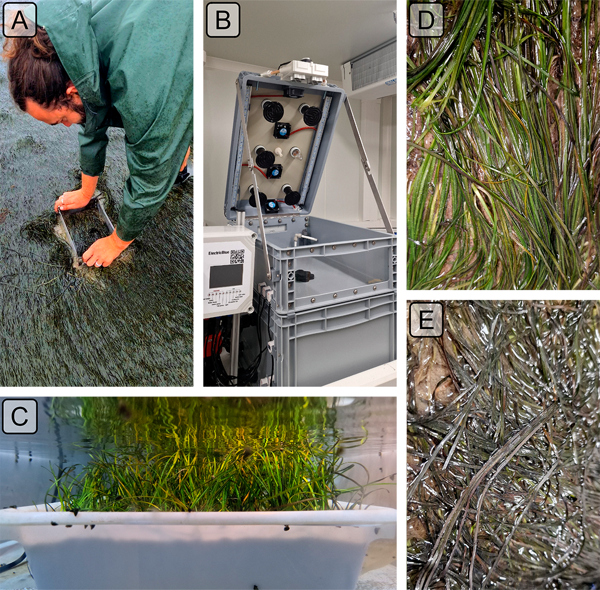
```

### Experimental design

Two intertidal chambers from [ElectricBlue](https://electricblue.eu/intertidal-chamber) were used to simulate tidal cycles and control water temperature during high tide and air temperature during low tide (@fig-design B,C). One chamber served as the control, while the other was used for the experimental treatment.

```{r in situ temperature Bourgneuf}
#| cache: true
#| echo: false
#| eval: false
#| warning: false

library(tidyverse)

fn <- function(x){
  a <- read_csv(x,skip = 21) %>% 
    mutate(file = gsub(".*/","",x))
  return(a)
}

df_insitu <- list.files("Data/In_situ_temperature/",".csv",full.names = T) %>% 
  map(fn) %>% 
  bind_rows() %>% 
  mutate(location = case_when(str_detect(file,"Upper") ~ "Upper",
                              str_detect(file,"Lower") ~ "Lower"),
         date = as.POSIXct(time, format = c("%Y-%m-%d %H:%M:%S"), tz = "UTC")) %>% 
      # dplyr::filter(date >= as.POSIXct("2024-08-14 12:00:00") & date <= as.POSIXct("2024-08-16 00:00:00"),
        dplyr::filter(location == "Upper") %>%
  mutate(day = as.Date(date),
         tide = NA)

df_insitu %>% 
  ggplot(aes(x = date, y = temp, color = location))+
  geom_line()

daily_max <- df_insitu %>% 
  group_by(day) %>% 
  reframe(daily_max_insitu = max(temp))


AirTemperature_MF <- list.files("Data/MeteoFrance/RAW/",pattern = "HOR_departement_85_*", full.names = TRUE) %>% 
  map(read.delim,
      sep = ";",
      .progress = TRUE) %>%
  list_rbind() %>% 
  dplyr::select(NOM_USUEL, LAT,LON,,AAAAMMJJHH,`T`, TN, TX, T10, T20, T50,T100) %>% 
  dplyr::filter(!is.na(`T`), 
                NOM_USUEL == "NOIRMOUTIER EN") %>% 
  mutate(date = as.POSIXct(as.character(AAAAMMJJHH), format = "%Y%m%d%H",tz = "UTC"),
         day = as.Date(date))


AirTemperature_MF_daily_max <- AirTemperature_MF %>% 
  group_by(day) %>% 
  reframe(daily_max_MF = max(`T`))

df_Temp <- daily_max %>% 
  left_join(AirTemperature_MF_daily_max, by = "day") %>% 
  pivot_longer(-day, names_to = "source", values_to = "temp")

coltabl = c("daily_max_insitu" = "#1f77b4", "daily_max_MF" = "#ff7f0e")

plot_temp <- df_Temp %>% 
  ggplot(aes(x = source, y = temp, color = source))+
  geom_boxplot(show.legend = F)+
  scale_color_manual(values = coltabl)+
  scale_x_discrete(labels=c("daily_max_insitu" = expression(italic("in situ")), "daily_max_MF" = "Meteo France"))+
  ylab("Daily maximum temperature (°C)")+
  theme_Bede()+
  theme(axis.title.x = element_blank(),
        axis.text.x = element_text(size = 30),
        axis.text.y = element_text(size = 30),
        axis.title.y = element_text(size = 35))

ggsave("Paper/Figs/High_res/Temperature_compare.png", plot_temp, height = 10, width = 10, dpi = 300)

meandiff <- df_Temp %>% 
  group_by(source) %>% 
  reframe(mean =mean(temp, na.rm = T), 
          sd = sd(temp, na.rm = T))


```

```{r Fig Temperature_Bourgneuf}
#| cache: false
#| echo: false
#| warning: false
#| fig-cap: "Comparison of daily maximum temperatures in August measured using an in-situ sensor (blue) and retrieved from Meteo France (orange). The solid line in the middle of the boxplot represents the median, the two ends of the box represent the 25th and 75th percentiles, and the whiskers represent values that are no more than 1.5 times the interquartile range."
#| label: fig-Temperature_Bourgneuf
#| fig-width: 10
#| fig-height: 10
#| out-width: "80%"


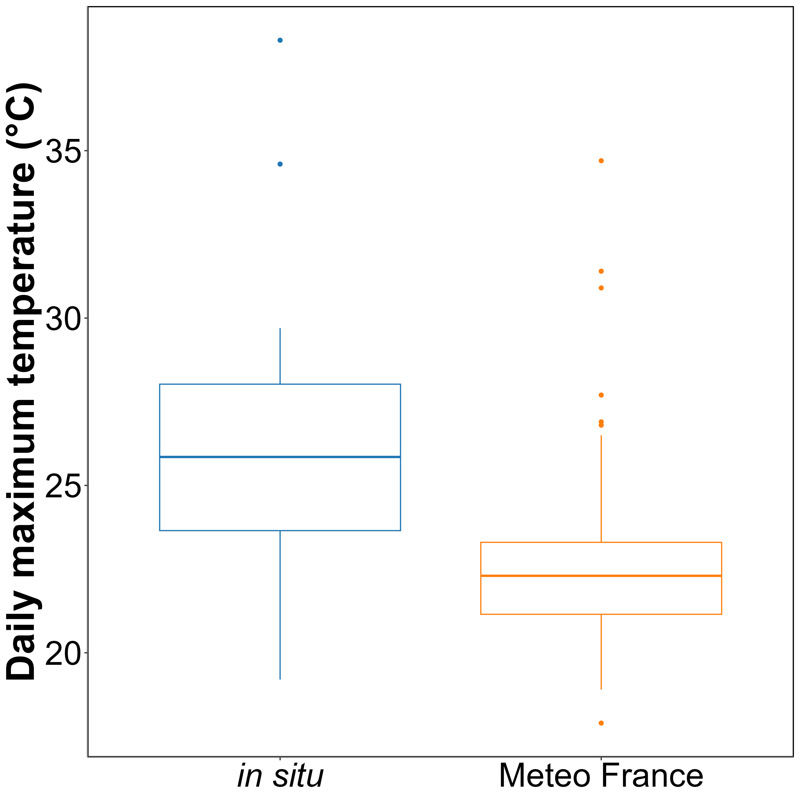
```

To closely replicate field temperatures experienced by seagrasses during the experiment, *in situ* temperature sensors were installed at the sampling site in Bourgneuf Bay in August 2024. Daily maximum temperatures recorded by these *in situ* sensors were compared to measurements from the nearest Meteo France weather station (@fig-Temperature_Bourgneuf). On average, *in situ* temperatures were 3 ± 3.2°C higher than those recorded by Meteo France. Additionally, temperatures recorded by Meteo France were more stable than those from the *in situ* sensors, likely due to the sheltered and shaded location of the Meteo France equipment. This difference was used to adjust heatwave temperatures measured by Meteo France to better reflect the conditions experienced by the seagrasses.

The control chamber was kept at temperatures representing typical seasonal conditions, with water temperatures ranging from 18°C to 19°C and air temperatures from 18°C to 23°C, following natural circadian temperature fluctuations (@fig-Profile left). For the experimental treatment, air temperature was adjusted to replicate an atmospheric heatwave that affected the seagrass meadow in Quiberon, France (47°35'40.0"N, 3°07'30.0"W), from September 2 to September 6, 2021. On the first day of the experiment, air temperatures in the experimental chamber were set to range from 23°C at night to 35°C during the day, increasing by 1°C daily. Water temperature in the experimental chamber was also adjusted to mimic heatwave conditions, starting at the seasonal baseline (18°C) and rising incrementally by 0.5°C daily to simulate the increasing temperatures during the heatwave. This setup aimed to replicate the thermal stress experienced by the seagrass meadow during the actual heatwave event (@fig-Profile right). The experiment concluded only when no changes in the reflectance of the treatment were observed for two consecutive days.

```{r chamber profiles}
#| cache: true
#| echo: false
#| eval: false
#| warning: false

library(MapRs)
library(tidyverse)
library(Utilities.Package)
library(patchwork)

experimental_design <- Make_Chamber_Profile(min_Air_Temp_control = 19,
                                            max_Air_Temp_control = 23,
                                            min_Air_Temp_test = 23,
                                            max_Air_Temp_test = 35,
                                            min_Water_Temp_control= 18, 
                                            max_Water_Temp_control = 18,
                                            min_Water_Temp_test = 18,
                                            max_Water_Temp_test = 18,
                                            date_start = "2024-07-22 21:00:00",
                                            date_end = "2024-07-26 23:00:00",
                                            low_tide_time = "2024-07-23 12:00:00",
                                            High_Tide_Until = "2024-07-24 09:00:00",
                                            daily_increase_Air_Test = 1,
                                            daily_increase_Water_Test = 0.5,
                                            daily_increase_Air_Control = 0,
                                            daily_increase_Water_Control = 0,
                                            sunrise = 6.25,
                                            sunset = 22,
                                            max_light_intensity = 120,
                                            export_profile = F,
                                            Tide = "both",
                                            night_tide = T,
                                            time_step = 60, 
                                            Save_Experiment = F, 
                                            Experiment_Name = "HW5_24072024_to_26072024")

df_control <- experimental_design$Control_df %>% 
  dplyr::filter(Time > as.POSIXct("2024-07-24 00:00:00", format = "%Y-%m-%d %H:%M", tz = "UTC")) %>% 
  dplyr::mutate(scenario = "Control")
df_test <- experimental_design$Test_df %>% 
  dplyr::filter(Time > as.POSIXct("2024-07-24 00:00:00", format = "%Y-%m-%d %H:%M", tz = "UTC")) %>% 
  dplyr::mutate(scenario = "Test")

df <- df_control %>% 
  bind_rows(df_test)

polygon_table <-   df %>% 
  group_by(tide_ID) %>% 
  reframe(Tide_Status = unique(Tide_Status), 
          xmin = min(Time),
          xmax = max(Time),
          T_min = min(Temp_Air,Temp_Water),
          T_max = max(Temp_Air,Temp_Water)) %>% 
  ungroup() %>% 
  mutate( ymin = min(T_min),
          ymax = max(T_max)) %>% 
  rename(Tide = Tide_Status) %>% 
  mutate(Tide = case_when(Tide == "High_Tide" ~ "High Tide",
                          TRUE ~ "Low Tide"))

#### Test
water_polyline_test <- df %>% 
  dplyr::filter(scenario == "Test") %>% 
  dplyr::filter(Tide_Status == "High_Tide") 

air_polyline_test <- df %>% 
  dplyr::filter(scenario == "Test") %>% 
  dplyr::filter(Tide_Status == "Low_Tide")

max_air_temp_test <- df %>% 
  dplyr::filter(scenario == "Test") %>% 
  dplyr::filter(Tide_Status == "Low_Tide") %>% 
  group_by(tide_ID) %>% 
  dplyr::filter(Temp == max(Temp)) %>% 
  dplyr::filter(Temp >=35)

  cols_fill <- c("High Tide" = "gray1", "Low Tide" = "gray50")
  cols_col <- c("Air Temperature" = "red4", "Water Temperature" = "blue3")


plot_treatment <- df %>% 
  dplyr::filter(scenario == "Test") %>% 
ggplot()+
  geom_line(aes(x = Time, y = Temp))+
  geom_rect(data = polygon_table , aes(ymin = 18, ymax = 39, xmin = xmin, xmax =xmax, fill = Tide, group = tide_ID),alpha = 0.1,show.legend = F) +
  geom_line(data = df  %>% 
    dplyr::filter(Time > as.POSIXct("2024-07-24 09:00:00", format = "%Y-%m-%d %H:%M", tz = "UTC")) %>% 
    dplyr::filter(scenario == "Test"),
    aes(x = Time, y = Temp_Water, color = "Water Temperature"), linewidth = 1, linetype = "dashed", alpha = 0.3,show.legend = F)+
  geom_line(data = water_polyline_test, aes(x = Time, y = Temp, group = tide_ID, color = "Water Temperature"), linewidth = 1,show.legend = F)+
    scale_x_datetime(date_breaks = "6 hour", date_labels = "%H:%M") +
  geom_line(aes(x = Time, y = Temp_Air, color = "Air Temperature"), linewidth = 1, linetype = "dashed", alpha = 0.3,show.legend = F)+
  geom_line(data = air_polyline_test, aes(x = Time, y = Temp, group = tide_ID, color = "Air Temperature"),, linewidth = 1,show.legend = F)+
    geom_text(data = data.frame(x = as.POSIXct("2024-07-24 03:00:00", format = "%Y-%m-%d %H:%M", tz = "UTC"), y = 38.5, label = "Treatment"), aes( x = x, y =y , label = label), hjust = 0, size = 10)+
    scale_fill_manual(name = "legend",
                      values = cols_fill) +
    scale_color_manual(name = "legend",
                       values = cols_col) +
   ggforce::geom_mark_ellipse(data=max_air_temp_test,
                 aes(x=Time,
                     y=Temp,
                     x0 = Time, 
                     y0 = Temp + 1,
                     label = paste0(Temp, " °C"),
                     group = tide_ID),
                     # description=Description),
                 size=0.3,
                 fill = "goldenrod",
                 con.colour = "goldenrod4",
                 show.legend=F,
                 label.fontsize = 25,
                 label.hjust = 0.5,
                 con.size = 2,
                 alpha=0.8,
  expand = unit(2, "mm") , 
  radius = unit(2, "mm") ,
  label.fill = NA,
  label.buffer = unit(5, "mm"))+
  ylab("Temperature (°C)")+
  ylim(c(18,39))+
  scale_y_continuous(position = "right") +
  theme_Bede()+
    theme(axis.text.x = element_text(size = 25, angle = 45, vjust = 0.6),
          axis.text.y = element_text(size = 25),
          axis.title.x = element_text(size = 30),
          axis.title.y = element_text(size = 30))

### Control 
water_polyline_control <- df %>% 
  dplyr::filter(scenario == "Control") %>% 
  dplyr::filter(Tide_Status == "High_Tide") 

air_polylines_control <- df %>% 
  dplyr::filter(scenario == "Control") %>% 
  dplyr::filter(Tide_Status == "Low_Tide")

max_air_temp_control <- df %>% 
  dplyr::filter(scenario == "Control") %>% 
  dplyr::filter(Tide_Status == "Low_Tide") %>% 
  group_by(tide_ID) %>% 
  dplyr::filter(Temp == max(Temp)) %>% 
  dplyr::filter(Temp >=20)

  # cols_fill <- c("High Tide" = "gray30", "Low Tide" = "gray90")
  # cols_col <- c("Air Temperature" = "red4", "Water Temperature" = "blue3")


plot_control <- df %>% 
  dplyr::filter(scenario == "Control") %>% 
  ggplot()+
    geom_line(aes(x = Time, y = Temp),alpha = 0.2, linewidth = 1)+
    geom_rect(data = polygon_table , aes(ymin = 18, ymax = 39, xmin = xmin, xmax =xmax, fill = Tide, group = tide_ID),alpha = 0.1) +
    geom_line(data = df  %>% 
      dplyr::filter(Time > as.POSIXct("2024-07-24 09:00:00", format = "%Y-%m-%d %H:%M", tz = "UTC")) %>% 
      dplyr::filter(scenario == "Control"),
      aes(x = Time, y = Temp_Water, color = "Water Temperature"), linewidth = 1, linetype = "dashed", alpha = 0.3)+
    geom_line(data = water_polyline_control, aes(x = Time, y = Temp, group = tide_ID, color = "Water Temperature"), linewidth = 1)+
    scale_x_datetime(date_breaks = "6 hour", date_labels = "%H:%M") +
    geom_line(aes(x = Time, y = Temp_Air, color = "Air Temperature"), linewidth = 1, linetype = "dashed", alpha = 0.3)+
    geom_line(data = air_polylines_control, aes(x = Time, y = Temp, group = tide_ID, color = "Air Temperature"), linewidth = 1)+
    geom_text(data = data.frame(x = as.POSIXct("2024-07-24 03:00:00", format = "%Y-%m-%d %H:%M", tz = "UTC"), y = 38.5, label = "Control"), aes( x = x, y =y , label = label), hjust = 0,size = 10)+
    ggforce::geom_mark_ellipse(data=max_air_temp_control,
                   aes(x=Time,
                       y=round(Temp,0),
                       x0 = Time, 
                       y0 = Temp + 1,
                       label = paste0(round(Temp,0), " °C"),
                       group = tide_ID),
                       # description=Description),
                   size=0.3,
                   fill = "goldenrod",
                   con.colour = "goldenrod4",
                   show.legend=F,
                   label.fontsize = 25,
                   label.hjust = 0.5,
                   con.size = 2,
                   alpha=0.8,
    expand = unit(2, "mm") , 
    radius = unit(2, "mm") ,
    label.fill = NA,
    label.buffer = unit(5, "mm"))+
    scale_fill_manual(name = "legend",
                      values = cols_fill) +
    scale_color_manual(name = "legend",
                       values = cols_col) +
  ylab("Temperature (°C)")+

    ylim(c(18,39))+
    theme_Bede()+
    theme(legend.position = c(0.16,.8),
          legend.background = element_rect(fill=scales::alpha('white', 0.8)),
          legend.text = element_text(size = 20, hjust = 0),
          legend.title = element_blank(),
          legend.key.size = unit(0.7,"cm"),
          legend.spacing = unit(0,"mm"),
          axis.text.x = element_text(size = 25,angle = 45, vjust = 0.6),
          axis.text.y = element_text(size = 25),
          axis.title.x = element_text(size = 30),
          axis.title.y = element_text(size = 30))


plt <- plot_control + plot_treatment

ggsave("Paper/Figs/High_res/Chamber_Profils.png",plt, height = 874*4, width = 1911*4, unit= "px")
```

```{r Fig Profiles}
#| cache: false
#| echo: false
#| warning: false
#| fig-cap: "Temperature profiles of both the control (left) and the treatment (right) followed during the heatwave experiment. The red line indicates air temperature, whereas the blue line indicates water temperature. Due to the tidal cycle followed during the experiment, the seagrasses only experience temperatures representade by solid lines."
#| label: fig-Profile
#| fig-width: 10
#| fig-height: 8
#| out-width: "100%"

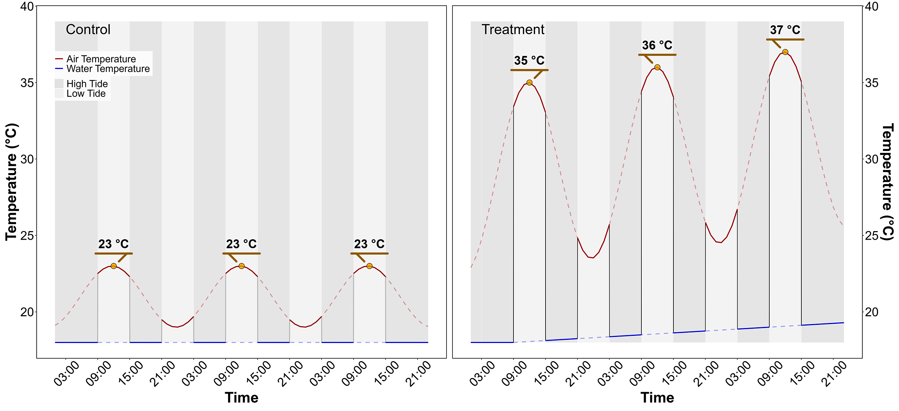
```

### Bio-optical measurmenents over seagrass leaves

#### Hyperspectral measurements

Throughout the experiment, hyperspectral signatures of both the control and treatment seagrasses were taken using an ASD HandHeld 2 equipped with a fiber optic, allowing measurements to be taken directly inside the chamber without opening it. Automatic spectra acquisition has been done using the [RS3 softaware](https://www.malvernpanalytical.com/en/learn/knowledge-center/user-manuals/rs3-software-user-manual) developed by the instrument manufacturer. An average of five reflectance spectrum ($R(\lambda)$), each with an integration time of 544 ms, was taken every minute. Every 10 minutes, the fiber optic was switched from one benthic chamber to the other, in order to measure reflectance in both treatment and control. Because light conditions were controlled inside of the chambers, reflectance calibration of the instrument was performed only each morning at the very first moment of low tide using a Spectralon white reference with 99% Lambertian reflectivity.

The second derivative of $R$ was calculated to retrieve absorption features and compare their variability over time. Two radiometric indices were also monitored throughout the experiment :

-   The Normalized Difference Vegetation Index (NDVI, @rouse1974monitoring), as a proxy of the concentration of chlorophyll-a (@eq-ndvi)

$$
NDVI = \frac{R(840)-R(668)}{R(840)+R(668)}
$$ {#eq-ndvi}

where $R(840)$ and $R(668)$ are the reflectance at 840 nm and 668 nm respectively.

-   The Seagrass Percent Covers, developed by @zoffoli2020sentinel, used to assess proportion of seagrass inside of a pixel (@eq-spc):

$$
SPC = 172.06 \times NDVI - 22.18
$$ {#eq-spc}

-   The Green Leaf Index (GLI, @louhaichi2001spatially), as a measurement of the greenness of seagrass leafs (@eq-gli)

$$
GLI = \frac{[R(550)-R(668)]+[R(550)-R(450)]}{(2 \times R(550) )+ R(668) + R(450) }
$$ {#eq-gli}

where $R(550)$ and $R(450)$ are the reflectance in green at 550 nm and in the blue at 450 nm, respectively.

> #### WILL BE REMOVED - Multispectral imagery measurement
>
> Parallel to hyperspectral measurements, multispectral images were taken at the beginning and end of each diurnal low tide (09:00 am and 03:00 pm). A Micasense RedEdge-MX Dual multispectral camera, originally designed to be mounted on a drone, was modified for use without a drone. A 3D-printed mount was designed to attach the camera to the intertidal chamber and ensure that each picture was captured under the same conditions. At each time step (09:00 am and 03:00 pm), a first picture of the Spectralon was taken to allow for image correction in reflectance, followed by a second picture of the target. [DISCOV](https://sigoiry.github.io/DISCOV-MicaSense/), a Neural Network classification model previously developed to map intertidal vegetation using drone imagery, has been applied to each image taken inside the intertidal chambers. To understand the behavior of the model on seagrasses affected by heatwaves, classification images from before and after the heatwave have been compared.

#### Pigment concentration measurements

At the beginning and the end of each diurnal low tide (09:00 am and 03:00 pm) leaves samples have been took in both the test and the control. leaves sampled have been stored under -80°C waiting for analysis. Before pigment extraction, each sample was lyophilized and its dry weight was measured. Pigment composition and biomass were analyzed using high-performance liquid chromatography (HPLC). The HPLC system (Alliance HPLC 248 System, Waters) was equipped with a reverse-phase C-18 separating column (SunFire C-18 Column, 100Å, 3.5 µm, 2.1 mm x 50 mm, Waters), preceded by a precolumn (VanGuard 3.9 mm x 5 mm, Waters). The system also included a photodiode array detector (2998 PDA) and a fluorimeter (Ex: 425 nm, Em: 655 nm; RF-20A, SH

**Au secours Philippe !!!**

## Observation of seagrass leaves darkening.

### Field Observation

```{r filedtrip Quadrats}
#| cache: true
#| echo: false
#| eval: false
#| warning: false

library(tidyverse)
library(exiftoolr)
library(shiny)

image_list <- list.files("Data/Biolittoral/Bio-Littoral_Drone/OFB2021_Quadrat_Zost_QBR", recursive = T, full.names = T) %>% 
  as_tibble() %>% 
  dplyr::rename(path = "value") %>% 
  dplyr::mutate(filename = gsub(".*/","",path),
                lat = NA,
                lon=NA) %>% 
  dplyr::filter(str_detect(path,"Quadrats"))


  for (i in 1:nrow(image_list)) {
    a <- exiftoolr::exif_read(image_list$path[i])
    
    lat_a <- a$GPSLatitude
    lon_B <- a$GPSLongitude
    
    image_list$lat[i] <- lat_a
    image_list$lon[i] <- lon_B
  } 
 
 if (!"Target_types" %in% colnames(image_list)) {
  image_list$Target_types <- NA
}

ui <- fluidPage(
  titlePanel("Image Annotation App"),
  sidebarLayout(
    sidebarPanel(
      uiOutput("category_ui"),
      textInput("new_category", "Add New Category"),
      actionButton("add_category_btn", "Add Category"),
      actionButton("next_btn", "Next Image")
    ),
    mainPanel(
      imageOutput("image_display", width = "900px")
    )
  )
)

server <- function(input, output, session) {
  # Reactive value to keep track of the current image index
  current_index <- reactiveVal(1)
  
  # ReactiveValues to store categories
  rv <- reactiveValues(categories = character())
  
  # Display the current image
  output$image_display <- renderImage({
    # Get the current image path
    img_path <- image_list$path[current_index()]
    
    # Check if the image file exists
    if (file.exists(img_path)) {
      list(src = img_path, contentType = 'image/jpeg', style = "width:100%; height:auto;", alt = "Image")
    } else {
      list(src = "https://via.placeholder.com/400x300?text=Image+Not+Found", contentType = 'image/png', alt = "Image Not Found")
    }
  }, deleteFile = FALSE)
  
  # Generate the UI for categories
  output$category_ui <- renderUI({
    if (length(rv$categories) > 0) {
      checkboxGroupInput("selected_categories", "Select Categories:", choices = rv$categories)
    } else {
      tags$p("No categories available. Please add a new category.")
    }
  })
  
  # Add new category
  observeEvent(input$add_category_btn, {
    new_cat <- input$new_category
    if (!is.null(new_cat) && new_cat != "") {
      rv$categories <- unique(c(rv$categories, new_cat))
      updateTextInput(session, "new_category", value = "")
    }
  })
  
  # Next button logic
  observeEvent(input$next_btn, {
    # Get selected categories
    selected_cats <- input$selected_categories
    if (is.null(selected_cats)) {
      selected_cats <- NA
    } else {
      selected_cats <- paste(selected_cats, collapse = ", ")
    }
    
    # Save the selected categories to 'Target_types' column
    image_list$Target_types[current_index()] <<- selected_cats
    
    # Move to next image
    if (current_index() < nrow(image_list)) {
      current_index(current_index() + 1)
      
      # Reset the selected categories input
      updateCheckboxGroupInput(session, "selected_categories", selected = character(0))
    } else {
      showModal(modalDialog(
        title = "End of Images",
        "You have reached the end of the images.",
        easyClose = TRUE
      ))
    }
  })
}

shinyApp(ui = ui, server = server)
 
write.csv(image_list, "Data/Biolittoral/Bio-Littoral_Drone/Quadrat_metadata.csv", row.names = F)


```

```{r img_list_text}
#| cache: true
#| echo: false
#| eval: true
#| warning: false

image_list <- read.csv("../Data/Biolittoral/Bio-Littoral_Drone/Quadrat_metadata.csv") %>% 
    as_tibble() %>% 
  dplyr::filter(Target_types %in% c("Bleached_Seagrass", "Healthy_Seagrasses"))

```

```{r Sites Quiberon}
#| cache: true
#| echo: false
#| eval: false
#| warning: false

library(tidyverse)
library(sf)
library(terra)
library(MapRs)
library(nngeo)
library(smoothr)
library(rnaturalearth) 
library(rnaturalearthdata) 

quadrat_sf <- image_list %>% 
  st_as_sf(coords = c("lon", "lat"), crs = 4326) %>% 
  mutate(Target_types = case_when(str_detect(Target_types,"Mix") ~ "Other",
                                  str_detect(Target_types,"Healthy") ~ "Healthy_seagrass",
                                  str_detect(Target_types,"Bleached") ~ "Bleached_seagrass",
                                  T ~ "Other")) %>% 
  dplyr::filter(Target_types %in% c("Bleached_seagrass","Healthy_seagrass"))# Assuming your data is in WGS84 (EPSG: 4326)


Drone_flight_area <- "Data/shp/Flight_area_drone.shp" %>% 
  read_sf()
######  Intertidal mask computing ######

lon_min <- -3.15
lon_max <- -3.07
lat_min <- 47.54
lat_max <- 47.6

poly <- data.frame(
  x = c(lon_min,lon_max,lon_max,lon_min),
  y = c(lat_max,lat_max,lat_min,lat_min),
  id = c(1,1,1,1)
)


# Ensure the polygon is closed by adding the first point at the end if necessary
if (!all(poly[1, c("x", "y")] == poly[nrow(poly), c("x", "y")])) {
  poly <- rbind(poly, poly[1, ])
}

# Create a matrix of coordinates
coords <- as.matrix(poly[, c("x", "y")])

# Create a list of coordinate matrices (required by st_polygon)
polygon_list <- list(coords)

# Create an 'sfc' (simple features geometry list column) object with the appropriate CRS
polygon_sfc <- st_sfc(st_polygon(polygon_list), crs = 4326) %>% 
  st_transform(32630)
  # CRS 4326 corresponds to WGS84

# Combine the 'id' with the geometry to create an 'sf' object
poly_sf <- st_sf(id = unique(poly$id), geometry = polygon_sfc)


Low_Tide <- "Data/Sentinel2/S2B_MSIL2A_20230903T110629_N0509_R137_T30TVT_20230903T125637.SAFE" %>% 
  list.files(pattern = ".jp2", recursive = T, full.names = T) %>% 
  as_tibble() %>% 
  rename(path = "value") %>% 
  dplyr::filter(str_detect(path, "10m"))

High_Tide <- "Data/Sentinel2/S2B_MSIL2A_20240503T112119_N0510_R037_T30TVT_20240503T130006.SAFE" %>% 
  list.files(pattern = ".jp2", recursive = T, full.names = T) %>% 
  as_tibble() %>% 
  rename(path = "value") %>% 
  dplyr::filter(str_detect(path, "10m"))

RGB_High <- rast(High_Tide$path[6]) %>% 
  crop(poly_sf)
RGB_Low <- rast(Low_Tide$path[6]) %>% 
  crop(poly_sf)

RGB(RGB_High) <- 1:3
RGB(RGB_Low) <- 1:3

NDVI_comp <- function(df,mask){
  
  B4 <- (rast(df$path[4])-1000) %>% 
    crop(mask)
  B8 <- (rast(df$path[5])-1000) %>% 
    crop(mask)
  
  ndvi = (B8-B4)/(B8+B4)
  return(ndvi)
}

 NDVI_High<- NDVI_comp(High_Tide,poly_sf)
 NDVI_Low<- NDVI_comp(Low_Tide,poly_sf)
 
 
int_mask <- NDVI_High < -0.05 & NDVI_Low > 0.05

values(int_mask)[values(int_mask) == F] <- NA

mask_sf <- as.polygons(int_mask) %>% 
  st_as_sf() %>% 
  st_cast("POLYGON") %>% 
  mutate(area = st_area(geometry)) %>% 
  dplyr::filter(as.numeric(area) > 6500) %>% 
  nngeo::st_remove_holes() %>% 
  smoothr::smooth(method = "ksmooth", smoothness = 3)
  
plot(mask_sf)

write_sf(mask_sf,"Data/shp/mask_intertidal_quiberon.shp")

########## Geomgrob ##################"

sovereignty10 <- ne_countries(scale = 10, returnclass = "sf")

world_map <- sovereignty10 %>% 
  st_as_sf() %>% 
  dplyr::filter(sovereignt%in%c("Spain","France","Portugal",
                                "Italy","Andorra",
                                "United Kingdom",
                                "Switzerland","Belgium",
                                "Germany","Luxembourg") ) 

bbox_europe <- st_bbox(c(xmin = -20, ymin = 34,
                         xmax = 20, ymax = 55) ,
                       crs = st_crs(world_map) ) 

world_map<-st_make_valid(world_map) 

european_union_map_cropped <- st_crop(world_map, bbox_europe)  %>% 
  st_transform("+proj=laea +lat_0=52 +lon_0=10 +x_0=4321000 +y_0=3210000 +ellps=GRS80 +units=m +no_defs ")  


UnitedKingdom<-sovereignty10 %>% 
  st_as_sf() %>% 
  dplyr::filter(sovereignt%in%c("United Kingdom") ) %>% 
  st_cast("POLYGON") 

bbox_UK <- st_bbox(c(xmin = -20, ymin = 45,
                         xmax = 20, ymax = 55) ,
                       crs = st_crs(UnitedKingdom) ) 

UnitedKingdom<-st_make_valid(UnitedKingdom) 

UK_map_cropped <- st_crop(UnitedKingdom, bbox_UK)  %>% 
  st_transform("+proj=laea +lat_0=52 +lon_0=10 +x_0=4321000 +y_0=3210000 +ellps=GRS80 +units=m +no_defs ") 

Europe_sf<-european_union_map_cropped %>% 
  dplyr::bind_rows(UK_map_cropped) 

Miniworld_map <- sovereignty10 %>% 
  st_as_sf()

sf_use_s2(FALSE)

bbox_EU <- st_bbox(c(xmin = -30, ymin = 20,
                         xmax = 50, ymax = 70) ,
                       crs = st_crs(Miniworld_map) ) 

MiniEU_map<-st_crop(Miniworld_map, bbox_EU)  %>% 
  st_transform("+proj=laea +lat_0=52 +lon_0=10 +x_0=4321000 +y_0=3210000 +ellps=GRS80 +units=m +no_defs ")  


scaleFUN <- function(x) paste0(sprintf("%.2f", x),"°N")
  
Quiberon_Location <- data.frame(
  lon = mean(c(lon_max,lon_min)),
  lat = mean(c(lat_max,lat_min)),
  ID = "Quiberon",
  Site = " baie de Plouharnel"
) %>% 
  st_as_sf(coords=c("lon","lat") )  %>% 
  st_set_crs("EPSG:4326") %>% 
  st_transform("+proj=laea +lat_0=52 +lon_0=10 +x_0=4321000 +y_0=3210000 +ellps=GRS80 +units=m +no_defs ")  %>% 
  dplyr::mutate(lon = sf::st_coordinates(.) [,1],
                lat = sf::st_coordinates(.) [,2]) %>% 
  sf::st_set_geometry(NULL)


p1  <-
  ggplot(MiniEU_map) +
  geom_sf(linewidth=0.5,alpha=0.93,
          fill="#CFCFCF",colour="grey30")+
    ggforce::geom_mark_ellipse(data=Quiberon_Location,
                 aes(x=lon,
                     y=lat,
                     label = ID
                     # description=Site
                     ) ,
                 linewidth=0.2,
                 fill="goldenrod",
                 show.legend=F,
                 label.hjust = 0.3,
                 con.size = 1,
                 con.colour = "goldenrod4",
                 label.fontsize = c(12),
                 alpha=0.8,
                 expand = unit(1.5, "mm") , 
                 radius = unit(1.5, "mm") , 
                 label.buffer = unit(4, "mm") ,
                 label.fill = "grey90")+
  coord_sf(xlim=c(2600000,4100000) ,
          ylim=c(1600000,3100000))+
  theme_Bede_Map()+
  labs(x="Longitude",
       y="Latitude")+
  scale_y_continuous(labels=scaleFUN)+
  # theme(plot.margin = unit(c(0.0,0.0,0.0,0.0), "cm"),
  #       axis.title = element_blank(),
  #       axis.ticks = element_blank(),
  #       panel.grid.major = element_blank(),
  #       # axis.text.x = element_text(size = 20),
  #       # axis.text.y = element_text(size = 20) 
  #       axis.text.x = element_blank(),
  #       axis.text.y = element_blank() 
  #       )+
  theme_void()+
  theme(plot.background = element_rect(fill = "slategray3"))

col_sf <- c("Bleached_seagrass" = "darkred", 
            "Healthy_seagrass" = "darkgreen"
            # "Other" = "grey"
            )

# Extract x and y ranges
xlim <- c(lon_min, lon_max)
ylim <- c(lat_min, lat_max)

# Compute the coordinates for the rectangle (25% to 75% of the ranges)
xleft   <- xlim[1] + 0.745 * diff(xlim)
xright  <- xlim[1] + 0.99 * diff(xlim)
ybottom <- ylim[1] + 0.854 * diff(ylim)
ytop    <- ylim[1] + 0.975 * diff(ylim)

# Create a rectangle as an sf polygon
rectangle_coords <- matrix(c(
  xleft,  ybottom,
  xleft,  ytop,
  xright, ytop,
  xright, ybottom,
  xleft,  ybottom  # Close the polygon by repeating the first point
), ncol = 2, byrow = TRUE)

rectangle_sf <- st_polygon(list(rectangle_coords)) %>%
  st_sfc(crs = st_crs("EPSG:4326")) %>%
    st_transform("+proj=laea +lat_0=52 +lon_0=10 +x_0=4321000 +y_0=3210000 +ellps=GRS80 +units=m +no_defs ") %>%
  st_sf()


p2 <- ggplot() +
  tidyterra::geom_spatraster_rgb(data = RGB_Low) +
  geom_sf(data = mask_sf, aes(fill = "Mask"), color = "grey20", linewidth = 0.5) +
  geom_sf(data = Drone_flight_area, aes(fill = "Drone_Flight_Area"), color = "grey0", size = 2.2, linewidth = 0.5) +
  geom_sf(data = quadrat_sf, aes(color = Target_types), size = 2.1)+
  geom_sf(data = rectangle_sf, fill = "white", alpha = 0.5, color = NA) +
  scale_color_manual(
    values = col_sf,
    labels = c("Blackened seagrasses", "Healthy seagrasses", "Other"),
    name = NULL
  ) +
  scale_fill_manual(
    values = c("Mask" = "grey90", "Drone_Flight_Area" = "grey70"),
    labels = c("Drone Flight", "Intertidal area"),
    name = NULL  # No title for the fill legend
  ) +
  coord_sf(expand = F) +
  theme_Bede_Map() +
  guides(
    fill = guide_legend(order = 2),  # Order the fill legend
    color = guide_legend(order = 1)  # Order the color legend
  ) +
  labs(fill = NULL, colour = NULL)+
  theme(
    legend.background = element_rect(fill = alpha("white", 0)),
    legend.box = "vertical",  # Stack legends vertically
    legend.box.just = "left",  # Align the legends to the left
    legend.spacing.y = unit(0.0, 'mm'),  # Adjust the spacing between items
    legend.key = element_rect(fill = "white", color = "black"),  # Ensure clear legend keys
    legend.box.margin = margin(5, 5, 5, 5)
    )  # Adjust position if needed  )

# p2

combined_plot <- ggdraw() +
  draw_plot(p2) +                    # Main plot
  draw_plot(p1, x = 0.65, y = 0.05,   # p1 inset (bottom right)
            width = 0.3, height = 0.3)

ggsave("Paper/Figs/High_res/Quiberon_map.png", combined_plot, width = 10, height = 10, dpi = 800)

```

```{r Fig Site Quiberon Plot}
#| cache: false
#| echo: false
#| warning: false
#| fig-cap: Location of the fieldtrip campaign that occured in the 10th of September 2021. The light grey polygons indicates the intertidal zone (Zone between High tide and low tide, that is totally emerged at low tide) and the dark grey polygon indicate the extent of the drone flight. Green dots indicate location of quadrat picture over green seagrasses while red dots indicate location of quadrat took over darkened seagrasses. 
#| label: fig-quiberonMap
#| fig-width: 10
#| fig-height: 10
#| out-width: "100%"

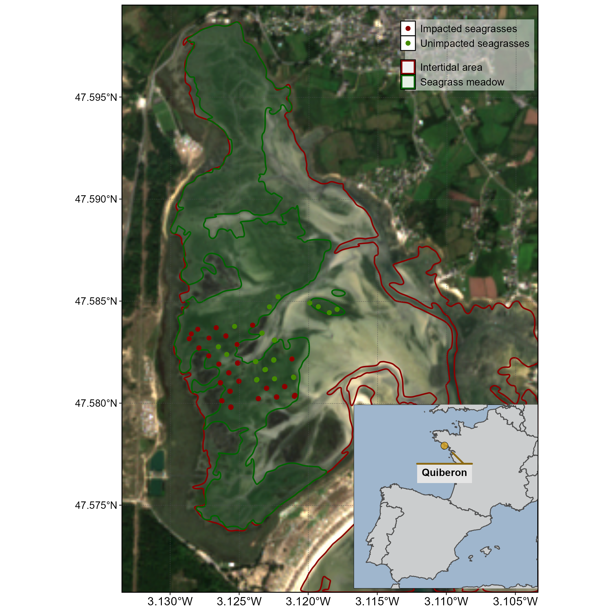
```

A fieldtrip, aiming to map a seagrass meadow near Quiberon (France : 46°57'32.0"N, 2°10'37.0"W), occurred in the 10th of September 2021 (@fig-quiberonMap). During this fieldtrip, significant darkening of seagrass leaves was observed over large areas of the meadow (@fig-QuiberonImg C & D). A total of `r nrow(image_list)` Ground Control Points (GCPs) were collected in the form of georeferenced quadrat images across the meadow. These images allow for visual assessment of vegetation type, density, and health status. The images were then divided into two categories: green seagrasses and darkened seagrasses, based on a visual estimation of the leaf condition (@fig-quiberonMap).

```{r img_Quiberon}
#| cache: true
#| echo: false
#| eval: false
#| warning: false

library(tidyverse)
library(tidyterra)
library(terra)

get_letter_position <- function(img){
  
  ext <- ext(img)
  
  x <- as.numeric(ext[1]+(0.05*(ext[2]-ext[1])))
  y <- as.numeric(ext[3]+(0.95*(ext[4]-ext[3])))

  
  return(c(ext[1]+0.1, ext[4]-0.1))
}


A <- rast("Data/imgs/biolittoral/healthy_landscap.png") 
ext(A) <- c(0,1,-2.05,0)

B <- rast("Data/imgs/biolittoral/Quadrat_Healthy.png") 
ext(B) <- c(1.05,2.05,-1,0)

C <- rast("Data/imgs/biolittoral/Quadrat_darkened.png")
ext(C) <- c(1.05,2.05,-2.05,-1.05)

D <- rast("Data/imgs/biolittoral/darkened_landscap.png") 
ext(D) <- c(2.1,3.1,-2.05,0)


letter_A <- get_letter_position(A)
letter_B <- get_letter_position(B)
letter_C <- get_letter_position(C)
letter_D <- get_letter_position(D)

letter_size <- 3

plot <- ggplot()+
  geom_spatraster_rgb(data = A, maxcell = 20e+05)+
  geom_spatraster_rgb(data = B, maxcell = 20e+05)+
  geom_spatraster_rgb(data = C, maxcell = 20e+05)+
  geom_spatraster_rgb(data = D, maxcell = 20e+05)+
  coord_equal()+
  geom_label(aes(x = letter_A[1],y=letter_A[2], label = "A"), alpha = 0.5, size = letter_size)+
  geom_label(aes(x = letter_B[1],y=letter_B[2], label = "B"), alpha = 0.5, size = letter_size)+
  geom_label(aes(x = letter_C[1],y=letter_C[2], label = "C"), alpha = 0.5, size = letter_size)+
  geom_label(aes(x = letter_D[1],y=letter_D[2], label = "D"), alpha = 0.5, size = letter_size)+
  theme_void()+
  theme(axis.text = element_blank(), 
        axis.title = element_blank(), 
        axis.ticks = element_blank(), 
        axis.ticks.length = unit(0, "pt"),
        panel.grid.major=element_blank(), 
        panel.grid.minor=element_blank(), 
        plot.margin = margin(0, 0, 0, 0, "pt"))

ggsave("Paper/Figs/High_res/img_Quiberon.png",plot, width = 3.1, height = 2.05, dpi = 800)

```

```{r Fig img_Quiberon}
#| cache: false
#| echo: false
#| warning: false
#| fig-cap: "Illustrations of the two health conditions of seagrasses observed in the field. A: Global view of a green green meadow; B: Quadrat images of green seagrasses; C: Quadrat images of darkened seagrasses; D: Global view of an darkened meadow. All images were taken on September 10th, 2021, in Quiberon."
#| label: fig-QuiberonImg
#| fig-width: 10
#| fig-height: 10
#| out-width: "100%"

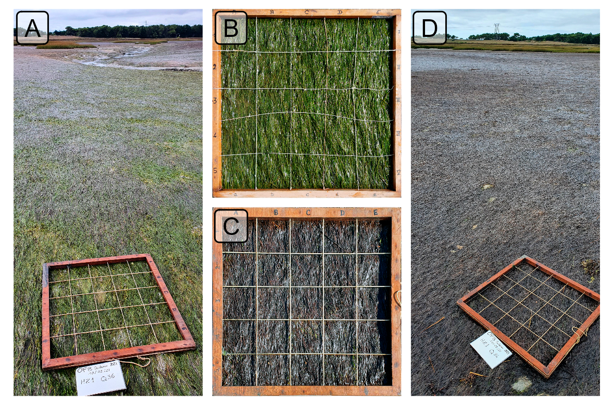
```

### Temparature Data and identification of heatwaves

#### Air temperature

Since January 1, 2024, Meteo France weather data has been freely and openly accessible. Hourly air temperature data (°C) for the French Atlantic and Channel coasts was retrieved using a [custom script](https://github.com/SigOiry/HeatWave_Seagrasses/blob/main/Scripts/MeteoFrance_Extraction.qmd) as no API was available at the time of this study. Weather stations located within 10 kilometers of the coastline were considered, but only those with at least 30 years of data were included to ensure reliable climatological reconstruction. Of the 156 weather stations within 10 kilometers of the coast, only 36 had sufficient data for climatology reconstruction. The hourly data was then aggregated into daily mean temperatures for each station.

Heatwave detection was performed using the HeatwaveR package in R [@heatwaveR]. This package utilizes the methodology proposed by @hobday2016hierarchical to detect heatwave events. The climatology for the year was computed using the temperature time series. An event was considered a heatwave each time the temperature exceeded the 90th percentile of the climatology for three consecutive days. The severity of each event has been assessed using the methodology proposed by @hobday2018categorizing. Following the methodology of @schlegel2017nearshore, coldspell events corresponding to temperature bellow the percentile 10th of the climatology during 3 consecutives days have also been measured.

Concerning heatwaves event near Quiberon, this methodology has been apply solely on the nearest weather station of our study site (Lorient-Lann Bihoue, 47°45'46"N 3°26'11"W , more than 395000 observation since the 1st of February 1952).

#### Water temperature

```{r Polygon_area_SST}
#| cache: true
#| echo: false
#| eval: true
#| warning: false

library(sf)
# Define the bounding box around Quiberon (adjust the range as needed)
lon_min <- -3.5
lon_max <- -2.7
lat_min <- 47.3
lat_max <- 47.7

poly <- data.frame(
  x = c(lon_min,lon_max,lon_max,lon_min),
  y = c(lat_max,lat_max,lat_min,lat_min),
  id = c(1,1,1,1)
)


# Ensure the polygon is closed by adding the first point at the end if necessary
if (!all(poly[1, c("x", "y")] == poly[nrow(poly), c("x", "y")])) {
  poly <- rbind(poly, poly[1, ])
}

# Create a matrix of coordinates
coords <- as.matrix(poly[, c("x", "y")])

# Create a list of coordinate matrices (required by st_polygon)
polygon_list <- list(coords)

# Create an 'sfc' (simple features geometry list column) object with the appropriate CRS
polygon_sfc <- st_sfc(st_polygon(polygon_list), crs = 4326)  # CRS 4326 corresponds to WGS84

# Combine the 'id' with the geometry to create an 'sf' object
poly_sf <- st_sf(id = unique(poly$id), geometry = polygon_sfc)

poly_sf_projected <- st_transform(poly_sf, crs = 32630)  # UTM Zone 30N

# 2. Calculate the area in square meters
area_poly_sst_m2 <- st_area(poly_sf_projected)

# 3. Convert the area to square kilometers
area_poly_sst_km2 <- units::set_units(area_poly_sst_m2, km^2)

# Convert the units object to numeric for rounding
area_poly_sst_numeric <- as.numeric(area_poly_sst_km2)

# 4. Round the area to the nearest hundred
area_poly_sst_rounded <- round(area_poly_sst_numeric / 100) * 100
```

SST data from the Copernicus CMEMS platform were downloaded for the French coast near Quiberon (47°29′03″N, 3°07′09″W), covering 1982-2022 [@CMEMS_1]. Only pixels within an area of `r area_poly_sst_rounded` km² around Quiberon, Brittany, France (47°29′03″N, 3°07′09″W) were extracted and analyzed. This area was large enough to minimize missing values caused by cloud cover, yet small enough to avoid being influenced by the stability of offshore SST. The multi-sensor Level 3S Sea Surface Temperature (SST) product that we used is built from nighttime infrared satellite data, including sources like ESA SST CCI, C3S, and EUMETSAT. Data from AVHRR, ATSR, and SLSTR radiometers are used, but only those with a quality level above 4. An intercalibration method ensures consistency, and a daily reference SST field is constructed by combining the best data with median values from other sources. A large-scale bias correction is applied, and daily single-sensor composites are merged into a multi-sensor file (L3S), selecting the best sensor for each grid cell. A daily average was computed for the time series, and the HeatwaveR package [@heatwaveR] was used to compute SST climatology and detect SST events using the same method as air temperature event detection.

### Satellite Observation

Two Sentinel-2 images covering the field trip site (@fig-quiberonMap) were downloaded from the Copernicus platform [@copernicus_sentinel2]. The first image was taken before the heatwave event on September 1, 2021, and the second one after the event on September 6, 2021. Both images were acquired at Level-2 processing, in surface reflectance, and were orthorectified and atmospherically corrected to account for the effects of the atmosphere on reflectance values [@sen2cor].

Reflectance value of each GCPs (@fig-quiberonMap) have been exctracted and compared before and after the heatwave event.

### Emersion Time of Seagrasses

To estimate the emersion time of seagrasses during low tide, bathymetric and tidal data were used. Bathymetry data for the Quiberon intertidal meadow were sourced from the “Service Hydrographique et Océanographique de la Marine” [@shom_bathymetry_litto3d_bzh_2018_2021]. It corresponds to the Litto3D® product, which is a three-dimensional land-sea elevation database, accurately depicting the coastal terrain along certain regions of the French shores. Litto3D data were collected through airborne bathymetric lidar over the sea and airborne topographic lidar extending up to 2 km inland and is available as a gridded digital terrain model. it uses the NGF/IGN69 reference “zero”, which corresponds to the mean sea level recorded at the Marseille tide gauge between 1885 and 1897, commonly known as the “Terrestrial Altimetric Zero”.

Tidal data during the heatwave event were downloaded from the Intergovernmental Oceanographic Commission data portal [@ioc_sea_level_lecy], using measurements from the nearest tide gauge at Le Crouesty. In this dataset, the reference “zero” corresponds to the lowest astronomical tide, also known as the Hydrographic Zero.

Before calculating the emersion time, both datasets were intercalibrated to a common altitude reference. This involved applying a correction factor to the Litto3D data to align it with the Hydrographic zero. SHOM annually publishes a document called “Références Altimétriques Marines” [RAM, @shom_ram_2022], which provides these correction factors for each seaport along the French coastline. For Le Crouesty port data from 2022, the correction factor was 2.85 m.

Once aligned, the corrected elevation was compared to water height for each pixel and each time step during the heatwave event. The emersion time was then calculated as the daily total time each pixel remained exposed.

# Results

## Laboratory Experiment

```{r functions_exp}
#| cache: true
#| echo: false
#| eval: false
#| warning: false


Correction_Factor_Computation <- function(Radiance, Ref){

  Ref_Rad <- Radiance %>% 
    dplyr::filter(Time == Ref) %>% 
    pull(Value)
  
  for(i in 1:length(unique(Radiance$Time))){
    
    Rad_to_Compare <- Radiance %>% 
    dplyr::filter(Time == unique(Radiance$Time)[i])
    

    Diff <- Rad_to_Compare %>% 
      mutate(Value = (Value/Ref_Rad)) %>% 
      rename(Correction_factor = "Value")
    
    if(i == 1){
      Correction_factor = Diff
    }else{
      Correction_factor = rbind(Correction_factor,Diff)
    }
  }
  
  return(Correction_factor %>% 
           dplyr::select(-Date))
}

```

```{r data opening exp}
#| cache: true
#| echo: false
#| eval: false
#| warning: false

HW3 <- MapRs::Open_library("Data/Experiment_Intertidal_Chambers/HW3") %>% 
  mutate(ID = gsub("HW2","HW3",ID),
         Spectra = gsub("HW2","HW3",Spectra),
         experiment = "HW3",
         Subdir = gsub("/","",Subdir),
         Time = substr(Time,1,5))%>% 
  rename(scenario = "Subdir")

HW5 <- MapRs::Open_library("Data/Experiment_Intertidal_Chambers/HW5") %>% 
  mutate(experiment = "HW5",
         Subdir = gsub("/","",Subdir),
         Time = substr(Time,1,5))%>% 
  rename(scenario = "Subdir")

HW6 <- MapRs::Open_library("Data/Experiment_Intertidal_Chambers/HW6") %>% 
  mutate(experiment = "HW6",
         Subdir = gsub("/","",Subdir),
         Time = substr(Time,1,5))%>% 
  rename(scenario = "Subdir")

HW6 <- MapRs::clean_spectra(HW6, batch_size = 100)
# HW6 <- cleaned


```

```{r Radiance of References exp}
#| cache: true
#| echo: false
#| eval: false
#| warning: false

Rad <- MapRs::Open_library("Data/Radiance_Referances") %>% 
  mutate(Date = ymd_hms(paste0("2024-08-21 ",substr(Spectra,1,2) %>%  gsub("[^0-9]", "", .),":00:00"))) %>%
  group_by(Date, Wavelength) %>% 
  reframe(Value = mean(Value))

full_time_seq <- seq(min(Rad$Date), max(Rad$Date), by = "min")


for(i in 1:length(unique(Rad$Wavelength))){
  
  a <- Rad %>% 
    dplyr::filter(Wavelength == unique(Rad$Wavelength)[i])
  
  interpolated_values <- approx(
  x = a$Date, 
  y = a$Value, 
  xout = full_time_seq
  )
  
  interpolated_series <- data.frame(
    Date = interpolated_values$x,
    Wavelength = rep(unique(Rad$Wavelength)[i],length(interpolated_values$x)),
    Value = interpolated_values$y
  )
  
  if(i == 1){
    df_interpolated = interpolated_series
  }else{
    df_interpolated = rbind(df_interpolated,interpolated_series)
  }
}

ggplot(df_interpolated)+
  geom_line(aes(x = Wavelength, y = Value, color = Date, group = Date))

##################

Radiance <- df_interpolated %>% 
    as_tibble() %>% 
  mutate(Time = substr(as.character(Date),12,16))

#########################
```

```{r Spectra Correction exp}
#| cache: true
#| echo: false
#| eval: false
#| warning: false


Cor_9h <- Correction_Factor_Computation(Radiance , "09:10")
Cor_9h_max <- Cor_9h %>% 
  dplyr::filter(Time == "12:00")
Cor_10h <- Correction_Factor_Computation(Radiance , "10:10")
Cor_10h_max <- Cor_10h %>% 
  dplyr::filter(Time == "12:00")


HW3 <- HW3 %>% 
  left_join(Cor_10h, by = c("Time","Wavelength"))  %>%
  left_join(dplyr::select(Cor_10h_max, Wavelength, Correction_factor), by = "Wavelength", suffix = c("", "_max")) %>%
  dplyr::mutate(Correction_factor = ifelse(!Time %in% Cor_10h$Time, Correction_factor_max, Correction_factor)) %>% 
  dplyr::select(-Correction_factor_max) %>% 
  dplyr::mutate(Value_mean_corrected = Value_mean * Correction_factor,
                Value_mean_corrected = case_when((timeDiff > 40) & (scenario == "Control") ~ Value_mean_corrected + 0.01,
                                                 T ~ Value_mean_corrected)
                )

HW5 <- HW5 %>% 
  left_join(Cor_9h, by = c("Time","Wavelength"))  %>%
  left_join(dplyr::select(Cor_9h_max, Wavelength, Correction_factor), by = "Wavelength", suffix = c("", "_max")) %>%
  dplyr::mutate(Correction_factor = ifelse(!Time %in% Cor_9h$Time, Correction_factor_max, Correction_factor)) %>% 
  dplyr::select(-Correction_factor_max)%>% 
  dplyr::mutate(Value_mean_corrected = Value_mean * Correction_factor)

HW6 <- HW6 %>% 
  left_join(Cor_9h, by = c("Time","Wavelength"))  %>%
  left_join(dplyr::select(Cor_9h_max, Wavelength, Correction_factor), by = "Wavelength", suffix = c("", "_max")) %>%
  dplyr::mutate(Correction_factor = ifelse(!Time %in% Cor_9h$Time, Correction_factor_max, Correction_factor)) %>% 
  dplyr::select(-Correction_factor_max)%>% 
  dplyr::mutate(Value_mean_corrected = Value_mean * Correction_factor)

df <- rbind(HW3,HW5,HW6) %>%
  group_by(ID) %>% 
  mutate(std_cor = (Value_mean_corrected-min(Value_mean_corrected))/(max(Value_mean_corrected)-min(Value_mean_corrected))) %>%
  ungroup() %>% 
  mutate(Value_mean_cor = Value_mean_corrected) %>% 
  dplyr::select(-c(Value_mean,std,Value_mean_corrected,IntegrationTime)) %>% 
  dplyr::rename(Raw_value = "Value",
                Scenario = "scenario",
                Experiment = "experiment") %>% 
  dplyr::mutate(Scenario = case_when(Scenario == "Test" ~ "Treatment",
                                     T ~ "Control"))

 new_data_HW6 <- df %>% 
  dplyr::filter(Wavelength > 450,
                Experiment == "HW6",
                timeDiff >=24) %>% 
   mutate(timeDiff = timeDiff + 24,
          Time_POS = Time_POS + 24*60*60
          ) %>% 
   group_by(ID) %>% 
   mutate(cor = runif(1,min = 0.88, max = 0.95),
          cor2 = runif(1,min = 0.98, max = 1)) %>% 
   # ungroup() %>% 
   # group_by(Wavelength, ID) %>% 
   mutate(
     Value_mean_cor = case_when(Scenario == "Test" ~ Value_mean_cor * cor,
                                     T ~ Value_mean_cor * cor2),
          Raw_value = case_when(Scenario == "Test" ~ Raw_value *cor,
                                     T ~ Raw_value * cor2),
          # Value_mean_cor = Value_mean_cor * cor,
          # Raw_value =  Raw_value *cor,
          Spectra = paste0(Spectra,"_1"),
          ID = paste0(ID,"_1")) %>% 
   ungroup() %>% 
   group_by(ID) %>% 
   mutate(std_cor = (Value_mean_cor-min(Value_mean_cor))/(max(Value_mean_cor)-min(Value_mean_cor)))%>% 
   dplyr::select(-c(cor, cor2))
 
df <- rbind(df,new_data_HW6)

write.csv(df, "Data/df_experiment.csv", row.names = F)

```

### Spectral inspection

Hyperspectral signatures were acquired throughout the experiment for both the Control and Treatment groups. In the Control group, reflectance remained relatively stable over time, with only minimal changes in magnitude and spectral features. Slight variations in spectral shape observed in this group were attributed to differing levels of water evaporation during low tides. Immediately after the water level receded from high to low tide, samples were very wet but dried progressively, reaching maximum dryness just before the tide rose again. This fluctuation in water content induced variations in the reflectance spectra. Overall, the Control group’s reflectance spectra displayed a peak at 560 nm (green region), low values at 665 nm (indicative of strong chlorophyll-a absorption), and a high plateau in the near-infrared (NIR), beyond 705 nm (@fig-Exp_Spectra, left).

In contrast, the Treatment group showed more pronounced changes in reflectance throughout the experiment. On the first day (T0), reflectance values were comparable to those in the Control group, especially in the visible region, with a notable peak around 560 nm and a pronounced trough at 665 nm. However, starting from T24 (the second day), reflectance began to decrease across all wavelengths, particularly around 560 nm and in the NIR. Around T48, the NIR reflectance appeared to stabilize at values like those observed at T24. In the green region, however, reflectance continued to decline slightly until the experiment’s conclusion. Additionally, a slight increase in reflectance at 665 nm between T24 and T48 was observed, possibly associated with a reduction in chlorophyll-a concentration (@fig-Exp_Spectra, right).

```{r Plot Spectra}
#| cache: true
#| echo: false
#| eval: false
#| warning: false

library(MapRs)
library(lubridate)
library(patchwork)
library(hsdar)

# df_spectra_exp <- read.csv("Data/df_experiment.csv")

Color_spectra = c("darkgreen", "#CDCD00","#73523E")

plot_Spectra_exp <- df_spectra_exp %>% 
  dplyr::filter(Experiment == "HW3") %>% 
  ggplot()+
  geom_line(aes(x = Wavelength, y = std_cor, color = timeDiff, group = ID))+
  facet_wrap(~ Scenario)+
  scale_color_gradientn(colors = Color_spectra,
                        breaks = c(0,24,48),
                        labels = c("T0","T24","T48"),
                        name = "Experiment Time")  +
  theme_Bede() + 
  ylab("Reflectance")+
    theme(
      strip.text.x = element_text(size =17),
      legend.title = element_text(size =17, hjust = 0.5),
      legend.title.position = "top",
      legend.text = element_text(size =13),

      # legend.text = element_text(hjust = 0, size =13),
      axis.text.x = element_text(size = 13),
      axis.text.y = element_text(size = 13),
      axis.title.x = element_text(size = 17),
      axis.title.y = element_text(size = 17),
      
      # legend.position = c(0.86, 0.13),
      legend.position = "top",
      plot.background = element_rect(fill = "white"),
      legend.key.width = unit(2,"cm"),
      legend.key.height = unit(2,"mm"),

    plot.margin = margin(t = 5, r = 5, b = 5, l = 5), # Adjusts plot margins
    legend.spacing.y = unit(0.1, "cm"),  # Reduces space between legend items vertically
    legend.margin = margin(t = 0, b = -10)  
      # panel.border = element_blank(),
    )

ggsave("Paper/Figs/High_res/plot_Spectra_exp.png", plot_Spectra_exp, height = 5, width = 10, dpi = 400)
ggsave("Paper/Figs/Low_res/plot_Spectra_exp.png", plot_Spectra_exp, height = 5, width = 10, dpi = 200)
```

```{r Fig Exp_Spectra}
#| cache: false
#| echo: false
#| warning: false
#| fig-cap: "Hyperspectral Reflectance signature collected during the three days of the experiment for both the Control (Left) and the Treatment (Right). A min-max standardization has been applied to each individual spectrum. Temperature profiles applied to both scenarios are shown in @fig-Profile."
#| label: fig-Exp_Spectra
#| fig-width: 10
#| fig-height: 5
#| out-width: "100%"

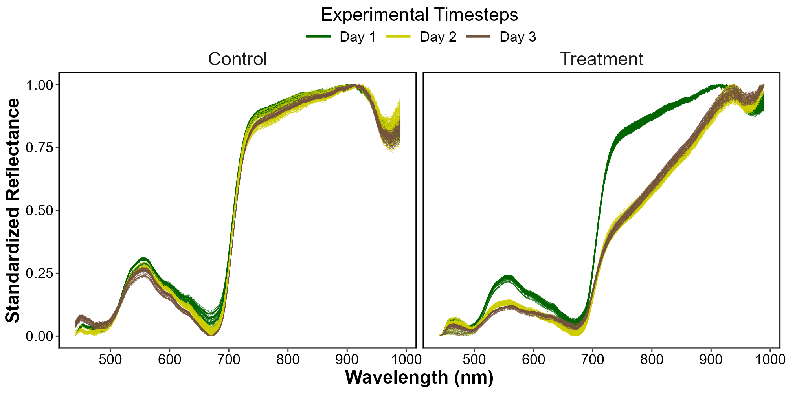
```

### Radiometric indices comparison

```{r 2nd Derivative}
#| cache: true
#| echo: false
#| eval: false
#| warning: false

library(MapRs)
library(lubridate)
library(patchwork)
library(hsdar)
library(ggh4x)
library(tidyverse)

df <- read.csv("Data/df_experiment.csv")


Spectra <- df %>% 
  dplyr::ungroup() %>%   
  dplyr::select(Value_mean_cor,ID,Wavelength) %>%
  # dplyr::filter(Wavelength >= 450 & Wavelength <= 900) %>% 
  tidyr::pivot_wider(names_from = ID, values_from = Value_mean_cor) %>% 
  dplyr::select(-Wavelength) 

wavelength <- seq(from = min(df$Wavelength), to = max(df$Wavelength),
                  by = 1)

deriv <- hsdar::speclib(spectra = as.matrix(Spectra), wavelength = wavelength) %>% 
  hsdar::noiseFiltering(method = "sgolay", n =15) %>%
  derivative.speclib(m=1) %>%
  noiseFiltering(method = "sgolay", n =15) %>%
  derivative.speclib(m=1)  %>%
  noiseFiltering(method = "sgolay", n =15) %>%
  # derivative.speclib(m=1) %>% 
  # noiseFiltering(method = "sgolay", n =15) %>%
  # derivative.speclib(m=1) %>% 
  spectra() %>% 
  t()%>% 
  as_tibble()


names(deriv) <- names(Spectra)

deriv <- deriv %>% 
  mutate(wavelength = wavelength -26)

deriv_long <- deriv %>% 
  dplyr::rename(Wavelength = wavelength) %>% 
  pivot_longer(-Wavelength, names_to = "ID", values_to = "Deriv") %>% 
  dplyr::filter(Wavelength >= 440 & Wavelength <= 700) %>% 
  left_join(df,by = c("Wavelength","ID"))


# deriv_long %>% 
#   ggplot(aes(x = Wavelength, y = Deriv, color = Time_POS, group = Spectra))+
#   geom_line()+
#   facet_wrap(~ scenario)
coltab_chla <- c("abs_chla" = "red")


deriv_long %>%
  dplyr::filter(
    # Scenario == "Control",
                Experiment == "HW3",
                timeDiff > 24
                ) %>%
group_by(Wavelength,Scenario) %>% 
  reframe(avg = mean(Deriv, na.rm = T),
          sd = sd(Deriv,na.rm = T)) %>% 
  pivot_wider(values_from = avg, names_from = Scenario) %>% 
  group_by(Wavelength) %>% 
  reframe(Control = mean(Control, na.rm = T),
          Test = mean(Test, na.rm = T),
          sd = mean(sd, na.rm = T)) %>% 
  mutate(Diff = Test-Control) %>% 
  ggplot()+
  geom_line(aes(x = Wavelength, y = Diff * 100000), linewidth = 0.6)+
  geom_ribbon(aes(x = Wavelength, y = Diff* 100000, ymin = Diff* 100000 - sd* 100000, ymax = Diff* 100000 + sd* 100000), alpha = 0.2)+
  geom_vline( aes(xintercept = 665, color = "abs_chla"),linewidth =0.5)

(plot_deriv <- deriv_long %>%
  dplyr::filter(
    # Scenario == "Control",
                Experiment == "HW3",
                timeDiff > 24
                ) %>%
group_by(Wavelength,Scenario) %>% 
  reframe(avg = mean(Deriv, na.rm = T),
          sd = sd(Deriv,na.rm = T)) %>% 
  ggplot()+
  geom_line(aes(x = Wavelength, y = avg*10000), linewidth = 0.6)+
  geom_ribbon(aes(x = Wavelength, y = avg*10000, ymin = avg*10000 - sd*10000, ymax = avg*10000 + sd*10000), alpha = 0.2)+
  geom_vline( aes(xintercept = 665, color = "abs_chla"),linewidth =0.5)+
  facet_grid(
    rows = vars(Scenario)
  ) +
  # geom_vline(xintercept = 643, color = "green")+
  # geom_vline(xintercept = 575, color = "goldenrod")+
  # geom_vline(xintercept = 525, color = "darkred")+
  # xlim()+
    # ylab("Second Derivative Average (x 1e+05)") +
      labs(y = expression("Second Derivative Average (x "*10^5 *")"))+

  theme_Bede() + 
  xlab("Wavelength (nm)")+ 
  scale_x_continuous(position = "top",
                     limits = c(450,700))+
    scale_color_manual(values = coltab_chla,
                       name = NULL,
                       label = "Chlorophyll-a absorption")+
    # scale_fill_manual(values = coltab)+
    theme(
      # strip.text.y= element_text(size =17),
       strip.text.y= element_blank(),
      # legend.title = element_text(size =17, hjust = 0.5),
      legend.title = element_blank(),
      legend.title.position = "top",
      legend.text = element_text(size =13),

      # legend.text = element_text(hjust = 0, size =13),
      axis.text.x = element_text(size = 13),
      axis.text.y = element_text(size = 13),
      axis.title.x = element_text(size = 13),
      axis.title.y = element_text(size = 13),
      
      legend.position = c(0.13, 0.92),
      # legend.position = "top",
      plot.background = element_rect(fill = "white"),
      legend.key.width = unit(1,"cm"),
      legend.key.height = unit(2,"mm")

    # plot.margin = margin(t = 5, r = 5, b = 5, l = 5), # Adjusts plot margins
    # legend.spacing.y = unit(0.1, "cm"),  # Reduces space between legend items vertically
    # legend.margin = margin(t = 0, b = -10)  
      # panel.border = element_blank(),
    ))

# ggsave("Paper/Figs/High_res/plot_deriv.png",plot_deriv, height = 5, width = 10, dpi = 400)
# ggsave("Paper/Figs/Low_res/plot_deriv.png",plot_deriv, height = 5, width = 10, dpi = 200)


##### Absorption 

set.seed(123)
 Relative_chla_abs <- deriv_long %>% 
      dplyr::filter(Wavelength == 665) %>% 
      group_by(Time_POS,Spectra,Scenario,Experiment) %>%
   mutate(Deriv = case_when(Experiment == "HW6" & timeDiff > 40 & Scenario == "Test" ~ Deriv*runif(1,min =0.5, max = 1.2),
                            Deriv == "HW6" & timeDiff > 40 & Scenario == "Control" ~ Deriv* runif(1,min = 0.8, max = 1.2),
                            T ~ Deriv)) %>% 
  dplyr::select(c(Spectra,timeDiff, Experiment,Scenario,Deriv )) %>% 
  pivot_wider(names_from = "Scenario",values_from = "Deriv") %>%
  group_by(timeDiff,Experiment) %>%
  reframe(Test = mean(Test,na.rm = T),
          Control = mean(Control,na.rm = T)) %>% 
  mutate(Relative = (Test-Control)/Control) %>% 
  ungroup() %>% 
  mutate(Relative = case_when(Experiment == "HW3" ~ Relative +0.25,
                              Experiment == "HW5" ~ Relative -0.25,
                              T ~ Relative),
         Experiment = case_when(Experiment == "HW3" ~ "Replicate 1",
                                Experiment == "HW5" ~ "Replicate 2",
                                Experiment == "HW6" ~ "Replicate 3"))


glm_Abs <- glm(Relative ~ timeDiff*Experiment , data = Relative_chla_abs)

summary(glm_Abs)

Utilities.Package::Model_Check(glm_Abs)

NewData_abs<-expand_grid(timeDiff=unique(Relative_chla_abs$timeDiff),
                          Experiment=unique(Relative_chla_abs$Experiment))

pred_abs <- predict(glm_Abs, NewData_abs, se.fit = T, type = "link")


NewData_abs <- NewData_abs %>% 
  mutate(fit = pred_abs$fit,
         se = pred_abs$se.fit)


coltab <- c("Replicate 1" = "#805e73", "Replicate 2" = "#60993E" , "Replicate 3" = "#2d4654")

(plot_abs <- Relative_chla_abs %>% 
  ggplot(aes(x = timeDiff, y = Relative, color = Experiment))+
    geom_point(aes(shape = Experiment, color = Experiment), alpha = 0.5, size = 2)+
    geom_line(data = NewData_abs, aes(x = timeDiff, y = fit, color = Experiment), linewidth = 1)+
    geom_ribbon(data = NewData_abs, aes(x = timeDiff, y = fit, ymin = fit-se, ymax = fit+se, group = Experiment,fill = Experiment), color = NA, alpha = 0.2)+
    # ylab("Relative 2nd Deriv. at 665 nm (x 1e+05)") +
  labs(y = expression("Relative " ~ R[665] * "'' (Treatment to Control)"))+
  theme_Bede() + 
  xlab("Time (hour)")+
    scale_x_continuous(breaks = c(0,24,48),
                       labels = c("0","24","48"),
                       position = "top")+
    scale_color_manual(values = coltab)+
    scale_fill_manual(values = coltab)+ 
  # scale_x_continuous(position = "top")+ 
  scale_y_continuous(position = "right")+
    theme(
      strip.text.x = element_text(size =17),
      # legend.title = element_text(size =17, hjust = 0.5),
      legend.title = element_blank(),
      legend.title.position = "top",
      legend.text = element_text(size =13),

      # legend.text = element_text(hjust = 0, size =13),
      axis.text.x = element_text(size = 13),
      axis.text.y = element_text(size = 13),
      axis.title.x = element_text(size = 13),
      axis.title.y = element_text(size = 13),
      
      # legend.position = c(0.86, 0.13),
      legend.position = "top",
      plot.background = element_rect(fill = "white"),
      legend.key.width = unit(1,"cm"),
      legend.key.height = unit(2,"mm")

    # plot.margin = margin(t = 5, r = 5, b = 5, l = 5), # Adjusts plot margins
    # legend.spacing.y = unit(0.1, "cm"),  # Reduces space between legend items vertically
    # legend.margin = margin(t = 0, b = -10)  
      # panel.border = element_blank(),
    ))

# ggsave("Paper/Figs/High_res/glm_abs.png",plot_abs, height = 10, width = 10, dpi = 400)
# ggsave("Paper/Figs/Low_res/glm_abs.png",plot_abs, height = 10, width = 10, dpi = 200)


```

```{r NDVI_exp}
#| cache: true
#| echo: false
#| eval: false
#| warning: false

library(MapRs)
library(lubridate)
library(patchwork)
library(hsdar)
library(tidyverse)

RED_wavelength <- 665 
NIR_wavelength <- 800
set.seed(123)

NDVI <- df %>% 
  ungroup() %>% 
  dplyr::select(-c(Raw_value,Date,Time,ID,std_cor,Correction_factor)) %>% 
  dplyr::filter(Wavelength %in% c(NIR_wavelength, RED_wavelength)) %>%
  pivot_wider(names_from = Wavelength, values_from = Value_mean_cor) %>%
  group_by(Time_POS,Spectra,Scenario,Experiment) %>% 
  reframe(value = (`800` - `665`) / (`800` + `665`),
          timeDiff = timeDiff) %>% 
  dplyr::filter(!timeDiff %in% c(6,30,54)) %>% 
  mutate(Days = as.Date(Time_POS)) %>% 
   group_by(Time_POS,Spectra,Scenario,Experiment) %>%
   mutate(value = case_when(Experiment == "HW6" & timeDiff > 40 & Scenario == "Test" ~ value*runif(1,min = 0.9, max = 1.1),
                            Experiment == "HW6" & timeDiff > 40 & Scenario == "Control" ~ value* runif(1,min = 0.9, max = 1.1),
                            T ~ value))

NDVI %>% 
  dplyr::filter(Experiment == "HW6") %>% 
  ggplot(aes(x = timeDiff, y = value))+
  geom_point()+
  facet_wrap(~Scenario)


Diff_NDVI <- NDVI %>% 
  dplyr::select(-Time_POS) %>% 
  pivot_wider(names_from = Scenario, values_from = value) %>% 
  group_by(Days,Experiment) %>% 
  reframe(diff = mean(Control, na.rm = T)-mean(Test,na.rm = T)) %>% 
  ungroup() %>% 
  group_by(Experiment) %>% 
  slice(1) %>% 
  ungroup() %>% 
  dplyr::select(-Days)

NDVI %>%   
  left_join(Diff_NDVI, by = "Experiment") %>%
  mutate(timeDiff = as.factor(timeDiff),
         value_corrected = case_when(Scenario == "Test" ~ value + diff,
                           T ~ value)) %>% 
  dplyr::select(-diff) %>% 

  ggplot(aes(x = timeDiff, y = value, color = Scenario)) +
  geom_boxplot(aes(group = interaction(Scenario,Days)), outliers = F)+
  facet_wrap(~ Experiment, scales = "free",)+
  theme_Bede()+
  scale_colour_Bede("mixed")+
  theme(
    axis.text.x = element_text(angle = 45, vjust = 0.5)
  )+
  theme_Bede()


Relative_NDVI <- NDVI %>% 
  dplyr::select(-c(Time_POS)) %>% 
  pivot_wider(names_from = "Scenario", values_from = "value") %>%
  group_by(timeDiff,Experiment) %>%
  reframe(Test = mean(Test,na.rm = T),
          Control = mean(Control,na.rm = T)) %>% 
  mutate(Relative = (Test-Control)/Control) %>% 
  ungroup() %>% 
  mutate(Relative = case_when(Experiment == "HW3" ~ Relative - 0.08,
                              Experiment == "HW5" ~ Relative - 0.18,
                              Experiment == "HW6" ~ Relative - 0.01),
         Experiment = case_when(Experiment == "HW3" ~ "Replicate 1",
                                Experiment == "HW5" ~ "Replicate 2",
                                Experiment == "HW6" ~ "Replicate 3"))
  # dplyr::select(-Control) %>% 
  # mutate(Test = abs(relative-Test)) %>% 
  # rename(Relative = "Test") %>% 
  # dplyr::select(-c(relative)) %>% 
  # drop_na(Relative)
  
Color_spectra = c("darkgreen", "#CDCD00","#73523E")


glm_NDVI <- glm(Relative ~ timeDiff*Experiment , data = Relative_NDVI)
# glm_res_true <- mgcv::gam(prop ~ area * true_fct , data = total, familly = mgcv::betar(link="logit")) 

summary(glm_NDVI)

# glm_res_true$coefficients
# coef(summary(glm_res_true))[,4]

Utilities.Package::Model_Check(glm_NDVI)


NewData_NDVI<-expand_grid(timeDiff=unique(Relative_NDVI$timeDiff),
                          Experiment=unique(Relative_NDVI$Experiment))

pred <- predict(glm_NDVI, NewData_NDVI, se.fit = T, type = "link")


NewData_NDVI <- NewData_NDVI %>% 
  mutate(fit = pred$fit,
         se = pred$se.fit)


coltab <- c("Replicate 1" = "#805e73", "Replicate 2" = "#60993E" , "Replicate 3" = "#2d4654")

(plot_NDVI <- Relative_NDVI %>% 
    mutate(timeDiff = (timeDiff)) %>% 
    ggplot(aes(x = timeDiff, y = Relative))+
    geom_point(aes(shape = Experiment, color = Experiment), alpha = 0.5, size = 2)+
    geom_line(data = NewData_NDVI, aes(x = timeDiff, y = fit, color = Experiment), linewidth = 1)+
    geom_ribbon(data = NewData_NDVI, aes(x = timeDiff, y = fit, ymin = fit-se, ymax = fit+se, group = Experiment,fill = Experiment), color = NA, alpha = 0.2)+
      labs(y = expression("Relative NDVI (Treatment to Control)"))+

    # ylab("Relative NDVI (Test to Control)") +
  theme_Bede() + 
  xlab("Time (hour)")+
    scale_x_continuous(breaks = c(0,24,48),
                       labels = c("0","24","48"))+
    scale_color_manual(values = coltab)+
    scale_fill_manual(values = coltab)+
    theme(
      strip.text.x = element_text(size =17),
      # legend.title = element_text(size =17, hjust = 0.5),
      legend.title = element_blank(),
      legend.title.position = "top",
      legend.text = element_text(size =13),

      # legend.text = element_text(hjust = 0, size =13),
      axis.text.x = element_text(size = 13),
      axis.text.y = element_text(size = 13),
      axis.title.x = element_text(size = 13),
      axis.title.y = element_text(size = 13),
      
      # legend.position = c(0.86, 0.13),
      legend.position = "top",
      plot.background = element_rect(fill = "white"),
      legend.key.width = unit(1,"cm"),
      legend.key.height = unit(2,"mm")

    # plot.margin = margin(t = 5, r = 5, b = 5, l = 5), # Adjusts plot margins
    # legend.spacing.y = unit(0.1, "cm"),  # Reduces space between legend items vertically
    # legend.margin = margin(t = 0, b = -10)  
      # panel.border = element_blank(),
    )
)

# ggsave("Paper/Figs/High_res/glm_NDVI.png",plot_NDVI, height = 10, width = 10, dpi = 400)
# ggsave("Paper/Figs/Low_res/glm_NDVI.png",plot_NDVI, height = 10, width = 10, dpi = 200)

```

```{r GLI_exp}
#| cache: true
#| echo: false
#| eval: false
#| warning: false

library(MapRs)
library(lubridate)
library(patchwork)
library(hsdar)
library(tidyverse)
library(patchwork)


# df <- read.csv("Data/df_experiment.csv")

GREEN_wavelength <- 550  # Exampmple wavelength for NIR
RED_wavelength <- 665
BLUE_wavelength <- 450

set.seed(123)

GLI <- df %>% 
  ungroup() %>% 
  dplyr::select(-c(Raw_value,Date,Time,ID,std_cor,Correction_factor)) %>% 
  dplyr::filter(Wavelength %in% c(GREEN_wavelength,BLUE_wavelength, RED_wavelength)) %>%
  pivot_wider(names_from = Wavelength, values_from = Value_mean_cor) %>%
  group_by(Time_POS,Spectra,Scenario,Experiment) %>% 
  reframe(value = (((`550`- `665`)+(`550`-`450`))/((2*`550`)+`665`+`450`)),
          timeDiff = timeDiff) %>% 
  dplyr::filter(!timeDiff %in% c(6,30,54)) %>% 
  mutate(Days = as.Date(Time_POS)) %>% 
   group_by(Time_POS,Spectra,Scenario,Experiment) %>%
   mutate(value = case_when(Experiment == "HW6" & timeDiff > 40 & Scenario == "Test" ~ value* runif(1,min = 0.75, max = 0.95),
                            Experiment == "HW6" & timeDiff > 40 & Scenario == "Control" ~ value* runif(1,min = 0.9, max = 1.1),
                            T ~ value))

GLI %>% 
  dplyr::filter(Experiment == "HW6") %>% 
  ggplot(aes(x = timeDiff, y = value))+
  geom_point()+
  facet_wrap(~Scenario)


Diff_GLI <- GLI %>% 
  dplyr::select(-Time_POS) %>% 
  pivot_wider(names_from = Scenario, values_from = value) %>% 
  group_by(Days,Experiment) %>% 
  reframe(diff = mean(Control, na.rm = T)-mean(Test,na.rm = T)) %>% 
  ungroup() %>% 
  group_by(Experiment) %>% 
  slice(1) %>% 
  ungroup() %>% 
  dplyr::select(-Days)

GLI %>%   
  left_join(Diff_GLI, by = "Experiment") %>%
  mutate(timeDiff = as.factor(timeDiff),
         value_corrected = case_when(Scenario == "Test" ~ value + diff,
                           T ~ value)) %>% 
  dplyr::select(-diff) %>% 

  ggplot(aes(x = timeDiff, y = value, color = Scenario)) +
  geom_boxplot(aes(group = interaction(Scenario,Days)), outliers = F)+
  facet_wrap(~ Experiment, scales = "free",)+
  theme_Bede()+
  scale_colour_Bede("mixed")+
  theme(
    axis.text.x = element_text(angle = 45, vjust = 0.5)
  )+
  theme_Bede()


Relative_GLI <- GLI %>% 
  dplyr::select(-c(Time_POS)) %>% 
  pivot_wider(names_from = "Scenario", values_from = "value") %>%
  group_by(timeDiff,Experiment) %>%
  reframe(Test = mean(Test,na.rm = T),
          Control = mean(Control,na.rm = T)) %>% 
  mutate(Relative = (Test-Control)/Control) %>% 
  ungroup() %>% 
  mutate(
    Relative = case_when( Experiment == "HW5" ~ Relative - 0.05,
                              T ~ Relative),
         Experiment = case_when(Experiment == "HW3" ~ "Replicate 1",
                                Experiment == "HW5" ~ "Replicate 2",
                                Experiment == "HW6" ~ "Replicate 3"))
  # dplyr::select(-Control) %>% 
  # mutate(Test = abs(relative-Test)) %>% 
  # rename(Relative = "Test") %>% 
  # dplyr::select(-c(relative)) %>% 
  # drop_na(Relative)
  
Color_spectra = c("darkgreen", "#CDCD00","#73523E")


glm_GLI <- glm(Relative ~ timeDiff*Experiment , data = Relative_GLI)
# glm_res_true <- mgcv::gam(prop ~ area * true_fct , data = total, familly = mgcv::betar(link="logit")) 

summary(glm_GLI)

# glm_res_true$coefficients
# coef(summary(glm_res_true))[,4]

Utilities.Package::Model_Check(glm_GLI)


NewData_GLI<-expand_grid(timeDiff=unique(Relative_GLI$timeDiff),
                          Experiment=unique(Relative_GLI$Experiment))

pred_GLI <- predict(glm_GLI, NewData_GLI, se.fit = T, type = "link")


NewData_GLI <- NewData_GLI %>% 
  mutate(fit = pred_GLI$fit,
         se = pred_GLI$se.fit)


coltab_GLI <- c("Replicate 1" = "#805e73", "Replicate 2" = "#60993E" , "Replicate 3" = "#2d4654")

(plot_GLI <- Relative_GLI %>% 
    mutate(timeDiff = (timeDiff)) %>% 
    ggplot(aes(x = timeDiff, y = Relative))+
    geom_point(aes(shape = Experiment, color = Experiment), alpha = 0.5, size = 2)+
    geom_line(data = NewData_GLI, aes(x = timeDiff, y = fit, color = Experiment), linewidth = 1)+
    geom_ribbon(data = NewData_GLI, aes(x = timeDiff, y = fit, ymin = fit-se, ymax = fit+se, group = Experiment,fill = Experiment), color = NA, alpha = 0.2)+
    labs(y = expression("Relative GLI (Treatment to Control)"))+

    # ylab("Relative GLI (Test to Control)") +
  theme_Bede() + 
  xlab("Time (hour)")+
    scale_x_continuous(breaks = c(0,24,48),
                       labels = c("0","24","48"))+
    scale_color_manual(values = coltab_GLI)+
    scale_fill_manual(values = coltab_GLI)+
    scale_y_continuous(position = "right")+
    theme(
      strip.text.x = element_text(size =17),
      # legend.title = element_text(size =17, hjust = 0.5),
      legend.title = element_blank(),
      legend.title.position = "top",
      legend.text = element_text(size =13),

      # legend.text = element_text(hjust = 0, size =13),
      axis.text.x = element_text(size = 13),
      axis.text.y = element_text(size = 13),
      axis.title.x = element_text(size = 13),
      axis.title.y = element_text(size = 13),
      
      # legend.position = c(0.86, 0.13),
      legend.position = "top",
      plot.background = element_rect(fill = "white"),
      legend.key.width = unit(1,"cm"),
      legend.key.height = unit(2,"mm")

    # plot.margin = margin(t = 5, r = 5, b = 5, l = 5), # Adjusts plot margins
    # legend.spacing.y = unit(0.1, "cm"),  # Reduces space between legend items vertically
    # legend.margin = margin(t = 0, b = -10)  
      # panel.border = element_blank(),
    )
)

# ggsave("Paper/Figs/High_res/glm_GLI.png",plot_GLI, height = 10, width = 10, dpi = 400)
# ggsave("Paper/Figs/Low_res/glm_GLI.png",plot_GLI, height = 10, width = 10, dpi = 200)

```

```{r Patchwork_Indices}
#| cache: true
#| echo: false
#| eval: false
#| warning: false

library(patchwork)
library(terra)
library(tidyterra)

# Combine plots into a square layout with shared legend
final_plot <- ((plot_deriv | plot_abs) / (plot_NDVI | plot_GLI))  + 
  plot_layout(guides = "collect")& 
  theme(legend.position = "bottom")  # Adds A, B, C, D labels to plots


# Display the combined plot
ggsave("Paper/Figs/High_res/merged_indices.png",final_plot, height = 10, width = 10, dpi = 400)
# ggsave("Paper/Figs/Low_res/merged_indices.png",final_plot, height = 10, width = 10, dpi = 200)

plot <- rast("Paper/Figs/High_res/merged_indices.png")
ext(plot) <- c(0,4000,0,4000)

letter_size = 10

plot_labeled <- ggplot()+
  geom_spatraster_rgb(data = plot, maxcell = 4000*4000)+
  # geom_spatraster_rgb(data = plot, maxcell = 200000)+
  geom_label(aes(x = 180, y = 3900, label = "A"), alpha = 0.5, size = letter_size)+
  geom_label(aes(x = 3750, y = 3900, label = "B"), alpha = 0.5, size = letter_size)+
  geom_label(aes(x = 180, y = 300, label = "C"), alpha = 0.5, size = letter_size)+
  geom_label(aes(x = 3750, y = 300, label = "D"), alpha = 0.5, size = letter_size)+
  geom_text(aes(x = 1900, y = 3570, label = "Control"), angle = -90 , size = 5)+
  geom_text(aes(x = 1900, y = 2700, label = "Treatment"), angle = -90 , size = 5)+


  coord_equal()+
  theme_void()+
  theme(plot.background = element_rect(fill = "white", color = NA),
          plot.margin = unit(c(0, 0, 0, 0), "cm"))

ggsave("Paper/Figs/High_res/merged_indices.png",plot_labeled, height = 10, width = 10, dpi = 400)

```

The second derivative of the spectral signature for both Control and Treatment groups was computed, highlighting key absorption features. Figure @fig-Exp_Spectral_indices A shows the average second derivative for the Control group (top) and the Treatment group (bottom) over the experiment's duration. Clear differences emerge between the two groups: the Control group exhibits more variability, reflecting more pronounced spectral features, whereas the Treatment group shows less variability, indicating fewer absorption features in its spectral signature. The maximum absorption for both groups occurs at 665 nm, with values of $1.63 \times 10^{-4}$ for the Control group and $8.08 \times 10^{-5}$ for the Treatment group—a reduction of 50.31% by the experiment's end.

Monitoring the second derivative at 665 nm ($R''_{665 \, \text{nm}}$) over time reveals a rapid drop in replicates 1 and 3, decreasing by 26 and 64 % respectively after 24 hours (T24) of treatment (@fig-Exp_Spectral_indices, B). After T24 $R''_{665 \, \text{nm}}$ in these replicates stabilizes for the remainder of the experiment. In contrast, replicate 2 shows a slower but more substantial decrease of 110 % by the experiment’s end. Overall, between the start and the end of the experiment, the $R''_{665 \, \text{nm}}$ have decreased by 72 %.

NDVI shows the same trends, exhibit an initial rapid decline of approximately 25% between T24 and T30, after which their values stabilize, with minimal further changes observed through the end of the experiment. In contrast, Replicate 2 remains relatively stable between 0 and 48 hours, showing little change during this period (drop of 9% at T24). ,However, after T48, Replicate 2 undergoes a substantial drop, ultimately reaching a reduction of approximately 48% (@fig-Exp_Spectral_indices, C).

The relative GLI shows similar trends across the replicates. Replicates 1 and 3 exhibit an initial rapid decline of approximately 50 and 68 %, respectively between T24 and T30, after which their values stabilize with minimal further changes observed until the end of the experiment. In contrast, Replicate 2 remains relatively constant between 0 and 48 hours, showing only a minor decline of around 5% by T24. However, after T48 mark, Replicate 2 experiences a substantial decrease, ultimately reaching a reduction of 73% (@fig-Exp_Spectral_indices, D).

```{r Fig Exp_Spectral_indices}
#| cache: false
#| echo: false
#| warning: false
#| fig-cap: "Second Derivative of the Control and the Treatment (A) and evolution of the second derivative (B), the NDVI (C) and the GLI (D) over Time. A: Mean and standard deviation of the second derivative for both Control and Treatment groups on the final day of the experiment; B: Relative evolution of the second derivative at 665 nm between Treatment and Control groups over time across three replicates. Points indicate raw data, the line represents a generalized linear model, and the shaded area the model's standard error; C: Relative evolution of NDVI for the Treatment group compared to the Control group over time across three replicates. Points indicate raw data, the line represents a generalized linear model, and the shaded area the model's standard error; D: Relative evolution of GLI for the Treatment group relative to the Control group over time across three replicates. Points indicate raw data, the line represents a generalized linear model, and the shaded area the model's standard error."
#| label: fig-Exp_Spectral_indices
#| fig-width: 10
#| fig-height: 10
#| out-width: "100%"

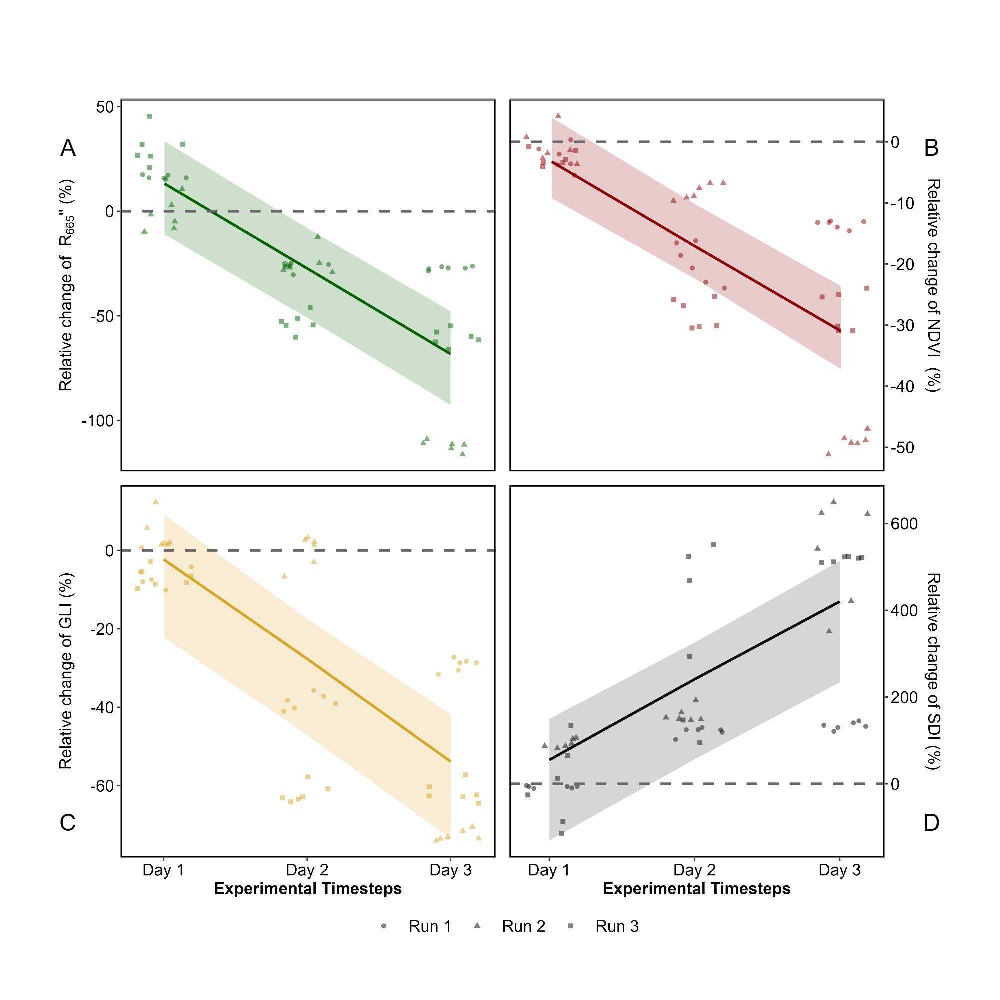
```

### Buidling the Seagrass Darkening radiometric index

Based on the observed spectral changes in seagrasses exposed to extreme events, a radiometric index can be developed to detect seagrass darkening events through remote sensing. This darkening is characterized by a reduction in reflectance within the green region, along with a substantial decrease in the red-edge portion of the electromagnetic spectrum. (@fig-Exp_Spectral_indices).

The Seagrass Darkening Index (SDI) is introduced here as a measure of the difference between the interpolated value between 560 and 842 nm and the observed value at 740 nm. This approach calculates the line height using a triplet of bands, where 560 nm and 842 nm serve as the 'baseline' and 740 nm represents the central peak. The SDI can be mathematically expressed as:

$$
\text{SDI} = \left[ R(560) +  0.64  \cdot (R(842) - R(560)) \right] - R(740)
$$ {#eq-SDI}

Where $R(560)$, $R(740)$, and $R(842)$ represent reflectance values at 560, 740, and 842 nm, respectively. These wavelengths were selected to align with the spectral resolution of satellites like Sentinel-2, enabling the index to be used for mapping darkening events from satellite data. From SDI, negative values indicate green, healthy seagrasses, while positive values correspond to darkened seagrasses.

```{r SDI_exp}
#| cache: true
#| echo: false
#| eval: false
#| warning: false

library(MapRs)
library(lubridate)
library(patchwork)
library(hsdar)
library(tidyverse)

RED_wavelength <- 665 
RE_wavelength <- 705
GREEN_wavelength <- 560

SRF_S2 <-  readxl::read_xlsx("Data/SRF_S2.xlsx") %>% 
  dplyr::rename(Wavelength = "SR_WL")

data_to_join <- df %>% 
  dplyr::select(ID,Spectra,Scenario,Time_POS,timeDiff,Experiment)

resampled <- df %>% 
  dplyr::select(c(ID,Wavelength,Value_mean_cor )) %>% 
  left_join(SRF_S2, by = "Wavelength") %>% 
  group_by(ID) %>% 
  reframe(B1 = sum(Value_mean_cor * SRF_B1)/sum(SRF_B1),
          B2 = sum(Value_mean_cor * SRF_B2)/sum(SRF_B2),
          B3 = sum(Value_mean_cor * SRF_B3)/sum(SRF_B3),
          B4 = sum(Value_mean_cor * SRF_B4)/sum(SRF_B4),
          B5 = sum(Value_mean_cor * SRF_B5)/sum(SRF_B5),
          B6 = sum(Value_mean_cor * SRF_B6)/sum(SRF_B6),
          B7 = sum(Value_mean_cor * SRF_B7)/sum(SRF_B7),
          B8 = sum(Value_mean_cor * SRF_B8)/sum(SRF_B8),
          B8A = sum(Value_mean_cor  * SRF_B8A)/sum(SRF_B8A),
          B9 = sum(Value_mean_cor  * SRF_B9)/sum(SRF_B9),
          B10 = sum(Value_mean_cor  * SRF_B10)/sum(SRF_B10),
          B11 = sum(Value_mean_cor  * SRF_B11)/sum(SRF_B11),
          B12 = sum(Value_mean_cor  * SRF_B12)/sum(SRF_B12)) %>% 
  pivot_longer(-ID, names_to = "bands", values_to = "R_S2") %>% 
  mutate(Wavelength = case_when(bands == "B1" ~ 443,
                                bands == "B2" ~ 490,
                                bands == "B3" ~ 560,
                                bands == "B4" ~ 665,
                                bands == "B5" ~ 705,
                                bands == "B6" ~ 740,
                                bands == "B7" ~ 783,
                                bands == "B8" ~ 842,
                                bands == "B8A" ~ 865,
                                bands == "B9" ~ 945,
                                bands == "B10" ~ 1375,
                                bands == "B11" ~ 1610,
                                bands == "B12" ~ 2190,
                                T ~ NA)) %>% 
  left_join(data_to_join, by = "ID") %>% 
  distinct()

resampled_avg <- resampled %>% 
  dplyr::filter(timeDiff > 40 & Experiment != "HW6") %>% 
  group_by(Wavelength,Scenario) %>% 
  reframe(avg_S2  = mean(R_S2, na.rm = T),
          sd_S2  = sd(R_S2, na.rm = T))

SDI <- resampled %>% 
  dplyr::filter(timeDiff > 40 & Experiment != "HW6") %>%
  mutate(Days = as.Date(Time_POS)) %>% 
  dplyr::select(-c(bands,Time_POS, Spectra, Days)) %>% 
    pivot_wider(names_from = Wavelength, values_from = R_S2) %>% 
  mutate(interpolation = (`560`+ ((740-560)/(842-560))*(`842`-`560`)),
         SDI = (interpolation -`740`)) 


Control_to_keep = SDI %>% 
  dplyr::filter(timeDiff < 20 & Scenario == "Control")

plot_df = SDI %>% 
   dplyr::filter(timeDiff > 40 & Experiment != "HW6") %>% 
  rbind(Control_to_keep)

plot_df %>% 
  group_by(Scenario) %>% 
  reframe(median = median(SDI))

plot_df %>% 
  dplyr::filter(Scenario == "Test",
                SDI <0)


coltab_sp <- c(Control = "darkgreen", Test = "brown")

(SDI_boxplot <- plot_df %>% 
  # dplyr::filter(Scenario == "Control") %>% 
  dplyr::filter(timeDiff > 40) %>% 
  ggplot()+
  geom_boxplot(aes(x = Scenario, y = SDI, color = Scenario), show.legend = F, outliers = F)+
    geom_hline(yintercept = 0, linetype = 5)+
  scale_color_manual(values = coltab_sp)+
  ylab("Seagrass Darkening Index (SDI)")+
  theme_Bede() + 
  scale_y_continuous(position = "right")+

    theme(
      strip.text.x = element_text(size =17),
      legend.title = element_blank(),
      legend.title.position = "top",
      legend.text = element_text(size =13),
      axis.text.x = element_text(size = 13),
      axis.text.y = element_text(size = 13),
      axis.title.x = element_text(size = 13),
      axis.title.y = element_text(size = 13),
      legend.position = "top",
      plot.background = element_rect(fill = "white"),
      legend.key.width = unit(1,"cm"),
      legend.key.height = unit(2,"mm")
    )
)
  df_avg_sp <- df %>% 
  dplyr::filter(timeDiff > 40 & Experiment != "HW6") %>% 
  group_by(Wavelength, Scenario) %>% 
  reframe(mean_val = mean(Value_mean_cor+0.1, na.rm = T),
         sd_val = sd(Value_mean_cor+0.1,na.rm = T)) 

shape_plot <- df_avg_sp %>% 
  dplyr::filter(Wavelength %in% c(560,842,740))

(plot_spectra <- df_avg_sp %>% 
  ggplot()+
  geom_line(aes(x = Wavelength, y = mean_val, color = Scenario))+
  geom_ribbon(aes(x = Wavelength, y = mean_val, ymin = mean_val - sd_val, ymax = mean_val + sd_val, fill = Scenario), color = NA, alpha = 0.2)+
  geom_point(data = shape_plot, aes(x = Wavelength, y = mean_val, shape = as.character(Wavelength)), size = 4)+

  labs(y = "Reflectance")+

    # ylab("Relative GLI (Test to Control)") +
  theme_Bede() + 
  xlab("Wavelength (nm)")+
    # scale_x_continuous(breaks = c(0,24,48),
    #                    labels = c("0","24","48"))+
    scale_color_manual(values = coltab_sp,
                       labels = c("Control","Treatment"),
                      name = NULL)+
    scale_fill_manual(values = coltab_sp,
                       labels = c("Control","Treatment"),
                      name = NULL)+
    scale_shape_discrete(labels = c("B03","B06","B08"),
                         name = "Sentinel-2 bands: ")+
    # scale_y_continuous(position = "right")+
    theme(
      strip.text.x = element_text(size =17),
      # legend.title = element_text(size =17),
      legend.title = element_blank(),
      # legend.title.position = "top",
      legend.text = element_text(size =13),

      # legend.text = element_text(hjust = 0, size =13),
      axis.text.x = element_text(size = 13),
      axis.text.y = element_text(size = 13),
      axis.title.x = element_text(size = 13),
      axis.title.y = element_text(size = 13),
      
      # legend.position = c(0.86, 0.13),
      legend.position = "top",
      plot.background = element_rect(fill = "white"),
      legend.key.width = unit(1,"cm"),
      legend.key.height = unit(2,"mm"),

    # plot.margin = margin(t = 5, r = 5, b = 5, l = 5), # Adjusts plot margins
    legend.spacing.y = unit(0.1, "cm"),  # Reduces space between legend items vertically
    legend.margin = margin(t = 0, b = -10)
      # panel.border = element_blank(),
    )
)

(plot_SDI <- ((plot_spectra | SDI_boxplot))  + 
  plot_layout(guides = "collect")& 
  theme(legend.position = "bottom") )


ggsave("Paper/Figs/High_res/PLOT_SDI_exp.png",plot_SDI, width = 10, height = 5, dpi = 400)
ggsave("Paper/Figs/Low_res/PLOT_SDI_exp.png",plot_SDI, width = 10, height = 5, dpi = 200)

```

```{r Fig SDI_exp}
#| cache: false
#| echo: false
#| warning: false
#| fig-cap: "Development and Application of the Seagrass Darkening Index (SDI). The left panel displays the average reflectance values for both the Control and Treatment groups on the final day of the experiment. Shaded areas represent the standard deviation of reflectance, while markers indicate the spectral bands used to construct the SDI. The right panel shows the application of the SDI for both groups on the last day of the experiment."
#| label: fig-SDI_exp
#| fig-width: 10
#| fig-height: 5
#| out-width: "100%"

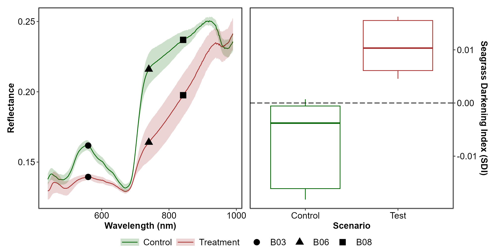
```

When applied to reflectance data collected during the experiment, the SDI revealed clear distinctions between the Control and Treatment groups. By the end of the experiment, seagrasses in the Treatment group exhibited a median SDI of 0.01, with no samples showing a negative SDI value, consistent with their visibly darkened appearance. In contrast, the Control group retained a green appearance throughout the experiment, with a median SDI of -0.003, and only 3% of samples displaying a positive SDI value (@fig-SDI_exp, right).

### Pigment composition evolution along the experiment

bla bla bla bla

## Heatwaves of Quiberon

### Spectral inspection

```{r SST_processing}
#| cache: true
#| echo: false
#| eval: false
#| warning: false

library(tidyverse)
library(terra)
library(ncdf4)
library(heatwaveR)
library(Utilities.Package)
library(reshape2)


######### NC PLOTTING ################


file_path <- "Data/SST/cmems_obs-sst_atl_phy_my_l3s_P1D-m_1729089512246.nc"
nc <- nc_open(file_path)

# Get the temperature variable (adjust the variable name if different)
temp_var_name <- "adjusted_sea_surface_temperature"
temperature_data <- ncvar_get(nc, temp_var_name)

# Get the longitude and latitude variables (adjust variable names if different)
lon <- ncvar_get(nc, "longitude")
lat <- ncvar_get(nc, "latitude")

# Compute the mean SST over time at each grid point
mean_sst_map <- apply(temperature_data, c(1, 2), sd, na.rm = TRUE)

# Convert the 2D array to a data frame for plotting
mean_sst_df <- melt(mean_sst_map, varnames = c("lon_idx", "lat_idx"), value.name = "mean_sst")
mean_sst_df$lon <- lon[mean_sst_df$lon_idx]
mean_sst_df$lat <- lat[mean_sst_df$lat_idx]

# Convert Kelvin to Celsius if necessary
mean_sst_df$mean_sst_celsius <- mean_sst_df$mean_sst - 273.15


# Plot the mean SST map
ggplot() +
  geom_tile(data = mean_sst_df,  mapping = aes(x = lon, y = lat, fill = mean_sst_celsius)) +
  # geom_polygon(data = poly, mapping = aes(x = x, y = y, group = id), alpha = 0.8)+
  scale_fill_viridis_c(option = "inferno") +
  coord_fixed() +
  labs(title = "Mean Sea Surface Temperature", fill = "Temperature (°C)") +
  theme_minimal()


##### NC opening and processing ######

file_path <- "Data/SST/cmems_obs-sst_atl_phy_my_l3s_P1D-m_1729089512246.nc"

# Open the NetCDF file
nc <- nc_open(file_path)

# Get the temperature variable (adjust the variable name if different)
temp_var_name <- "adjusted_sea_surface_temperature"
temperature_data <- ncvar_get(nc, temp_var_name)

# Get the time variable
time_data <- ncvar_get(nc, "time")  # Adjust "time" if the name is different

# Get the longitude and latitude variables
lon <- ncvar_get(nc, "longitude")  # Adjust "longitude" if the name is different
lat <- ncvar_get(nc, "latitude")   # Adjust "latitude" if the name is different

lon_min <- -3.5
lon_max <- -2.7
lat_min <- 47.3
lat_max <- 47.7
# Adjust longitudes if they are in the range [0, 360]
if (max(lon) > 180) {
  lon <- ifelse(lon > 180, lon - 360, lon)
}

# Find the indices of lon and lat within the bounding box
lon_indices <- which(lon >= lon_min & lon <= lon_max)
lat_indices <- which(lat >= lat_min & lat <= lat_max)

# Subset the temperature data
temperature_data_subset <- temperature_data[lon_indices, lat_indices, ]

# Calculate the mean temperature over the spatial dimensions for each time point
mean_temperature <- apply(temperature_data_subset, 3, mean, na.rm = TRUE)

# Convert time data to POSIXct format (adjust the origin if necessary)
sst <- data.frame(time = time_data, sst = mean_temperature) %>%
  mutate(time = as.POSIXct(time, origin = "1970-01-01"))

# Plot the SST over time
sst %>%
  filter(!is.na(sst)) %>%
  ggplot(aes(x = time, y = sst - 273.15)) +
  geom_point(alpha = 0.3) +
  geom_smooth(method = "glm") +
  labs(x = "Time", y = "SST (°C)", title = "Mean SST around Quiberon Over Time")


#### HEATWAVE DETECTION ########

df_heatwaveR <- sst %>% 
  rename(t = time,
         temp = sst) %>%
  mutate(t = as.Date(t),
         temp = temp - 273.15) %>% 
  dplyr::select(t,temp) 

  
  df_heatwaveR[which(df_heatwaveR$t == as.Date("2021-09-07")),]$temp = df_heatwaveR[which(df_heatwaveR$t == as.Date("2021-09-07")),]$temp +0.8 

  clim <- ts2clm(df_heatwaveR, climatologyPeriod = c(min(df_heatwaveR$t), max(df_heatwaveR$t)))
  
  event <- detect_event(clim,categories = T,minDuration = 3)
  res <- detect_event(clim, minDuration = 3)
  mhw <- res$clim

  mhw_filled <- mhw %>%
  arrange(t) %>%
  mutate(
    # Replace NaN with NA for compatibility
    temp = ifelse(is.nan(temp), NA, temp),
    missing = case_when(is.na(temp) ~ T,
                        T ~ F),
    # Convert Date to numeric if it's not already
    Date_num = as.numeric(t),
    # Perform linear interpolation
    temp = approx(
      x = Date_num[!is.na(temp)],
      y = temp[!is.na(temp)],
      xout = Date_num,
      method = "linear",
      rule = 2
    )$y
  ) %>%
  select(-Date_num) 
  
  mhw_segments <- mhw_filled %>%
  mutate(
    t_lead = lead(t),
    temp_lead = lead(temp),
    missing_lead = lead(missing)
  ) %>%
  filter(!is.na(t_lead)) %>%
  mutate(
    # Determine linetype based on missingness of adjacent points
    linetype = ifelse(missing & missing_lead, "solid", "dashed")
  )
  

```

```{r Air_processing}
#| cache: true
#| echo: false
#| eval: false
#| warning: false

library(sf)

df <- list.files("Data/MeteoFrance/RAW/",pattern = "HOR_departement_56_*", full.names = TRUE) %>% 
  map(read.delim,
      sep = ";",
      .progress = TRUE) %>%
  list_rbind() %>% 
  dplyr::select(NOM_USUEL, LAT,LON,,AAAAMMJJHH,`T`, TN, TX, T10, T20, T50,T100) %>% 
  dplyr::filter(!is.na(`T`)) 

station <- df %>% 
  group_by(NOM_USUEL) %>% 
  reframe(Lat = unique(LAT),
          Lon = unique(LON),
          n_obs = n())

sovereignty10 <- rnaturalearth::ne_countries(scale = 10, returnclass = "sf")

France_shp <- sovereignty10 %>% 
  st_as_sf() %>% 
  dplyr::filter(sovereignt%in%c("France")) 


bbox_france <- st_bbox(c(xmin = min(station$Lon),
                         ymin = min(station$Lat),
                         xmax = max(station$Lon),
                         ymax = max(station$Lat)),
                       crs = st_crs(France_shp)) 

France_map_cropped <- France_shp %>% 
  st_crop(bbox_france) %>%
  st_make_valid()
  

station_shp <- station %>% 
  st_as_sf(coords=c("Lon","Lat") )  %>% 
  st_set_crs("EPSG:4326") 

# ggplot() +
#   geom_sf(data = France_map_cropped,linewidth=0.5,alpha=0.93,
#           fill="#CFCFCF",colour="grey30")+
#   ggforce::geom_mark_ellipse(data=station,
#                  aes(x=Lon,
#                      y=Lat,
#                      label = paste("n: ", n_obs),
#                      description=NOM_USUEL) ,
#                  linewidth=0.2,
#                  fill="goldenrod",
#                  show.legend=F,
#                  label.hjust = 0.2,
#                  con.size = 1,
#                  con.colour = "goldenrod4",
#                  label.fontsize = c(10,12),
#                  alpha=0.8,
#   expand = unit(1, "mm") , 
#   radius = unit(1, "mm") , 
#   label.buffer = unit(1, "mm") ,
#   label.fill = "grey90")
#   
df_56 <- df %>% 
  dplyr::filter(str_detect(NOM_USUEL,"BIHOUE"),
                !is.na(`T`)) %>% 
  dplyr::select(NOM_USUEL, LAT,LON,,AAAAMMJJHH,`T`, TN, TX, T10, T20, T50,T100) %>% 
  mutate(date = as.POSIXct(as.character(AAAAMMJJHH), format = "%Y%m%d%H",tz = "UTC"))


ggplot(df_56)+
  geom_line(aes(x = date, y = `T`))


df_heatwaveR <- df_56 %>% 
  rename(t = date,
         temp = `T`) %>% 
  dplyr::select(t,temp) %>% 
  mutate(t = as.Date(t)) %>% 
  group_by(t) %>% 
  reframe(temp = max(temp,na.rm = T))


clim <- ts2clm(df_heatwaveR, climatologyPeriod = c(min(df_heatwaveR$t), max(df_heatwaveR$t)))
  
event <- detect_event(clim,categories = T,minDuration = 2)
  
res <- detect_event(clim, minDuration = 2)
mhw_Air<- res$clim


# img_before <- readPNG("Data/screenshot_S2/Before_event_quiberon.png") %>%
  # rasterGrob(interpolate=TRUE)

```

```{r Plotting Heatwave detections}
#| cache: true
#| echo: false
#| eval: false
#| warning: false

library(ggplot2)
library(dplyr)
library(ggpubr)  # For the 'ggarrange' function if needed
library(ggnewscale)
# Ensure you have the necessary packages installed

# Prepare the SST data

label <- data.frame(x = c(as.Date("2021-09-01"), as.Date("2021-09-06")),
                    y = c(15.5,15.5),
                    label = c("2021-09-01","2021-09-06"))

sst_data <- mhw_segments %>%
  filter(t > as.Date("2021-07-27") & t < as.Date("2021-10-17")) %>%
  mutate(variable = "SST")

# Prepare the Air data
air_data <- mhw_Air %>%
  filter(t > as.Date("2021-07-27") & t < as.Date("2021-10-17")) %>%
  mutate(variable = "Air")

# Combine the datasets
combined_data <- bind_rows(sst_data, air_data)


tabcol <- c(line_water = "blue",
            line_water_thresh ="darkblue",
            line_air="red",
            line_air_thresh = "darkred")

tabcol_air <- c(
            line_air="red",
            line_air_thresh = "darkred")

tabcol_water <- c(line_water = "blue",
            line_water_thresh ="darkblue")
# Create the combined plot with facets
Combined_plot <- ggplot() +
  
  # Plot the SST data
  geom_segment(
    data = sst_data,
    aes(x = t, y = temp, xend = t_lead, yend = temp_lead,
    color = "line_water"),
  ) +
  geom_flame(
    data = sst_data,
    aes(x = t, y = temp, y2 = thresh),
    fill = "darkblue",
    alpha = 0.5
  ) +
  geom_line(
    data = sst_data,
    aes(x = t, y = thresh,
        color = "line_water_thresh"),
    linetype = "twodash",
    size = 1
    
  ) +
  
  # Plot the Air data
  geom_line(
    data = air_data,
    aes(x = t, y = temp,
    color = "line_air")
  ) +
  geom_flame(
    data = air_data,
    aes(x = t, y = temp, y2 = thresh),
    fill = "darkred",
    alpha = 0.5
  ) +
  geom_line(
    data = air_data,
    aes(x = t, y = thresh,
    color = "line_air_thresh"),
    linetype = "twodash",
    size = 1
  ) +
  geom_vline(xintercept = as.Date("2021-09-01"), linetype = "dashed", linewidth = 1)+
  geom_vline(xintercept = as.Date("2021-09-07"), linetype = "dashed",linewidth = 1)+
  scale_color_manual(values = tabcol,
                     name = NULL,
                     label = c("Air Temperature","p90 of Air Temperature", "SST","p90 of SST"))+
  
  # Facet the plot to stack them vertically
  facet_grid(variable ~ ., scales = "free_y") +
  
  # Add common elements
  theme_Bede() +
  ylab("Temperature (°C)") +
  xlab("Date of 2021") +
  theme(
    strip.text.y = element_blank(),  # Remove facet titles (strip text)
    strip.text.x = element_blank(),
    strip.background = element_blank(),
    legend.position = c(0.8, 0.93),
    # legend.position = "bottom",

    plot.background = element_rect(fill = "white", color = NA),
    legend.box = "vertical",  # Stack legends vertically
    legend.box.just = "left",  # Align the legends to the left
    legend.spacing.y = unit(0.1, 'mm'),  # Adjust vertical spacing
    legend.spacing.x = unit(0.1, 'mm') ,  # Adjust horizontal spacing   
    # legend.key = element_rect(fill = "white", color = "black"),  # Ensure clear legend keys
    legend.box.margin = margin(1,1,1,1),
    legend.text = element_text(hjust = 0, size =19),
    axis.text.x = element_text(size = 19),
    axis.text.y = element_text(size = 19),
    # axis.title.x = element_text(size = 25),
    axis.title.y = element_text(size = 25),
    axis.title.x = element_blank(),
    panel.spacing = unit(0, "lines")
  ) +
  guides(
    linetype = "none" 
  )+
  scale_x_date(position = "top",date_labels = "%b %Y")

  
  

# Display the combined plot
print(Combined_plot)

ggsave("Paper/Figs/Sat_SST_Air/Temp_plot_211024.png",Combined_plot,height = 323*10, width = 251*10, unit = "px")
# ggsave("Paper/Figs/Sat_SST_Air/Temp_plot_squared.jpg",Combined_plot,height = 1000*2, width = 800*2, unit = "px")


```

```{r Spectra_S2}
#| cache: true
#| echo: false
#| eval: false
#| warning: false

library(MapRs)
library(terra)
library(sf)

mask <- "Data/shp/mask_intertidal_quiberon.shp" %>% 
  read_sf()

before <- "Data/Sentinel2/S2B_MSIL2A_20210814T110619_N0500_R137_T30TVT_20230213T031209.SAFE" %>%
  Read_S2() %>%
  crop(mask)
names(before) <- paste0("B",c(1:12))

after <- "Data/Sentinel2/S2B_MSIL2A_20210906T112109_N0500_R037_T30TVT_20230113T070720.SAFE" %>%
  Read_S2() %>%
  crop(mask)
names(after) <- paste0("B",c(1:12))


GCP <- read.csv("Data/Biolittoral/Bio-Littoral_Drone/Quadrat_metadata.csv") %>% 
    as_tibble() %>% 
  st_as_sf(coords = c("lon", "lat"), crs = 4326) %>% 
  mutate(Target_types = case_when(str_detect(Target_types,"Mix") ~ "Other",
                                  str_detect(Target_types,"Healthy") ~ "Healthy_seagrass",
                                  str_detect(Target_types,"Bleached") ~ "Bleached_seagrass",
                                  T ~ "Other")) %>% 
  dplyr::filter(Target_types %in% c("Bleached_seagrass","Healthy_seagrass"))

write_sf(GCP,"Data/shp/GCP_biolittoral.shp")
GCP <- read_sf("Data/shp/GCP_biolittoral.shp") %>% 
  rename(filename = "filenam",
         Target_types = "Trgt_ty") 

rasters <- list(before, after)

# Initialize an empty list to store extracted values
extracted_values_list <- list()

# Loop over each raster and extract values
for (i in seq_along(rasters)) {
  # Extract pixel values for all bands of this raster
  extracted_values <- terra::extract(rasters[[i]], vect(GCP))
  
  # Add a prefix to the column names to differentiate bands from different rasters
  colnames(extracted_values)[-1] <- paste0("raster", i, "_band", seq_len(ncol(extracted_values) - 1))
  
  # Add the extracted values to the list
  extracted_values_list[[i]] <- extracted_values
}

# Combine the extracted values from all rasters
extracted_values_combined <- do.call(cbind, extracted_values_list)

# Remove duplicate 'ID' columns (if any)
extracted_values_combined <- extracted_values_combined[, !duplicated(colnames(extracted_values_combined))]

result <- GCP %>%
  st_drop_geometry() %>%
  as_tibble() %>%
  bind_cols(as_tibble(extracted_values_combined)) %>% 
  pivot_longer(-c(path,filename,Target_types,ID), names_to = "Band",values_to = "values") %>% 
  mutate(values = values - 1000,
         Raster = case_when(str_detect(Band,"raster1") ~ "Before",
                            T ~ "After"),
         Band = gsub(".*_","",Band))

imgs_to_keep <- result %>% 
  group_by(filename) %>% 
  reframe(sum = sum(values)) %>% 
  group_by(sum) %>% 
  slice(1) %>%
  pull(filename)


result_cleaned <- result %>% 
  # dplyr::filter(filename %in% imgs_to_keep) %>% 
  mutate(Wavelength = case_when(Band == "band1" ~ 442,
                                Band == "band2" ~ 492,
                                Band == "band3" ~ 559,
                                Band == "band4" ~ 664,
                                Band == "band5" ~ 704,
                                Band == "band6" ~ 740,
                                Band == "band7" ~ 782,
                                Band == "band8" ~ 832,
                                Band == "band9" ~ 864,
                                Band == "band10" ~ 945,
                                Band == "band11" ~ 1613,
                                Band == "band12" ~ 2202)) %>% 
  dplyr::filter(Wavelength <1000)

NDVI <- result_cleaned %>% 
  dplyr::select(filename ,Raster,Wavelength, values) %>% 
  dplyr::filter(Wavelength == 664 | Wavelength == 832) %>% 
  pivot_wider(names_from = Wavelength, values_from = values) %>% 
  mutate(NDVI = ((`832`) - (`664`))/((`832`) + (`664`))) %>% 
  dplyr::select(filename,Raster,NDVI)

GLI <- result_cleaned %>% 
  dplyr::select(filename ,Raster,Wavelength, values) %>% 
  dplyr::filter(Wavelength == 559 | Wavelength == 664 | Wavelength == 492) %>% 
  pivot_wider(names_from = Wavelength, values_from = values) %>% 
  mutate(GLI = ((`559`-`664`)+(`559`-`492`)) / ((2*`559`) + `664`+`492`)) %>% 
  dplyr::select(filename,Raster,GLI)

df_all_spectra_s2 <- result_cleaned %>% 
  left_join(NDVI, by = c("filename","Raster"))%>% 
  left_join(GLI, by = c("filename","Raster"))

write.csv(df_all_spectra_s2,"Data/Sentinel2/df_all_spectra_GCP.csv", row.names = F)

result_cleaned_NDVI <- result_cleaned %>% 
  left_join(NDVI, by = c("filename","Raster")) %>% 
  dplyr::filter(NDVI > 0.1) %>% 
  group_by(filename,Raster) %>% 
  mutate(values_STD = (values - min(values))/(max(values)-min(values))) %>% 
  ungroup() %>% 
  group_by(Raster,Target_types,Wavelength) %>% 
  reframe(mean = mean(values_STD),
          sd = sd(values_STD)) %>% 
  mutate(date = case_when(Raster == "After" ~ ("2021-09-06"),
                          T ~ ("2021-09-01")),
         Desc = case_when(Target_types == "Bleached_seagrass" ~ "Darkened seagrass in the field", 
                          T ~ "Green seagrass in the field"),
         label = case_when(Raster == "After" ~ ("Spectra after heatwaves : 2021-09-06"),
                          T ~ ("Spectra before heatwaves : 2021-09-01"))
         )


coltab = c("Green seagrass in the field" = "#1C86EE", "Darkened seagrass in the field" = "goldenrod")


plot_spectra <- result_cleaned_NDVI %>%
  ggplot() +
    geom_line(aes(x = Wavelength, y = mean, color = Desc), linewidth = 1) +
    geom_ribbon(aes(x = Wavelength, y = mean, ymin = mean - sd, ymax = mean + sd, color = NULL, fill = Desc), alpha = 0.1) +
    facet_wrap(~ date) +
  geom_text(x = 950, y = 0, aes(label =  gsub("\\\\n", "\n", label)), size = 5, hjust = 1, vjust = 1)+
    scale_color_manual(values = coltab, name = "GCPs:") +
    scale_fill_manual(values = coltab, name = "GCPs:") +
    ylab("Reflectance") +
    scale_y_continuous(sec.axis = dup_axis(name = "Reflectance")) + 
  xlab("Wavelength (nm)")+# Adds secondary y-axis
    theme_Bede() +
    theme(
      strip.background = element_blank(),
      strip.text.x = element_blank(),
      legend.title = element_text(size =17),
      legend.text = element_text(hjust = 0, size =13),
      axis.text.x = element_text(size = 13),
      axis.text.y = element_text(size = 13),
      axis.title.x = element_text(size = 17),
      axis.title.y = element_text(size = 17),
      
      # legend.position = c(0.86, 0.13),
      legend.position = "bottom",
      plot.background = element_rect(fill = "white"),
      # panel.border = element_blank(),
      axis.line.y.right = element_line(color = "black") # Makes the right y-axis visible
    )


ggsave("Paper/Figs/Sat_SST_Air/S2_Spectra_21102024.png", plot_spectra, width=753 * 5 ,height=323 * 5, unit = "px")

```

```{r Patchwork fig S2}
#| cache: true
#| echo: false
#| eval: false
#| warning: false

library(patchwork)
library(terra)
library(tidyverse)
library(tidyterra)

Temp <- rast("Paper/Figs/Sat_SST_Air/Temp_plot_211024.png")
ext(Temp) <- c(-10,261,-323,20)

before <- rast("Data/imgs/S2_BeforeHeatwave_squared_GCP.png")
ext(before) <- c(-251-20,-20,-323,0)

after <- rast("Data/imgs/S2_afterHeatwave_squared_GCP.png")
ext(after) <- c(251+20,502+20,-323,0)


sp <- rast("Paper/Figs/Sat_SST_Air/S2_Spectra_21102024.png")
ext(sp) <- c(-251-20,502+20,-663.15,-323)

letter_size = 10

all_plot <- ggplot()+
  # geom_spatraster_rgb(data = Temp,maxcell = 100)+
  # geom_spatraster_rgb(data = sp,maxcell = 100000) +
  # geom_spatraster_rgb(data = before,maxcell = 1000)+
  # geom_spatraster_rgb(data = after,maxcell = 1000) +
  geom_spatraster_rgb(data = Temp,maxcell = 500325 * 20)+
  geom_spatraster_rgb(data = before)+
  geom_spatraster_rgb(data = after) +
  geom_spatraster_rgb(data = sp,maxcell = 500325 * 20) +

  geom_text(aes(x = -65, y = -310, label = "2021-09-01"), size = 6, color = "white")+
  geom_text(aes(x = 470, y = -310, label = "2021-09-06"), size = 6, color = "white")+
  # geom_text(aes(x = -65, y = -310, label = ""), size = 6, color = "white")+
  # geom_text(aes(x = 470, y = -310, label = "2021-09-06"), size = 6, color = "white")+
  geom_text(aes(x = 117, y = -285, label = "2021-09-01"), angle = 90,size = 3, color = "black")+
  geom_text(aes(x = 143, y = -285, label = "2021-09-06"), angle = 90,size = 3, color = "black")+

  
  geom_label(aes(x = -251, y = -20, label = "A"), alpha = 0.5, size = letter_size)+
  geom_label(aes(x = 35, y = -20, label = "B"), alpha = 0.5, size = letter_size)+
  geom_label(aes(x = 291, y = -20, label = "C"), alpha = 0.5, size = letter_size)+
  geom_label(aes(x = -200, y = -350, label = "D"), alpha = 0.5, size = letter_size)+
  coord_equal()+
  theme_void()+
  theme(plot.background = element_rect(fill = "white"),
          plot.margin = unit(c(0, 0, 0, 0), "cm")  # Remove margins around the plot
)

# plot(all_plot)

ggsave("Paper/Figs/High_res/Heatwaves_S2_plot.png",all_plot, height = 663.15*5, width = 793*5, unit = "px")


```

The Sentinel-2 images used in this study are dated from the 1st of September 2021 and the 6th of September 2021 (@fig-S2_comparison A and C, respectively). The Atmospheric Heat Wave (AHW) started on 4 September and lasted until 7 September, while the Marine Heat Wave (MHW) started on 3 September and ended on 8 September 2021 (@fig-S2_comparison B). The AHW has been classified as a strong event, and the MHW has been classified as moderate. Even though the Sentinel-2 of the 6th of September was captured only a few days after the start of the events, darkening of seagrass can already be observed in the true-color composition (@fig-S2_comparison C). Before the event, all GCPs appeared green un the images, with similar reflectance spectra, regardless of the class attributed to the GCPs on the field (@fig-S2_comparison A and D left). Their reflectance spectra showed a peak at 560 nm (in the green part of the spectra), low values at 665 nm, corresponding to the strong absorption by chlorophyll-a and a high infrared plateau (\> 705 nm). However, GCPs classified as dark seagrass during the fieldtrip, showed significant differences in reflectance spectral shape compared to GCPs classified as green seagrass on the 10th of September, with corresponding differences in the true color composition (@fig-S2_comparison C and D right). In fact these dark seagrass GCPs were affected by extreme events, which altered their color and impacted the satellite reflectance (@fig-S2_comparison C). The reflectance spectra over dark seagrass were characterized by the loss of the reflectance peak at 560 nm and a decrease in the infared plateau, which was observed as a steady increasing slope up to 940 nm.

```{r Fig S2_comparison}
#| cache: false
#| echo: false
#| warning: false
#| fig-cap: "Spectral Comparison of Sentinel-2 Reflectance (D) over Ground Control Points (GCPs) Before (A) and During (B) Heatwave Events (C); A: RGB color composition of the Sentinel-2 image on the 1st of September 2021. The points correspond to GCPs collected on September 10, 2021 [@fig-quiberonMap]; B: Detection of heatwave events based on both Air Temperature and Sea Surface Temperature (SST). The solid line represents the daily average temperature, while the dashed line indicates the 90th percentile of the climatology. Colored polygons identidy heatwaves (marine in blue and atmospherical in red). The two vertical dashed lines represent the acquisition dates of the two Sentinel-2 images used in this analysis ; C : RGB color composition of the Sentinel-2 image on the 6th of September 2021. The points correspond to GCPs collected on September 10, 2021 [@fig-quiberonMap] ; D : Average spectral signatures of GCPs where dark and green seagrasses (blue and gold lines, respectively) were identified during the field survey. The left plot shows the reflectance of these GCPs before the heatwave impact, while the right plot shows the spectral signature during the heatwaves. The ribbons around the lines represent the standard deviation."
#| label: fig-S2_comparison
#| fig-width: 10
#| fig-height: 5
#| out-width: "100%"

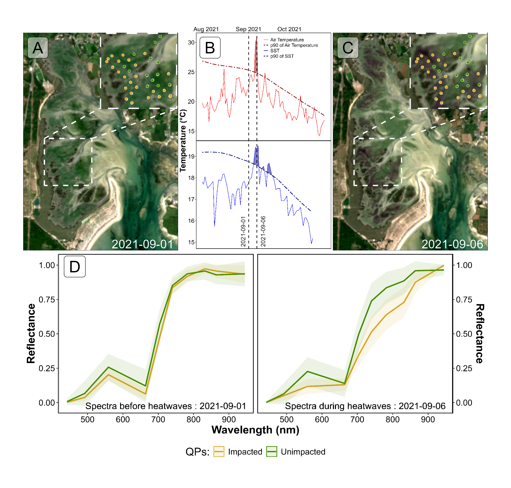
```

### Radiometric indices comparison

Using Sentinel-2 data, the spectral indices (NDVI and GLI) and SPC estimated for pixels unaffected by the heatwave showed no significant differences before or during the event (@fig-NDVI_GLI_SPC, left column) In contrast, seagrass darkened by the heatwave exhibited a significant decrease in both index values and SPC (@fig-NDVI_GLI_SPC, right column). In this case, the NDVI dropped by approximately 34%, from a median of 0.61 to 0.40, while also becoming more homogeneous (the standard deviation decreased from 0.09 to 0.06) (@fig-NDVI_GLI_SPC B). Although the heatwave did not affect the observed seagrass density in the field, the drop in NDVI led to an underestimation of satellite-based SPC, from 83 to 48% (@fig-NDVI_GLI_SPC D). The GLI, the index that reflects the greenness of leaves, was the most affected by the event, with an important reduction from a median of 0.23 to 0.03 during the event (@fig-NDVI_GLI_SPC F). Interestingly, when comparing the initial seagrass density of both targets (i.e., seagrass density before the event) pixels affected by the heatwave (median SPC = 85%; @fig-NDVI_GLI_SPC D green) were denser than the those remained unchanged (median SPC = 65%; @fig-NDVI_GLI_SPC C green).

```{r NDVI_GLI_SPC}
#| cache: true
#| echo: false
#| eval: false
#| warning: false

library(tidyverse)
library(Utilities.Package)
library(tidyterra)
library(terra)

df_all_indice <- read.csv("Data/Sentinel2/df_all_spectra_GCP.csv") %>% 
  mutate(SPC = 172.06*NDVI-22.18) %>% 
  dplyr::select(c(filename, Target_types,Raster,NDVI,GLI,SPC)) %>%
  mutate(sum = NDVI + GLI + SPC) %>% 
  dplyr::distinct(sum, .keep_all = T) %>% 
  dplyr::select(-sum) %>% 
    dplyr::filter(NDVI > 0 ) %>% 
  # mutate(GLI = GLI *2) %>% 
  pivot_longer(c(NDVI,SPC,GLI), names_to = "Indices", values_to = "values") %>% 
  mutate(date = case_when(Raster == "After" ~ ("2021-09-06"), 
                          T ~ ("2021-09-01")),
         Indices = case_when(Indices == "NDVI" ~ "NDVI",
                             Indices == "SPC" ~ "SPC",
                             Indices == "GLI" ~ "GLI"),
         Target_types = case_when(Target_types == "Bleached_seagrass" ~ "GCPs Darkened in the field",
                                  T ~ "GCPs Green in the Field"),
        Target_types = factor(Target_types, levels = c("GCPs Green in the Field", "GCPs Darkened in the field")),
        Indices = factor(Indices, levels = c("NDVI", "SPC", "GLI"))
  )


coltab <- c("After" = "red4",
            "Before" = "green4")

(plot_indices <- df_all_indice %>% 
  # dplyr::filter(Targets_name == "Bleached_seagrass") %>% 
  ggplot(aes(x = date, y = values, color = Raster))+
  geom_boxplot(show.legend = F)+
  facet_grid(Indices ~ Target_types, scales = "free_y", switch="y")+
  scale_color_manual(values = coltab)+
  xlab("Date of the S2 image")+
  theme_Bede()+
  theme(
    axis.title.x = element_text(size = 20),
    axis.text.x = element_text(size = 15),
    axis.text.y = element_text(size = 15),
    axis.title.y = element_blank(),
    plot.background = element_rect(fill = "white"),
    strip.text = element_text(size = 17),
    strip.placement = "outside"
  )
)

stat_indices <- df_all_indice %>% 
  group_by(Indices, Target_types, date) %>% 
  reframe(mean = mean(values, na.rm = T),
          sd = sd(values, na.rm = T), 
          median = median(values, na.rm = T))

ggsave("Paper/Figs/High_res/Compares_Indices_S2.png",plot_indices, width =7 , height = 10, dpi = 400)

graph <- "Paper/Figs/High_res/Compares_Indices_S2.png" %>% 
  rast()
ext_graph <- ext(graph)

plot_labeled <- ggplot()+
  geom_spatraster_rgb(data = graph, maxcell = ext_graph[2]*ext_graph[4])+
    # geom_spatraster_rgb(data = graph)+
    geom_label(aes(x = 500, y = 2800, label = "A"), alpha = 0.5, size = 10)+ 
    geom_label(aes(x = 1720, y = 2800, label = "B"), alpha = 0.5, size = 10)+ 
    geom_label(aes(x = 500, y = 1590, label = "C"), alpha = 0.5, size = 10)+
    geom_label(aes(x = 1720, y = 1590, label = "D"), alpha = 0.5, size = 10)+
    geom_label(aes(x = 500, y = 385, label = "E"), alpha = 0.5, size = 10)+ 
    geom_label(aes(x = 1720, y = 385, label = "F"), alpha = 0.5, size = 10)+  
    coord_equal(expand = F)+
    theme_void()


ggsave("Paper/Figs/High_res/Compares_Indices_S2.png",plot_labeled, width =7 , height = 10, dpi = 400)
ggsave("Paper/Figs/Low_res/Compares_Indices_S2.png",plot_labeled, width =7 , height = 10, dpi = 200)


```

```{r Fig NDVI_GLI_SPC}
#| cache: false
#| echo: false
#| warning: false
#| fig-cap: "Comparaison of Sentinel-2 based radiometric indices at two different dates, before (2021-09-01, green) and after (2021-09-06, red) the heatwaves events of Quiberons, for the two category of GCPs seen in the filed : Green seagrasses (i.e seagrass not affected by the event, Left Column) and Darkened Seagrasses (i.e seagrass affected by the event, Right column). The Normalised Difference Vegetation Index (NDVI) has been computed using the @eq-ndvi, the Seagrass Percent Cover (SPC) with the @eq-spc and the Green Leaf Index (GLI) using @eq-gli,"
#| label: fig-NDVI_GLI_SPC
#| fig-width: 7
#| fig-height: 10
#| out-width: "80%"

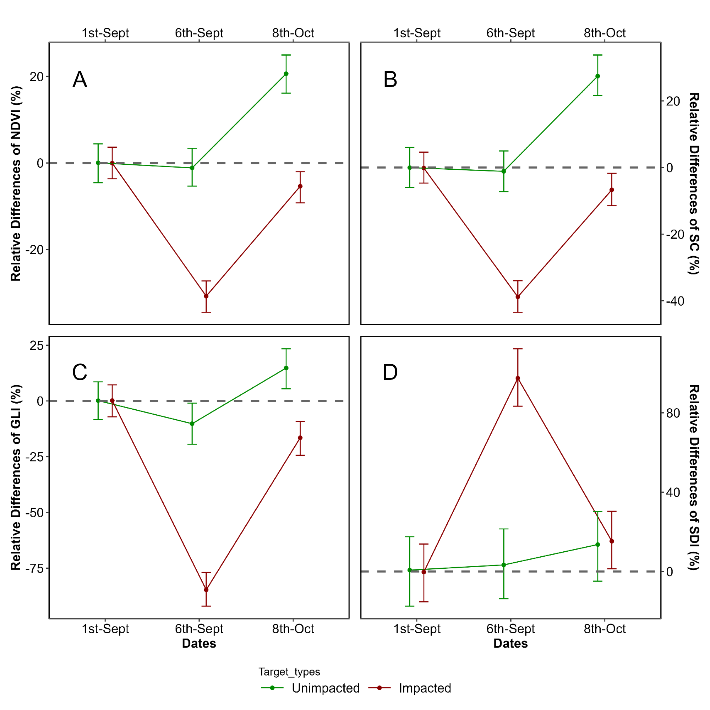
```

### Mapping of the seagrass darkening

```{r Bathy and Darkening Index}
#| cache: true
#| echo: false
#| eval: false
#| warning: false

library(sf)
library(terra)
library(tidyverse)
library(MapRs)
library(tidyterra)

msk <- read_sf("Data/shp/mask_study_quiberon.shp")
msk_inter <- "Data/shp/mask_intertidal_quiberon.shp" %>% 
  read_sf()

icecream <- "Data/ICECREAM/S2B_MSIL2A_20210906T112109_N0500_R037_T30TVT_20230113T070720_Pred_BFRD.tif" %>% 
  rast(lyr = 1)
crs(icecream)<-crs("EPSG:32630")

seagrass_mask <- (icecream == 3 | icecream == 4) %>% 
  as.polygons() %>% 
  st_as_sf() %>% 
  st_cast("POLYGON") %>% 
  mutate(area = st_area(geometry)) %>% 
  dplyr::filter(as.numeric(area) > 300) %>%
  nngeo::st_remove_holes() %>% 
  mutate(area_num = as.numeric(area)) %>% 
  dplyr::filter(out_class == 1,
                area_num == 1215400)


write_sf(seagrass_mask, "Data/shp/mask_seagrasses.shp")
plot(seagrass_mask)

############## S2 opening ####################

before <- "Data/Sentinel2/S2B_MSIL2A_20210814T110619_N0500_R137_T30TVT_20230213T031209.SAFE" %>%
  Read_S2() %>%
  crop(msk_inter)
names(before) <- paste0("B",c(1:12))

after <- "Data/Sentinel2/S2B_MSIL2A_20210906T112109_N0500_R037_T30TVT_20230113T070720.SAFE" %>%
  Read_S2() %>%
  crop(msk_inter)
names(after) <- paste0("B",c(1:12))

before_corr <- before - 1000
NDVI_before = ((before_corr$B8)-(before_corr$B4))/((before_corr$B8)+(before_corr$B4))
GLI_before =  ((before_corr$B3-before_corr$B4)+(before_corr$B3-before_corr$B2)) / ((2*before_corr$B3) + before_corr$B4+before_corr$B2)
SDI_before = (before_corr$B3+ ((740-560)/(842-560))*(before_corr$B8-before_corr$B3)) - before_corr$B6


after_corr <- after - 1000
NDVI_after = ((after_corr$B8)-(after_corr$B4))/((after_corr$B8)+(after_corr$B4))
GLI_after =  ((after_corr$B3-after_corr$B4)+(after_corr$B3-after_corr$B2)) / ((2*after_corr$B3) + after_corr$B4+after_corr$B2)
SDI_after = (after_corr$B3+ ((740-560)/(842-560))*(after_corr$B8-after_corr$B3)) - after_corr$B6


names(NDVI_after) <- "NDVI_after"
names(NDVI_before) <- "NDVI_before"
names(GLI_after) <- "GLI_after"
names(GLI_before) <- "GLI_before"
names(SDI_after) <- "SDI_after"
names(SDI_before) <- "SDI_before"

seagrass_mask <- read_sf("Data/shp/mask_seagrasses.shp")

stk <- c(NDVI_before,NDVI_after,GLI_before,GLI_after,SDI_before,SDI_after) %>% 
  crop(seagrass_mask,mask = T) 

writeRaster(stk,"Data/Sentinel2/Before_after_indices_meadowCropped.tif", overwrite = T)

############### Litto3D ################# 
filelist_litto <- list.files("Data/Litto3D", pattern = "IGN69.asc", recursive = T, full.names = T) %>% 
  as_tibble() %>% 
  rename(path = "value") %>% 
  dplyr::filter(str_detect(path, "MNT1m"))

for (i in 1:nrow(filelist_litto)) {
 a <- rast(filelist_litto$path[i]) 
 print(paste0(i,"/",nrow(filelist_litto)))
 if(i == 1 ){
   b = a
 }else{
   b = terra::merge(b,a)
 }
}

writeRaster(b, "Data/Litto3D/Litto_1m_merged.tif", overwrite = T)


crs(b) <- crs("EPSG:2154")

b_corr_HZ <- b + 2.850 ### Correct avergage sea level heigh to be in "lowest athmospheric tides"


b_32630 <- b_corr_HZ %>% 
  terra::project(crs("EPSG:32630"))

b_32630_cropped <- b_32630%>% 
  # crop(msk) %>% 
  crop(msk_inter, mask = T) 
  
litto_10m <- terra::resample(b_32630_cropped, stk$NDVI_before, method = "average") %>% 
  # crop(msk) %>% 
  crop(seagrass_mask, mask = T) 
names(litto_10m) = "bathy"

writeRaster(litto_10m, "Data/Litto3D/Litto_10m_merged_32630.tif", overwrite = T)

litto_10m <- rast("Data/Litto3D/Litto_10m_merged_32630.tif") %>% 
  crop(seagrass_mask, mask = T)
# Create contour lines (specify the contour interval or levels)
contours = terra::as.contour(b_32630_cropped, levels = seq(0,8,by = 0.1))

# Convert the SpatVector to sf object
contours_sf <- st_as_sf(contours)

# Check the structure of the sf object
plot(contours_sf)


write_sf(contours_sf,"Output/Bathy_lines1.shp")

bathy_line <- read_sf("Output/Bathy_lines.shp")

############### Stacking ########### 

stk_litto <- c(stk, litto_10m) %>% 
  as.data.frame(xy = T) %>% 
  mutate(diff_GLI = (GLI_before-GLI_after), 
         diff_NDVI = NDVI_before-NDVI_after)


ggplot() +
  geom_point(data = stk_litto,aes(x = bathy, y = diff_GLI)) + 
  ylim (-1,1)


rast_darkening_SDI <- stk_litto  %>% 
  dplyr::select(c(x,y,SDI_after)) %>% 
  rast(type = "xyz", crs = "EPSG:32630") 

writeRaster(rast_darkening_SDI, "Output/SDI_after.tif", overwrite = T)
  
dark_seagrass <- rast_darkening_SDI >=0

values(dark_seagrass)[values(dark_seagrass)==F] = NA

sf_darkseagrass <- as.polygons(dark_seagrass) %>% 
  st_as_sf() %>% 
  st_cast("POLYGON") %>% 
  mutate(area = st_area(geometry)) %>% 
  dplyr::filter(as.numeric(area) > 300) %>%
  nngeo::st_remove_holes() %>% 
  smoothr::smooth(method = "ksmooth", smoothness = 2)


write_sf(sf_darkseagrass,"Output/darkening_patches_SDI.shp")
plot(sf_darkseagrass)

```

```{r function Tide_info}
#| cache: true
#| echo: false
#| eval: false
#| warning: false

library(rvest)
library(sf)
library(terra)
Tide_info<-function(coords=NA,tide_date=NA){
  
  
  data_coord<-list.files("./", pattern="station_coordinate.csv",full.names = T,recursive = T)
  if (length(data_coord)==1) {
    station_coordinate<-read.csv(data_coord)
    
  }
  if (exists("station_coordinate")==FALSE) {
    
    url_stat<-"http://www.ioc-sealevelmonitoring.org/list.php?operator=&showall=all&output=general"
    download.file(url_stat, destfile = "scrapedpage_stat.html",quiet=T)
    webpage_stat <- read_html("scrapedpage_stat.html")
    stat_table<-rvest::html_text(rvest::html_nodes(webpage_stat,'td'))
    stat_table<-stat_table[-length(stat_table)]
    
    stat_table<-stat_table[-c(1:19)]
    name_stat_table<-stat_table[c(1:10)]
    name_stat_table<-unlist(strsplit(name_stat_table,"\r\r\n\t\t\t\t"))
    name_stat_table[8]<-"Last_Observation_Time_in_GMT"
    for (i in 1:length(name_stat_table)) {
      name_stat_table[i]<-gsub(" ","_",  name_stat_table[i])
      
    }
    
    
    stat_table<-stat_table[-c(1:10)]
    stat_table<-as.data.frame(matrix(stat_table,ncol=11,byrow = T))
    names(stat_table)<-name_stat_table
    
    stat_table<-stat_table[which((nchar(stat_table$Code)==4)|(nchar(stat_table$Code)==5)),]
    # stat_table<-stat_table[which(stat_table$Connection=="ftp"),]
    stat_table$Last_Observation_Time_in_GMT<-substr(stat_table$Last_Observation_Time_in_GMT,7,nchar(stat_table$Last_Observation_Time_in_GMT))
    stat_table<-stat_table[which((stat_table$Last_Observation_Time_in_GMT!="-down-")),]
    stat_table<-stat_table[which((stat_table$Last_Observation_Time_in_GMT!="-maintenance-")),]
    
    for (i in 1:nrow(stat_table)) {
      
      print(paste0(i,"/",nrow(stat_table)," station: ",stat_table$Code[i]))
      
      url_coord<-paste0("http://www.ioc-sealevelmonitoring.org/station.php?code=",stat_table$Code[i])
      download.file(url_coord, destfile = "scrapedpage_coord.html",quiet=T)
      webpage <- read_html("scrapedpage_coord.html")
      stat_coord<-as.character(rvest::html_text(rvest::html_nodes(webpage,'tr')))
      
      lat<-stat_coord[which(substr(stat_coord,1,8)=="Latitude")]
      long<-stat_coord[which(substr(stat_coord,1,9)=="Longitude")]
      lat<-gsub("Latitude . ","",lat)
      long<-gsub("Longitude . ","",long)
      stat_table$long[i]<-long
      stat_table$lat[i]<-lat
      
      station_coordinate<-stat_table
      
      
    }
    # return(station_coordinate)
    write.csv(station_coordinate,"./station_coordinate.csv")
  }
  
  
  
  sr<-crs('+proj=longlat +ellps=WGS84 +datum=WGS84 +no_defs')
  # coord_centroid<-data.frame(x=(c(xmax(roi)+xmin(roi), ymax(roi)+ymin(roi))/2)[1],
  #                            y=(c(xmax(roi)+xmin(roi), ymax(roi)+ymin(roi))/2)[2])
  
  # coordinates(coord_centroid)<- ~x+y
  # crs(coord_centroid)<-crs(roi)
  # 
  # roi <- spTransform(coord_centroid, sr)
  # coord_centroid<-c(xmax(roi)+xmin(roi), ymax(roi)+ymin(roi))/2
  # 
  dist_roi_Tide<-data.frame(
    code_tide=station_coordinate$Code,
    Name_station=station_coordinate$Location,
    dist=NA
  )
  
  coord_centroid = coords
  
  for (i in 1:nrow(station_coordinate)) {
    
    dist_roi_Tide$dist[i]<-sqrt(((coord_centroid[2]-station_coordinate$long[i])^2)+(coord_centroid[1]-station_coordinate$lat[i])^2)
  }
  
  site_name_selected<-dist_roi_Tide[which(dist_roi_Tide$dist==min(dist_roi_Tide$dist)),]
  site_id<-site_name_selected$code_tide[1]
  
  
  tide_date_wrong<-as.POSIXct(tide_date, format = "%Y-%m-%d")
  tide_date_true<-tide_date_wrong+ (60*60*24)
  
  
  # site_id<-"batr"
  
  url <- paste0("http://www.ioc-sealevelmonitoring.org/bgraph.php?code=",site_id,"&output=tab&period=1&endtime=",tide_date_true)
  download.file(url, destfile = "scrapedpage.html",quiet=T)
  webpage <- read_html("scrapedpage.html")
  tidal_RAW<-rvest::html_text(rvest::html_nodes(webpage,'td'))
  Tide_table<-as.data.frame(matrix(tidal_RAW,ncol=2, byrow = T))
  names(Tide_table)<-Tide_table[1,]
  Tide_table<-Tide_table[-1,]
  Tide_table$`Time (UTC)`<-as.POSIXct(Tide_table$`Time (UTC)`, tryFormats = c("%Y-%m-%d %H:%M:%OS",
                                                                              "%Y/%m/%d %H:%M:%OS",
                                                                              "%Y-%m-%d %H:%M",
                                                                              "%Y/%m/%d %H:%M",
                                                                              "%Y-%m-%d",
                                                                              "%Y/%m/%d",
                                                                              "%Y%m%d %H:%M:%OS3",
                                                                              "%Y%m%d %H:%M",
                                                                              "%Y%m%d"))
  
  Tide_table_aggregate <- aggregate(as.numeric(Tide_table[,2]), 
                                    list(fiveMin=cut(Tide_table$`Time (UTC)`, "10 mins")),
                                    mean)
  # # Tide_table_aggregate$x<-round(Tide_table_aggregate$x,3)
  # Tide_table_aggregate$fiveMin<-as.POSIXct(Tide_table_aggregate$fiveMin, tryFormats = c("%Y-%m-%d %H:%M:%S",
  #                                                                                       "%Y/%m/%d %H:%M:%S",
  #                                                                                       "%Y-%m-%d %H:%M",
  #                                                                                       "%Y/%m/%d %H:%M",
  #                                                                                       "%Y-%m-%d",
  #                                                                                       "%Y/%m/%d",
  #                                                                                       "%Y%m%d %H:%M:%S",
  #                                                                                       "%Y%m%d %H:%M",
  #                                                                                       "%Y%m%d"))

  Tide_table_aggregate$smooth<-signal::sgolayfilt(Tide_table_aggregate$x,n=15)
  
  # Tide_table_aggregate$first_diff<- ave(Tide_table_aggregate$smooth , Tide_table_aggregate$fiveMin , FUN=function(i) c(NA,diff(i)))
  
  
  
  
  for (i in 1:(nrow(Tide_table_aggregate)-1)) {
    
    a<-as.numeric(Tide_table_aggregate[i,3])-as.numeric(Tide_table_aggregate[i+1,3])
    # a<-round(a,digits = 2)
    
    if (i==1) {
      
      if (a>0) {
        Tide_type<-"jusant"
        
      }else{
        Tide_type<-"flot"
      }
    }else{
      
      if (a>0 & Tide_type=="flot" ) {
        Tide_table_aggregate[i,4]<-"HT"
      }
      if (a<0 & Tide_type=="jusant" ){
        Tide_table_aggregate[i,4]<-"LT"
      }
      if (a>0) {
        Tide_type<-"jusant"
        
      }else{
        Tide_type<-"flot"
      }
      
    }
    
  }
  names(Tide_table_aggregate)<-c('date','water_height',"smooth",'tide_step')
  
  
  Tide_table_aggregate$date1 <- as.character(Tide_table_aggregate$date) %>% 
    as.POSIXct(format = "%Y-%m-%d %H:%M:%S")
  
  Tide_table_aggregate$date1[1]<- as.character(Tide_table_aggregate$date[1]) %>% 
    as.POSIXct(format = "%Y-%m-%d %H:%M:%S")
  Tide_table_aggregate$date1[nrow(Tide_table_aggregate)]<- as.character(Tide_table_aggregate$date[nrow(Tide_table_aggregate)]) %>% 
    as.POSIXct(format = "%Y-%m-%d %H:%M:%S")
  
  Tide_table_aggregate <- Tide_table_aggregate %>% 
    dplyr::select(-date) %>% 
    rename(date = "date1")
  BMPM<-Tide_table_aggregate[which(is.na(Tide_table_aggregate[,4])==FALSE),]
  
  plot_tide<-ggplot(data=Tide_table_aggregate,aes(x=date,y=water_height))+
    geom_line()
    # geom_vline(xintercept = as.POSIXct(BMPM$date,tryFormats = c("%Y-%m-%d %H:%M:%OS",
    #                                                             "%Y/%m/%d %H:%M:%OS",
    #                                                             "%Y-%m-%d %H:%M",
    #                                                             "%Y/%m/%d %H:%M",
    #                                                             "%Y-%m-%d",
    #                                                             "%Y/%m/%d",
    #                                                             "%Y%m%d %H:%M:%OS3",
    #                                                             "%Y%m%d %H:%M",
    #                                                             "%Y%m%d")), linetype="dotted", 
    #            color = "blue", size=1.5)
    # 
 
  out<-list()
  out$site<-site_name_selected
  out$tide<-BMPM
  out$df_tide<-Tide_table_aggregate[,c(1,2,4)]
  out$tide_plot<-plot_tide
  
  return(out)
  
}


```

```{r GAM Bathy to Emersion}
#| cache: true
#| echo: false
#| eval: false
#| warning: false

library(tidyverse)
library(Utilities.Package)
library(heatwaveR)

dates <- c("2021-09-04", "2021-09-05","2021-09-06","2021-09-07")
coords <- c(47.586782, -3.121514)

seagrass_mask <- read_sf("Data/shp/mask_seagrasses.shp")

for(i in 1:length(dates)){
  tide_data <- Tide_info(coords = coords, tide_date = dates[i])
  
  if(i == 1){
    df_tide = tide_data$tide %>% 
      as_tibble()
  }else{
    df_tide = rbind(df_tide,tide_data$tide)
  }

}


tabfill <- c("UnderWater" = "darkblue","Exposed" = "darkred")

plot_tide <- ggplot2::ggplot(df_tide)+
  geom_line(aes(x = date, y = smooth))+
  geom_hline(yintercept = 3.9, color = "goldenrod2", linewidth = 1)+
  geom_flame(
    aes(x = date, y = smooth, y2 = 3.9,
    fill = "UnderWater"),
    alpha = 0.2
  )+
   geom_flame(
    aes(x = date, y2 = smooth, y = 3.9,
        fill = "Exposed"),
    alpha = 0.1
  )+
  scale_fill_manual(values = tabfill,
                    labels = c("Exposed Seagrass", "Under Water Seagrasses"),
                    name = NULL)+
  ylab("Water Height (m)")+
  theme_Bede()+
  theme(legend.position = c(0.22, 0.1),
        # legend.text = element_text(hjust = 0),
        
    strip.text.y = element_blank(),  # Remove facet titles (strip text)
    strip.text.x = element_blank(),
    strip.background = element_blank(),
    # legend.position = "bottom",

    plot.background = element_rect(fill = "white"),
    legend.box = "vertical",  # Stack legends vertically
    legend.box.just = "left",  # Align the legends to the left
    legend.spacing.y = unit(0.1, 'mm'),  # Adjust vertical spacing
    legend.spacing.x = unit(0.1, 'mm') ,  # Adjust horizontal spacing   
    # legend.key = element_rect(fill = "white", color = "black"),  # Ensure clear legend keys
    legend.box.margin = margin(1,1,1,1),
    legend.text = element_text(hjust = 0, size =19),
    axis.text.x = element_text(size = 19),
    axis.text.y = element_text(size = 19),
    # axis.title.x = element_text(size = 25),
    axis.title.y = element_text(size = 25),
    axis.title.x = element_blank(),
    panel.spacing = unit(0, "lines"))


ggsave("Paper/Figs/High_res/graph_tide.png", plot_tide, height = 8, width = 10, dpi = 400)  


### emersion time processing

litto_10m_df <- rast("Data/Litto3D/Litto_10m_merged_32630.tif") %>% 
  as.data.frame(xy=T) %>% 
  mutate(emersion_time = NA,
         submerged_time = NA)

tidal_df <- df_tide %>% 
  dplyr::select(date,smooth) %>%
  complete(date = seq(min(date), max(date), by = "1 min")) %>%
  mutate(smooth = zoo::na.approx(smooth, na.rm = FALSE))

for (i in 1:nrow(litto_10m_df)) {
  
  df_emerged <- tidal_df %>% 
    dplyr::filter(smooth < litto_10m_df$bathy[i])
  df_submerged <- tidal_df %>% 
    dplyr::filter(smooth > litto_10m_df$bathy[i])
  
  litto_10m_df$emersion_time[i] <- (nrow(df_emerged))+1
  litto_10m_df$submerged_time[i] <- (nrow(df_submerged))+1
}

litto_cropped <- litto_10m_df %>% 
  rast(type = "xyz", crs = crs("EPSG:32630"))%>% 
  crop(seagrass_mask, mask = T)

stk_all <- c(stk,litto_cropped) %>% 
  mutate(diff_GLI = GLI_before-GLI_after) %>% 
  crop(seagrass_mask, mask = T)

writeRaster(stk_all,"Data/Stack_all_variables.tif", overwrite = T)

stk_all_df <- stk_all %>% 
  as.data.frame(xy = T) %>% 
  as_tibble() %>% 
  # as_tibble() %>% 
  mutate(diff_GLI = GLI_before - GLI_after,
         percentage_GLI =  ((GLI_before - GLI_after)/ GLI_before)*100,
         emersion_per_day = (emersion_time/60)/4, 
         SDI_after = (SDI_after / 1000)+0.1, 
         SDI_before = (SDI_before / 1000)+0.1)%>% 
  as.data.frame()

stk_all_df_gam <- stk_all_df %>% 
  dplyr::filter(NDVI_before > 0.5,
                !(percentage_GLI < 25 & emersion_per_day > 14.5),
                emersion_per_day < 16)

stk_all_df_gam_sdi <- stk_all_df %>% 
  dplyr::filter(NDVI_before > 0.5,
                # !(percentage_GLI < 25 & emersion_per_day > 14.5),
                emersion_per_day < 16)
# 
# stk_all_df_gam %>% 
#   # dplyr::filter(NDVI_before > 0.5) %>% 
#   ggplot(aes(x = emersion_per_day, y = diff))+
#   # geom_density2d()
#   geom_point()

stk_all_df_gam_sdi %>% 
  ggplot(aes(x = emersion_per_day, y = SDI_after))+
  # geom_density2d()
  geom_point()

  
  

gam_model <- mgcv::gam(SDI_after ~ s(emersion_per_day,
                                          k=6
                                          ), 
                       
                 family = gaussian(),
                 data = stk_all_df_gam_sdi)

# Utilities.Package::Model_Check(gam_model)


NewData<-expand_grid(emersion_per_day=unique(stk_all_df_gam_sdi$emersion_per_day))

pred <- predict(gam_model, NewData, se.fit = T, type = "link")


NewData <- NewData %>% 
  mutate(fit = pred$fit,
         se = pred$se.fit)

(plot_GAM <- ggplot(NewData)+
  geom_line(data = NewData, aes(x = emersion_per_day, y = fit), linewidth = 1)+
  geom_ribbon(data = NewData, aes(x = emersion_per_day, y = fit, ymin = fit- se, ymax = fit + se ), alpha = 0.2)+
  ylab("Seagrass Darkening Index")+
  xlab("Emerged time per day (hour)")+
  geom_point(data = stk_all_df_gam_sdi , aes(x = emersion_per_day , y = SDI_after), alpha = 0.05)+
    geom_hline(yintercept = 0)+
  theme_Bede()+
  xlim(c(10,15))+
  theme(axis.text.x = element_text(size = 15),
        axis.text.y = element_text(size = 15),
        axis.title.x = element_text(size = 16),
        axis.title.y = element_text(size = 16),
        plot.background = element_rect(fill = "white")))

ggsave("Paper/Figs/High_res/GAM_emersion.png", plot_GAM, height = 5 , width = 10, dpi = 400 )
ggsave("Paper/Figs/Low_res/GAM_emersion.png", plot_GAM, height = 5 , width = 10, dpi = 200 )

```

```{r making bathyMap}
#| cache: true
#| echo: false
#| eval: false
#| warning: false

library(ggplot2)
library(sf)
library(cowplot)


zoom1 <- "Data/shp/zoom_bathy_insert.shp" %>% 
  read_sf()
coltab <- c("bathy_color" = "goldenrod2")

RGB_comp <- "Data/Sentinel2/after_RGB_comp.tif" %>% 
  terra::rast() %>% 
  terra::crop(msk)

lims <- ext(RGB_comp)

segment_bathy= data.frame(x1 = c(490415, 490816),
                     x2 = c(490760,491554),
                     y1 = c(5271168,5271168),
                     y2 = c(5270760,5270762),
                     id = c(1,2))
# Create the main plot
main_plot_bathy <- ggplot() +
  geom_spatraster_rgb(data = RGB_comp,interpolate = F,max_col_value = 220 ) +
  geom_sf(data = bathy_line, aes(color = "bathy_color"), linewidth = 0.7) +
  geom_sf(data = zoom1, color = "red", fill = NA,linewidth = 1, linetype = "dashed")+
  geom_segment(data = segment_bathy, aes(x = x1, xend = x2, y = y1, yend = y2, group = id), color = "red", linewidth = 0.8, linetype = "dashed")+
  geom_label(aes(x = 490200, y = 5271680, label = "A"), alpha = 0.5, size = 10)+
  coord_sf(xlim = lims[1:2], ylim = lims[3:4], expand = FALSE) +
  scale_color_manual(values = coltab,
                     label = "3.9 meter",
                     name = "Bathymetry Isobar") +
  theme_Bede_Map() +
  theme(
    legend.position = c(0.95, 0.98),
    legend.background = element_rect(fill = alpha("white", 0.5)),
    plot.background = element_rect(fill = "white"),
    axis.text.y = element_text(vjust = 0.5,hjust = 0.5, angle = 90),
    axis.title.y = element_blank(),
    axis.title.x = element_blank()
  )


zoom1_bbox <- st_bbox(zoom1)

# Create the inset plot
inset_plot_bathy <- ggplot() +
  geom_spatraster_rgb(data = RGB_comp,interpolate = F,max_col_value = 150 ) +
  geom_sf(data = bathy_line, aes(color = "bathy_color"), linewidth = 0.7) +
    geom_sf(data = zoom1, color = "red", fill = NA, linewidth = 2, linetype = "dashed")+
  coord_sf(
    xlim = c(zoom1_bbox$xmin, zoom1_bbox$xmax),
    ylim = c(zoom1_bbox$ymin, zoom1_bbox$ymax),
    expand = FALSE
  ) +
  scale_color_manual(values = coltab,
                     label = "1m bathymetry",
                     name = NULL) +
  theme_void() +  # Remove axes and background for the inset
  theme(legend.position = "none")  # Remove legend from the inset

# Combine the main plot and the inset plot
final_plot <- ggdraw() +
  draw_plot(main_plot_bathy) +
  draw_plot(
    inset_plot_bathy,
    x = 0.95,     # X position of the inset (adjust as needed)
    y = 0.75,     # Y position of the inset (adjust as needed)
    width = 0.45,  # Width of the inset (adjust as needed)
    height = 0.45, # Height of the inset (adjust as needed)
    hjust = 1,
    vjust = 1
  )
# print(final_plot)

ggsave("Paper/Figs/High_res/Map_bathy.png",final_plot, width = 5, height = 9, dpi = 400)


```

```{r making DarkeningIndexMap}
#| cache: true
#| echo: false
#| eval: false
#| warning: false

library(ggplot2)
library(sf)
library(cowplot)


zoom2 <- "Data/shp/zoom_bathy_insert.shp" %>% 
  read_sf()

# coltab_darkening <- c("darkseagrass" = c("#436EEE"))
coltab_darkening <- c("darkseagrass" = c("#009ACD"))


segment_darkening= data.frame(x1 = c(490524, 490925),
                     x2 = c(490797,491540),
                     y1 = c(5269905,5269905),
                     y2 = c(5270467,5270448),
                     id = c(1,2))

main_plot_darkening <- ggplot() +
  geom_spatraster_rgb(data = RGB_comp,interpolate = F,max_col_value = 220 ) +
  geom_sf(data = sf_darkseagrass, aes(color = "darkseagrass", fill = "darkseagrass"), linewidth = 0.7) +
  geom_sf(data = bathy_line, color = "goldenrod2", linewidth = 0.7) +

  geom_sf(data = zoom2, color = "red", fill = NA,linewidth = 1, linetype = "dashed")+
  geom_segment(data = segment_bathy, aes(x = x1, xend = x2, y = y1, yend = y2, group = id), color = "red", linewidth = 0.8, linetype = "dashed")+
  geom_label(aes(x = 490200, y = 5271680, label = "B"), alpha = 0.5, size = 10)+

  coord_sf(xlim = lims[1:2], ylim = lims[3:4], 
           expand = FALSE,
          label_axes = list(
          bottom = "E", right = "N"
           )) +
  
  scale_color_manual(values = coltab_darkening,
                     label = "Dark Patches",
                     name = NULL) +
  scale_fill_manual(values = coltab_darkening,
                     label = "Dark Patches",
                     name = NULL) +
  theme_Bede_Map() +
  theme(
    legend.position = c(0.95, 0.98),
    legend.background = element_rect(fill = alpha("white", 0.5)),
    plot.background = element_rect(fill = "white"),

    # axis.text.y = element_text(vjust = 0.5,hjust = 0.5, angle = 90),
    axis.text.y.right = element_text(vjust = 0.5,hjust = 0.5, angle = 90),
    axis.title.y = element_blank(),
    axis.title.x = element_blank()
  )
main_plot_darkening


zoom2_bbox <- st_bbox(zoom2)

# Create the inset plot
inset_plot_darkening <- ggplot() +
  geom_spatraster_rgb(data = RGB_comp,interpolate = F,max_col_value = 150 ) +
  geom_sf(data = sf_darkseagrass, aes(color = "darkseagrass", fill = "darkseagrass"), fill = NA, linewidth = 0.7) +
  geom_sf(data = bathy_line, color = "goldenrod2", linewidth = 0.7) +
  geom_sf(data = zoom2, color = "red", fill = NA, linewidth = 2, linetype = "dashed")+
  coord_sf(
    xlim = c(zoom2_bbox$xmin, zoom2_bbox$xmax),
    ylim = c(zoom2_bbox$ymin, zoom2_bbox$ymax),
    expand = FALSE
  ) +
  scale_color_manual(values = coltab_darkening,
                     label = "Dark Patches",
                     name = NULL) +
  scale_fill_manual(values = coltab_darkening,
                     label = "Dark Patches",
                     name = NULL) +
  theme_void() +  # Remove axes and background for the inset
  theme(legend.position = "none")  # Remove legend from the inset

# Combine the main plot and the inset plot
final_plot <- ggdraw() +
  draw_plot(main_plot_darkening) +
  draw_plot(
    inset_plot_darkening,
    x = 0.9,     # X position of the inset (adjust as needed)
    y = 0.75,     # Y position of the inset (adjust as needed)
    width = 0.45,  # Width of the inset (adjust as needed)
    height = 0.45,
    hjust = 1,
    vjust = 1# Height of the inset (adjust as needed)
  )


# print(final_plot)

ggsave("Paper/Figs/High_res/Map_darkening.png",final_plot, width = 5, height = 9, dpi = 400)

```

```{r merging Bathy and Darkening}
#| cache: true
#| echo: false
#| eval: false
#| warning: false

plt1 <- rast("Paper/Figs/High_res/Map_bathy.png")
values(plt1)[values(plt1$Map_bathy_4)==0] <- NA

plt2 <- rast("Paper/Figs/High_res/Map_darkening.png")
values(plt2)[values(plt2$Map_darkening_4)==0] <- NA

ext(plt2)[1]<-ext(plt2)[1]+ext(plt1)[2]-100 
ext(plt2)[2]<-ext(plt2)[2]+ext(plt1)[2]-100

plt_combine <- ggplot()+
  geom_spatraster_rgb(data = plt2, maxcell = ext(plt1)[2]*ext(plt1)[4])+
  geom_spatraster_rgb(data = plt1, maxcell = ext(plt1)[2]*ext(plt1)[4])+
  coord_sf(expand = F)+
  theme_void()+
  theme( plot.background = element_rect(fill = "white", color = NA))
     

ggsave("Paper/Figs/High_res/Map_darkening_Bathy.png",plt_combine, width = 10, height = 9.35, dpi = 400)
ggsave("Paper/Figs/Low_res/Map_darkening_Bathy.png",plt_combine, width = 10, height = 9.35, dpi = 200)
```

```{r Stat_mapping}
#| cache: true
#| echo: false
#| eval: true
#| warning: false

library(sf)
library(terra)
library(tidyverse)

sf_darkseagrass <- read_sf("../Output/darkening_patches_SDI.shp") %>% 
  mutate(area = st_area(geometry),
         area_num = as.numeric(area))

seagrass_extent <-  read_sf("../Data/shp/mask_seagrasses.shp") %>% 
  mutate(area = st_area(geometry),
         area_num = as.numeric(area))


rast_all <- rast("../Data/Stack_all_variables.tif") %>% 
  as.data.frame(xy = T) %>% 
  as_tibble()

darkenened <- rast_all %>% 
  dplyr::filter(SDI_after > 0)

Percent_above_bathy <- darkenened %>% 
  mutate(Above = case_when(bathy > 3.8 ~ T,
                           T ~ F)) %>% 
  group_by(Above) %>% 
  reframe(nobs = n()) %>% 
  pivot_wider(names_from = "Above", values_from = "nobs") %>% 
  mutate(PercentAbove = (`TRUE`/(`TRUE`+`FALSE`))*100) %>% 
  pull(PercentAbove) %>% 
  round(1)

```

Using the @eq-SDI, we can detect seagrass patches that have darkened. Following the heatwave events, a total of `r round(sum(sf_darkseagrass$area_num) * 1e-4, 2)` hectares of seagrass darkened, with the largest affected patch covering nearly `r round(max(sf_darkseagrass$area_num) * 1e-4)` hectares. Overall, `r round((sum(sf_darkseagrass$area_num)/sum(seagrass_extent$area_num))*100)` % of the total seagrass meadow area showed signs of darkening between the 1st and 6th of September 2021. Comparing the spatial distribution of darkened patches with the site’s bathymetry reveals that `r Percent_above_bathy` % of darkened areas are located at above 3.8 meters of bathymetry (@fig-Map_darkening_Bathy, A and B).

```{r Fig Map_darkening_Bathy}
#| cache: false
#| echo: false
#| warning: false
#| fig-cap: "Map of the Darkening of seagrasses during the heatwave events of September 2021 in Quiberon. A: 3.9 m bathymetry isobar (golden line); B: Result of the detection of darkened seagrass patches (Blue plolygons)"
#| label: fig-Map_darkening_Bathy
#| fig-width: 10
#| fig-height: 9.35
#| out-width: "100%"

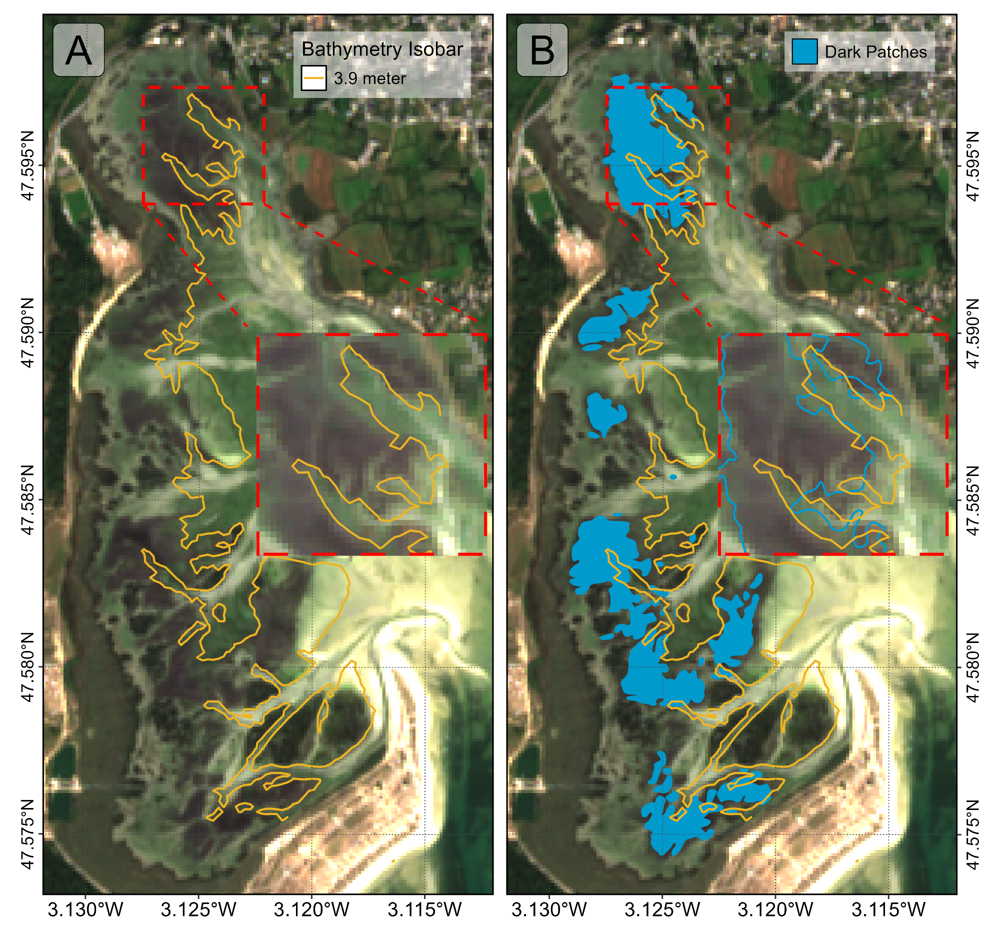
```

Additionally, analysis of bathymetry data to determine seagrass emersion time shows a clear relationship between the time seagrass is exposed to air and its darkening. During the heatwave, no significant darkening occurred with daily exposure below 13.5 hours. However, when exposure reached 13.5 hours or more per day, seagrasses began to darken, peaking at around 14.5 hours of daily exposure (@fig-GAM_Emersion).

```{r Fig GAM_Emersion}
#| cache: false
#| echo: false
#| warning: false
#| fig-cap: "Seagrass Darkening Index as a function of the daily emergence time of seagrasses. The line represents a Generalized Additive Model (GAM) prediction, and the shaded area indicates the standard error. Shaded points represent raw data, with each point corresponding to a single pixel of the meadow."
#| label: fig-GAM_Emersion
#| fig-width: 10
#| fig-height: 5
#| out-width: "100%"

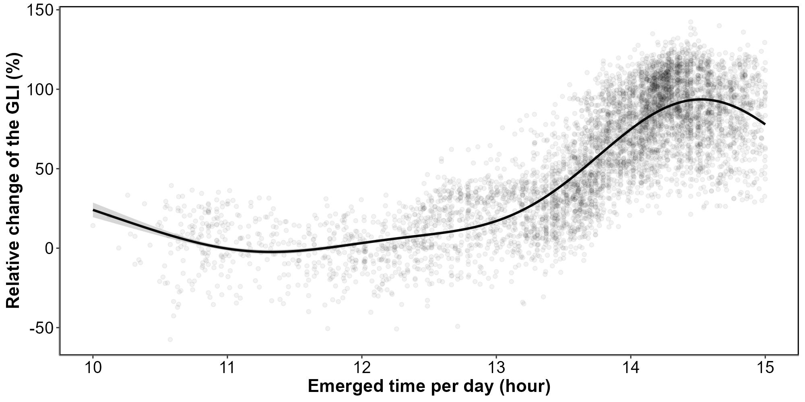
```

# Discussion

Although extensive research exists on marine heatwaves' effects on subtidal seagrasses, little attention has been given to intertidal habitats and even less to the interaction between atmospherical extreme event and intertidal meadows. This study initiates an exploration of how intertidal seagrasses respond to the dual influence of marine and atmospheric heatwaves, underscoring the need for further investigation in this underexplored area.

In the present study, significant changes in the reflectance of seagrasses exposed to heatwaves were observed experimentally. These changes mainly include a drop in reflectance around 560 nm and another drop around 740 nm in the near-infrared part of the spectrum. The change in color can be multifactorial and has been documented in plants under various stress conditions, including thermal stress. Leaf blackening in angiosperms, as observed in *Protea neriifolia*, is primarily driven by oxidative processes involving the enzyme polyphenol oxidase (PPO) and the oxidation of phenolic compounds. When photosynthesis is inhibited by factors such as low light, chemical interference, or thermal stress, the plant’s production of essential carbohydrates and antioxidants diminishes, increasing oxidative stress and leading to darkening. Experimental essays have proved that low-oxygen environments and the addition of antioxydants like diphenylamine (DPA), have been effective in reducing these oxidative reactions. In the absence of photosynthesis, membrane integrity is also compromised, allowing PPO to interact with phenolic compounds, thereby accelerating darkening. Furthermore, high temperatures can destabilize membranes, especially in chloroplasts, disrupting photosystem II and impairing recovery of photosynthetic function [@jones1992leaf; @dascaliuc2007heat]. As chlorophyll-a degrades, the ratio of pigments shift; with pigments like carotenoids becoming more prominent, leading to a darkening of the leaves.

*Zostera noltei*, as a species inhabiting the intertidal zone and regularly exposed to air, has developed adaptations to minimize water stress. For example, *Zostera noltei* exhibits smaller, narrower leaves compared to species residing lower in the intertidal zone, such as *Zostera marina*, which helps reduce water loss during air exposure periods [@cabaco2009individual]. However, during intense warming events and under high light conditions, desiccation can occur in certain parts of the meadow, particularly where seagrass leaves are exposed for prolonged periods ( @fig-GAM_Emersion). Under such water stress, cellular turgor pressure decreases (the internal cell water pressure that maintains cell shape), and concentrations of ions like Na+ and Cl– can reach toxic levels. These effects can impair cellular functions, enzymatic activity, and membrane stability.

High infrared reflectance in plant leaves is primarly due to the internal cellular structure that scatters light. Once sunlight enters the leaf, it is diffused through carious layers, particularly the spongy mesophyll, which contains air spaces and cell walls with different refractive indices. this scattering effect is intensified because there is minimal absorption in the near-infrared range (700 - 1300 nm), allowing light to reflect back through the leaf surface. Once the membranes (chloroplasts, thylakoids, cell walls) are destroyed due to oxidative stress, the reflectance in the Red Edge and the near-infrared regions of the spectrum (\> 700 nm) decreases significantly [@knipling1970reflectance].

These unique reflectance properties of seagrasses under heat stress enable the detection of this darkening through remote sensing techniques. The SDI (@eq-SDI) index developed in this study leverages key reflectance bands (560, 740 and 840 nm) to detect reductions in the green and the Red-Edge regions. SDI can be used to assess the extent and severity of darkening events across intertidal seagrass meadows from space. Current satellite missions, including Sentinel-2, Pleiades-Neo, WorldView-3, SkySat, and GeoSat-2 along with upcoming missions (Sentinel-2 Next Generation and Landsat Next), capture reflectance in the three wavelengths used as input for SDI. As climate change advances, remote sensing becomes a crucial tool for monitoring cumulative ecological impacts on seagrass meadows due to heatwaves. Although these physiological and structural changes occur at the cellular level over short temporal scales, they manifest synchronously across the entire meadow. Remote sensing, with its synoptic views and real-time acquisition capabilities, enables the monitoring of these rapid biological responses to natural stressors. However, cloud coverage can limit continuous observations, necessitating the integration of alternative tools, such as multi-spectral drone platforms. Combined approaches allow for precise, localized monitoring of damaged seagrass meadows immediately after extreme events, which is critical for the early detection of ecosystem degradation, quick actions for habitat 6conservation and targeted management strategies. Moreover, uninterrupted, multi-year data acquisition would strengthen predictive ecological models for future heatwave impacts, enhancing the capacity for adaptive management and supporting long-term resilience planning for seagrass ecosystems.

```{r data opening HW}
#| cache: true
#| echo: false
#| eval: false
#| warning: false


df <- list.files("Data/MeteoFrance/RAW/",pattern = "HOR_departement_56_*", full.names = TRUE) %>% 
  map(read.delim,
      sep = ";",
      .progress = TRUE) %>%
  list_rbind() %>% 
  dplyr::select(NOM_USUEL, LAT,LON,,AAAAMMJJHH,`T`, TN, TX, T10, T20, T50,T100) %>% 
  dplyr::filter(!is.na(`T`))
```

```{r first process HW}
#| cache: true
#| echo: false
#| eval: false
#| warning: false

df_date <- df  %>% 
  mutate(date = as.POSIXct(strptime(AAAAMMJJHH, format = "%Y%m%d%H"))) %>% 
  group_by(NOM_USUEL) %>% 
  reframe(min_date = min(date,na.rm = T),
          max_date = max(date,na.rm = T),
          n = n())

selected_site <- df_date %>% 
  filter(n ==max(n)) %>% 
  pull(NOM_USUEL)

df_sub <- df %>% 
  dplyr::filter(NOM_USUEL == "LORIENT-LANN BIHOUE",
                !is.na(`T`)) %>% 
  dplyr::select(NOM_USUEL, LAT,LON,,AAAAMMJJHH,`T`, TN, TX, T10, T20, T50,T100) %>% 
  mutate(date = as.POSIXct(as.character(AAAAMMJJHH), format = "%Y%m%d%H",tz = "UTC"))


ggplot(df_sub)+
  # geom_hex(aes(x = date, y = `T`), bins = 10)+
  geom_line(aes(x = date, y = `T`))+
  ylab("Temperature (°C)")+
  xlab("Date")+
  theme_Bede()+
  theme(axis.text.x = element_text(size = 15),
        axis.text.y = element_text(size = 15),
        axis.title.x = element_text(size = 20),
        axis.title.y = element_text(size = 20))

df_heatwaveR <- df_sub %>% 
  rename(t = date,
         temp = `T`) %>% 
  dplyr::select(t,temp) %>% 
  mutate(t = as.Date(t)) %>% 
  group_by(t) %>% 
  reframe(temp = max(temp,na.rm = T)) %>% 
  dplyr::filter(t > as.Date("1948-12-31"))

  

  clim <- ts2clm(df_heatwaveR, climatologyPeriod = c(min(df_heatwaveR$t), max(df_heatwaveR$t)))
  
  event <- detect_event(clim,categories = T,minDuration = 3)
  
  res <- detect_event(clim, minDuration = 3)
  mhw <- res$clim
  
  mhw %>%
    filter(t> as.Date("2022-01-01") ) %>%
ggplot(aes(x = t, y = temp))+
    geom_line() +
  geom_flame(aes(y2 = thresh))
```

```{r frequency of heatwaves as define in Perkins and Alexander (2013)}
#| cache: true
#| echo: false
#| eval: false
#| warning: false


library(tidyverse)
library(heatwaveR)
library(mgcv)
library(Utilities.Package)

freq_heatwave <- event %>% 
  mutate(year = substr(as.character(date_start),1,4)) %>% 
  group_by(year) %>% 
  reframe(value = n()) %>% 
  mutate(data = "Frequency")

intensity_heatwave <- event %>% 
  mutate(year = substr(as.character(date_start),1,4)) %>% 
  group_by(year) %>% 
  reframe(value = sum(intensity_cumulative)) %>% 
  mutate(data = "Intensity") %>% 
  mutate(value = sqrt(value*value))


df_heatwaves <- rbind(freq_heatwave,intensity_heatwave) %>% 
  pivot_wider(names_from = data, values_from = value)

# coeff=30
# ggplot(df_heatwaves, aes(x=as.numeric(year))) +
#   geom_point( aes(y=Frequency), color = "blue") +
#   geom_smooth( aes(y=Frequency), color = "blue",method = "gam")+
#   geom_point( aes(y=Intensity / coeff), color = "red") +
#   geom_smooth( aes(y=Intensity / coeff), color = "red",method = "gam")+
#   scale_y_continuous(
#     
#     # Features of the first axis
#     name = "Frequency",
#     
#     # Add a second axis and specify its features
#     sec.axis = sec_axis(~.*coeff, name="Intensity")
#   )+
#   theme_Bede()


df_freq_HW <- df_heatwaves %>% 
  dplyr::select(-Intensity) %>% 
  mutate(year = as.numeric(year))

gam_freq_HW <- mgcv::gam(Frequency ~ s(year,
                                       k=3), 
                 # family = poisson(),
                 data = df_freq_HW)

Utilities.Package::Model_Check(gam_freq_HW)


NewData_freq_HW<-expand_grid(year=unique(df_freq_HW$year))

pred_freq_HW <- predict(gam_freq_HW, NewData_freq_HW, se.fit = T, type = "link")


NewData_freq_HW <- NewData_freq_HW %>% 
  mutate(fit = pred_freq_HW$fit,
         se = pred_freq_HW$se.fit)

(heatwaves_frequency <- ggplot(df_freq_HW, aes(x=year))+
  geom_point(aes(y=Frequency), color = "darkred", alpha = 0.3)+
    geom_line(data = NewData_freq_HW, aes(x = year, y = fit),color = "darkred")+
    geom_ribbon(data = NewData_freq_HW, aes(x = year, y = fit, ymin = fit-se, ymax = fit+se),color = NA ,fill = "darkred",alpha = 0.2)+
    ylab(expression("Frequency of atmospheric heatwaves (year"^"-1" * ")"))+
    xlab(expression("Years"))+
    scale_x_continuous(position = "top")+
    theme_Bede()+
    # scale_fill_manual(values = coltab)+
    theme(
      # strip.text.y= element_text(size =17),
       strip.text.y= element_blank(),
      # legend.title = element_text(size =17, hjust = 0.5),
      legend.title = element_blank(),
      legend.title.position = "top",
      legend.text = element_text(size =13),

      # legend.text = element_text(hjust = 0, size =13),
      axis.text.x = element_text(size = 13),
      axis.text.y = element_text(size = 13),
      axis.title.x = element_text(size = 13),
      axis.title.y = element_text(size = 13),
      
      legend.position = c(0.13, 0.92),
      # legend.position = "top",
      plot.background = element_rect(fill = "white", color =NA) ,
      legend.key.width = unit(1,"cm"),
      legend.key.height = unit(2,"mm")

    # plot.margin = margin(t = 5, r = 5, b = 5, l = 5), # Adjusts plot margins
    # legend.spacing.y = unit(0.1, "cm"),  # Reduces space between legend items vertically
    # legend.margin = margin(t = 0, b = -10)  
      # panel.border = element_blank(),
    )
)


df_Int_HW <- df_heatwaves %>% 
  dplyr::select(-Frequency) %>% 
  mutate(year = as.numeric(year))

gam_Int_HW <- mgcv::gam(Intensity ~ s(year,
                                       k=3), 
                 # family = poisson(),
                 data = df_Int_HW)

Utilities.Package::Model_Check(gam_Int_HW)


NewData_Int_HW<-expand_grid(year=unique(df_Int_HW$year))

pred_Int_HW <- predict(gam_Int_HW, NewData_Int_HW, se.fit = T, type = "link")


NewData_Int_HW <- NewData_Int_HW %>% 
  mutate(fit = pred_Int_HW$fit,
         se = pred_Int_HW$se.fit)

(heatwaves_Intensity <- ggplot(df_Int_HW, aes(x=year))+
  geom_point(aes(y=Intensity), color = "darkred", alpha = 0.3)+
    geom_line(data = NewData_Int_HW, aes(x = year, y = fit),color = "darkred")+
    geom_ribbon(data = NewData_Int_HW, aes(x = year, y = fit, ymin = fit-se, ymax = fit+se),color = NA ,fill = "darkred",alpha = 0.2)+
    ylab(expression("Cumulative intensity of atmospheric heatwaves (°C)"))+
    xlab(expression("Years"))+
    scale_y_continuous(position = "right")+
    scale_x_continuous(position = "top")+

    theme_Bede()+
    # scale_fill_manual(values = coltab)+
    theme(
      # strip.text.y= element_text(size =17),
       strip.text.y= element_blank(),
      # legend.title = element_text(size =17, hjust = 0.5),
      legend.title = element_blank(),
      legend.title.position = "top",
      legend.text = element_text(size =13),

      # legend.text = element_text(hjust = 0, size =13),
      axis.text.x = element_text(size = 13),
      axis.text.y = element_text(size = 13),
      axis.title.x = element_text(size = 13),
      axis.title.y = element_text(size = 13),
      
      legend.position = c(0.13, 0.92),
      # legend.position = "top",
      plot.background = element_rect(fill = "white", color =NA) ,
      legend.key.width = unit(1,"cm"),
      legend.key.height = unit(2,"mm")

    # plot.margin = margin(t = 5, r = 5, b = 5, l = 5), # Adjusts plot margins
    # legend.spacing.y = unit(0.1, "cm"),  # Reduces space between legend items vertically
    # legend.margin = margin(t = 0, b = -10)  
      # panel.border = element_blank(),
    )
)

```

```{r cold spells}
#| cache: true
#| echo: false
#| eval: false
#| warning: false


cold_clim <- ts2clm(df_heatwaveR, climatologyPeriod = c("1949-01-01", "2024-06-23"),
                   pctile = 10)
  res_cold <- detect_event(cold_clim, coldSpells = T)
  event_cold <- detect_event(cold_clim,categories = T) %>% 
    filter(intensity_cumulative < 0)
  coldspell_clim <- res_cold$clim
  
  coldspell_clim %>% 
    filter(t> as.Date("1960-01-01") & t< as.Date("1961-01-01")) %>%
ggplot(aes(x = t, y = temp))+
  geom_line() +
  geom_flame(aes(y = thresh ,y2 = temp), fill = "darkblue")+
  geom_line(aes(y = thresh), color = "darkblue")

    
freq_coldspells <- event_cold %>% 
  mutate(year = substr(as.character(date_start),1,4)) %>% 
  group_by(year) %>% 
  reframe(value = n()) %>% 
  mutate(data = "Frequency")

intensity_coldspells <- event_cold %>% 
  mutate(year = substr(as.character(date_start),1,4)) %>% 
  group_by(year) %>% 
  reframe(value = sum(intensity_cumulative)) %>% 
  mutate(data = "Intensity") %>% 
  mutate(value = (value))

df_coldspells <- rbind(freq_coldspells,intensity_coldspells) %>% 
  pivot_wider(names_from = data, values_from = value)


df_freq_CS <- df_coldspells %>% 
  dplyr::select(-Intensity) %>% 
  mutate(year = as.numeric(year))

gam_freq_CS <- mgcv::gam(Frequency ~ s(year,
                                       k=3), 
                 # family = poisson(),
                 data = df_freq_CS)

Utilities.Package::Model_Check(gam_freq_CS)


NewData_freq_CS<-expand_grid(year=unique(df_freq_CS$year))

pred_freq_CS <- predict(gam_freq_CS, NewData_freq_CS, se.fit = T, type = "link")


NewData_freq_CS <- NewData_freq_CS %>% 
  mutate(fit = pred_freq_CS$fit,
         se = pred_freq_CS$se.fit)

(coldspells_frequency <- ggplot(df_freq_CS, aes(x=year))+
  geom_point(aes(y=Frequency), color = "darkblue", alpha = 0.3)+
    geom_line(data = NewData_freq_CS, aes(x = year, y = fit),color = "darkblue")+
    geom_ribbon(data = NewData_freq_CS, aes(x = year, y = fit, ymin = fit-se, ymax = fit+se),color = NA ,fill = "darkblue",alpha = 0.2)+
    ylab(expression("Frequency of atmospheric coldspells (year"^"-1" * ")"))+
    xlab(expression("Years"))+
    scale_y_continuous(breaks = c(2,5,8))+
    theme_Bede()+
    # scale_fill_manual(values = coltab)+
    theme(
      # strip.text.y= element_text(size =17),
       strip.text.y= element_blank(),
      # legend.title = element_text(size =17, hjust = 0.5),
      legend.title = element_blank(),
      legend.title.position = "top",
      legend.text = element_text(size =13),

      # legend.text = element_text(hjust = 0, size =13),
      axis.text.x = element_text(size = 13),
      axis.text.y = element_text(size = 13),
      axis.title.x = element_text(size = 13),
      axis.title.y = element_text(size = 13),
      
      legend.position = c(0.13, 0.92),
      # legend.position = "top",
      plot.background = element_rect(fill = "white", color =NA) ,
      legend.key.width = unit(1,"cm"),
      legend.key.height = unit(2,"mm")

    # plot.margin = margin(t = 5, r = 5, b = 5, l = 5), # Adjusts plot margins
    # legend.spacing.y = unit(0.1, "cm"),  # Reduces space between legend items vertically
    # legend.margin = margin(t = 0, b = -10)  
      # panel.border = element_blank(),
    )
)


df_Int_CS <- df_coldspells %>% 
  dplyr::select(-Frequency) %>% 
  mutate(year = as.numeric(year))

gam_Int_CS <- mgcv::gam(Intensity ~ s(year,
                                       k=3), 
                 # family = poisson(),
                 data = df_Int_CS)

Utilities.Package::Model_Check(gam_Int_CS)


NewData_Int_CS<-expand_grid(year=unique(df_Int_CS$year))

pred_Int_CS <- predict(gam_Int_CS, NewData_Int_CS, se.fit = T, type = "link")


NewData_Int_CS <- NewData_Int_CS %>% 
  mutate(fit = pred_Int_CS$fit,
         se = pred_Int_CS$se.fit)

(coldspells_Intensity <- ggplot(df_Int_CS, aes(x=year))+
  geom_point(aes(y=Intensity), color = "darkblue", alpha = 0.3)+
    geom_line(data = NewData_Int_CS, aes(x = year, y = fit),color = "darkblue")+
    geom_ribbon(data = NewData_Int_CS, aes(x = year, y = fit, ymin = fit-se, ymax = fit+se),color = NA ,fill = "darkblue",alpha = 0.2)+
    ylab(expression("Cumulative intensity of atmospheric coldspells (°C)"))+
    xlab(expression("Years"))+
    scale_y_continuous(position = "right",
                       transform = "reverse")+
    # scale_x_continuous(position = "top")+

    theme_Bede()+
    # scale_fill_manual(values = coltab)+
    theme(
      # strip.text.y= element_text(size =17),
       strip.text.y= element_blank(),
      # legend.title = element_text(size =17, hjust = 0.5),
      legend.title = element_blank(),
      legend.title.position = "top",
      legend.text = element_text(size =13),

      # legend.text = element_text(hjust = 0, size =13),
      axis.text.x = element_text(size = 13),
      axis.text.y = element_text(size = 13),
      axis.title.x = element_text(size = 13),
      axis.title.y = element_text(size = 13),
      
      legend.position = c(0.13, 0.92),
      # legend.position = "top",
      plot.background = element_rect(fill = "white", color =NA) ,
      legend.key.width = unit(1,"cm"),
      legend.key.height = unit(2,"mm")

    # plot.margin = margin(t = 5, r = 5, b = 5, l = 5), # Adjusts plot margins
    # legend.spacing.y = unit(0.1, "cm"),  # Reduces space between legend items vertically
    # legend.margin = margin(t = 0, b = -10)  
      # panel.border = element_blank(),
    )
)


```

```{r merging HW CS plots}
#| cache: true
#| echo: false
#| eval: false
#| warning: false

(plot_HW_CP <- ((heatwaves_frequency | heatwaves_Intensity) / (coldspells_frequency | coldspells_Intensity))  + 
  plot_layout(guides = "collect")& 
  theme(legend.position = "bottom")
)

ggsave("Paper/Figs/High_res/plot_HW_CS.png", plot_HW_CP, width = 10, height = 10, dpi = 400)
ggsave("Paper/Figs/Low_res/plot_HW_CS.png", plot_HW_CP, width = 10, height = 10, dpi = 200)

```

The rapid global escalation of heatwave frequency, intensity and duration is a defining characteristic of the current climate crisis, heavily influenced by anthropogenic activities and greenhouse gas emissions. Recent research suggests that the magnitude of these events has surged in the past decades, with climate projections predicting a continuation of this trend. For example, heatwaves that were once considered rare are now up to ten times more likely to occur, with some regions experiencing events three times as intense as those in the early 20th century [@devi2024intensity ; @russo2023intensity]. In our study site in Quiberon, a similar pattern emerges. Data from a local weather station show an increasing trend in both the frequency and cumulative intensity of atmospheric heatwaves, while coldspells—defined as extreme low temperatures below the 10th percentile—have shown a marked decline in both frequency and intensity [@fig-Freq_Int_HW_CS]. Cumulative indices that quantify heatwave intensity are based on total temperature exceedances and offer a more comprehensive understanding of event severity than average temperature alone. This is because the cumulative impact of prolonged high temperatures imposes more extensive stress on ecosystems than isolated peak temperatures [@russo2023intensity].

```{r Fig Freq_Int_HW_CS}
#| cache: false
#| echo: false
#| warning: false
#| fig-cap: "Frequency and intensity of atmospheric heatwaves (red) and cold spells (blue) over time at the Lorient-Lann Bihoué weather station. The left column displays the annual frequency of heatwaves and cold spells as the total number of events per year. The right column illustrates event intensity, represented by the cumulative temperature anomaly throughout the year, measured in degrees Celsius."
#| label: fig-Freq_Int_HW_CS
#| fig-width: 10
#| fig-height: 10
#| out-width: "80%"

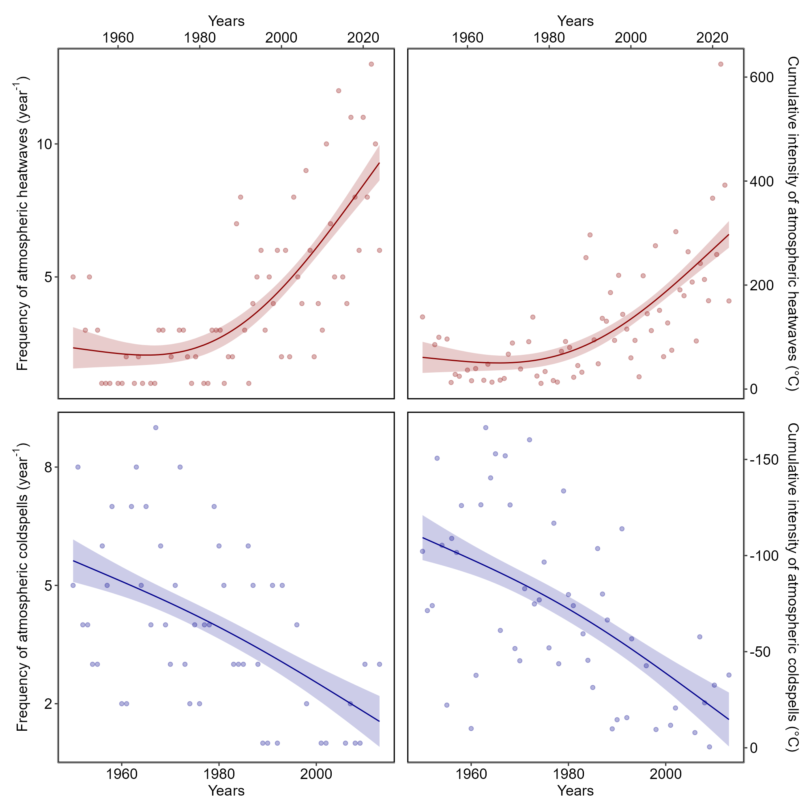
```

From a hazard analysis perspective, the concurrent evaluation of intensity, frequency, and duration of atmospheric heatwaves allows for a partial understanding of their likely impacts. Models like the Heatwave Intensity Duration Frequency (HIDF) provide insights into various heatwave scenarios, indicating that both short intense and prolonged moderate events present unique risks depending on the region. For instance, in the Mediterranean, the frequency of high-intensity heatwaves has dramatically increased, leading to severe impacts on urban infrastructure, public health, energy consumption but also to terrestrial and intertidal ecosystems, such as seagrass meadows [@mazdiyasni2019hidf ; @smale2019marine]. Sharper increase in extreme heat events are expected in regions experiencing large daily thermic amplitude, which underscores the role of atmospheric variability in local heatwave dynamics. In mid-latitudes, where daily variability is expected to decrease, heat extremes may stabilize at elevated levels, reducing cold extremes while allowing for increasingly frequent hot day [@simolo2022quantifying].

In the ocean, similar trends are observed with marine heatwaves (MHWs). MHWs have increased by over 50% in annual days since the early 20th century, and projections suggest that a near-permanent state of marine heatwaves, based on nowadays baselines, could develop by the end of the century if greenhouse gas emissions remain high [@oliver2019projected]. Events like the “Blob” in the northeast Pacific (2013–2016) have underscored the ecological ramifications of such heat anomalies, including shifts in species distributions, mass mortalities, and habitat degradation across vast oceanic regions. The physical mechanisms driving MHWs, such as altered ocean circulation and air-sea heat flux, further illustrate the interconnectedness of atmospheric and marine systems in the context of climate-driven thermal extremes [@smale2019marine].

The escalating frequency and intensity of heatwaves represent not only an atmospheric anomaly but a profound disruption to ecological stability across diverse ecosystems [@devi2024intensity ; @stillman2019heat]. The sustained high temperatures associated with both atmospheric and marine heatwaves lead to physiological stress, habitat degradation, and increased mortality in many species, particularly those with limited thermal tolerance [@simolo2022quantifying ; @oliver2019projected]. Terrestrial and marine ecosystems experience shifts in species distributions, altered community dynamics, and reduced biodiversity as species are either forced to migrate or face local extinction under increasingly inhospitable conditions [@pansch2018heat]. Similarly, in marine environments, prolonged heat stress from marine heatwaves has cascading effects on foundational species, including corals, kelps, and seagrasses, all of which are crucial for providing habitat, food, and shelter to diverse marine life [@smale2019marine ; @oliver2019projected]. Seagrasses, in particular, play a vital role in carbon sequestration and coastal protection but are especially vulnerable to extreme heat events. Elevated temperatures can disrupt seagrass photosynthesis and metabolic processes, leading to reduced growth and heightened susceptibility to disease [@guerrero2020heat ; @winters2011effects ; @sawall2021chronically ; @deguette2022physiological]. With repeated heatwave exposure and limited recovery periods, seagrass meadows may suffer severe declines, threatening their ability to deliver key ecosystem services such as carbon storage, sediment stabilization, and habitat provision [@mazdiyasni2019hidf]. The compounded impacts of atmospheric and marine heatwaves thus pose an existential threat to intertidal seagrass ecosystems, highlighting the urgent need for targeted climate adaptation measures to mitigate these escalating thermal stresses and preserve the resilience of these essential marine habitats [@stillman2019heat ; @russo2023intensity].

```{r resilience of seagrasses}
#| cache: true
#| echo: false
#| eval: false
#| warning: false

library(Utilities.Package)
library(tidyverse)
library(terra)
library(sf)
library(MapRs)


img_list <- "Data/Sentinel2/" %>% 
  list.files(recursive = T, full.names = T ,pattern = ".SAFE", include.dirs = T) %>% 
  as_tibble() %>% 
  rename(path = "value") %>% 
  dplyr::filter(str_detect(path,"20210906") | str_detect(path, "20210814") | str_detect(path, "20211008"))

msk <- read_sf("Data/shp/mask_seagrasses.shp")

GCP <- read.csv("Data/Biolittoral/Bio-Littoral_Drone/Quadrat_metadata.csv") %>% 
    as_tibble() %>% 
  st_as_sf(coords = c("lon", "lat"), crs = 4326) %>% 
  mutate(Target_types = case_when(str_detect(Target_types,"Mix") ~ "Other",
                                  str_detect(Target_types,"Healthy") ~ "Healthy_seagrass",
                                  str_detect(Target_types,"Bleached") ~ "Bleached_seagrass",
                                  T ~ "Other")) %>% 
  dplyr::filter(Target_types %in% c("Bleached_seagrass","Healthy_seagrass")) %>% 
  vect()


before <- img_list %>%  
  dplyr::filter(str_detect(path,"20210814")) %>% 
  pull(path) %>% 
  Read_S2() %>% 
  crop(msk, mask = T) 

during <- img_list %>%  
  dplyr::filter(str_detect(path,"20210906")) %>% 
  pull(path) %>% 
  Read_S2() %>% 
  crop(msk, mask = T) 

after <- img_list %>%  
  dplyr::filter(str_detect(path,"20211008")) %>% 
  pull(path) %>% 
  Read_S2() %>% 
  crop(msk, mask = T) 

before_cor <- before -1000
during_cor <- during - 1000
after_cor <- after - 1000

SPC_before <- 172.06*(before_cor$B08-before_cor$B04)/(before_cor$B08+before_cor$B04)-22.18
SPC_during <- 172.06*(during_cor$B08-during_cor$B04)/(during_cor$B08+during_cor$B04)-22.18
SPC_after <- 172.06*(after_cor$B08-after_cor$B04)/(after_cor$B08+after_cor$B04)-22.18

names(SPC_before) <- "SPC_before"
names(SPC_during) <- "SPC_during"
names(SPC_after) <- "SPC_after"


darkened_patches <- read_sf("Output/darkening_patches_SDI.shp") %>% 
  rasterize(SPC_before)
names(darkened_patches)<-"IsDarkened"

stk <- c(SPC_before,SPC_during,SPC_after, darkened_patches) %>% 
  as.data.frame() %>% 
  pivot_longer(-IsDarkened, names_to = "When", values_to = "SPC") %>% 
  mutate(When = case_when(str_detect(When,"before") ~ "Before",
                          str_detect(When, "during") ~ "During",
                          str_detect(When, "after") ~ "After"),
         IsDarkened = case_when(IsDarkened == 1 ~ "Impacted",
                                T ~ "Green"))
ggplot(stk)+
  geom_boxplot(aes(x = IsDarkened, y = SPC, color = IsDarkened))+
  facet_wrap(~When, ncol = 3)


df_all_indice <- read.csv("Data/Sentinel2/df_all_spectra_GCP.csv") %>% 
  mutate(SPC = 172.06*NDVI-22.18) %>% 
  dplyr::select(c(filename, Target_types,Raster,NDVI,GLI,SPC)) %>%
  mutate(sum = NDVI + GLI + SPC) %>% 
  dplyr::distinct(sum, .keep_all = T) %>% 
  dplyr::select(-sum) %>% 
    dplyr::filter(NDVI > 0 ) %>% 
  mutate(GLI = GLI *2) %>% 
  pivot_longer(c(NDVI,SPC,GLI), names_to = "Indices", values_to = "values") %>% 
  mutate(date = case_when(Raster == "After" ~ ("2021-09-06"), 
                          T ~ ("2021-09-01")),
         Indices = case_when(Indices == "NDVI" ~ "NDVI",
                             Indices == "SPC" ~ "SPC",
                             Indices == "GLI" ~ "GLI"),
         Target_types = case_when(Target_types == "Bleached_seagrass" ~ "GCPs Darkened in the field",
                                  T ~ "GCPs Green in the Field"),
        Target_types = factor(Target_types, levels = c("GCPs Green in the Field", "GCPs Darkened in the field")),
        Indices = factor(Indices, levels = c("NDVI", "SPC", "GLI"))
  ) %>% 
  dplyr::filter(Indices == "SPC") %>% 
  dplyr::select(-c(filename,Indices,date)) %>% 
  rename(SPC = "values",
         When = "Raster") %>% 
  mutate(When = case_when(When == "After" ~ "During",
                          T ~ When))


# coltab <- c("GCPs Darkened in the field" = "brown", "GCPs Green in the Field" = "darkgreen")
coltab <- c("Impacted" = "brown", "Not Impacted" = "darkgreen")

  
plot_resilience <- c(SPC_after) %>% 
  terra::extract(GCP, bind = T) %>% 
  as_tibble() %>% 
   dplyr::select(-c(path,filename)) %>% 
   mutate(When = "After",
         Target_types = case_when(Target_types == "Bleached_seagrass" ~ "GCPs Darkened in the field",
                                  T ~ "GCPs Green in the Field")) %>% 
   rename(SPC = "SPC_after") %>% 
   rbind(df_all_indice) %>% 
   mutate(date = case_when(When == "Before" ~ "2021-09-01",
                           When == "During" ~ "2021-09-06", 
                           When == "After" ~ "2021-10-07"),
         Target_types = case_when(Target_types == "GCPs Darkened in the field" ~ "Impacted",
                                  T ~ "Not Impacted"),
          Target_types = as.factor(Target_types),
         SPC = case_when(SPC > 100 ~ 100,
                         T ~ SPC)
          # Target_types = fct_relevel(Target_types, "GCPs Green in the Field", "GCPs Darkened in the field")
          ) %>% 
  dplyr::filter(SPC > 0 ) %>% 
   ggplot()+
  geom_boxplot(aes(x = Target_types, y = SPC, color = Target_types), show.legend = F)+
    scale_color_manual(values = coltab, 
                       label = c("Unimpacted seagrasses","Impacted seagrasses")) +
  facet_wrap(~date, nrow = 1)+
  ylab("Seagrass Cover (%)")+
  xlab("Seagrass status")+
  # scale_x_discrete(breaks = c("No", "Yes"))+
   theme_Bede()+
  theme(
      strip.text.x = element_text(size =17),
      # legend.title = element_text(size =17),
      legend.title = element_blank(),
      # legend.title.position = "top",
      legend.text = element_text(size =15),

      # legend.text = element_text(hjust = 0, size =13),
      axis.text.x = element_text(size = 13),
      axis.text.y = element_text(size = 13),
      axis.title.x = element_text(size = 15),
      axis.title.y = element_text(size = 15),
      
      # legend.position = c(0.86, 0.13),
      # legend.position = "top",
      plot.background = element_rect(fill = "white"),
      legend.key.width = unit(1,"cm"),
      legend.key.height = unit(8,"mm")
      # panel.border = element_blank(),
    )

ggsave("Paper/Figs/High_res/plot_resilience.png", plot_resilience, width = 10, height = 5, dpi = 400)
ggsave("Paper/Figs/Low_res/plot_resilience.png", plot_resilience, width = 10, height = 5, dpi = 200)
```

```{r function Tide_info2}
#| cache: true
#| echo: false
#| eval: false
#| warning: false

library(rvest)
library(sf)
library(terra)
Tide_info<-function(coords=NA,tide_date=NA){
  
  
  data_coord<-list.files("./", pattern="station_coordinate.csv",full.names = T,recursive = T)
  if (length(data_coord)==1) {
    station_coordinate<-read.csv(data_coord)
    
  }
  if (exists("station_coordinate")==FALSE) {
    
    url_stat<-"http://www.ioc-sealevelmonitoring.org/list.php?operator=&showall=all&output=general"
    download.file(url_stat, destfile = "scrapedpage_stat.html",quiet=T)
    webpage_stat <- read_html("scrapedpage_stat.html")
    stat_table<-rvest::html_text(rvest::html_nodes(webpage_stat,'td'))
    stat_table<-stat_table[-length(stat_table)]
    
    stat_table<-stat_table[-c(1:19)]
    name_stat_table<-stat_table[c(1:10)]
    name_stat_table<-unlist(strsplit(name_stat_table,"\r\r\n\t\t\t\t"))
    name_stat_table[8]<-"Last_Observation_Time_in_GMT"
    for (i in 1:length(name_stat_table)) {
      name_stat_table[i]<-gsub(" ","_",  name_stat_table[i])
      
    }
    
    
    stat_table<-stat_table[-c(1:10)]
    stat_table<-as.data.frame(matrix(stat_table,ncol=11,byrow = T))
    names(stat_table)<-name_stat_table
    
    stat_table<-stat_table[which((nchar(stat_table$Code)==4)|(nchar(stat_table$Code)==5)),]
    # stat_table<-stat_table[which(stat_table$Connection=="ftp"),]
    stat_table$Last_Observation_Time_in_GMT<-substr(stat_table$Last_Observation_Time_in_GMT,7,nchar(stat_table$Last_Observation_Time_in_GMT))
    stat_table<-stat_table[which((stat_table$Last_Observation_Time_in_GMT!="-down-")),]
    stat_table<-stat_table[which((stat_table$Last_Observation_Time_in_GMT!="-maintenance-")),]
    
    for (i in 1:nrow(stat_table)) {
      
      print(paste0(i,"/",nrow(stat_table)," station: ",stat_table$Code[i]))
      
      url_coord<-paste0("http://www.ioc-sealevelmonitoring.org/station.php?code=",stat_table$Code[i])
      download.file(url_coord, destfile = "scrapedpage_coord.html",quiet=T)
      webpage <- read_html("scrapedpage_coord.html")
      stat_coord<-as.character(rvest::html_text(rvest::html_nodes(webpage,'tr')))
      
      lat<-stat_coord[which(substr(stat_coord,1,8)=="Latitude")]
      long<-stat_coord[which(substr(stat_coord,1,9)=="Longitude")]
      lat<-gsub("Latitude . ","",lat)
      long<-gsub("Longitude . ","",long)
      stat_table$long[i]<-long
      stat_table$lat[i]<-lat
      
      station_coordinate<-stat_table
      
      
    }
    # return(station_coordinate)
    write.csv(station_coordinate,"./station_coordinate.csv")
  }
  
  
  
  sr<-crs('+proj=longlat +ellps=WGS84 +datum=WGS84 +no_defs')
  # coord_centroid<-data.frame(x=(c(xmax(roi)+xmin(roi), ymax(roi)+ymin(roi))/2)[1],
  #                            y=(c(xmax(roi)+xmin(roi), ymax(roi)+ymin(roi))/2)[2])
  
  # coordinates(coord_centroid)<- ~x+y
  # crs(coord_centroid)<-crs(roi)
  # 
  # roi <- spTransform(coord_centroid, sr)
  # coord_centroid<-c(xmax(roi)+xmin(roi), ymax(roi)+ymin(roi))/2
  # 
  dist_roi_Tide<-data.frame(
    code_tide=station_coordinate$Code,
    Name_station=station_coordinate$Location,
    dist=NA
  )
  
  coord_centroid = coords
  
  for (i in 1:nrow(station_coordinate)) {
    
    dist_roi_Tide$dist[i]<-sqrt(((coord_centroid[2]-station_coordinate$long[i])^2)+(coord_centroid[1]-station_coordinate$lat[i])^2)
  }
  
  site_name_selected<-dist_roi_Tide[which(dist_roi_Tide$dist==min(dist_roi_Tide$dist)),]
  site_id<-site_name_selected$code_tide[1]
  
  
  tide_date_wrong<-as.POSIXct(tide_date, format = "%Y-%m-%d")
  tide_date_true<-tide_date_wrong+ (60*60*24)
  
  
  # site_id<-"batr"
  
  url <- paste0("http://www.ioc-sealevelmonitoring.org/bgraph.php?code=",site_id,"&output=tab&period=1&endtime=",tide_date_true)
  download.file(url, destfile = "scrapedpage.html",quiet=T)
  webpage <- read_html("scrapedpage.html")
  tidal_RAW<-rvest::html_text(rvest::html_nodes(webpage,'td'))
  Tide_table<-as.data.frame(matrix(tidal_RAW,ncol=2, byrow = T))
  names(Tide_table)<-Tide_table[1,]
  Tide_table<-Tide_table[-1,]
  Tide_table$`Time (UTC)`<-as.POSIXct(Tide_table$`Time (UTC)`, tryFormats = c("%Y-%m-%d %H:%M:%OS",
                                                                              "%Y/%m/%d %H:%M:%OS",
                                                                              "%Y-%m-%d %H:%M",
                                                                              "%Y/%m/%d %H:%M",
                                                                              "%Y-%m-%d",
                                                                              "%Y/%m/%d",
                                                                              "%Y%m%d %H:%M:%OS3",
                                                                              "%Y%m%d %H:%M",
                                                                              "%Y%m%d"))
  
  Tide_table_aggregate <- aggregate(as.numeric(Tide_table[,2]), 
                                    list(fiveMin=cut(Tide_table$`Time (UTC)`, "10 mins")),
                                    mean)
  # # Tide_table_aggregate$x<-round(Tide_table_aggregate$x,3)
  # Tide_table_aggregate$fiveMin<-as.POSIXct(Tide_table_aggregate$fiveMin, tryFormats = c("%Y-%m-%d %H:%M:%S",
  #                                                                                       "%Y/%m/%d %H:%M:%S",
  #                                                                                       "%Y-%m-%d %H:%M",
  #                                                                                       "%Y/%m/%d %H:%M",
  #                                                                                       "%Y-%m-%d",
  #                                                                                       "%Y/%m/%d",
  #                                                                                       "%Y%m%d %H:%M:%S",
  #                                                                                       "%Y%m%d %H:%M",
  #                                                                                       "%Y%m%d"))

  Tide_table_aggregate$smooth<-signal::sgolayfilt(Tide_table_aggregate$x,n=15)
  
  # Tide_table_aggregate$first_diff<- ave(Tide_table_aggregate$smooth , Tide_table_aggregate$fiveMin , FUN=function(i) c(NA,diff(i)))
  
  
  
  
  for (i in 1:(nrow(Tide_table_aggregate)-1)) {
    
    a<-as.numeric(Tide_table_aggregate[i,3])-as.numeric(Tide_table_aggregate[i+1,3])
    # a<-round(a,digits = 2)
    
    if (i==1) {
      
      if (a>0) {
        Tide_type<-"jusant"
        
      }else{
        Tide_type<-"flot"
      }
    }else{
      
      if (a>0 & Tide_type=="flot" ) {
        Tide_table_aggregate[i,4]<-"HT"
      }
      if (a<0 & Tide_type=="jusant" ){
        Tide_table_aggregate[i,4]<-"LT"
      }
      if (a>0) {
        Tide_type<-"jusant"
        
      }else{
        Tide_type<-"flot"
      }
      
    }
    
  }
  names(Tide_table_aggregate)<-c('date','water_height',"smooth",'tide_step')
  
  
  Tide_table_aggregate$date1 <- as.character(Tide_table_aggregate$date) %>% 
    as.POSIXct(format = "%Y-%m-%d %H:%M:%S")
  
  Tide_table_aggregate$date1[1]<- as.character(Tide_table_aggregate$date[1]) %>% 
    as.POSIXct(format = "%Y-%m-%d %H:%M:%S")
  Tide_table_aggregate$date1[nrow(Tide_table_aggregate)]<- as.character(Tide_table_aggregate$date[nrow(Tide_table_aggregate)]) %>% 
    as.POSIXct(format = "%Y-%m-%d %H:%M:%S")
  
  Tide_table_aggregate <- Tide_table_aggregate %>% 
    dplyr::select(-date) %>% 
    rename(date = "date1")
  BMPM<-Tide_table_aggregate[which(is.na(Tide_table_aggregate[,4])==FALSE),]
  
  plot_tide<-ggplot(data=Tide_table_aggregate,aes(x=date,y=water_height))+
    geom_line()
    # geom_vline(xintercept = as.POSIXct(BMPM$date,tryFormats = c("%Y-%m-%d %H:%M:%OS",
    #                                                             "%Y/%m/%d %H:%M:%OS",
    #                                                             "%Y-%m-%d %H:%M",
    #                                                             "%Y/%m/%d %H:%M",
    #                                                             "%Y-%m-%d",
    #                                                             "%Y/%m/%d",
    #                                                             "%Y%m%d %H:%M:%OS3",
    #                                                             "%Y%m%d %H:%M",
    #                                                             "%Y%m%d")), linetype="dotted", 
    #            color = "blue", size=1.5)
    # 
 
  out<-list()
  out$site<-site_name_selected
  out$tide<-BMPM
  out$df_tide<-Tide_table_aggregate[,c(1,2,4)]
  out$tide_plot<-plot_tide
  
  return(out)
  
}


```

```{r GAM Bathy to Emersion NeapvsSpring}
#| cache: true
#| echo: false
#| eval: false
#| warning: false

library(tidyverse)
library(Utilities.Package)
library(heatwaveR)

#### Spring tides

dates <- c("2021-09-04", "2021-09-05","2021-09-06","2021-09-07")
coords <- c(47.586782, -3.121514)

seagrass_mask <- read_sf("Data/shp/mask_seagrasses.shp")

for(i in 1:length(dates)){
  tide_data <- Tide_info(coords = coords, tide_date = dates[i])
  
  if(i == 1){
    df_tide = tide_data$tide %>% 
      as_tibble()
  }else{
    df_tide = rbind(df_tide,tide_data$tide)
  }

}


litto_10m_df <- rast("Data/Litto3D/Litto_10m_merged_32630.tif") %>% 
  as.data.frame(xy=T) %>% 
  mutate(emersion_time = NA,
         submerged_time = NA)

tidal_df <- df_tide %>% 
  dplyr::select(date,smooth) %>%
  complete(date = seq(min(date), max(date), by = "1 min")) %>%
  mutate(smooth = zoo::na.approx(smooth, na.rm = FALSE))

for (i in 1:nrow(litto_10m_df)) {
  
  df_emerged <- tidal_df %>% 
    dplyr::filter(smooth < litto_10m_df$bathy[i])
  df_submerged <- tidal_df %>% 
    dplyr::filter(smooth > litto_10m_df$bathy[i])
  
  litto_10m_df$emersion_time[i] <- (nrow(df_emerged))+1
  litto_10m_df$submerged_time[i] <- (nrow(df_submerged))+1
}

litto_cropped_ST <- litto_10m_df %>% 
  rast(type = "xyz", crs = crs("EPSG:32630"))%>% 
  crop(seagrass_mask, mask = T)


#### Neap Tide 

dates <- c("2021-09-29", "2021-09-30","2021-10-01","2021-10-02")
coords <- c(47.586782, -3.121514)

seagrass_mask <- read_sf("Data/shp/mask_seagrasses.shp")

for(i in 1:length(dates)){
  tide_data <- Tide_info(coords = coords, tide_date = dates[i])
  
  if(i == 1){
    df_tide = tide_data$tide %>% 
      as_tibble()
  }else{
    df_tide = rbind(df_tide,tide_data$tide)
  }

}


litto_10m_df <- rast("Data/Litto3D/Litto_10m_merged_32630.tif") %>% 
  as.data.frame(xy=T) %>% 
  mutate(emersion_time = NA,
         submerged_time = NA)

tidal_df <- df_tide %>% 
  dplyr::select(date,smooth) %>%
  complete(date = seq(min(date), max(date), by = "1 min")) %>%
  mutate(smooth = zoo::na.approx(smooth, na.rm = FALSE))

for (i in 1:nrow(litto_10m_df)) {
  
  df_emerged <- tidal_df %>% 
    dplyr::filter(smooth < litto_10m_df$bathy[i])
  df_submerged <- tidal_df %>% 
    dplyr::filter(smooth > litto_10m_df$bathy[i])
  
  litto_10m_df$emersion_time[i] <- (nrow(df_emerged))+1
  litto_10m_df$submerged_time[i] <- (nrow(df_submerged))+1
}

litto_cropped_NT <- litto_10m_df %>% 
  rast(type = "xyz", crs = crs("EPSG:32630"))%>% 
  crop(seagrass_mask, mask = T)

names(litto_cropped_NT) <- c("bathy_NT","Emersion_NT","Submersion_NT")
names(litto_cropped_ST) <- c("bathy_ST","Emersion_ST","Submersion_ST")

c(litto_cropped_NT, litto_cropped_ST) %>% 
  as.data.frame() %>% 
  ggplot()+
  geom_point(aes(x = (Emersion_NT/60)/4, y =(Emersion_ST/60)/4))+
  xlab("Submersion time during Neap tides (Hours)")+
  ylab("Submersion time during Spring tides (Hours)")+
  # scale_x_discrete(breaks = c("No", "Yes"))+
   theme_Bede_Map()+
  theme(
      # strip.text.x = element_text(size =17),
      # legend.title = element_text(size =17),
      legend.title = element_blank(),
      # legend.title.position = "top",
      legend.text = element_text(size =15),

      # legend.text = element_text(hjust = 0, size =13),
      axis.text.x = element_text(size = 13),
      axis.text.y = element_text(size = 13),
      axis.title.x = element_text(size = 15),
      axis.title.y = element_text(size = 15),
      
      # legend.position = c(0.86, 0.13),
      # legend.position = "top",
      plot.background = element_rect(fill = "white")
      # legend.key.width = unit(1,"cm"),
      # legend.key.height = unit(8,"mm")
      # panel.border = element_blank(),
    )

```

Seagrass resilience to heatwaves is a complex and multifaceted issue shaped by species-specific traits, geographical location, and concurrent environmental stressors [@canadell2021ecosystem; @hatum2024predicting; @berger2024eelgrass]. As climate change drives the frequency and intensity of marine heatwaves, understanding these dynamics becomes crucial, especially for temperate seagrass meadows composed of slow-growing, long-lived species like *Posidonia*, *Amphibolis*, and *Zostera.* These species, unlike their tropical counterparts, tend to be highly vulnerable to abrupt environmental changes, struggling to recover from disturbances due to their slower growth and longer lifespan. In contrast, colonizing species typical of tropical regions, such as *Halodule*, *Halophila*, and *Syringodium*, demonstrate greater resilience to warming events and marine heatwaves due to their rapid growth and more flexible life strategies [@o2018seagrass].

The impact of heatwaves on seagrass ecosystems is further intensified by tidal variations, especially in temperate regions with tidal ranges that can exceed 10 meters, such as Mont Saint Michel Bay in France. This pronounced tidal amplitude affects intertidal seagrasses like *Zostera noltei*, which experience varying durations of air exposure based on their position within the intertidal zone. During neap tides, seagrasses situated higher in the intertidal zone may remain exposed for extended periods, heightening their vulnerability to atmospheric heatwaves. Conversely, seagrasses in the lower intertidal zone, although submerged longer, experience prolonged emersion during low tides, making them susceptible to extreme marine heat events. As a result, both marine and atmospheric heatwaves can increase stress on seagrass meadows, with effects that may be intensified by tidal timing and amplitude. In our study, we observed a darkening effect in the seagrasses, despite our experimental setup simulating tides with consistent 6-hour exposure periods. In natural settings, however, bathymetry plays a significant role, and depending on depth variations, seagrasses may be exposed for even longer durations during low tides. This suggests that *in situ* exposure times could exacerbate the stress effects observed, as seagrasses may endure prolonged air exposure beyond what our controlled conditions have replicated.

Species like *Zostera noltei* display distinct seasonal patterns that become increasingly pronounced at higher latitudes [@davies2024sentinel; @davies2024intertidal]. These patterns reflect the species' adaptation to seasonal variations in temperature and light, but they also make N. noltei particularly sensitive to extreme events depending on their timing. For instance, if a heatwave coincides with early developmental stages or occurs after the biomass peak when leaf senescence has begun, the impact on meadow resilience can be severe

Environmental conditions can moderate seagrass resilience to thermal stress. Seagrass meadows located in areas benefiting from tidal cooling or positioned further from the warmer edges of their geographical ranges often experience reduced heat stress, resulting in higher shoot densities and enhanced resilience [@canadell2021ecosystem; @berger2024eelgrass]. In these cooler areas, *Nanostera noltei* exhibits high survival and photosynthetic performance up to 37°C, though temperatures above 39°C lead to near-total mortality within days, underscoring the species' sensitivity to temperature thresholds that may become increasingly common under climate change scenarios [@franssen2014genome]. Moreover, the frequency, duration, and intervals between heatwaves significantly affect seagrass biomass and recovery; prolonged and frequent heatwaves reduce resilience and complicate recovery processes [@hatum2024predicting].

The influence of other stressors, such as eutrophication and sulfide accumulation, complicates this resilience. Increased sediment sulfide levels, which often accompany nutrient enrichment, can be toxic to seagrasses, particularly under elevated temperatures that amplify sulfide toxicity. *Zostera noltei*, for example, has a mutualistic relationship with lucinid clams that helps detoxify sulfides. However, this interaction is compromised at high temperatures, reducing the efficacy of sulfide removal and further inhibiting nutrient uptake, growth, and overall resilience [@de2022increased].

In a simulated heatwave experiment on *Zostera noltei*, resilience was evident under short-term moderate stress, with no significant changes in photosynthetic performance or survival. However, prolonged or more intense heat events posed a greater challenge, highlighting the species’ limited capacity to withstand chronic thermal stress [@massa2009temperature ; @franssen2014genome]. The long-term impact of heatwaves is especially evident in changes to seagrass cover (SPC). Before the heatwave event on 1st September 2021, impacted seagrass patches exhibited higher SPC than non-impacted areas. However, during the event on 6th September, SPC in the impacted patch experienced a sharp decline. By 7th October, one month post-event, the SPC of impacted seagrasses, initially higher, had fallen below that of non-impacted seagrasses [@fig-Resilience_of_seagrasses]. The observed decrease in seagrass cover (SPC) on 6th September was primarily due to leaf darkening, which influenced the NDVI measurements used to estimate SPC. This darkening effect reduced the NDVI values, creating an apparent decrease in SPC in the impacted patch when, in reality, the density of seagrass remained stable. The bias introduced by remote sensing in this instance reflects a limitation in accurately capturing true seagrass cover during stress events. It was only after the heatwave that leaves began to detach, leading to an actual decline in seagrass density. This delayed physical response underscores how extreme events can compromise seagrass resilience, leaving previously robust patches in a weakened state compared to less disturbed areas [@fig-Resilience_of_seagrasses].

```{r Fig Resilience_of_seagrasses}
#| cache: false
#| echo: false
#| warning: false
#| fig-cap: "Comparison of the seagrass percent cover before (left), during (center) and after (right) the heatwaves for seagrasses that have not been impacted by heatwaves (i.e. remains green) and seagrasses that have been impacted by the events (i.e. seagrasses that darkened)."
#| label: fig-Resilience_of_seagrasses
#| fig-width: 10
#| fig-height: 5
#| out-width: "100%"

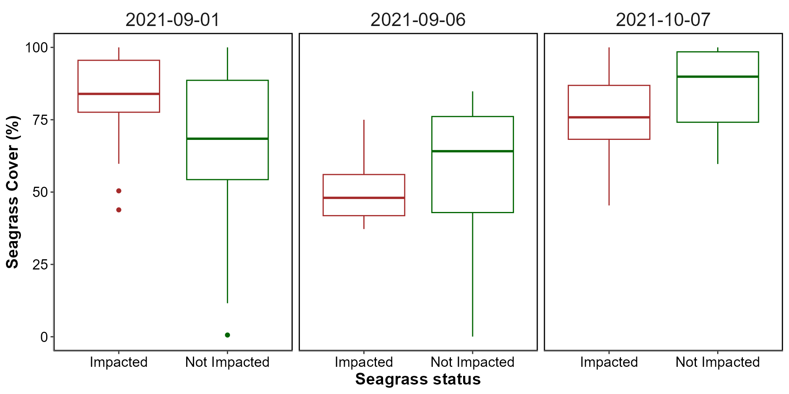
```

On a physiological level, seagrasses possess coping mechanisms such as photoprotective responses and heat-responsive gene expression, including the activation of heat-shock proteins (HSPs) and other stress-related genes [@hughes2004genetic; @reusch2005ecosystem]. *Zostera noltei*, in particular, has shown differential gene expression responses to heat stress, with a variety of genes involved in protein folding, membrane stability, and reactive oxygen species scavenging playing critical roles. However, the rapid pace of climate change raises concerns about whether these adaptations can keep up with the increasing frequency and severity of thermal events [@franssen2014genome].

Given the combined pressures of temperature extremes, eutrophication, and other anthropogenic impacts, targeted management strategies are essential for enhancing seagrass resilience [@loarie2009velocity]. Approaches such as reducing local stressors, cultivating heat-tolerant genotypes, and investing in restoration initiatives are vital to supporting these ecosystems in a warming climate. Although challenges remain, the adaptability and potential resilience of certain seagrass species offer hope for their persistence amid accelerating ecological shifts. In particular, regions that can buffer seagrasses from extreme stressors or provide cooler refuges may play a critical role in maintaining these valuable ecosystems in the face of global climate change [@de2022increased ; @canadell2021ecosystem].

Seagrass meadows function as foundational components of coastal ecosystems, sustaining diverse marine communities by providing essential habitats, nursery grounds, and trophic resources for fish, invertebrates, and migratory birds [@zoffoli2023remote]. Their dense canopies stabilize sediment and protect shorelines from erosion, an increasingly crucial role as sea levels rise due to climate change [@gacia1999approach ; @folmer2012seagrass]. Recurrent heatwave events, which induce physiological stress like leaf darkening, can severely diminish seagrass density, thereby reducing their effectiveness in sediment stabilization and wave attenuation, ultimately increasing the risk of coastal erosion [@calleja2007relationship]. From a biodiversity perspective, degradation of these meadows disrupts intricate food webs, impacting commercially significant fish and shellfish populations that rely on seagrass for sustenance and refuge. This loss can reduce local fisheries' productivity and threaten the livelihoods of coastal communities [@unsworth2014biodiversity]. Furthermore, as seagrasses decline, their capacity to act as a blue carbon sink—critical for climate mitigation—also diminishes, inadvertently contributing to increased atmospheric carbon levels [@armitage2016carbon ; @samper2020characterization]

# Conclusion 

This research has investigated the effects of both marine and atmospheric heatwaves on the intertidal seagrass *Zostera noltei*, a critical component of coastal ecosystems facing increased thermal stress due to climate change. By examining reflectance and pigment composition under controlled experimental conditions and validating these findings with satellite data, we aimed to understand how extreme heat events impact seagrass health and assess the potential of remote sensing to monitor these effects effectively.
Our findings reveal that heatwaves lead to substantial declines in seagrass reflectance, particularly in the green and near-infrared regions, driven by pigment degradation and structural damage. This change is reflected in significant reductions in key vegetation indices such as NDVI and GLI. The Seagrass Darkening Index (SDI), developed in this study, successfully detected seagrass darkening, a visible symptom of heatwave stress, demonstrating the viability of spectral monitoring to capture early-stage impacts of heat events on intertidal ecosystems.
By connecting our findings with satellite data, we have also confirmed the broader spatial impact of heatwaves on seagrass meadows in Quiberon, France. The correlation between heatwave exposure and darkening of seagrass suggests that remote sensing, combined with targeted field observations, can enhance our understanding of ecosystem responses to climate-driven thermal events. These results advocate for integrating continuous spectral monitoring into conservation strategies, as it can help predict the resilience of these ecosystems and guide adaptive management practices.
As climate change accelerates, with an anticipated increase in the frequency and intensity of heatwaves, the vulnerability of intertidal zones to such events will likely intensify. This study not only underscores the importance of seagrass meadows in coastal ecosystems but also highlights the urgency of protecting these critical habitats. Future work should focus on refining remote sensing tools and examining the cumulative effects of repeated heatwave events to support the resilience and conservation of intertidal seagrass meadows in a warming world.

# Bibliography
