```{r library}
#| cache: true
#| echo: false
#| eval: true
#| warning: false

library(tidyverse)
library(Utilities.Package)
library(sf) 
library(rnaturalearth) 
library(rnaturalearthdata) 
library(rnaturalearthhires)
library(leaflet)
library("leaflet.extras")
```


```{r update gitignore}
#| cache: true
#| echo: false
#| warning: false
#| eval: false

library(fs)

# Define the size threshold in bytes (100 MB)
size_threshold <- 100 * 1024 * 1024

# Get a list of all files in the repository
files <- dir_ls(recurse = TRUE, type = "file")

# Filter files larger than the size threshold
large_files <- files[file_info(files)$size > size_threshold]

# Check if there are large files
if (length(large_files) > 0) {
  # Read the existing .gitignore file if it exists
  gitignore_path <- ".gitignore"
  gitignore_content <- if (file_exists(gitignore_path)) {
    readLines(gitignore_path)
  } else {
    character(0)
  }
  
  # Identify files not already in .gitignore
  files_to_add <- large_files[!large_files %in% gitignore_content]
  
  # Append new large files to .gitignore
  if (length(files_to_add) > 0) {
    writeLines(c(gitignore_content, files_to_add), gitignore_path)
    message(length(files_to_add), " file(s) added to .gitignore.")
  } else {
    message("No new files to add to .gitignore.")
  }
} else {
  message("No files larger than 100 MB found.")
}
```


##  {background-image="Images/background_title2.png"}

::: {.gradient_box style="text-align: center; position: absolute; left: 50%; top: 15%; width: 1800px; transform: translate(-50%, -50%)"}
[Impact of Marine and Atmospheric Heatwaves on Intertidal Seagrass: Experimental Spectroradiometry and Satellite-Based Insights]{style="color: black; font-size: 90px; font-weight: bold; line-height: 1em; margin: 0px; text-align: justify-all;"}
:::

::: {.gradient_box style="text-align: center; position: absolute; left: 50%; top: 90%; width: 1300px; transform: translate(-50%, -50%)"}
[10th of January 2025]{style="color: black;font-size: 60px; font-weight: bold;"}
:::

::: {.gradient_box style="text-align: center; position: absolute; left: 50%; top: 60%; width: 1200px; transform: translate(-50%, -50%)"}
[Simon Oiry, Bede Ffinian Rowe Davies, Phillipe Rosa, Augustin Debly, Maria Laura Zoffoli, Anne-Laure Barillé, Nicolas Harin, Pierre Gernez, Laurent Barillé]{style="color: black; font-size: 60px; font-weight: bold;"}
:::

::: {.absolute bottom="65%" left="0%"}
{height="300"}
:::

::: {.absolute bottom="65%" right="0%"}
{height="300"}
:::

# Introduction
## Preface


::: {.absolute style="top: 0%; left: 95%; width: 1800px;"}
::: sectionhead
1 [2 3 4 5]{style="opacity:0.25;"}
:::
:::

::: {.fragment .fade-out fragment-index="4"} 
::: {.absolute .fragment .fade-in bottom="3%" left="-5%" fragment-index="1"}
{height="1000"}
:::

::: {.absolute .fragment .fade-in bottom="3%" left="18%" fragment-index="1"}
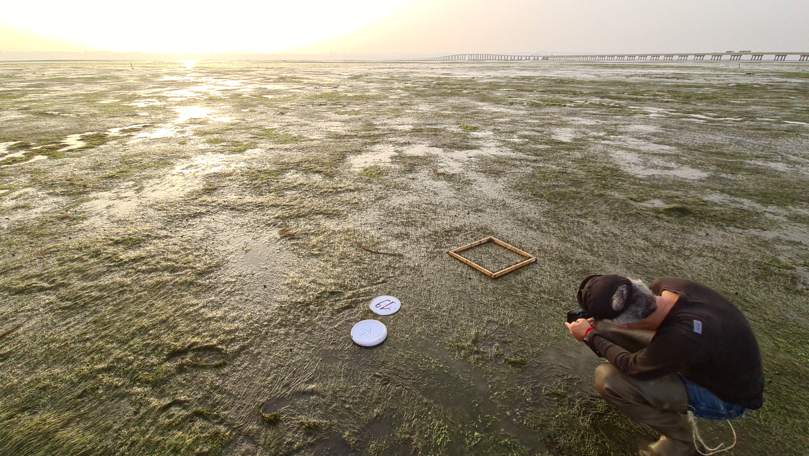{height="400"}
:::

::: {.absolute .fragment .fade-in bottom="35%" left="18%" fragment-index="1"}
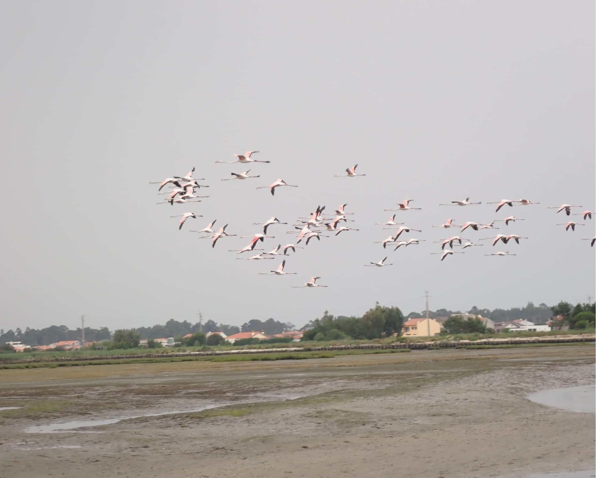{height="567"}
:::

::: {.absolute .fragment .fade-in top="5%" left="13.5%" fragment-index="1"}
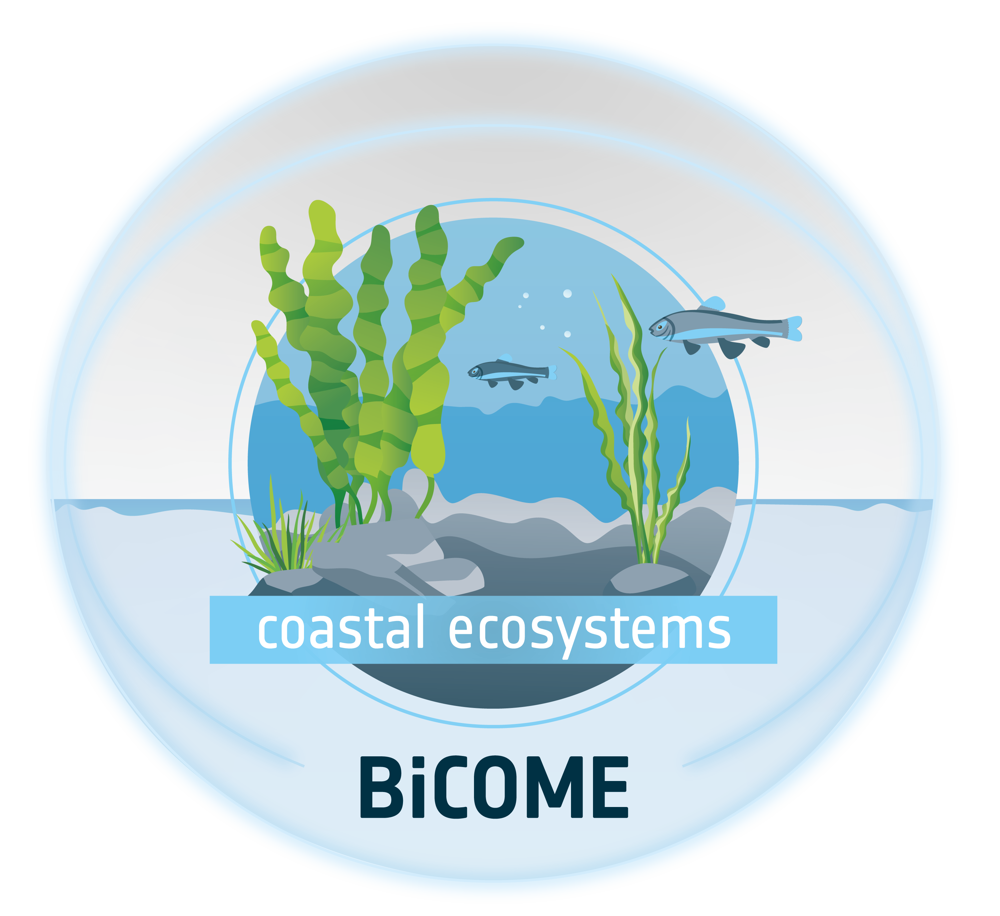{height="200"}
:::

::: {.absolute .fragment .fade-in fragment-index="1" left="150px" top="200px" style="font-size: 40px;"}
June 2022
:::


::: {.absolute .fragment .fade-in top="10%" right="-3%" fragment-index="3"}
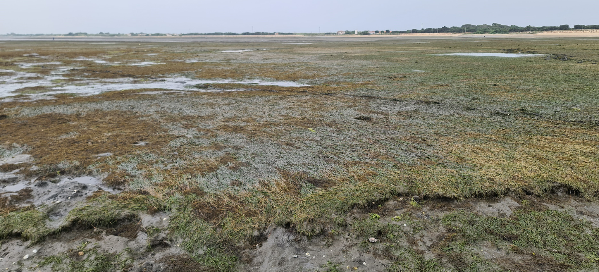{height="600"}
:::

::: {.absolute .fragment .fade-in bottom="3%" right="-3%" fragment-index="3"}
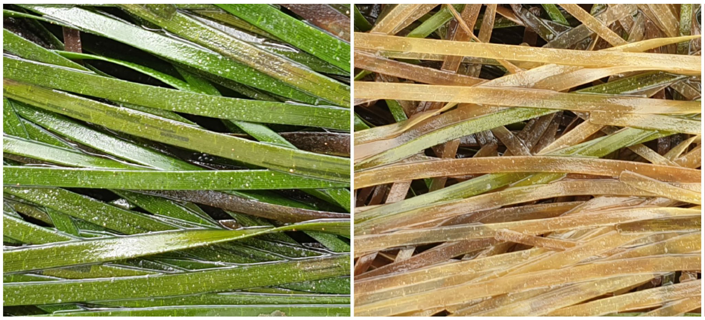{height="600"}
:::
::: 

::: {.absolute .fragment .fade-in top="13%" left="3%" fragment-index="4"}
{height="70"}
:::

::: {.absolute .fragment .fade-in bottom="3%" left="-5%" fragment-index="4"}
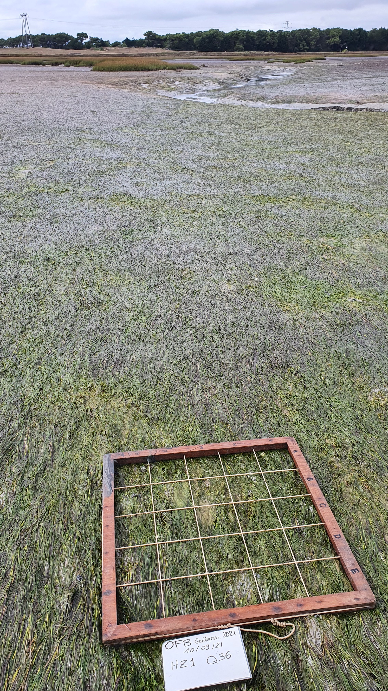{height="1000"}
:::

::: {.absolute .fragment .fade-in bottom="3%" left="18%" fragment-index="4"}
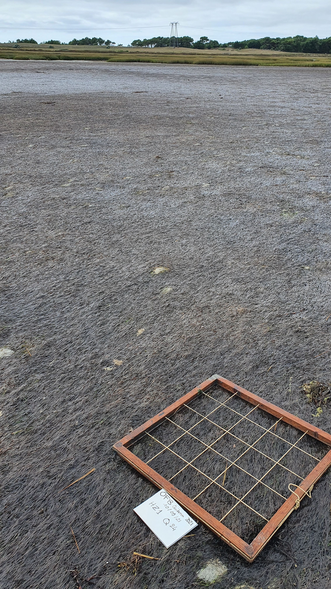{height="1000"}
:::

::: {.absolute .fragment .fade-in fragment-index="4" left="500px" top="200px" style="font-size: 40px;"}
September 2021
:::

```{r SST_processing}
#| cache: true
#| echo: false
#| eval: false
#| warning: false

library(tidyverse)
library(terra)
library(ncdf4)
library(heatwaveR)
library(Utilities.Package)
library(reshape2)


######### NC PLOTTING ################


file_path <- "Data/SST/cmems_obs-sst_atl_phy_my_l3s_P1D-m_1729089512246.nc"
nc <- nc_open(file_path)

# Get the temperature variable (adjust the variable name if different)
temp_var_name <- "adjusted_sea_surface_temperature"
temperature_data <- ncvar_get(nc, temp_var_name)

# Get the longitude and latitude variables (adjust variable names if different)
lon <- ncvar_get(nc, "longitude")
lat <- ncvar_get(nc, "latitude")

# Compute the mean SST over time at each grid point
mean_sst_map <- apply(temperature_data, c(1, 2), sd, na.rm = TRUE)

# Convert the 2D array to a data frame for plotting
mean_sst_df <- melt(mean_sst_map, varnames = c("lon_idx", "lat_idx"), value.name = "mean_sst")
mean_sst_df$lon <- lon[mean_sst_df$lon_idx]
mean_sst_df$lat <- lat[mean_sst_df$lat_idx]

# Convert Kelvin to Celsius if necessary
mean_sst_df$mean_sst_celsius <- mean_sst_df$mean_sst - 273.15


# Plot the mean SST map
ggplot() +
  geom_tile(data = mean_sst_df,  mapping = aes(x = lon, y = lat, fill = mean_sst_celsius)) +
  # geom_polygon(data = poly, mapping = aes(x = x, y = y, group = id), alpha = 0.8)+
  scale_fill_viridis_c(option = "inferno") +
  coord_fixed() +
  labs(title = "Mean Sea Surface Temperature", fill = "Temperature (°C)") +
  theme_minimal()


##### NC opening and processing ######

file_path <- "Data/SST/cmems_obs-sst_atl_phy_my_l3s_P1D-m_1729089512246.nc"

# Open the NetCDF file
nc <- nc_open(file_path)

# Get the temperature variable (adjust the variable name if different)
temp_var_name <- "adjusted_sea_surface_temperature"
temperature_data <- ncvar_get(nc, temp_var_name)

# Get the time variable
time_data <- ncvar_get(nc, "time")  # Adjust "time" if the name is different

# Get the longitude and latitude variables
lon <- ncvar_get(nc, "longitude")  # Adjust "longitude" if the name is different
lat <- ncvar_get(nc, "latitude")   # Adjust "latitude" if the name is different

lon_min <- -3.5
lon_max <- -2.7
lat_min <- 47.3
lat_max <- 47.7
# Adjust longitudes if they are in the range [0, 360]
if (max(lon) > 180) {
  lon <- ifelse(lon > 180, lon - 360, lon)
}

# Find the indices of lon and lat within the bounding box
lon_indices <- which(lon >= lon_min & lon <= lon_max)
lat_indices <- which(lat >= lat_min & lat <= lat_max)

# Subset the temperature data
temperature_data_subset <- temperature_data[lon_indices, lat_indices, ]

# Calculate the mean temperature over the spatial dimensions for each time point
mean_temperature <- apply(temperature_data_subset, 3, mean, na.rm = TRUE)

# Convert time data to POSIXct format (adjust the origin if necessary)
sst <- data.frame(time = time_data, sst = mean_temperature) %>%
  mutate(time = as.POSIXct(time, origin = "1970-01-01"))

# Plot the SST over time
sst %>%
  filter(!is.na(sst)) %>%
  ggplot(aes(x = time, y = sst - 273.15)) +
  geom_point(alpha = 0.3) +
  geom_smooth(method = "glm") +
  labs(x = "Time", y = "SST (°C)", title = "Mean SST around Quiberon Over Time")


#### HEATWAVE DETECTION ########

df_heatwaveR_sst <- sst %>% 
  rename(t = time,
         temp = sst) %>%
  mutate(t = as.Date(t),
         temp = temp - 273.15) %>% 
  dplyr::select(t,temp) 

  
  df_heatwaveR[which(df_heatwaveR_sst$t == as.Date("2021-09-07")),]$temp = df_heatwaveR_sst[which(df_heatwaveR_sst$t == as.Date("2021-09-07")),]$temp +0.8 

  clim <- ts2clm(df_heatwaveR_sst, climatologyPeriod = c(min(df_heatwaveR_sst$t), max(df_heatwaveR_sst$t)))
  
  event <- detect_event(clim,categories = T,minDuration = 3)
  res <- detect_event(clim, minDuration = 3)
  mhw <- res$clim

  mhw_filled <- mhw %>%
  arrange(t) %>%
  mutate(
    # Replace NaN with NA for compatibility
    temp = ifelse(is.nan(temp), NA, temp),
    missing = case_when(is.na(temp) ~ T,
                        T ~ F),
    # Convert Date to numeric if it's not already
    Date_num = as.numeric(t),
    # Perform linear interpolation
    temp = approx(
      x = Date_num[!is.na(temp)],
      y = temp[!is.na(temp)],
      xout = Date_num,
      method = "linear",
      rule = 2
    )$y
  ) %>%
  select(-Date_num) 
  
  mhw_segments <- mhw_filled %>%
  mutate(
    t_lead = lead(t),
    temp_lead = lead(temp),
    missing_lead = lead(missing)
  ) %>%
  filter(!is.na(t_lead)) %>%
  mutate(
    # Determine linetype based on missingness of adjacent points
    linetype = ifelse(missing & missing_lead, "solid", "dashed")
  )
  

```

```{r Air_processing}
#| cache: true
#| echo: false
#| eval: false
#| warning: false

library(sf)

df <- list.files("Data/MeteoFrance/RAW/",pattern = "HOR_departement_56_*", full.names = TRUE) %>% 
  map(read.delim,
      sep = ";",
      .progress = TRUE) %>%
  list_rbind() %>% 
  dplyr::select(NOM_USUEL, LAT,LON,AAAAMMJJHH,`T`, TN, TX, T10, T20, T50,T100) %>% 
  dplyr::filter(!is.na(`T`)) 

station <- df %>% 
  group_by(NOM_USUEL) %>% 
  reframe(Lat = unique(LAT),
          Lon = unique(LON),
          n_obs = n())

sovereignty10 <- rnaturalearth::ne_countries(scale = 10, returnclass = "sf")

France_shp <- sovereignty10 %>% 
  st_as_sf() %>% 
  dplyr::filter(sovereignt%in%c("France")) 


bbox_france <- st_bbox(c(xmin = min(station$Lon),
                         ymin = min(station$Lat),
                         xmax = max(station$Lon),
                         ymax = max(station$Lat)),
                       crs = st_crs(France_shp)) 

France_map_cropped <- France_shp %>% 
  st_crop(bbox_france) %>%
  st_make_valid()
  

station_shp <- station %>% 
  st_as_sf(coords=c("Lon","Lat") )  %>% 
  st_set_crs("EPSG:4326") 

# ggplot() +
#   geom_sf(data = France_map_cropped,linewidth=0.5,alpha=0.93,
#           fill="#CFCFCF",colour="grey30")+
#   ggforce::geom_mark_ellipse(data=station,
#                  aes(x=Lon,
#                      y=Lat,
#                      label = paste("n: ", n_obs),
#                      description=NOM_USUEL) ,
#                  linewidth=0.2,
#                  fill="goldenrod",
#                  show.legend=F,
#                  label.hjust = 0.2,
#                  con.size = 1,
#                  con.colour = "goldenrod4",
#                  label.fontsize = c(10,12),
#                  alpha=0.8,
#   expand = unit(1, "mm") , 
#   radius = unit(1, "mm") , 
#   label.buffer = unit(1, "mm") ,
#   label.fill = "grey90")
#   
df_56 <- df %>% 
  dplyr::filter(str_detect(NOM_USUEL,"BIHOUE"),
                !is.na(`T`)) %>% 
  dplyr::select(NOM_USUEL, LAT,LON,,AAAAMMJJHH,`T`, TN, TX, T10, T20, T50,T100) %>% 
  mutate(date = as.POSIXct(as.character(AAAAMMJJHH), format = "%Y%m%d%H",tz = "UTC"))


ggplot(df_56)+
  geom_line(aes(x = date, y = `T`))


df_heatwaveR_air <- df_56 %>% 
  rename(t = date,
         temp = `T`) %>% 
  dplyr::select(t,temp) %>% 
  mutate(t = as.Date(t)) %>% 
  group_by(t) %>% 
  reframe(temp = max(temp,na.rm = T))


clim <- ts2clm(df_heatwaveR_air, climatologyPeriod = c(min(df_heatwaveR_air$t), max(df_heatwaveR_air$t)))
  
event <- detect_event(clim,categories = T,minDuration = 2)
  
res <- detect_event(clim, minDuration = 2)
mhw_Air<- res$clim


# img_before <- readPNG("Data/screenshot_S2/Before_event_quiberon.png") %>%
  # rasterGrob(interpolate=TRUE)

```

```{r Temperatures datasets & plots}
#| cache: true
#| echo: false
#| eval: false
#| warning: false

library(tidyverse)
library(Utilities.Package)


coltabl <- c(sst = "darkblue", air = "darkred")

df_air <- df_heatwaveR_air %>% 
  mutate(type = "air")

df_sst <- df_heatwaveR_sst %>% 
  mutate(type = "sst")

df_all <- df_air %>% 
  bind_rows(df_sst)

Sys.setlocale("LC_TIME", "C")

plot <- df_all %>% 
  dplyr::filter(t > as.Date("2021-08-15"),
                t < as.Date("2021-09-30")) %>% 
  ggplot(aes(x = t, y = temp, color = type)) +
  geom_line(linewidth=1)+
  # geom_vline(xintercept = as.Date("2021-09-01")) +
  # geom_vline(xintercept = as.Date("2021-09-11")) +
  # scale_x_date(date_labels = "%b") +
  scale_color_manual(values = coltabl,
                     labels = c("Air","SST"))+
  theme_Bede() +
  ylab("Temperature (°C)")+
  theme(axis.title.x = element_blank(),
        legend.title = element_blank(),
        legend.position = c(0.8,0.8), 
        axis.text.x = element_text(size = 15, hjust = 1, angle = 45),
        axis.text.y = element_text(size = 15),
        axis.title.y = element_text(size = 20),
        legend.text = element_text(size = 15),
        legend.key.size = unit(1,"cm"))


ggsave("Slides/Images/plot_temp.png", width = 10, height = 6.89)
```

::: {.absolute .fragment .fade-in-then-out bottom="3%" right="-5%" fragment-index="5"}
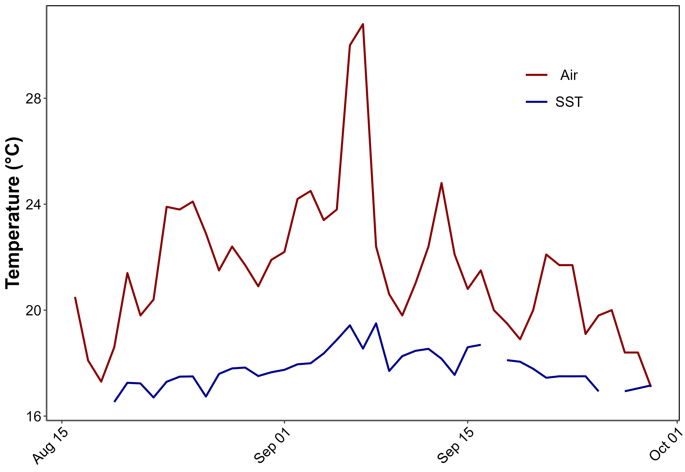{height="1000"}
:::
::: {.absolute .fragment .fade-in bottom="3%" right="-5%" fragment-index="6"}
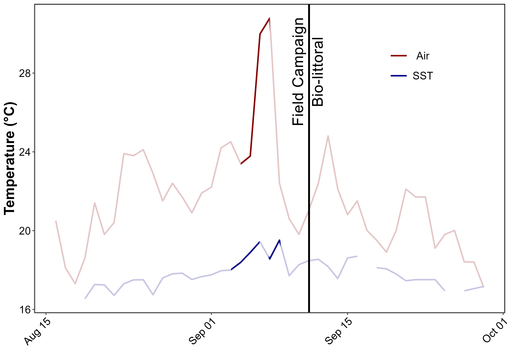{height="1000"}
:::

## What's in the litterature ?

::: {.absolute style="top: 0%; left: 95%; width: 1800px;"}
::: sectionhead
1 [2 3 4 5]{style="opacity:0.25;"}
:::
:::

::: {.absolute .fragment .fade-in top="10%" left="0%" fragment-index="1"}
{height="200"}
:::

::: {.absolute .fragment .fade-in top="30%" left="0%" fragment-index="1"}
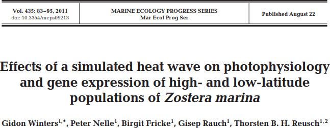{height="200"}
:::

::: {.absolute .fragment .fade-in top="50%" left="0%" fragment-index="1"}
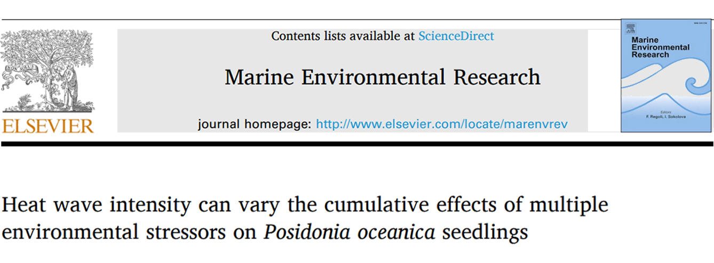{height="200"}
:::

::: {.absolute .fragment .fade-in top="70%" left="0%" fragment-index="1"}
{height="200"}
:::


::: {.absolute .fragment .fade-in fragment-index="1" top="10%" left="30%" style="font-size: 50px;"}
On subtidal *Zostera marina* and *Cymodosea nodosa*: 
:::

::: {.absolute .fragment .fade-in-then-out fragment-index="2" width="1200" top="15%" left="35%" style="font-size: 50px;"}
- Highly vulnerable to elevated sea temperatures in winter and spring, leading to early flowering, high mortality, and reduced biomass.

:::

::: {.absolute .fragment .fade-in-then-out fragment-index="3" width="1200" top="15%" left="35%" style="font-size: 50px;"}
- Highly vulnerable to elevated sea temperatures in winter and spring, leading to early flowering, high mortality, and reduced biomass.
- Photosynthetic activity rises during HWs but diminishes during recovery, impairing performance and reducing leaf biomass.
:::

::: {.absolute .fragment .fade-in-then-out fragment-index="4" width="1200" top="15%" left="35%" style="font-size: 50px;"}
- Highly vulnerable to elevated sea temperatures in winter and spring, leading to early flowering, high mortality, and reduced biomass.
- Photosynthetic activity rises during HWs but diminishes during recovery, impairing performance and reducing leaf biomass.
- Responses vary greatly between species...
:::

::: {.absolute .fragment .fade-in fragment-index="5" width="1200" top="15%" left="35%" style="font-size: 50px;"}
- Highly vulnerable to elevated sea temperatures in winter and spring, leading to early flowering, high mortality, and reduced biomass.
- Photosynthetic activity rises during HWs but diminishes during recovery, impairing performance and reducing leaf biomass.
- Responses vary greatly between species...
- ...and within a single species across latitudes.
:::

::: {.absolute .fragment .fade-in fragment-index="6" bottom="25%" left="30%" style="font-size: 75px;"}
What about *Zostera noltei* ?  
:::

::: {.absolute .fragment .fade-in fragment-index="7" bottom="15%" left="30%" style="font-size: 75px;"}
Impact on the reflectance ? 
:::

::: {.absolute .fragment .fade-in fragment-index="8" bottom="5%" left="30%" style="font-size: 75px;"}
Impact of Extreme Atmospheric temperature ? 
:::

## Extreme Temperature Events =  Heatwaves

::: {.absolute style="top: 0%; left: 95%; width: 1800px;"}
::: sectionhead
1 [2 3 4 5]{style="opacity:0.25;"}
:::
:::

::: {.absolute .fade-in top="10%" left="10%"}
{height="300"}
:::

::: {.absolute .fade-in top="10%" right="0%"}
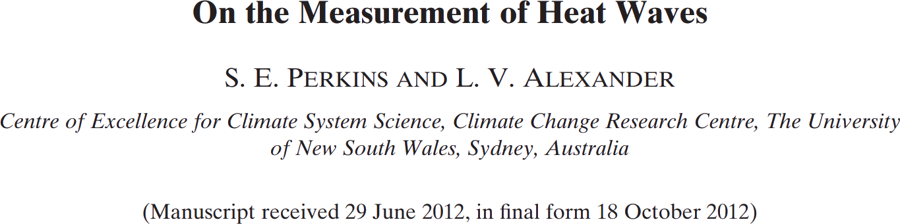{height="300"}
:::

::: {.absolute .fragment .fade-in-then-out fragment-index="1" top="36%" left="5%" style="font-size: 50px; text-align: center;"}
Defined as periods of three or more consecutive days where the daily maximum temperature (Tmax) exceeds the calendar-day 90th percentile based on at least 30 years
:::

::: {.absolute .fragment .fade-in-then-out fragment-index="2" top="36%" left="5%" style="font-size: 50px; text-align: center;"}
Defined as periods of three or more consecutive days where the daily maximum temperature (Tmax) exceeds the calendar-day 90th percentile based on at [least 30 years]{style="color: red;"}
:::

::: {.absolute .fragment .fade-in-then-out fragment-index="3" top="36%" left="5%" style="font-size: 50px; text-align: center;"}
Defined as periods of three or more consecutive days where the daily maximum temperature (Tmax) exceeds the [calendar-day 90th percentile]{style="color: red;"} based on at least 30 years
:::

::: {.absolute .fragment .fade-in-then-out fragment-index="4" top="36%" left="5%" style="font-size: 50px; text-align: center;"}
Defined as periods of three or more consecutive days where the [daily maximum temperature (Tmax)]{style="color: red;"} exceeds the calendar-day 90th percentile based on at least 30 years
:::

::: {.absolute .fragment .fade-in fragment-index="5" top="36%" left="5%" style="font-size: 50px; text-align: center;"}
Defined as periods of [three or more consecutive days]{style="color: red;"} where the daily maximum temperature (Tmax) exceeds the calendar-day 90th percentile based on at least 30 years
:::


::: {.absolute .fragment .fade-in-then-out bottom="0%" left="5%" fragment-index="2"}
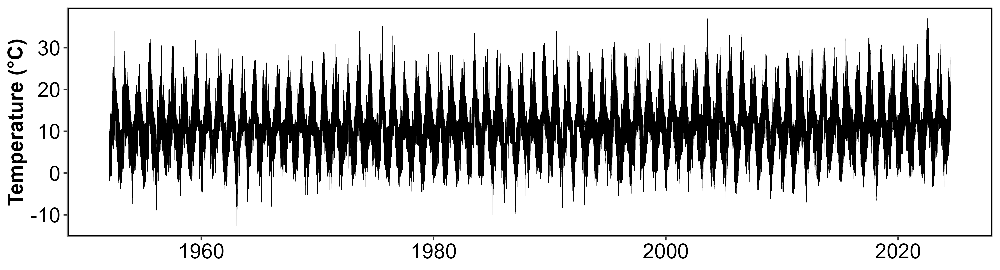{height="600"}
:::

::: {.absolute .fragment .fade-in-then-out bottom="0%" left="5%" fragment-index="3"}
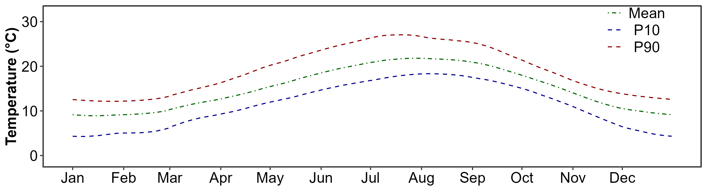{height="600"}
:::

::: {.absolute .fragment .fade-in-then-out bottom="0%" left="5%" fragment-index="4"}
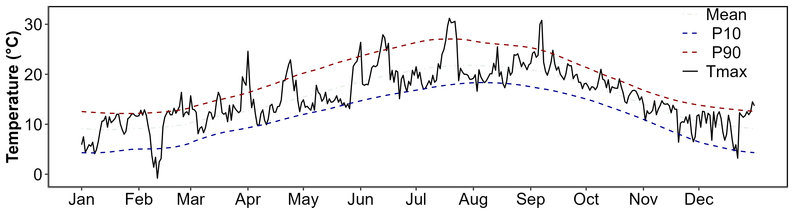{height="600"}
:::

::: {.absolute .fragment .fade-in bottom="0%" left="5%" fragment-index="5"}
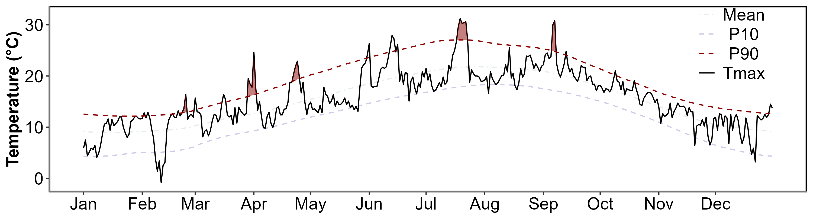{height="600"}
:::


```{r Air_processing1}
#| cache: false
#| echo: false
#| eval: false
#| warning: false

library(sf)

df <- list.files("Data/MeteoFrance/RAW/",pattern = "HOR_departement_56_*", full.names = TRUE) %>% 
  map(read.delim,
      sep = ";",
      .progress = TRUE) %>%
  list_rbind() %>% 
  dplyr::select(NOM_USUEL, LAT,LON,AAAAMMJJHH,`T`, TN, TX, T10, T20, T50,T100) %>% 
  dplyr::filter(!is.na(`T`)) 

station <- df %>% 
  group_by(NOM_USUEL) %>% 
  reframe(Lat = unique(LAT),
          Lon = unique(LON),
          n_obs = n())

sovereignty10 <- rnaturalearth::ne_countries(scale = 10, returnclass = "sf")

France_shp <- sovereignty10 %>% 
  st_as_sf() %>% 
  dplyr::filter(sovereignt%in%c("France")) 


bbox_france <- st_bbox(c(xmin = min(station$Lon),
                         ymin = min(station$Lat),
                         xmax = max(station$Lon),
                         ymax = max(station$Lat)),
                       crs = st_crs(France_shp)) 

France_map_cropped <- France_shp %>% 
  st_crop(bbox_france) %>%
  st_make_valid()
  

station_shp <- station %>% 
  st_as_sf(coords=c("Lon","Lat") )  %>% 
  st_set_crs("EPSG:4326") 

# ggplot() +
#   geom_sf(data = France_map_cropped,linewidth=0.5,alpha=0.93,
#           fill="#CFCFCF",colour="grey30")+
#   ggforce::geom_mark_ellipse(data=station,
#                  aes(x=Lon,
#                      y=Lat,
#                      label = paste("n: ", n_obs),
#                      description=NOM_USUEL) ,
#                  linewidth=0.2,
#                  fill="goldenrod",
#                  show.legend=F,
#                  label.hjust = 0.2,
#                  con.size = 1,
#                  con.colour = "goldenrod4",
#                  label.fontsize = c(10,12),
#                  alpha=0.8,
#   expand = unit(1, "mm") , 
#   radius = unit(1, "mm") , 
#   label.buffer = unit(1, "mm") ,
#   label.fill = "grey90")
#   
df_56 <- df %>% 
  dplyr::filter(str_detect(NOM_USUEL,"BIHOUE"),
                !is.na(`T`)) %>% 
  dplyr::select(NOM_USUEL, LAT,LON,,AAAAMMJJHH,`T`, TN, TX, T10, T20, T50,T100) %>% 
  mutate(date = as.POSIXct(as.character(AAAAMMJJHH), format = "%Y%m%d%H",tz = "UTC"))


plot_timeserie <- ggplot(df_56)+
  geom_line(aes(x = date, y = `T`), linewidth = 0.1)+
  theme_Bede() +
  ylab("Temperature (°C)")+
  theme(axis.title.x = element_blank(),
        legend.title = element_blank(),
        legend.position = c(0.8,0.8), 
        axis.text.x = element_text(size = 15),
        axis.text.y = element_text(size = 15),
        axis.title.y = element_text(size = 15),
        legend.text = element_text(size = 15),
        legend.key.size = unit(1,"cm"))

ggsave("Slides/Images/plot_temp_timeserie.png", plot_timeserie, height = 2.70, width = 10)

df_heatwaveR_air <- df_56 %>% 
  rename(t = date,
         temp = `T`) %>% 
  dplyr::select(t,temp) %>% 
  mutate(t = as.Date(t)) %>% 
  group_by(t) %>% 
  reframe(temp = max(temp,na.rm = T))


clim_cold <- ts2clm(df_heatwaveR_air, climatologyPeriod = c(min(df_heatwaveR_air$t), max(df_heatwaveR_air$t)),pctile = 10,
)

mhw_Air_cold <- detect_event(clim_cold, minDuration = 2)$clim %>% 
  dplyr::filter(t >= as.Date("2021-01-01"),
                t <= as.Date("2021-12-31"))

clim <- ts2clm(df_heatwaveR_air, climatologyPeriod = c(min(df_heatwaveR_air$t), max(df_heatwaveR_air$t)))
  
event <- detect_event(clim,categories = T,minDuration = 2)
  
res <- detect_event(clim, minDuration = 2)
mhw_Air<- res$clim


coltab <- c("Mean" = "darkgreen", "P90" = "darkred", "P10" = "darkblue", "Tmax" = "black")
shapetab <- c("P90" = "dashed")


df_flame <- mhw_Air  %>% 
  dplyr::filter((t >= as.Date("2021-02-20") & t <= as.Date("2021-02-25")) |
                (t >= as.Date("2021-03-28") & t <= as.Date("2021-04-03")) |
                (t >= as.Date("2021-03-28") & t <= as.Date("2021-04-03")) |
                (t >= as.Date("2021-04-21") & t <= as.Date("2021-04-26")) |
                (t >= as.Date("2021-06-11") & t <= as.Date("2021-05-14")) |
                (t >= as.Date("2021-07-17") & t <= as.Date("2021-07-25")) |
                (t >= as.Date("2021-09-05") & t <= as.Date("2021-09-08")))
  

(mean_temp <- mhw_Air %>% 
  dplyr::filter(t >= as.Date("2021-01-01"),
                t <= as.Date("2021-12-31")) %>% 
  ggplot()+
  geom_line(aes(x = t, y = seas, color = "Mean"), linetype = "dotdash", alpha = 0.1)+
  geom_line(aes(x = t, y = temp, color = "Tmax"))+
  geom_line(aes(x = t, y = thresh, color = "P90"), linetype = "dashed")+
  geom_line(data = mhw_Air_cold, aes(x = t, y = thresh, color = "P10"), linetype = "dashed",, alpha = 0.2)+

  ylim(c(-1,32))+
  scale_color_manual(values = coltab)+
  heatwaveR::geom_flame(data  = df_flame,
    aes(x = t, y = temp, y2 = thresh),
    fill = "darkred",
    alpha = 0.5
  )+
  theme_Bede() +
  ylab("Temperature (°C)")+
  theme(axis.title.x = element_blank(),
        legend.title = element_blank(),
        legend.position = c(0.9,0.849-0.051), 
        axis.text.x = element_text(size = 15),
        axis.text.y = element_text(size = 15),
        axis.title.y = element_text(size = 15),
        legend.text = element_text(size = 15))+
  scale_x_date(date_labels = "%b", breaks = c(as.Date("2021-01-01"),
                                                               as.Date("2021-02-01"),
                                                               as.Date("2021-03-01"),
                                                               as.Date("2021-04-01"),
                                                               as.Date("2021-05-01"),
                                                               as.Date("2021-06-01"),
                                                               as.Date("2021-07-01"),
                                                               as.Date("2021-08-01"),
                                                               as.Date("2021-09-01"),
                                                               as.Date("2021-10-01"),
                                                               as.Date("2021-11-01"),
                                                               as.Date("2021-12-01"))))


(mean_temp <- mhw_Air %>% 
  dplyr::filter(t >= as.Date("2021-01-01"),
                t <= as.Date("2021-12-31")) %>% 
  ggplot()+
  # geom_line(aes(x = t, y = seas, color = "Mean"), linetype = "dotdash", alpha = 0.1)+
  geom_line(aes(x = t, y = temp, color = "Tmax"))+
  geom_line(aes(x = t, y = thresh, color = "P90"), linetype = "dashed")+
  # geom_line(data = mhw_Air_cold, aes(x = t, y = thresh, color = "P10"), linetype = "dashed",, alpha = 0.2)+

  ylim(c(15,32))+
  scale_color_manual(values = coltab)+
  heatwaveR::geom_flame(data  = df_flame,
    aes(x = t, y = temp, y2 = thresh),
    fill = "darkred",
    alpha = 0.5
  )+
  theme_Bede() +
  ylab("Temperature (°C)")+
  theme(axis.title.x = element_blank(),
        legend.title = element_blank(),
        legend.position = c(0.9,0.849-0.051), 
        axis.text.x = element_text(size = 15),
        axis.text.y = element_text(size = 15),
        axis.title.y = element_text(size = 15),
        legend.text = element_text(size = 15)
        )+
  xlim(c(as.Date("2021-08-15"), as.Date("2021-10-15")))+
  geom_vline(xintercept = as.Date("2021-09-01"), linewidth = 2, linetype = "dashed")+
    geom_text(mapping = aes(x = as.Date("2021-08-31"), y = 28, label = "Before"), angle = 90, size =5)+
  geom_vline(xintercept = as.Date("2021-09-07"), linewidth = 2, linetype = "dashed")+
    geom_text(mapping = aes(x = as.Date("2021-09-08"), y = 28, label = "During"), angle = 90, size =5) +
  geom_vline(xintercept = as.Date("2021-10-08"), linewidth = 2, linetype = "dashed")+
    geom_text(mapping = aes(x = as.Date("2021-10-07"), y = 28, label = "After"), angle = 90, size =5) 
  )


ggsave("Slides/Images/plot_Temp_Quiberon4.png", mean_temp, height = 3, width = 10)

# img_before <- readPNG("Data/screenshot_S2/Before_event_quiberon.png") %>%
  # rasterGrob(interpolate=TRUE)

```

## Hypothesis & Objectives

::: {.absolute style="top: 0%; left: 95%; width: 1800px;"}
::: sectionhead
1 [2 3 4 5]{style="opacity:0.25;"}
:::
:::


::: {.absolute .fragment .fade-in fragment-index="1" top="10%" style="font-size: 75px;"}
Heatwaves alter the spectral reflectance of *Zostera noltei* seagrass. This change can be detected using remote sensing technique. 
:::

::: {.absolute .incremental .fragment .fade-in fragment-index="2" top="28%" style="font-size: 75px;"}
- Evaluate the direct impact of heatwave-induced **thermal stress** on the reflectance of *Zostera noltei* through **controlled experiments**.
- Develop a **spectral indice** for detecting stress-induced changes in seagrass coloration. 
- To apply findings from experimental reflectance changes to **satellite-based** remote sensing, assessing the spatial extent and temporal dynamics of an heatwave event that occurs in September 2021, in Quiberon, on seagrass meadows.
:::

# Materials & Methods

::: {.absolute top="-50%" left="50%" style="font-size: 75px; color: #3B2F2F;"}
- Experiment in the Lab

- *in situ* Satellite Mapping
:::

## Experiment in the Lab


::: {.absolute style="top: 0%; left: 95%; width: 1800px;"}
::: sectionhead
[1]{style="opacity:0.25;"} 2 [3 4 5]{style="opacity:0.25;"}
:::
:::

### The Benthic Chambers
::: {.absolute  top="16%" left="0%" style="font-size: 40px;"}
*Intertidal chambers from ElectricBlue*
:::

::: {.absolute .fragment .fade-out fragment-index="1" top="20%" left="0%"}
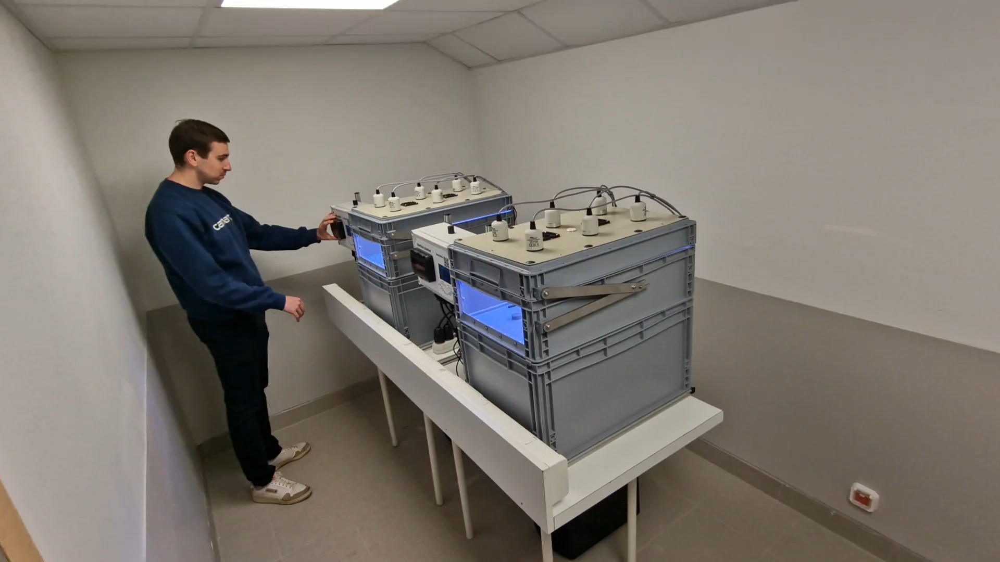{height="700"}
:::

::: {.absolute .fragment .fade-out fragment-index="1" top="20%" right="0%"}
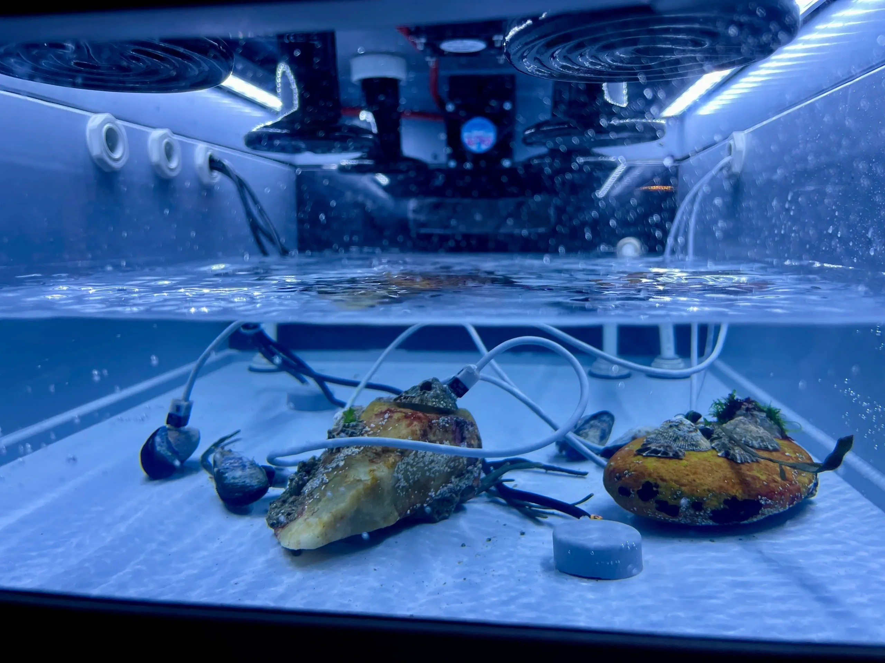{height="850"}
:::

::: {.absolute .fragment .fade-in-then-out fragment-index="1" top="20%" left="0%"}
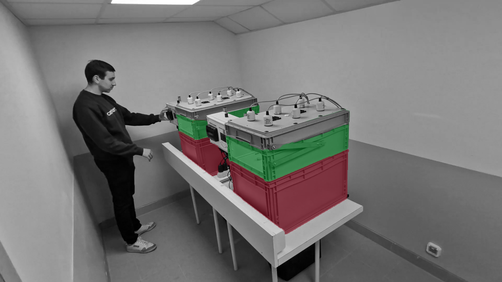{height="700"}
:::

::: {.absolute .fragment .fade-in-then-out fragment-index="1" top="40%" left="60%" style="font-size: 80px; color: rgba(54, 128, 74,1);"}
Experiment Tank
:::

::: {.absolute .fragment .fade-in-then-out fragment-index="1" top="50%" left="60%" style="font-size: 80px; color: rgba(125, 52, 64,1);"}
Storage Tank
:::


  <div class="absolute fragment fade-in" data-fragment-index="2" style="top: 20%; left: 0%; ">
  <video id="droneVideo" muted autoplay height="700">
    <source src="Videos/Benthic_Chamber.mp4" type="video/mp4">
    Your browser does not support the video tag.
  </video>
  </div>


::: {.absolute .fragment .fade-in-then-out fragment-index="2" top="30%" left="55%" style="font-size: 60px;"}
- Air Temperature : from 18 to 60°C
- Water Temperature : from 8°C to 55°C
- Programmable tides
- Programmable lights
:::

::: {.absolute .fragment .fade-in-then-out fragment-index="3" top="10%" left="55%"}
{height="1000"}
:::

::: {.absolute .fragment .fade-in-then-out fragment-index="3" top="30%" left="75%" style="font-size: 60px;"}
Measure variation of seagrass leaves reflectance over time. 
:::

::: {.absolute .fragment .fade-in-then-out fragment-index="3" top="10%" left="75%"}
{height="150"}
:::


::: {.absolute .fragment .fade-in fragment-index="4" top="15%" left="55%"}
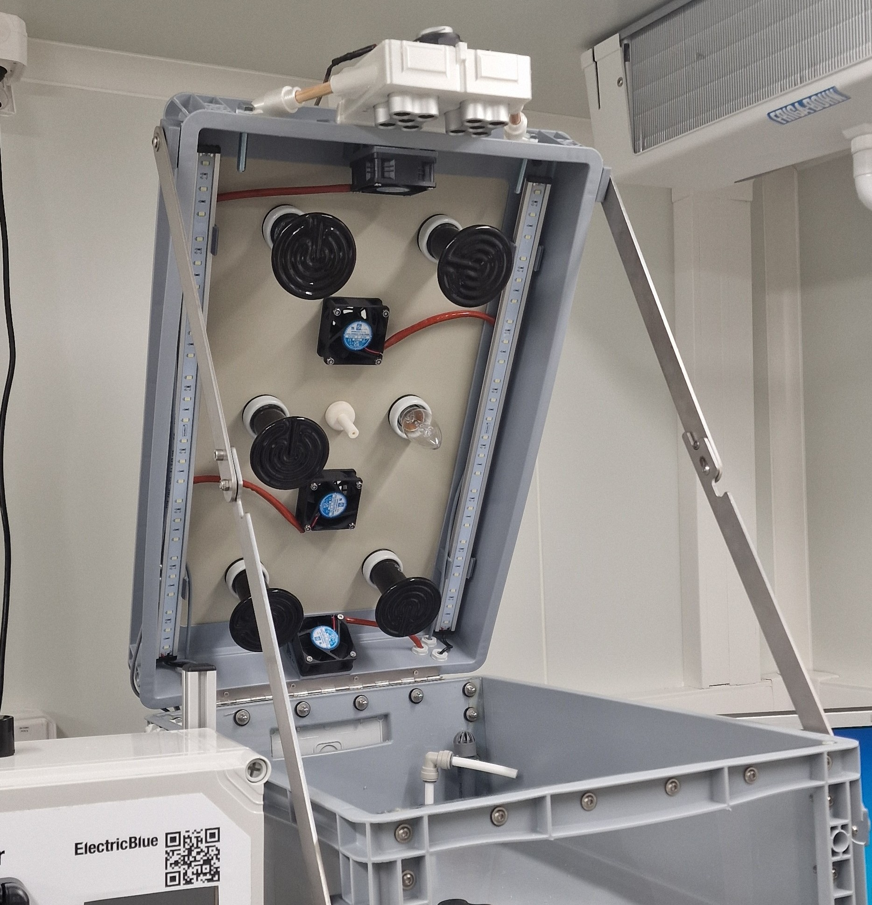{height="1000"}
:::


## Experiment in the Lab
### Sampling & Experimental design 

::: {.absolute style="top: 0%; left: 95%; width: 1800px;"}
::: sectionhead
[1]{style="opacity:0.25;"} 2 [3 4 5]{style="opacity:0.25;"}
:::
:::

::: {.fragment .fade-out fragment-index="5"}
::: {.absolute top="16%" left="0%" style="font-size: 40px;"}
*Seagrasses inside of a chamber*
:::


 <div class="absolute" style="top: 20%; left: 0%; ">
 <video id="droneSeagrasses" muted autoplay height="700">
   <source src="Videos/Seagrass_inside_chambers2.mp4" type="video/mp4">
   Your browser does not support the video tag.
 </video>
 </div>
 
::: {.fragment .fade-out fragment-index="4"}
::: {.absolute .fragment .fade-out fragment-index="2" top="10%" left="55%"}
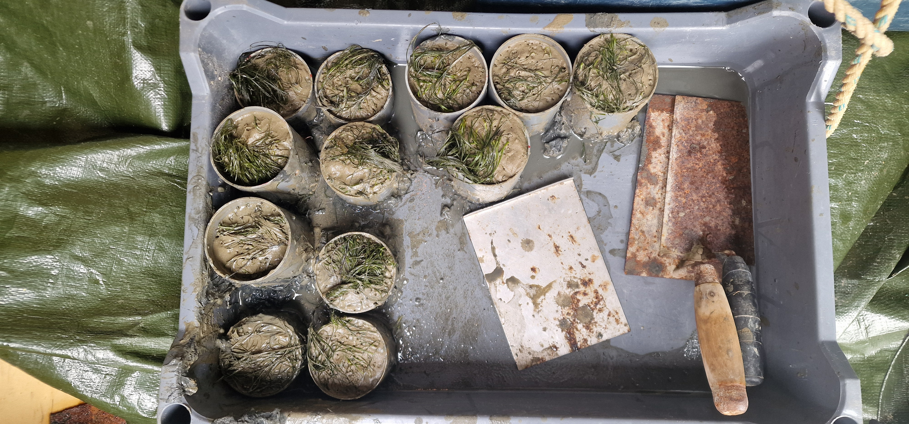{height="1000"}
:::

::: {.absolute .fragment .fade-in-then-out fragment-index="1" top="10%" left="75%"}
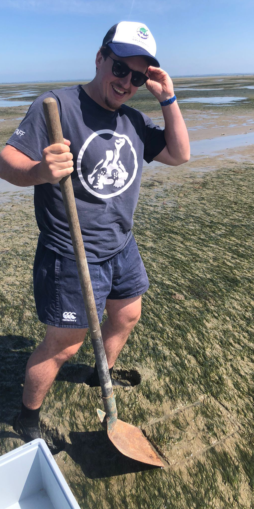{height="1000"}
:::

::: {.absolute .fragment .fade-in-then-out fragment-index="2" top="10%" left="55%"}
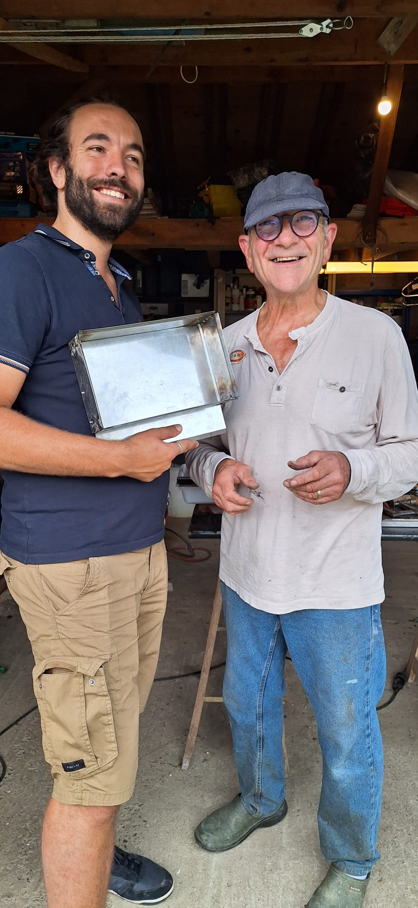{height="1000"}
:::

::: {.absolute .fragment .fade-in-then-out fragment-index="2" top="10%" left="75%"}
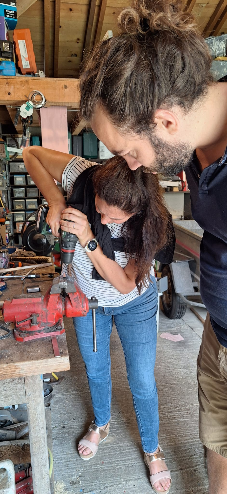{height="1000"}
:::


 <div class="absolute fragment fade-in" data-fragment-index="3" style="top: 5%; left: 55%; ">
 <video id="SamplingBox" muted autoplay height="1300">
   <source src="Videos/SamplingBox.mp4" type="video/mp4">
   Your browser does not support the video tag.
 </video>
 </div>
 
:::


::: {.rotate-img2 .fragment .fade-in fragment-index="4" .absolute top="30%" left="50%"}
{width="250"}
:::

::: {.rotate-img1 .fragment .fade-in fragment-index="4" .absolute top="56%" left="50%"}
{width="250"}
:::

::: {.fragment .fade-in fragment-index="4" .absolute top="11%" right="0%"}
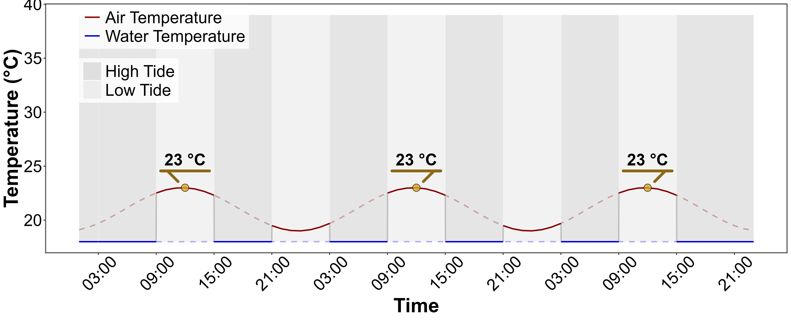{width="1000"}
:::

::: {.absolute .fragment .fade-in fragment-index="4" top="5%" left="75%" style="font-size: 60px;"}
Control
:::

::: {.absolute .fragment .fade-in fragment-index="4" top="50%" left="75%" style="font-size: 60px;"}
Treatment
:::


::: {.fragment .fade-in fragment-index="4" .absolute bottom="11%" right="0%"}
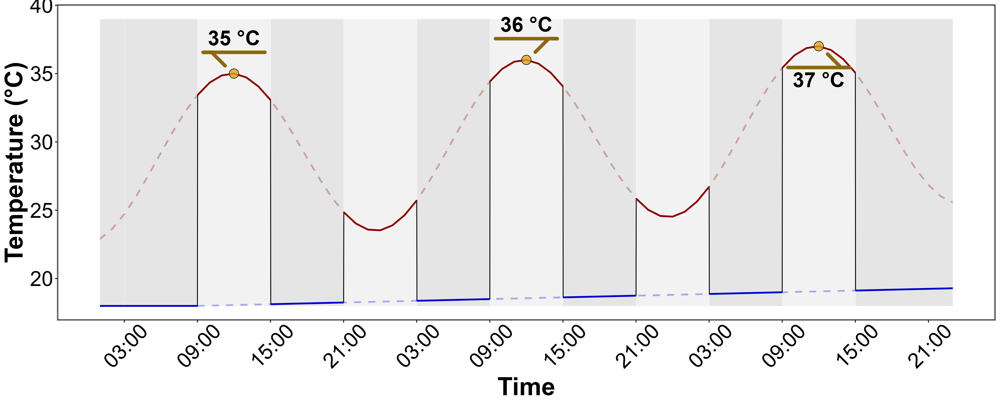{width="1000" id="profile-image"}
:::
:::

::: {.fragment .fade-out fragment-index="6" .absolute top="15%"}
::: {.fragment .scale-up fragment-index="5" style="transform-origin:bottom right"}
{width="2400"}
:::
:::

::: {.fragment .fade-out fragment-index="8"}
::: {.fragment .fade-in fragment-index="6" .absolute top="15%" .absolute bottom="11%" left="0%"}
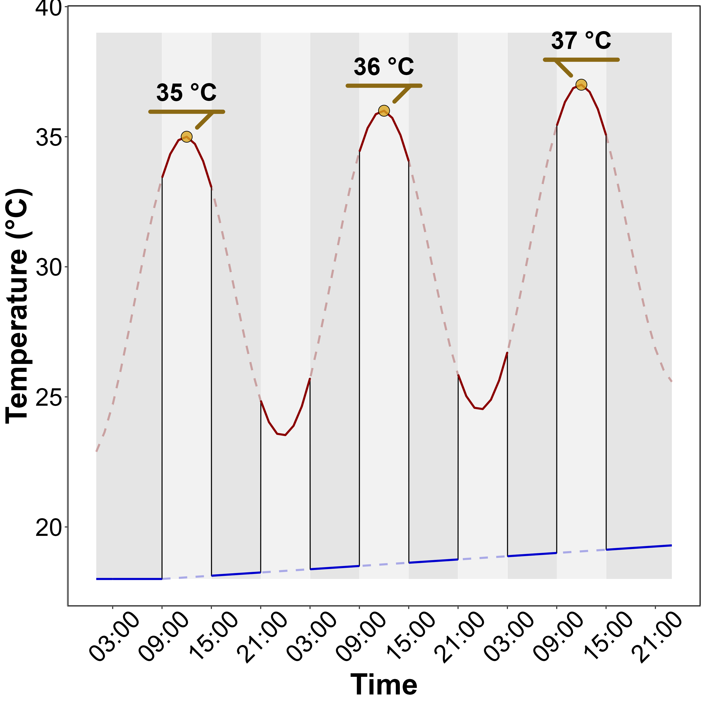{width="1000"}
:::

::: {.fragment .fade-in fragment-index="6" .absolute top="15%" right="0%"}
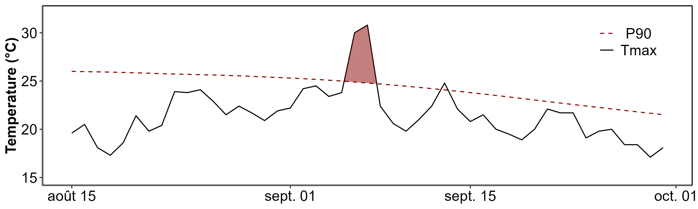{width="1300"}
:::

::: {.fragment .fade-in fragment-index="7" .absolute bottom="0%" right="0%"}
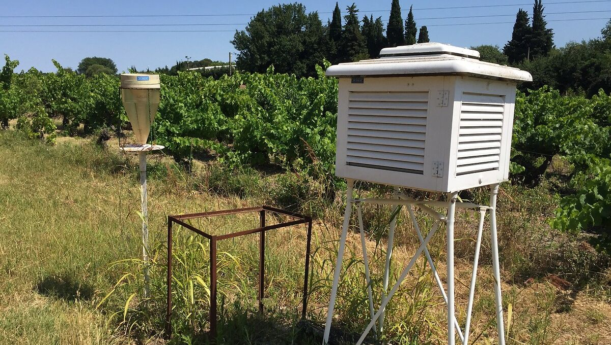{width="1300"}
:::


::: {.absolute .fragment .fade-in fragment-index="7" top="45%" left="46.5%" style="font-size: 40px; text-align: center;"}
[Meteo France Weather Station]{style="color: white;"}
:::


::: {.fragment .fade-in fragment-index="7" .absolute bottom="0%" right="0%"}
{width="1300"}
:::
:::

::: {.fragment .fade-in-then-out fragment-index="8" .absolute bottom="0%" left="10%"}
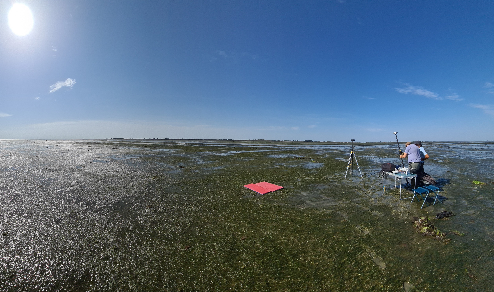{width="85%"}
:::

::: {.fragment .fade-in-then-out fragment-index="9" .absolute top="20%" left="15%"}
{width="500"}
:::

::: {.absolute .fragment .fade-in-then-out fragment-index="9" top="22%" left="10%" style="font-size: 40px; text-align: center;"}
*EnvLogger system from ElectricBlue*
:::

::: {.fragment .fade-in-then-out fragment-index="9" .absolute top="10%" right="0%"}
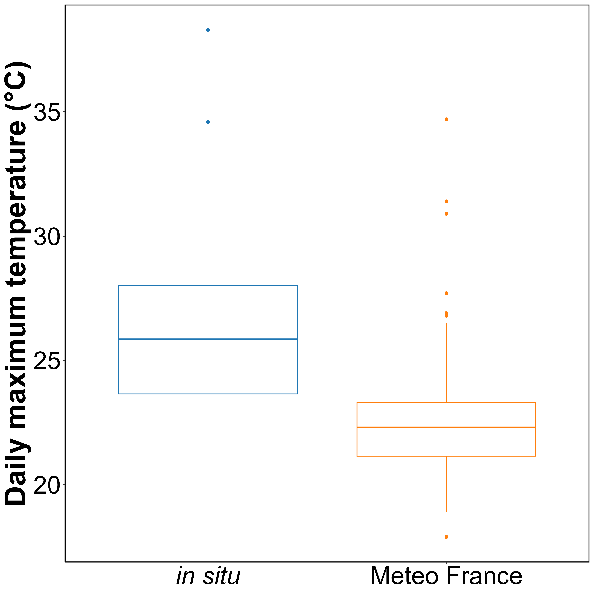{width="1200"}
:::

::: {.absolute .fragment .fade-in fragment-index="10" top="15%" left="0%" style="font-size: 60px;"}
During the experiment : 

- **Leaves sampling** : 
  - triplicate at the beginning and the end of each day of experiment
  - HPLC pigment concentration
  
- **Hyperspectral measurement**: 
  - In continuous at low tide
:::

::: {.fragment .fade-in fragment-index="10" .absolute top="10%" left="80%"}
{width="300"}
:::

::: {.fragment .fade-in fragment-index="10" .absolute top="70%" left="70%"}
{width="500"}
:::

::: {.fragment .fade-in fragment-index="10" .absolute top="60%" left="40%"}
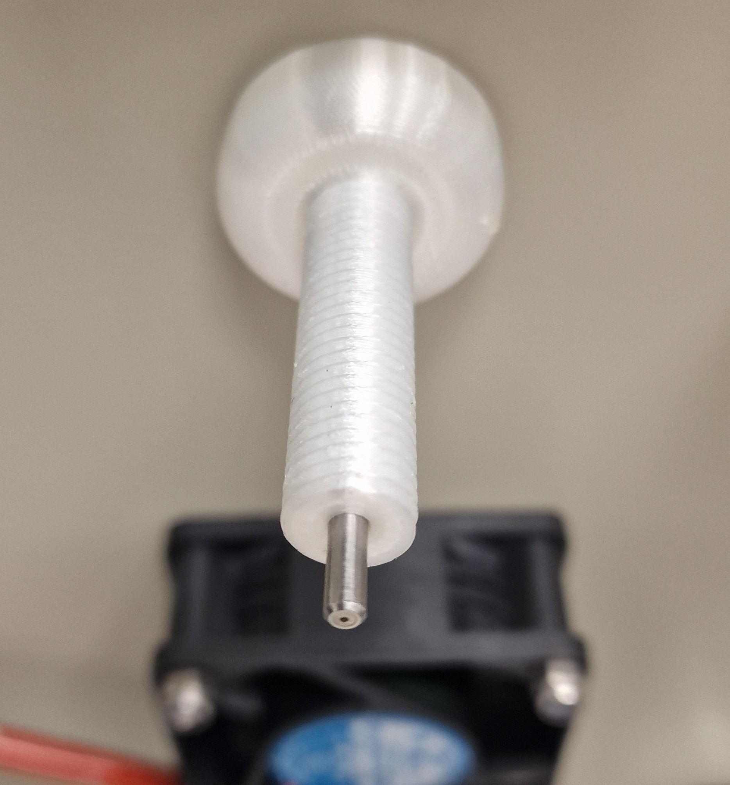{width="500"}
:::


## *in situ* Satellite mapping

::: {.absolute style="top: 0%; left: 95%; width: 1800px;"}
::: sectionhead
[1]{style="opacity:0.25;"} 2 [3 4 5]{style="opacity:0.25;"}
:::
:::

::: {.fragment .fade-in-then-out fragment-index="1" .absolute top="5%" left="0%"}
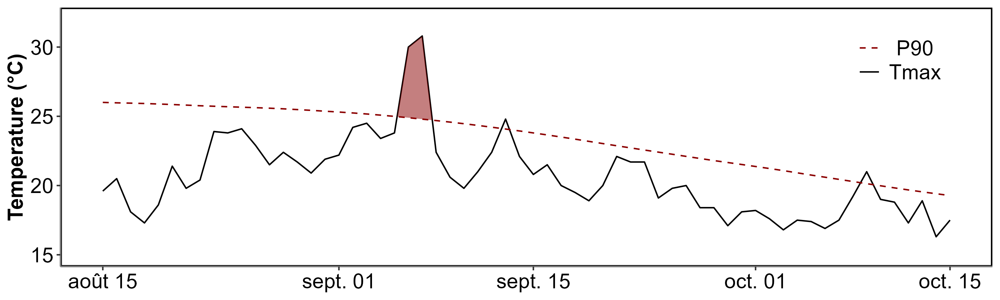{width="1400"}
:::

::: {.fragment .fade-out fragment-index="5"}

::: {.fragment .fade-in fragment-index="1" style="text-align: center; position: absolute; left: 80%; top: 20%; width: 800px; transform: translate(-50%, -50%)"}
Atmospheric heatwave between the 4th of September 2021 and the 7th of September 2021 in Quiberon
:::

```{r leaflet maps Quiberon}
#| echo: false
#| eval: false
#| warning: false
#| fig-width: 10
#| fig-height: 10

library(htmlwidgets)
library(leaflet)
library(tidyverse)

Projects<-data.frame(
  Name=c("Plouharnel"),
  Lat = c(47.585714),
   Long = c(-3.121394)) %>% 
  sf::st_as_sf(coords=c("Long","Lat") )  %>% 
  sf::st_set_crs("EPSG:4326")  

# custom_icon <- makeIcon(
#   iconUrl = "Images/drone_icon.png",
#   iconWidth = 40, # Adjust the width to fit your needs
#   iconHeight = 40 # Adjust the height to fit your needs
# )

m <- leaflet() %>% setView(lng =-3.121394, lat = 47.585714, zoom = 13) %>% 
  addTiles() %>% 
  addProviderTiles(provider = providers$Esri.WorldImagery) %>% 
  leaflet::addMarkers(data = Projects) %>% 
  addLabelOnlyMarkers(data = Projects,
    label = ~Name
  )

m <- htmlwidgets::onRender(
  m,
  '
  function(el, x) {
    var map = this;

    function toggleLabels() {
      var zoomLevel = map.getZoom();
      map.eachLayer(function(layer) {
        if (layer.getElement && layer.getTooltip && layer.getTooltip()) {
          var labelElement = layer.getTooltip().getElement();
          if (zoomLevel < 10) {
            labelElement.style.display = "none";
          } else {
            labelElement.style.display = "block";
          }
        }
      });
    }

    // Initially toggle labels based on the starting zoom level
    toggleLabels();

    // Toggle labels on zoom end
    map.on("zoomend", function() {
      toggleLabels();
    });
  }
  '
)

saveWidget(m, "Slides/maps/map_Quiberon_presentation.html", selfcontained = TRUE)

# Print the map
```

::: {.absolute .fragment .fade-in fragment-index="1" left="0%" top="40%"}
```{=html}
<iframe width="1400" height="800" src="maps/map_Quiberon_presentation.html" title="Webpage example"></iframe>
```
:::

::: {.fragment .fade-in-then-out fragment-index="2" .absolute top="5%" left="0%"}
{width="1400"}
:::

::: {.fragment .fade-in-then-out fragment-index="3" .absolute top="5%" left="0%"}
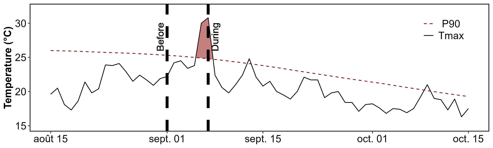{width="1400"}
:::

::: {.fragment .fade-in-then-out fragment-index="4" .absolute top="5%" left="0%"}
{width="1400"}
:::

::: {.fragment .fade-in fragment-index="2" .absolute top="35%" left="65%"}
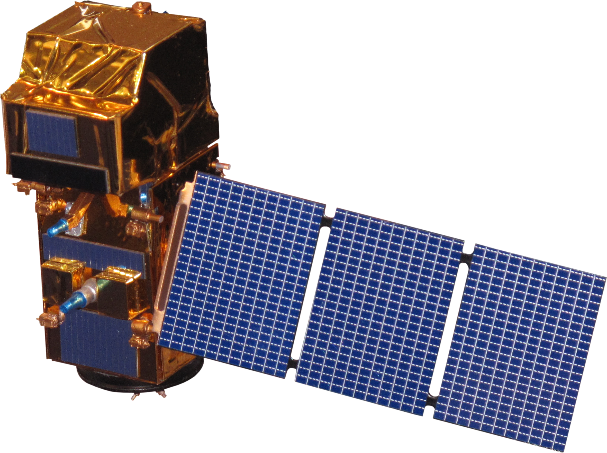{width="500"}
:::

::: {.absolute .fragment .fade-in-then-out fragment-index="2" top="70%" left="60%" style="font-size: 50px;"}
3 Sentinel-2 images, level L2A, Low Tide:

- **Before**: 1st of September 2021
:::

::: {.absolute .fragment .fade-in-then-out fragment-index="3" top="70%" left="60%" style="font-size: 50px;"}
3 Sentinel-2 images, level L2A, Low Tide:

- **Before**: 1st of September 2021

- **During**: 6th of September 2021
:::

::: {.absolute .fragment .fade-in fragment-index="4" top="70%" left="60%" style="font-size: 50px;"}
3 Sentinel-2 images, level L2A, Low Tide:

- **Before**: 1st of September 2021

- **During**: 6th of September 2021

- **After**: 8th of October 2021
:::
:::

::: {.absolute .fragment .fade-in-then-out fragment-index="5" top="15%" left="0%" style="text-align: right; font-size: 70px;"}
- Well established radiometric Indices:

:::

::: {.absolute .fragment .fade-in-then-out fragment-index="5" top="30%" left="10%" style="text-align: right; font-size: 50px;"}

$$NDVI = \frac{R(NIR)-R(Red)}{R(NIR)+R(Red)}$$
:::
::: {.absolute .fragment .fade-in-then-out fragment-index="5" top="50%" left="10%" style="text-align: right; font-size: 50px;"}

$$GLI = \frac{[R(Green)-R(Red)]+[R(Green)-R(Blue)]}{(2 \times R(Green) )+ R(Red) + R(Blue) }$$
:::


::: {.absolute .fragment .fade-in-then-out fragment-index="6" top="15%" left="0%" style="text-align: right; font-size: 70px;"}
- Introduction of the Seagrass Heat Shock Index (SHSI):
:::

::: {.absolute .fragment .fade-in-then-out fragment-index="6" top="30%" left="0%" style="text-align: left; font-size: 50px;"}

$$
\text{SHSI} = I_{SHSI} - R(740)
$$
:::
::: {.absolute .fragment .fade-in-then-out fragment-index="6" top="50%" left="0%" style="text-align: left; font-size: 50px;"}

$$
I_{SHSI} = R(560) + \tau    [R(842) - R(560)]
$$
:::
::: {.absolute .fragment .fade-in-then-out fragment-index="6" top="70%" left="0%" style="text-align: left; font-size: 50px;"}

$$
\tau = \frac{740 - 560}{842 - 560}
$$
:::


::: {.fragment .fade-in-then-out fragment-index="6" .absolute top="30%" right="0%"}
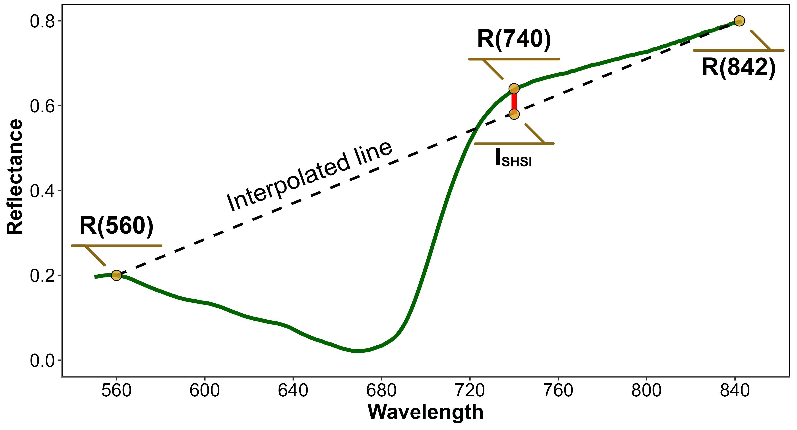{width="1450"}
:::


::: {.absolute .fragment .fade-in fragment-index="7" top="10%" left="0%" style="text-align: right; font-size: 70px;"}
- Litto3D product
:::

::: {.absolute .fragment .fade-in fragment-index="7" top="20%" left="0%" style="text-align: right; font-size: 60px;"}
detailed 3D coastal and nearshore mapping
:::

::: {.fragment .fade-out fragment-index="10"}
::: {.absolute .fragment .fade-in fragment-index="7" left="0%" top="30%"}
```{r LeafletLitto3D}
#| cache: false
#| echo: false
#| eval: true
#| warning: false
#| out-width: "1100px"
#| out-height: "800px"

library(tidyverse)
library(leaflet)
library(sf)
library(leafem)
library(leaflet.extras2)
library(terra)

Quiberon_Litto3D <- "../Data/Litto3D/Litto_10m_merged_32630.tif" %>% 
  rast() %>% 
  project(crs("EPSG:4326"))

pal2 <- colorNumeric("viridis", domain = values(Quiberon_Litto3D),na.color = "transparent")

(plot <- leaflet() %>%   
  # addTiles() %>% 
  setView(lng =-3.121394, lat = 47.585714, zoom = 14) %>% 
  addMapPane("right", zIndex = 0) %>%
  addMapPane("left", zIndex = 0) %>%
  # addProviderTiles(provider = providers$Esri.WorldImagery) %>% 
    # addProviderTiles(providers$CartoDB, group="carto", layerId = "RGBid", options = pathOptions(pane = "left")) %>% 
  # addProviderTiles(providers$CartoDB, group="carto", layerId = "DSMid", options = pathOptions(pane = "right")) %>% 
  addProviderTiles(providers$Esri.WorldImagery,
                     group = "Toner",
                     options = c(providerTileOptions(minZoom = 8, maxZoom = 100),
                                 pathOptions(pane = "left")),
                     layerId = "RGB"
                     ) %>%
  addProviderTiles(providers$OpenStreetMap,
                     group = "Toner",
                     options = c(providerTileOptions(minZoom = 8, maxZoom = 100),
                                 pathOptions(pane = "right")),
                     layerId = "DSM_pred") %>%
  addRasterImage(Quiberon_Litto3D,
                       colors=pal2,
                       # maxBytes = 200,
                       options = pathOptions(pane = "right"),
                       layerId = "DSM_pred") %>%
  leaflet.extras2::addSidebyside(leftId = "RGB",
                                  rightId = "DSM_pred")) %>%
  addLegend(pal = pal2, values = values(Quiberon_Litto3D),
    title = "Bathymetry (m)",
    group = "DSM_pred")

# htmlwidgets::saveWidget(plot, file="Slides/maps/map_Bathy_Quiberon.html", selfcontained = F)

```
:::
:::

::: {.fragment .fade-in-then-out fragment-index="8" .absolute top="25%" right="-5%"}
{width="1300"}
:::

::: {.fragment .fade-in-then-out fragment-index="9" .absolute top="25%" right="-5%"}
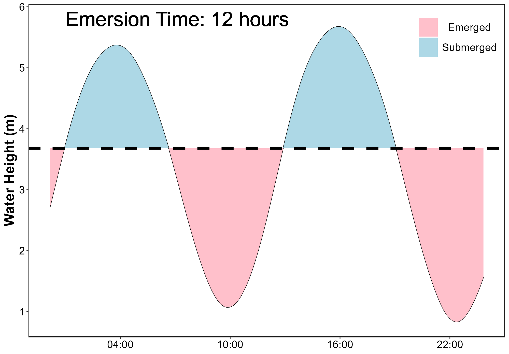{width="1300"}
:::

::: {.absolute .fragment .fade-in fragment-index="10" left="0%" top="30%"}
```{r LeafletEmersion}
#| cache: false
#| echo: false
#| eval: true
#| warning: false
#| out-width: "1100px"
#| out-height: "800px"

library(tidyverse)
library(leaflet)
library(sf)
library(leafem)
library(leaflet.extras2)
library(terra)

stk <- "../Data/Stack_all_variables.tif" %>% 
  rast() %>% 
  project(crs("EPSG:4326"))

EmersionTime <- (stk$emersion_time/60)/4


pal2 <- colorNumeric("magma", domain = c(10,16),na.color = "transparent")


(plot <- leaflet() %>%   
  # addTiles() %>% 
  setView(lng =-3.121394, lat = 47.585714, zoom = 14) %>% 
  addMapPane("right", zIndex = 0) %>%
  addMapPane("left", zIndex = 0) %>%
  # addProviderTiles(provider = providers$Esri.WorldImagery) %>% 
    # addProviderTiles(providers$CartoDB, group="carto", layerId = "RGBid", options = pathOptions(pane = "left")) %>% 
  # addProviderTiles(providers$CartoDB, group="carto", layerId = "DSMid", options = pathOptions(pane = "right")) %>% 
  addProviderTiles(providers$Esri.WorldImagery,
                     group = "Toner",
                     options = c(providerTileOptions(minZoom = 8, maxZoom = 100),
                                 pathOptions(pane = "left")),
                     layerId = "RGB"
                     ) %>%
  addProviderTiles(providers$OpenStreetMap,
                     group = "Toner",
                     options = c(providerTileOptions(minZoom = 8, maxZoom = 100),
                                 pathOptions(pane = "right")),
                     layerId = "DSM_pred") %>%
  addRasterImage(EmersionTime,
                       colors=pal2,
                       # maxBytes = 200,
                       options = pathOptions(pane = "right"),
                       layerId = "DSM_pred") %>%
  leaflet.extras2::addSidebyside(leftId = "RGB",
                                  rightId = "DSM_pred")) %>%
  addLegend(pal = pal2, values = c(10,16),
    title = "Emersion Time per Day (hours)",
    group = "DSM_pred")

# htmlwidgets::saveWidget(plot, file="Slides/maps/map_Bathy_Quiberon.html", selfcontained = F)

```
:::

```{r plottides}
#| cache: false
#| echo: false
#| eval: false
#| warning: false

library(tidyverse)
library(Utilities.Package)

df <- read.csv("Slides/Data/tide_df.csv") %>% 
  mutate(date = as.POSIXct(date))


tblcol = c("Emerged" = "pink", "Submerged" = "lightblue")


steps <- seq(1,5.5, by=0.01)
steps <- c(steps, seq(5.5,1, by=-0.01))

for(i in 1:(length(steps)-1)){
  
  print(paste0(i, "/",length(steps)-1))
  
  Height = steps[i]

  
  emersiontime_df <- df %>% 
    dplyr::filter(smooth <= Height) %>% 
    nrow()-1
  
  plot <- df  %>% 
    ggplot()+
    geom_line(aes(x = date, y = smooth ))+
    theme_Bede()+
    ylab("Water Height (m)")+
    
    heatwaveR::geom_flame(aes(x = date, y = smooth,y2 = Height,fill = "Submerged")
    )+
    heatwaveR::geom_flame(aes(x = date, y = Height , y2 = smooth,
      fill = "Emerged")
    )+
    geom_text(aes(x = as.POSIXct("2021-09-07 01:00:00"), y = 5.8, hjust = 0,label = paste0("Emersion Time: ", round((emersiontime_df*10)/60,2), " hours")), size = 10)+
    geom_hline(aes(yintercept = Height), linetype ="dashed", linewidth = 2) +
    scale_fill_manual(values = tblcol,
                      name = NULL)+
    theme(axis.text.x = element_text(size = 15),
          axis.text.y = element_text(size = 15),
          axis.title.x = element_blank(),
          axis.title.y = element_text(size = 20),
          legend.text = element_text(size = 15),
          legend.key.size = unit(1,"cm"),
          legend.position = c(0.9,0.9))+
  scale_x_datetime(
    date_labels = "%H:%M",    # Format for hours and minutes
    date_breaks = "6 hours"   # Breaks every 6 hours
  )

  ggsave(paste0("Slides/Data/EmersionPlot/plot_",i,".png"), plot,height =  6.97, width = 10, dpi = 200)
  
    # ggsave(paste0("Slides/Images/plot_waterHeight.png"), plot,height =  6.97, width = 10, dpi = 200)
}


#### Gif making

files <- fs::dir_ls("Slides/Data/EmersionPlot/",glob="*.png")

num <- as.numeric(str_extract(files, "\\d+"))
                  
frame <- tibble(files, num) %>% arrange(num)

gifski::gifski(frame$files, gif_file = "Slides/Images/Emersion_time.gif",
               delay = 0.00001, loop = TRUE, progress = TRUE,width=2000,height=1394)

  
```

::: {.fragment .fade-in fragment-index="10" .absolute top="25%" right="-5%"}
{width="1300"}
:::

# Results
## Heatwave Experiment

::: {.absolute style="top: 0%; left: 95%; width: 1800px;"}
::: sectionhead
[1 2]{style="opacity:0.25;"} 3 [4 5]{style="opacity:0.25;"}
:::
:::

::: {.absolute .fragment .fade-in-then-out fragment-index="1" top="10%" left="0%" style="text-align: right; font-size: 70px;"}
Spectral signature
:::

::: {.absolute .fragment .fade-in-then-out fragment-index="2" top="10%" left="0%" style="text-align: right; font-size: 70px;"}
SHSI design
:::

::: {.fragment .fade-in-then-out fragment-index="1" .absolute top="10%" left="0%"}
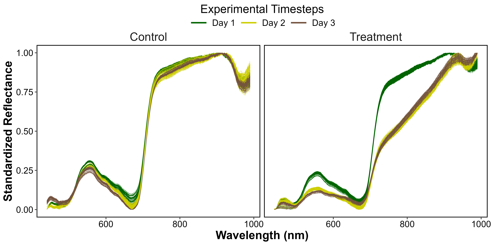{width="2400"}
:::

::: {.fragment .fade-in-then-out fragment-index="2" .absolute top="20%" left="0%"}
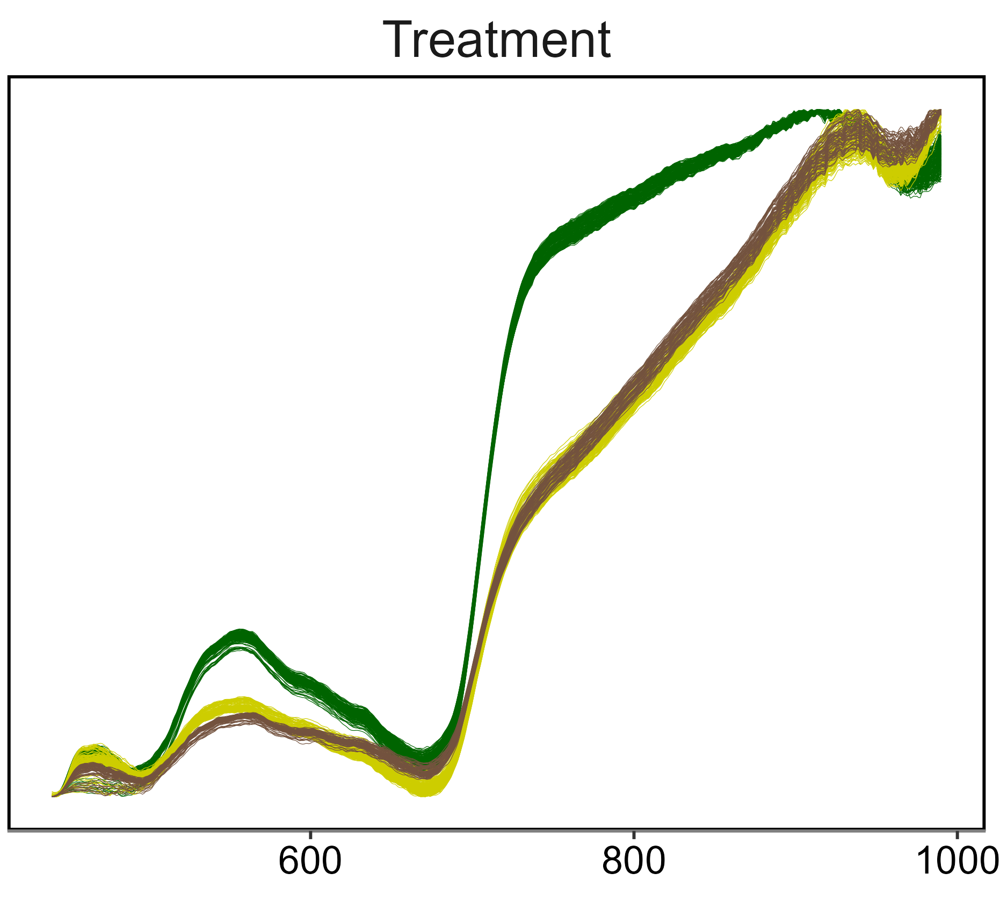{width="1200"}
:::

::: {.fragment .fade-in-then-out fragment-index="2" .absolute top="10%" left="50%"}
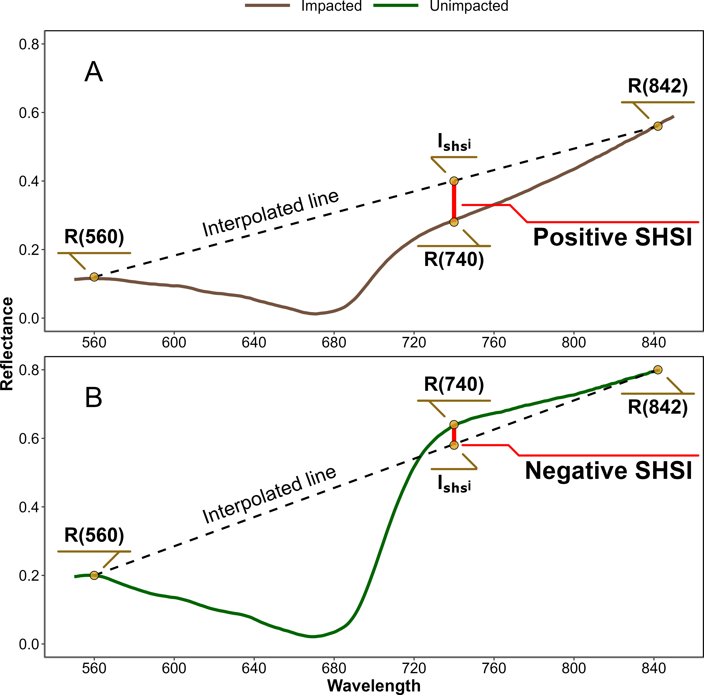{width="1200"}
:::

::: {.absolute .fragment .fade-in fragment-index="3" top="10%" left="0%" style="text-align: right; font-size: 70px;"}
Spectral metrics:
:::

::: {.fragment .fade-in-then-out fragment-index="3" .absolute top="0%" left="25%"}
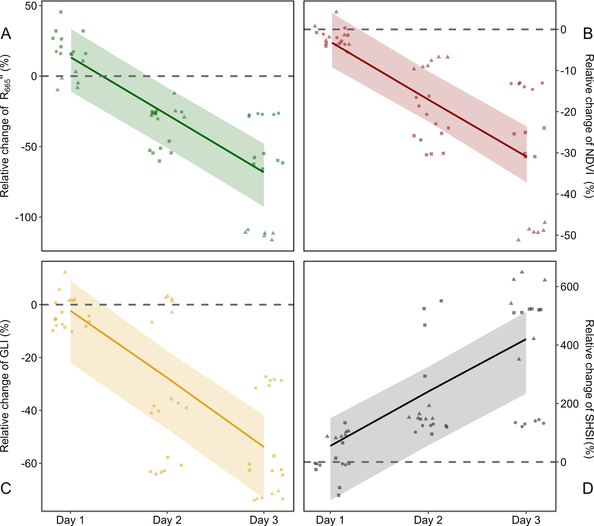{width="1500"}
:::

::: {.fragment .fade-in-then-out fragment-index="4" .absolute top="0%" left="25%"}
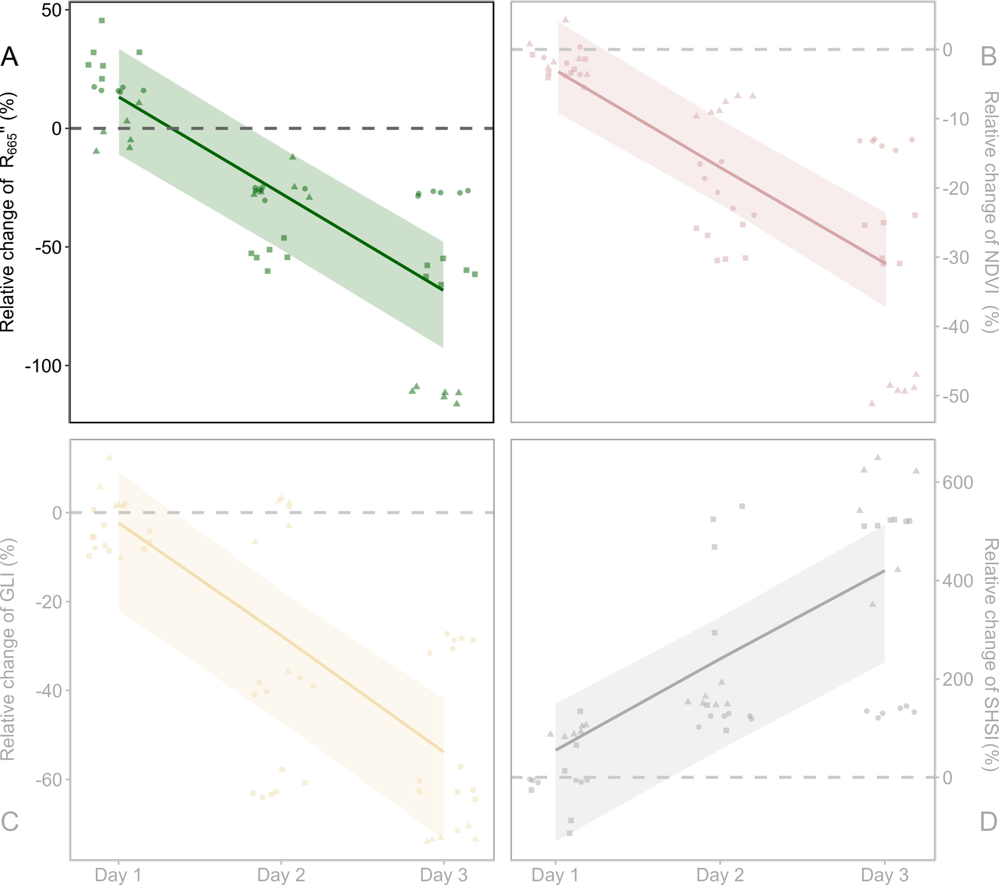{width="1500"}
:::

::: {.fragment .fade-in-then-out fragment-index="5" .absolute top="0%" left="25%"}
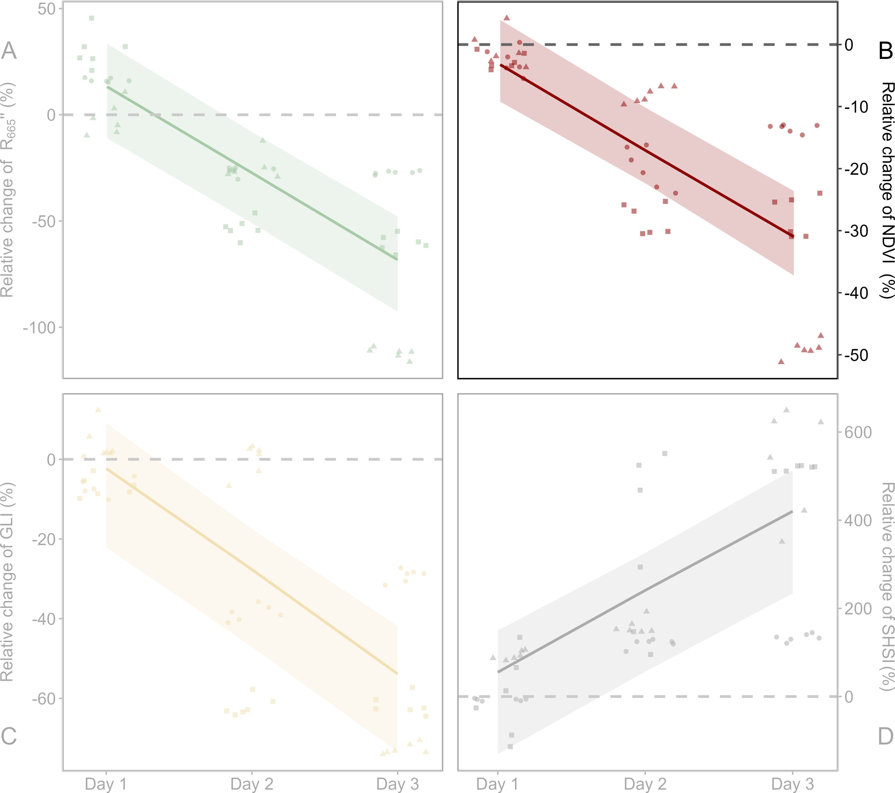{width="1500"}
:::

::: {.fragment .fade-in-then-out fragment-index="6" .absolute top="0%" left="25%"}
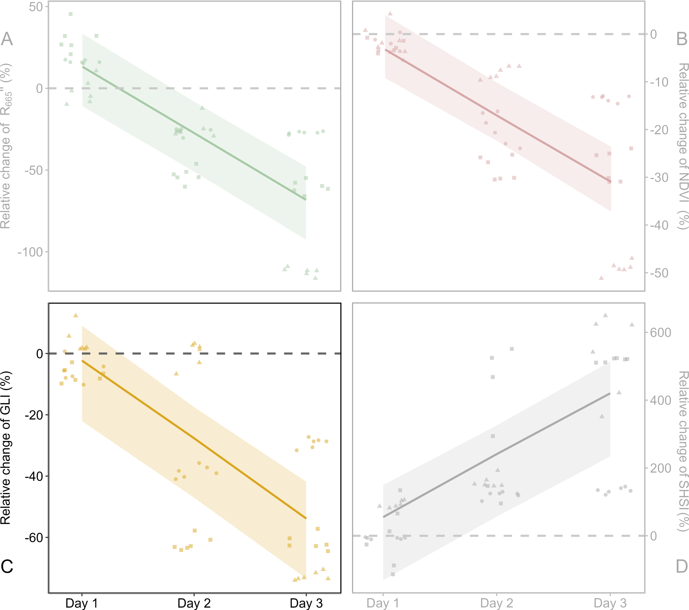{width="1500"}
:::

::: {.fragment .fade-in-then-out fragment-index="7" .absolute top="0%" left="25%"}
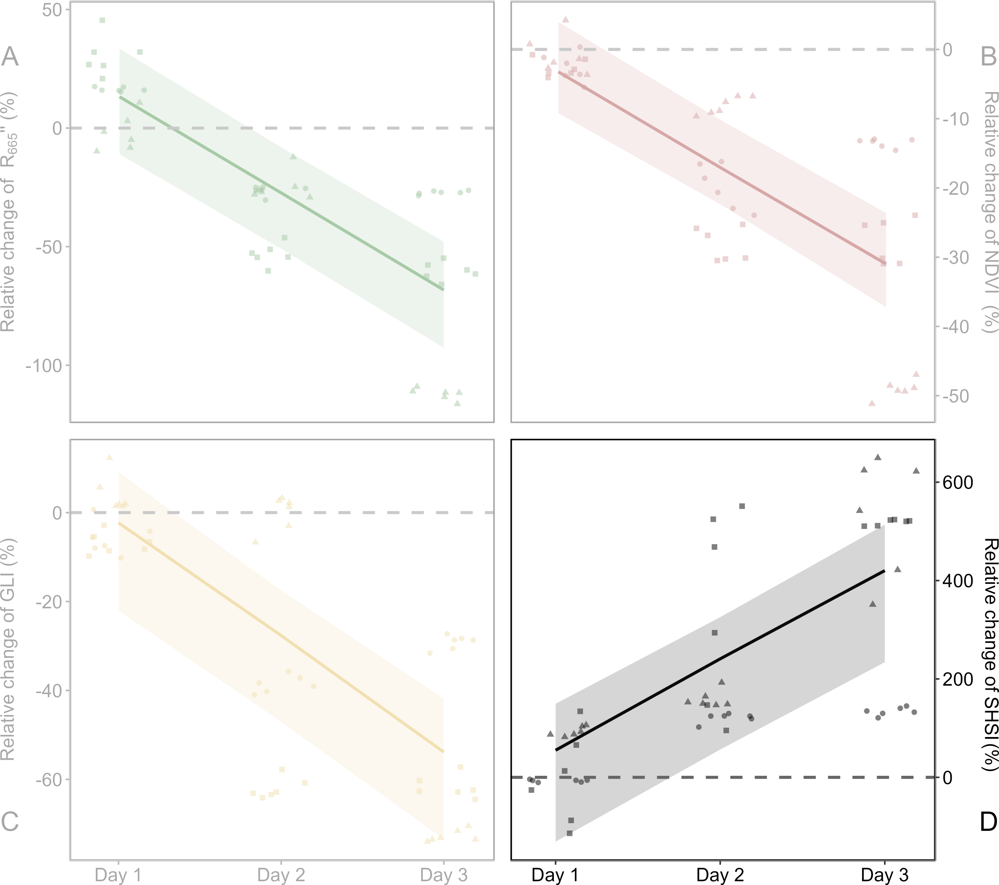{width="1500"}
:::


::: {.absolute .fragment .fade-in fragment-index="4" top="20%" left="0%" style="text-align: right; font-size: 50px;"}
$R''_{665 \, \text{nm}}$ drops by 68 %
:::

::: {.absolute .fragment .fade-in fragment-index="5" top="30%" left="0%" style="text-align: right; font-size: 50px;"}
$NDVI$ drops by 31 %
:::

::: {.absolute .fragment .fade-in fragment-index="6" top="40%" left="0%" style="text-align: right; font-size: 50px;"}
$GLI$ drops by 54 %
:::

::: {.absolute .fragment .fade-in fragment-index="7" top="60%" left="0%" style="text-align: right; font-size: 50px;"}
$SHSI$ increases by 420 %
:::


## *in situ* Satellite Mapping

::: {.absolute style="top: 0%; left: 95%; width: 1800px;"}
::: sectionhead
[1 2]{style="opacity:0.25;"} 3 [4 5]{style="opacity:0.25;"}
:::
:::

::: {.fragment .fade-out fragment-index="6"}
::: {.fragment .fade-in fragment-index="1"}
```{r LeafletMap_QPs}
#| cache: false
#| echo: false
#| eval: true
#| warning: false
#| out-width: "1100px"
#| out-height: "1200px"

library(tidyverse)
library(leaflet)
library(sf)
library(leafem)
library(leaflet.extras2)
library(terra)

img_during <- "../Slides/Data/S2/Heatwaves_S2.tif" %>% 
  raster::stack() %>% 
  raster::projectRaster(crs = raster::crs("+init=EPSG:3857"))


img_before <- "../Slides/Data/S2/Heatwaves_S2_before.tif" %>% 
  raster::stack() %>% 
  raster::projectRaster(crs = raster::crs("+init=EPSG:3857"))

img_after <- "../Slides/Data/S2/Heatwaves_S2_after.tif" %>% 
  raster::stack() %>% 
  raster::projectRaster(crs = raster::crs("+init=EPSG:3857"))


# NAflag(img) <- NA

Unimpacted  <- sf::st_read("../Slides/Data/S2/GCP_biolittoral.shp",quiet = T) %>% 
  dplyr::filter(Trgt_ty =="Healthy_seagrass")

Impacted  <- sf::st_read("../Slides/Data/S2/GCP_biolittoral.shp",quiet = T) %>% 
  dplyr::filter(Trgt_ty !="Healthy_seagrass")
all_QPs <- sf::st_read("../Slides/Data/S2/GCP_biolittoral.shp",quiet = T,)
  
  
# points <- sf::st_transform(points, crs = 3857)

(plot <- leaflet() %>%   
  # addTiles() %>% 
  setView(lng =-3.121394, lat = 47.585714, zoom = 14)  %>% 
  addMapPane("right", zIndex = 1) %>%
  addMapPane("left", zIndex = 1) %>%
  addProviderTiles(providers$Esri.WorldImagery,
                     group = "Toner",
                     options = c(providerTileOptions(minZoom = 8, maxZoom = 100),
                                 pathOptions(pane = "left")),
                     layerId = "UnImpacted"
                     ) %>%
  addProviderTiles(providers$Esri.WorldImagery,
                     group = "Toner",
                     options = c(providerTileOptions(minZoom = 8, maxZoom = 100),
                                 pathOptions(pane = "right")),
                     layerId = "Impacted") %>% # Add raste
  addRasterRGB(img_during, r = 1, g = 2, b = 3, na.color = "transparent",
                     options = c(pathOptions(pane = "right")),
                     layerId = "During") %>% 
  addRasterRGB(img_before, r = 1, g = 2, b = 3, na.color = "transparent",
                     options = c(pathOptions(pane = "left")),
                     layerId = "Before") %>% 
  addRasterRGB(img_after, r = 1, g = 2, b = 3, na.color = "transparent",
                     options = c(pathOptions(pane = "right")),
                     layerId = "Impacted",
                     group = "Image After") %>% 
  addRasterRGB(img_after, r = 1, g = 2, b = 3, na.color = "transparent",
                     options = c(pathOptions(pane = "left")),
                     layerId = "UnImpacted",
                     group = "Image After") %>% 
  addCircleMarkers(
    data        = Unimpacted,
    radius      = 2,
    color       = "lightgreen",
    fillColor   = "lightgreen",
    fillOpacity = 0.8,
    group       = "Unimpacted Points",   # <--- group name
    # options     = pathOptions(pane = "left"),
    popup = ~paste0(""),
    popupOptions = popupOptions(
    maxWidth  = 600*5,    # Maximum width of the popup
    minWidth  = 100*5,    # Minimum width of the popup
    maxHeight = 600*5)
  ) %>%
  addCircleMarkers(
    data        = Impacted,
    radius      = 2,
    color       = "goldenrod",
    fillColor   = "goldenrod",
    fillOpacity = 0.8,
    group       = "Impacted Points",     # <--- group name
    # options     = pathOptions(pane = "right"),
    popup = ~paste0(""),
    popupOptions = popupOptions(
    maxWidth  = 600*5,    # Maximum width of the popup
    minWidth  = 100*5,    # Minimum width of the popup
    maxHeight = 600*5)
  ) %>%
  leaflet.extras2::addSidebyside(leftId = "UnImpacted",
                                  rightId = "Impacted") %>% 
    addLegend(
    position = "bottomright",
    colors   = c("lightgreen", "goldenrod"),
    labels   = c("Unimpacted Points", "Impacted Points"),
    title    = "Legend"
  ) %>%
  
  # Add Layers Control to toggle point layers on/off
  addLayersControl(
    overlayGroups = c("Unimpacted Points", "Impacted Points", "Image After"),
    options = layersControlOptions(collapsed = FALSE)
  )%>%
  
  # Hide groups by default (turn them off at startup)
  hideGroup("Unimpacted Points") %>%
  hideGroup("Impacted Points") %>%
  hideGroup("Image After")
)


# htmlwidgets::saveWidget(plot, file="Slides/maps/map_Bathy_Quiberon.html", selfcontained = F)

```
:::

::: {.fragment .fade-in-then-out fragment-index="1" .absolute top="10%" right="0%"}
{width="1300"}
:::

::: {.fragment .fade-out fragment-index="5"}
::: {.fragment .fade-in fragment-index="2" .absolute top="10%" right="0%"}
{width="1300"}
:::
:::

::: {.absolute .fragment .fade-in fragment-index="1" top="12%" left="0.5%" style="text-align: right; font-size: 50px;"}
[Before]{style="color:white;"}
:::

::: {.absolute .fragment .fade-in fragment-index="1" top="12%" left="39%" style="text-align: right; font-size: 50px;"}
[During]{style="color:white;"}
:::


::: {.fragment .fade-in-then-out fragment-index="3" .absolute top="40%" right="8%"}
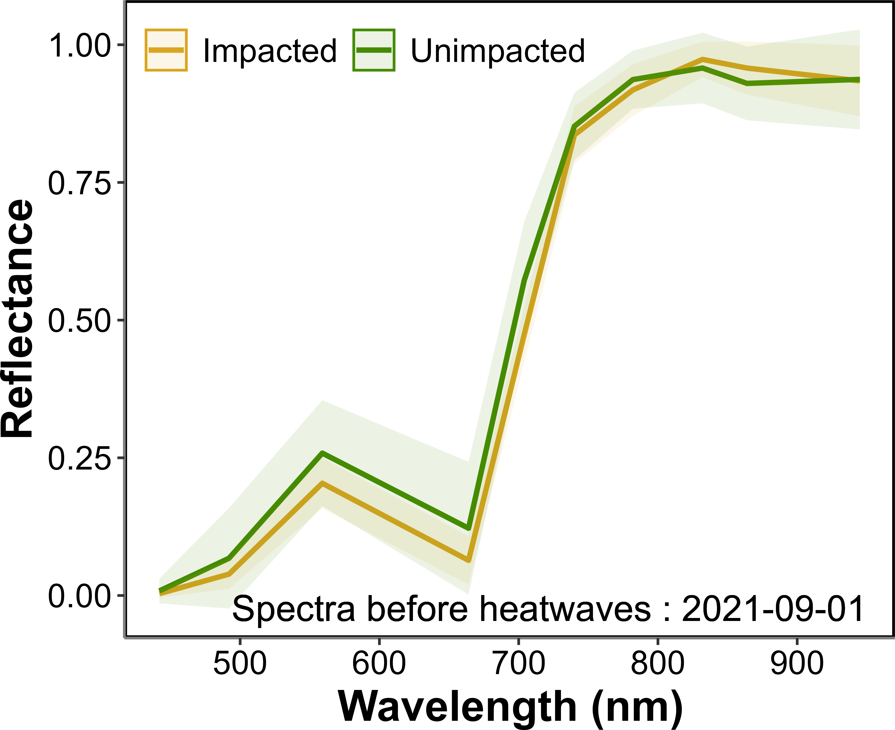{width="1000"}
:::

::: {.fragment .fade-in-then-out fragment-index="4" .absolute top="40%" right="8%"}
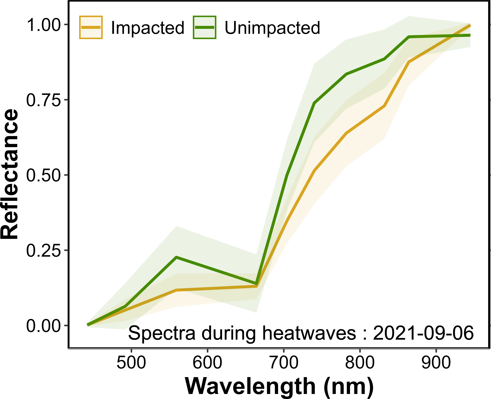{width="1000"}
:::

::: {.fragment .fade-in fragment-index="5" .absolute top="10%" right="0%"}
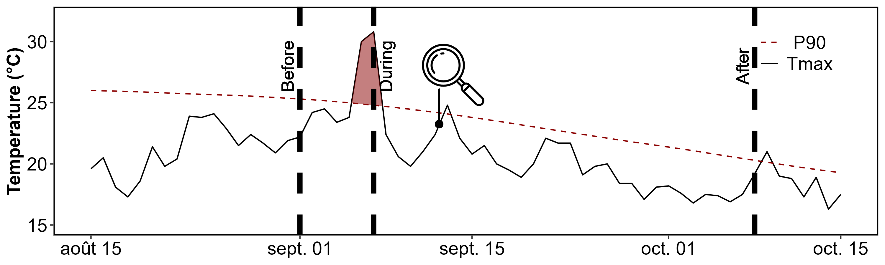{width="1300"}
:::

::: {.fragment .fade-in fragment-index="5" .absolute top="44%" right="-3%"}
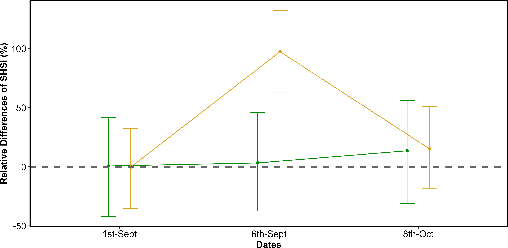{width="1300"}
:::
:::


::: {.fragment .fade-out fragment-index="7"}
::: {.fragment .fade-in fragment-index="6" .absolute top="11%" left="0%" width="2300px" height="1100px"}

```{r Maps_SHSI}
#| cache: false
#| echo: false
#| eval: true
#| warning: false
#| out-width: "2300px"
#| out-height: "1100px"

library(tidyverse)
library(leaflet)
library(sf)
library(leafem)
library(leaflet.extras2)
library(terra)
library(scico)
library(leafsync)


Index_rast <- rast("../Data/Sentinel2/Before_During_After_indices_meadowCropped.tif")[[7:9]]

names(Index_rast) <- c("SHSI_Before","SHSI_During","SHSI_After")


Unimpacted  <- sf::st_read("../Slides/Data/S2/GCP_biolittoral.shp",quiet = T) %>% 
  dplyr::filter(Trgt_ty =="Healthy_seagrass")

Impacted  <- sf::st_read("../Slides/Data/S2/GCP_biolittoral.shp",quiet = T) %>% 
  dplyr::filter(Trgt_ty !="Healthy_seagrass")

  
Before <- Index_rast$SHSI_Before/100
values(Before)[values(Before) < -2] <- -2
values(Before)[values(Before) > 2] <- 2

During <- Index_rast$SHSI_During/100
values(During)[values(During) < -2] <- -2
values(During)[values(During) > 2] <- 2

After <- Index_rast$SHSI_After/100
values(After)[values(After) < -2] <- -2
values(After)[values(After) > 2] <- 2


img_during <- "../Slides/Data/S2/Heatwaves_S2.tif" %>% 
  raster::stack() %>% 
  raster::projectRaster(crs = raster::crs("+init=EPSG:3857"))


img_before <- "../Slides/Data/S2/Heatwaves_S2_before.tif" %>% 
  raster::stack() %>% 
  raster::projectRaster(crs = raster::crs("+init=EPSG:3857"))

img_after <- "../Slides/Data/S2/Heatwaves_S2_after.tif" %>% 
  raster::stack() %>% 
  raster::projectRaster(crs = raster::crs("+init=EPSG:3857"))


  
# pal2 <- colorNumeric("batlow", domain = c(-2,2),na.color = "transparent")
pal2 <- colorNumeric(scico(n = 256, palette = "batlow"), domain = c(-2, 2), na.color = "transparent")


m1 <- leaflet(width = "100%", height = "600px") %>%   
  # addTiles() %>% 
  setView(lng =-3.121394, lat = 47.585714, zoom = 14) %>%
  addProviderTiles(providers$Esri.WorldImagery,
                     group = "Toner",
                     options = c(providerTileOptions(minZoom = 8, maxZoom = 100)))%>%
  addRasterImage(Before,
                   colors=pal2,
                   layerId = "Before")

m2 <- leaflet(width = "100%", height = "600px") %>%   
  # addTiles() %>% 
  setView(lng =-3.121394, lat = 47.585714, zoom = 14) %>%
  addProviderTiles(providers$Esri.WorldImagery,
                     group = "Toner",
                     options = c(providerTileOptions(minZoom = 8, maxZoom = 100)))%>%
  addRasterImage(During,
                   colors=pal2,
                   layerId = "During")

m3 <- leaflet(width = "100%", height = "600px") %>%   
  # addTiles() %>% 
  setView(lng =-3.121394, lat = 47.585714, zoom = 14) %>%
  addProviderTiles(providers$Esri.WorldImagery,
                     group = "Toner",
                     options = c(providerTileOptions(minZoom = 8, maxZoom = 100)))%>%
  addRasterImage(After,
                   colors=pal2,
                   layerId = "After")
m4 <- leaflet(width = "100%", height = "600px") %>%   
  # addTiles() %>% 
  setView(lng =-3.121394, lat = 47.585714, zoom = 14) %>%
  addProviderTiles(providers$Esri.WorldImagery,
                     group = "Toner",
                     options = c(providerTileOptions(minZoom = 8, maxZoom = 100)))%>% 
  addRasterRGB(img_before, r = 1, g = 2, b = 3, na.color = "transparent",
                     layerId = "Before")

m5 <- leaflet(width = "100%", height = "600px") %>%   
  # addTiles() %>% 
  setView(lng =-3.121394, lat = 47.585714, zoom = 14) %>%
  addProviderTiles(providers$Esri.WorldImagery,
                     group = "Toner",
                     options = c(providerTileOptions(minZoom = 8, maxZoom = 100)))%>% 
  addRasterRGB(img_during, r = 1, g = 2, b = 3, na.color = "transparent",
                     layerId = "During")

m6 <- leaflet(width = "100%", height = "600px") %>%   
  # addTiles() %>% 
  setView(lng =-3.121394, lat = 47.585714, zoom = 14) %>%
  addProviderTiles(providers$Esri.WorldImagery,
                     group = "Toner",
                     options = c(providerTileOptions(minZoom = 8, maxZoom = 100)))%>% 
  addRasterRGB(img_after, r = 1, g = 2, b = 3, na.color = "transparent",
                     layerId = "After")

sync(m1, m2, m3, m4, m5, m6, sync = "all",ncol = 3)


# htmlwidgets::saveWidget(plot, file="Slides/maps/map_Bathy_Quiberon.html", selfcontained = F)
```

:::

::: {.fragment .fade-in fragment-index="6" .absolute top="35%" right="5%"}
{height="500"}
:::

::: {.absolute .fragment .fade-in fragment-index="6" top="6%" left="0%" style="text-align: left; font-size: 50px;"}
Before
:::

::: {.absolute .fragment .fade-in fragment-index="6" top="6%" left="43%" style="text-align: center; font-size: 50px;"}
During
:::

::: {.absolute .fragment .fade-in fragment-index="6" top="6%" right="9%" style="text-align: right; font-size: 50px;"}
After
:::
:::

::: {.fragment .fade-in fragment-index="7" .absolute top="10%" left="0%"}
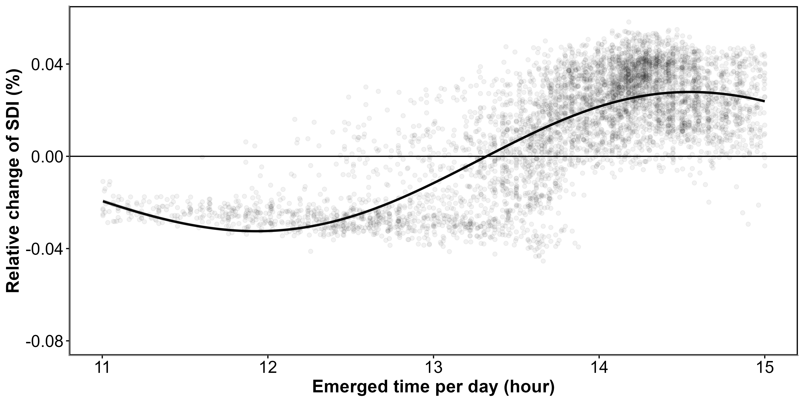{width="2400"}
:::

# Discussion


